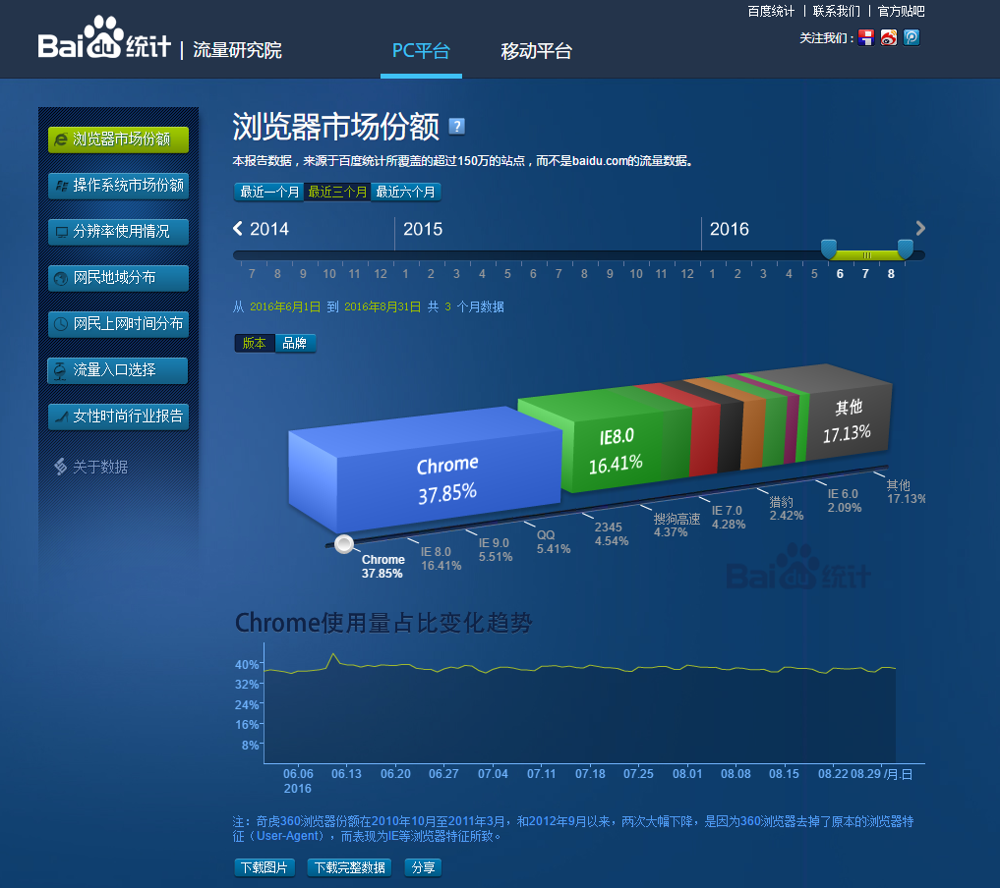

# 01-HTML标签

## 核心知识点

- [x] 网页组成
- [x] 网页规范
- [x] HTML结构[重点]
- [ ] 单标签
- [ ] 双标签

## 认识网页

### 网页组成

```html
网页是由: 文字,图片,输入框,按钮,视频,音频....元素组成的
总结:
	 网页就是由HTML组成的
```

### 网页规范(万维网联盟)

```html
  ☞ 结构标准:  制作网页必须按照HTMl的标准结构去写网页
  ☞ 表现标准:  用来美化网页CSS
  ☞ 行为标准:  用来实现网页中的用户的一些动作处理 JavaScript
```

## 浏览器介绍

### 主流浏览器




### 内核（渲染引擎）

```html
Trident(IE内核)：
	IE、傲游、世界之窗浏览器、Avant、腾讯TT、猎豹安全浏览器、360极速浏览器、百度浏览器等

Gecko(firefox)：
     Gecko(Firefox 内核)： Mozilla FireFox(火狐浏览器) 采用该内核，Gecko 的特点是代码完全公开，因此，其可开发程度很高

webkit(Safari):
	Safari 是苹果公司开发的浏览器，所用浏览器内核的名称是大名鼎鼎的 WebKit。傲游浏览器3、 Apple Safari (Win/Mac/iPhone/iPad)、Symbian手机浏览器、Android 默认浏览器。

Blink：
	大部分国产浏览器最新版都采用Blink内核。二次开发。谷歌浏览器。Blink 其实是 WebKit 的分支。 

Presto(Opera) ：
	  Presto（已经废弃） 是挪威产浏览器 opera 的 "前任" 内核，为何说是 "前任"，因为最新的 opera 浏览器早已将之抛弃从而投入到了谷歌怀抱了。  
```

## HTML(重点)

### 概念

```html
☞ HTML：  Hyper   Text  Markup  Language.[  超文本标记语言 ]

   超文本: 本质就是一个文本[在网页中,用来实现页面跳转的文本  ---超链接标签]

     标记: 记号. [各种HTML标签]
```

### 结构

```html
注意:
	1. 我们在以后写代码(html,css,js...)遇到特殊符号,必须都是英文输入下的符号.
	2. 制作一个网页必须按照html的结构去写.
<!doctype  html>
<html>
    <head>
         <title></title>
    </head> 
    <body>
    </body>
</html>
```

### 结构详解

```html
<!doctype  html>     -----> 用来告诉浏览器文档类型, 该标签最好不要去掉.如果将该标签去掉之后,浏览器会出现一只怪异模式[浏览器不确定到底按照哪种渲染方式去渲染显示网页]

<html></html>   -----> 根标签

<head></head>   -----> 设置网页中基本的配置内容(网页的标题,网页中的样式,网页中的js代码效果....)

<title></title> -----> 设置网页标题

<body></body>   -----> 代表的是网页主体[在网页中除去地址栏看到的任何信息都要放到body标签中]
```

### 标签之间的关系

```html
☞ 嵌套关系:  一个标签包含其他标签 [父元素和子元素]

☞ 并列关系:  标签之间不存在嵌套包含

  例如:  <head></head>  和 <body></body>
```

### 标签写法分类

```html
☞ 双标签: 有开始和结束的标签.

  总结:
	  1. 如果页面中出现嵌套关系,父元素一定是双标签,子元素可以是双标签或者单标签

☞ 单标签: 只有开始没有结束
  总结:
	  1. 单独标签一定不能作为父元素.
```

### sublime第一个网页

```html
  1. 网页必须是html文件,文件后缀名是 .html 或者  .htm

  2. sublime工具基本使用
		☞ 必须要在电脑中新建一个对应的文件夹.推荐以天为单位.

		☞ 使用开发工具打开该文件夹
			file  ---> 打开文件夹

	    ☞ 新建html文件.
			1. 在文件夹上点击鼠标右键  --  new file(新建文件)  ---> 输入文件名.html
			2. 在html文件中输入  !+tab  或者  html:5 + tab 生成html结构
	      注意:
		    1.写网页的时候,必须保证文件是html文件
     		2. 如果新建文件的时候没有出现文件名输入框, ctrl+s -----> 输入文件名称  ---> 生成html结构

	    ☞ 新建文件夹
			在文件夹上点击鼠标右键  ----> newfolder

	    ☞ 在浏览器中预览HTMl文件
			在html文件中,点击鼠标右键   ----> 在浏览器中查看

中午作业:
		1. 安装开发工具
		2. 先使用记事本写一个简单的网页(必须设置网页标题,必须设置网页内容)
		3. 使用开发工具再写一遍上面的网页
```

### 单标签

```html
☞ 换行标签:  <br>

☞ 横线:  <hr>

☞ 文档类型:  <!doctype  html>  

☞ 注释标签: <!-- 内容 -->     ctrl + /
```

### 双标签

```html
☞ 标题标签:  <h1></h1>  -  <h6></h6>
   注意:
    	一个网页中的标题,最好只出现一次一号标题.
☞ 段落标签: <p></p>
    注意:
		段落标签中不能设置数字
```

### 格式化（修饰）标签[双标签]

```html
☞ 设置文字颜色或者设置文字大小:  <font></font>

	1. 改变文字颜色需要添加color属性   <font color="red">我是红颜色的文字</font>
    2.  改变文字大小需要添加size属性    <font color="orange" size="7">我是红颜色的文字</font>


☞ 设置文字是否加粗:  <strong> </strong> 或者 <b> </b>

☞ 设置文字斜体显示: <em></em> 或者  <i> </i>

☞ 设置文字删除线效果: <del></del>  或者  <s></s>

☞ 设置文字下划线效果: <ins></ins>   或者  <u></u>
```

### 图片标签【多媒体标签】

```html
☞ 图片标签: 
☞ 属性:  
		src:设置要显示的图片路径     .
		width: 设置标签宽度.
		height: 设置标签高度.
	    title:  鼠标悬停到图片上的文字提示.
		alt:   当图片无法正常显示时候的文字提示.
```

### 视频标签

```html
 ☞ video用来显示视频
 ☞ 属性:
 	  src: 设置显示视频路径
 	  controls: 显示控制栏
 	  loop: 控制视频循环播放
 	  autoplay: 自动播放
 	  
  解决视频或音频标签自动播放在谷歌浏览器中不起作用: 
      在chrome 浏览器中输入：chrome://flags
      再搜索audio,找到Autoplay policy
      再在右侧的选项中设置为 no user gesture is required 即可
```

### 音频标签

```html
☞ audio用来播放音频
用法与video标签一样.
<audio src="See You Again.mp3"  autoplay></audio>
```

### 路径（重点）

```html
 ☞ 绝对路径:
	 1. 如果路径中包含具体的磁盘目录:   d:/img/1.jpg
	 2. 如果路径中具有具体的网址:    www.baidu.com/img/1.jpg

 ☞ 相对路径: 必须在同一个根目录下.
	1. 如果当前页面和被访问的资源在同一个文件夹中,路径=直接设置文件名称
    2. 如果当前页面在被访问资源的上一级目录中, 路径=文件所在的文件夹名称/文件名
    3. 如果当前页面在被访问资源的下一级目录中,路径=../文件名称
```

### 超链接

```html
本质: 就是用来实现页面跳转.
<a  href="目标页面路径"></a>

属性:
	target:设置目标页面打开方式(默认在当前页面中打开_self | _blank 新窗口中打开)
总结:
	如果希望当前页面中所有超链接跳转页面的时候,都在新窗口中打开,那么只需要在head标签中设置 base标签,给base标签设置target属性即可.
```

### 锚链接

```html
本质: 在当前页面中跳转. 网页中的返回顶部效果
<a href="#"></a>
"#": 返回当前页面开始位置
```

### 

