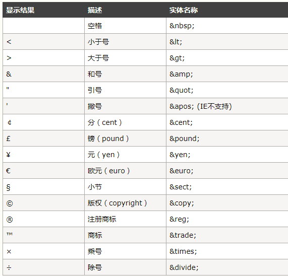
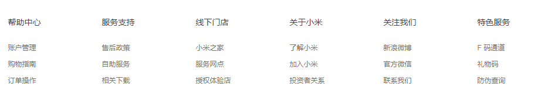

# 02HTML基础

## 核心知识点

- link标签
- meta标签
- 列表
- 表格
- 表单
- 网页布局标签

## 实体字符（了解）



## link标签

```html
☞ 设置网页图标

☞ 注意事项：
		1. 图标格式最好是.ico 也可以是其他的图片格式（png,jpg）

		2. 设置网页图标使用的link标签必须放到head标签中

		3. 网页图标一般直接放到项目的根目下

☞ 设置网页图标方式:

	<head>
        <meta charset="UTF-8">
        <title>Document</title>

        <!-- 设置网页图标 -->
        <link rel="icon" href="favicon.ico">
    </head>
```

## meta标签

```html
<!-- 防止网页出现乱码 -->
<meta charset="UTF-8">
```

## 列表（掌握）

```html
  ☞ 无序列表(unordered-list)
	  <ul>
          <li> 列表项	</li>
          <li> 列表项	</li>
          ...
	  </ul>
	总结：
		 1. ul列表必须直接包含的标签是li
		 2. 在li标签中可以包含其他任何标签
		 3. 在展示数据的时候没有先后顺序的要求

	例如：
	<ul>
		<li><a href="#">蔚来第二款SUV ES6实车谍照曝光</a></li>
		<li><a href="#">蔚来第二款SUV ES6实车谍照曝光</a></li>
		<li><a href="#">蔚来第二款SUV ES6实车谍照曝光</a></li>
		<li><a href="#">蔚来第二款SUV ES6实车谍照曝光</a></li>
		<li><a href="#">蔚来第二款SUV ES6实车谍照曝光</a></li>
		<li><a href="#">蔚来第二款SUV ES6实车谍照曝光</a></li>
		<li><a href="#">蔚来第二款SUV ES6实车谍照曝光</a></li>
	</ul>
	
  ☞ 有序列表： (order-list)
		<ol>
            <li> </li>
            <li> </li>
            <li> </li>
		</ol>

	 总结：
	     1. 有序列表在展示数据的时候是按照一定的顺序显示的
		 2. 有序列表在用法上与无序列表一样。

	 例如：
	 <ol>
		<li><a href="#">蔚来第二款SUV ES6实车谍照曝光</a></li>
		<li><a href="#">蔚来第二款SUV ES6实车谍照曝光</a></li>
		<li><a href="#">蔚来第二款SUV ES6实车谍照曝光</a></li>
		<li><a href="#">蔚来第二款SUV ES6实车谍照曝光</a></li>
		<li><a href="#">蔚来第二款SUV ES6实车谍照曝光</a></li>
		<li><a href="#">蔚来第二款SUV ES6实车谍照曝光</a></li>
	</ol>


  ☞ 自定义列表(defined-list)

	<dl>
        <dt> </dt>
        <dd> 列表项 </dd>
        <dd> 列表项 </dd>
        <dd> 列表项 </dd>
	</dl>

	总结：
		一般在网页的结尾处会使用该列表
```



## 表格（掌握）

```html
 ☞ 作用：
	  1. 最开始（没有css之前）进行网页布局
	  2. 用来展示数据

☞ 写法：
	  ◆ 组成
		 行  tr
		 列  td
		表格  table
	
	  ◆  写法：
	     <table>
             <tr>
             	<td></td>
             </tr>
	    </table>


	  ◆ 表格中的属性级其他标签介绍：
		   1. border属性： 设置边框

		   2. width属性： 改变宽度

		   3. height属性： 改变高度
		
	       4. 去掉td与td之间的距离  cellspacing的默认是2 

		   5. 设置内容居中显示  align: left | center  | right
			   ◆如果希望表格中的内容对齐，那么将align属性设置给tr或者td
			   ◆如果将align属性设置给table，只能改变table整体的对齐方式，不会影响内容的对齐方式
		
		   6. 如果希望给表格设置表头，那么请使用th标签替代td标签，th在表格中就是表示表头，默认实现文字居中加粗显示
	
		    7. 设置背景颜色属性： bgcolor="颜色"；

		  	8. 设置表格的标题： <caption>人员信息表</caption>

          <table border="1" width="400" height="400"  cellspacing="0" align="center"  bgcolor="pink">

                <caption>人员信息表</caption>

                <tr bgcolor="red">
                    <th bgcolor="green">姓名</th>
                    <th>年龄</th>
                    <th>职业</th>
                    <th>性别</th>
                </tr>
              
		</table>

		  注意：
			 1. 在浏览器中所有的元素（文字，图片），默认都是左对齐

   ☞表格其他部分介绍（了解）
		
		 1.表格的标准的结构写法：

		 <table>
             <thead>  
             	<tr>
                	<th></th> 
                 </tr>
             </thead>
             
             
             <tbody>
             	 <tr>
                 	<td></td>
                 </tr>
             </tbody>
             
             
             <tfoot>
             	  <tr>
                    <td> </td>
                 </tr>
             </tfoot>
		</table>


	  总结：
		1. 如果按照规范写法，会在一些低版本浏览器中出现兼容性问题（IE低版本）

		2. 在高版本浏览器中，浏览器默认会自动帮我们添加主体


	 ☞ 表格合并单元格：

		1. 横向合并：  colspan="2"

		2. 纵向合并：  rowspan="3"


		<tr>
			<td></td>
			<td colspan="2"></td>
			<td></td>
		</tr>
		<tr>
			<td></td>
			<td></td>
			<td></td>
			<td rowspan="3"></td>
		</tr>


	  备注：
		 1. 合并单元格后，将多余的行或者列删掉
		
```

## 表单（掌握）

```html
  ☞ 作用：  收集信息(通过表单控件收集信息)

  ☞ 表单组成：
		1. 表单域 （form）
		2. 提示信息
		3. 表单控件

  ☞ 表单域（form）:

		 ◆属性 action 设置一个后台程序，处理表单控件中的数据  

		 ◆属性 method 设置一个提交数据方式  （get |  post）


		 <form action="1.js" method="post">

                用户名: <input type="text" name="username">

                <br>
                <br>

                密码: <input type="password" name="pwd">

                <br>
                <br>

                <input type="submit" name="">

          </form>
		
   ☞ 表单控件：
		1. 输入框：<input type="text">
		   属性： name设置控件名称
				maxlength设置当前控件最多能输入多少个字符
				readonly="readonly" 设置当前控件为只读模式（不能输入）
			    disabled="disabled"  当前控件没有被渲染成功（没有被激活）【不能输入】
				value设置控件默认值


		2. 密码输入框： <input type="password" name=""  value="">

		    属性：与输入框的属性一样


		3. 下拉列表框：
		 <select>

                      <optgroup label="中国">
                        <option>北京</option>	
                        <option>上海</option>	
                        <option>南京</option>	
                        <option>河北</option>	
                      </optgroup>	
			

            </select>
		

		  或者：
		  <select>
                        <option>北京</option>	
                        <option>上海</option>	
                        <option>南京</option>	
                        <option>河北</option>	
            </select>

		  属性： selected="selected"  设置默认选中项
		  例如：
			<option>北京</option>	
			<option>上海</option>	
			<option selected="selected">南京</option>	
			<option>河北</option>	


		
		4. 复选框： <input type="checkbox">
		   属性：
				checked="checked" 设置默认选中项

		<input type="checkbox" checked="checked">爱好
		<input type="checkbox" checked="checked">旅游
		<input type="checkbox" checked="checked">学习


  5. 单选控件：<input type="radio">
		注意：
			1. 如果要实现单选效果，那么需要设置相同的name值
			   <input type="radio" name="abc">男
			   <input type="radio" name="abc">女

			2. checked="checked" 设置默认选中项


	6. 上传控件： <input type="file">


	7. 文本域：<textarea></textarea>

	
     8. 提交表单数据： 
		<input type="submit">

		<input type="image" name="" src="按钮.jpg">


	9. 重置按钮： 将表单控件中的值恢复到默认值
		 <input type="reset" name="">


	10. 普通按钮：
		 <input type="button" value="按钮">   不能提交数据，可以和js配合使用
```

