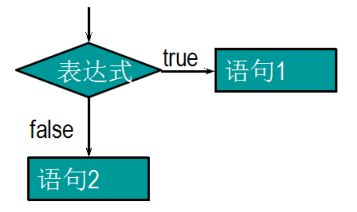

# 02-JavaScript基础

## 赋值运算符

```javascript
+= |  -=   |  *=  |  /=  |   %=    |   = 

var  a += b ;    =====> 等价于        a = a+b;
```

## 一元运算符

```javascript
 1.   ++  和  -- 

 2. ++ 运算
 	 ++a       在变量a的基础上加1
     a++	   在变量a的基础上加1
     
     
    ✔ 如果将 a++ 或者 ++a赋值给一个变量的时候，这个变量的值有区别
    
       ◆ 如果将 a++ 赋值一个变量，那么先将a原来的值赋值给新的变量，然后自己再加1（先赋值再计算）
       ◆ 如果将 ++a 赋值一个变量，那么先进行加1计算，然后把计算后的结果赋值给新的变量
```

## 课堂测试

```javascript
1.
    var    a;
    var    b=6;
    a=++b;
    请问：a的值是多少，b的值是多少。  7   7
    a=b++;
    请问：a的值是多少，b的值是多少。  7   8
2.
var a = 1; var b = ++a + ++a;   console.log(b);  //  
var a = 1; var b = a++ + ++a;   console.log(b);  //
var a = 1; var b = a++ + a++;   console.log(b);  //
var a = 1; var b = ++a + a++;   console.log(b);  //
```

## 比较运算符

```javascript
1.   >  
    
2.   <
    
3.   >=     大于 或者 等于，只要有一个满足即可
    
4.   <=     小于 或者 等于，只要满足一个即可

5.  ==      只用来比较变量中的值是否相等，不考虑数据类型
    
6.  ===     用来判断值和数据类型必须同时相等
    
7.  !=	    判断值是否不相等，不考虑数据类型
 
8.  !==     判断值和数据类型
    
    
☞ 总结：
	  ✔ 通过比较运算符得到的结果只有两个结果，一个是正确的，一个是错误的
      ✔ 通过比较运算符得到的结果 只有 true[正确] 和 false[错误]
```

## 逻辑运算符

```javascript
 1.   ||  或： 条件只要有一个满足即可
      总结：
      	  1. 如果条件中有一个结为true(代表有一个条件满足了)，那么通过或运算后最后的结果为true
          2. 如果条件中结果都不满足，那么通过或运算后结果为false
     
 2.   &&  且： 要求所有的条件都必须满足才可以
 	  总结：
	      1. 如果条件都为真（true），那么通过且运算后最后的结果也是真（true）
          2. 如果条件中自少有一个条件不满足（false），那么通过且运算后的结果为false
     
 3.   ! 非（取反） : 
```

## 运算符优先级（了解）

```javascript
优先级从高到底
	1. ()  优先级最高   
	2. 一元运算符  ++   --   !
	3. 算数运算符  先*  /  %   后 +   -
	4. 关系运算符  >   >=   <   <=
	5. 相等运算符   ==   !=    ===    !==
	6. 逻辑运算符 先&&   后||
	7. 赋值运算符
```

## isNaN()

```javascript
 ☞  判断一个变量的值 是不是数字
 
 	   var n1 = '123';
		//判断n1是不是一个数字
		var res = isNaN(n1);
		console.log(res);

		// isNaN 返回的是一个 true， 不是数字
		// isNaN 返回的是一个false , 是一个数字 
```

## 条件判断（分支）

> ### 语法

```javascript
//单条件表达式
☞   if ( 条件表达式【布尔类型的结果】 ) { 
       
   	    逻辑代码。。。
       
     }else {
       
         逻辑代码。。。
     } 

//多条件表达式
☞  if ( 条件表达式 ) {
    
	}else if ( 条件表达式 ) {
    
    }else {
        
    }
```

> ### 执行过程

```javascript
1. 单条件条件判断代码执行过程：
	 ✔ 先进行表达式结果判断 
     ✔ 如果结果是true, 程序只会执行if中的语句，不会执行else中的语句
	 ✔ 如果结果是false， 程序只会执行else中的语句，不会执行if中的语句
```



> ### 断点调试

```

```

> ### 课堂案例

```javascript
  1. 接收用户输入两个数字，求两个数的最大数。【排除非法输入】

  2. 接收用户输入一个数字，判断一个数是偶数还是奇数【将非法输入考虑进去】
  
  3. 当点击确定，弹出消息提示“您已退出” 当点击取消  弹出消息“您已取消退出”
  
作业：

   1. 判断一个年份是闰年还是平年
      闰年：能被4整除，但不能被100整除的年份 或者 能被400整除的年份

   2. 依据一个人的年龄判断是否成年（大于18岁）

   3. 一个加油站为了鼓励车主多加油，所以加的多有优惠。
      92号汽油，每升6元；如果大于20升，那么超出部分每升5.9；
      95号汽油，每升7元；如果大于30升，那么超出部分每升6.95
      编写JS程序，用户输入自己的汽油编号，然后输入自己加多少升，弹出价格。
      
   4.  收先接收用户输入的用户名，判断该用户名是否是admin,如果不是直接程序终止，如果是那么再次提示让用户输入密码,如果密码是88888,那么提示登录成功，否则提示登录失败。

    5.分数转换，把百分制转换成ABCDE   <60  E  60-70 D  70-80 C  80-90 B  90 - 100 A
```

## 三元运算

> ### 语法

```
   表达式 ?  结果1 ：  结果2 
```

> ### 执行过程

```
  1. 
  	✔ 先判断表达式的结果是 true还是false
  	✔ 如果结果是true ,那么代码执行 结果1
  	✔ 如果结果是false，那么代码执行 结果2
  	
  	？  ====> 相当与条件判断中的if
  	：  =====> 相当于else
```

> ### 课堂案例(使用三元运算的方式解决)

```
1:接收用户输入的数字，判断是奇数还是偶数
2:当点击确定，弹出消息提示“您已退出”  当点击取消  弹出消息“您已取消退出”
3:从两个数中找最大值
4:从三个数字中找最大值
```

## switch语句

> ### 语法

```javascript
switch ( 变量 ) {
    case  值1:
        代码语句..
     break;
    case  值2:
        代码语句...
    break;
    default:    
    break;
}
```

> ### 执行过程

```javascript
 总结：
	 1. 如果在程序中要表示一个范围，那么推荐使用条件判断
     2. 如果程序中表示的是一个具体的值， 可以用switch语句

  注意：
	//1. switch 后面的变量数据类型必须和 case 后面的值数据类型保持一至
	//2. break语句必须加
```

> ### 课堂案例

```javascript
☞ 根据用户输入月份，显示对应的季节（例如：3,4,5为春季）
```

## 循环

```javascript
 ☞  循环：  重复的再做一件事件
 
 	✔ 当条件满足的时候，执行循环代码
    ✔ 条件不满足的时候，不会执行循环代码
```


- ### while循环

> ### 语法

```javascript
while(条件表达式) {
    代码（循环体）
}
```

> ### 执行过程

```javascript
 1.  先条件判断结构是 true 还是 false
 2.  如果是true，那么程序会一直执行循环体中的代码
 3.  如果条件为false，那么程序会立即跳出循环体代码结束执行
```

- ### do .. while 循环

> ### 语法

```javascript
do {
    循环体代码
}while(条件表达式)
```

> ### 执行过程

```javascript
 ☞  先执行循环体代码
 ☞ 然后判断条件
 ☞ 如果条件为true，继续执行循环体代码
 ☞ 如果条件为false,循环体代码立即结束，跳出循环


 与while循环的区别：
 	 1. 如果条件不满足，do while循环会比while循环多执行一次
     2. 如果条件满足，do while循环和while循环执行的次数是一样一样的。
```

### for 循环

> ### 语法

```javascript
for(变量初始化; 条件 ; 变量自增)
```

> ### 执行过程

```javascript

```

- ### continue和break

> ### continue语句执行及特点

```javascript
 ☞ 立即跳出本次循环，继续下一次循环（本次循环体 continu 之后的 代码 就都少执行这一次）
 
 ☞ 通俗理解： 吃5个包子，第3个掉地下了，就扔掉第3个，继续吃第4个第5个包子。
```

> ### break语句执行及特点

```javascript
 ☞  理解跳出整个循环（循环结束），开始执行 循环后面的代码
 ☞  通俗理解：  吃5个包子，吃到第3个吃饱了，就不再吃后面的包子。
```


### 

