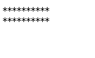
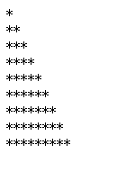

# 03-javaScript基础

## switch语句

> ### 语法
>
> ```js
> switch ( 变量 ) {
>  case  值1:
>      代码语句..
>   break;
>  case  值2:
>      代码语句...
>  break;
>  default:    
>  break;
> }
> ```
>
> ### 执行过程
>
> ```js
> 总结：
> 	 1. 如果在程序中要表示一个范围，那么推荐使用条件判断
>      2. 如果程序中表示的是一个具体的值， 可以用switch语句
>   
> 注意：
> 	//1. switch 后面的变量数据类型必须和 case 后面的值数据类型保持一至
> 	//2. break语句必须加
> ```
>
> ### 课堂案例
>
> ```
> ☞ 根据用户输入月份，显示对应的季节（例如：3,4,5为春季）
> ☞ 李四的年终工作评定,如果定为A级,则工资涨500元,如果定为B级,则工资涨200元,如果定为C级,工资不变,如果	 定为D级工资降200元,如果定为E级工资降500元.
>    设李四的原工资为5000,请用户输入李四的评级,然后显示李四来年的工资.
> ```

## 循环

```
 ☞  循环：  重复的再做一件事件
 	✔ 当条件满足的时候，执行循环代码
    ✔ 条件不满足的时候，不会执行循环代码
```


## while循环

> ### 语法
>
> ```
> while(条件表达式) {
>  代码（循环体）
> }
> ```
>
> ### 执行过程
>
> ```
>  1.  先条件判断结构是 true 还是 false
>  2.  如果是true，那么程序会一直执行循环体中的代码
>  3.  如果条件为false，那么程序会立即跳出循环体代码结束执行
> ```
>
> ### 课堂案例
>
> ```
> 1. 将 1 到 100 之间的所有数字输出到控制台中
> 2. 将1到100之间的所有是3的倍数找出来，在控制台中输出
> 3. 求1到100之间的数字和。在控制台中输出
> 4. 首先接收用户输入用户名和密码，只要用户名不是admin或者密码不是888就一直提示要求重新输入,如果正确则提登录成功.
> 5. 请将1到50中所有的奇数并求和，在控制台中输出！【输出1-50之间的所有奇数，输出1-50中所有奇数的和】
> ```

## do .. while 循环

> ### 语法
>
> ```
> do {
> 
>    循环体代码
>  
> }while(条件表达式)
> ```
>
> ### 执行过程
>
> ```
> ☞ 先执行循环体代码
> ☞ 然后判断条件
> ☞ 如果条件为true，继续执行循环体代码
> ☞ 如果条件为false,循环体代码立即结束，跳出循环
> 
> 
> 与while循环的区别：
>  	 1. 如果条件不满足，do while循环会比while循环多执行一次
>      2. 如果条件满足，do while循环和while循环执行的次数是一样一样的。
> ```
>
> ### 课堂案例
>
> ```
> 1. 将1到100之间的所有是3的倍数找出来，在控制台中输出
> 2. 求1到100之间的数字和。在控制台中输出
> 3. 首先接收用户输入用户名和密码，只要用户名不是admin或者密码不是888就一直提示要求重新输入,如果正确则提登录成功.
> 4. 请将1到50中所有的奇数并求和，在控制台中输出！
> ```

## for 循环

```javascript
☞  如果能明确循环次数，推荐使用for循环， 如果循环次数不确定，可以使用while获取do while循环
for (变量初始化; 条件表达式 ;  变量自增（变量自减）) {
     循环体代码
}
```

### 执行过程

```javascript
1. 先执行变量初始化
2. 条件判断，结构是否为true
3. 如果条件为true，进入循环体中执行代码 【如果条件为false，循环立即结束】
4. 变量自增或自减  --   条件判断   --  true  --- 执行代码
```

### 案例演示

```javascript
1. 计算1到100的和 
2. 将1到100之间所有是6的倍数的数字输出到控制台中
3. 在页面中打印两行每行中有10颗*
4. 在页面中打印直角三角形
5. 在页面中打印99乘法表

作业：	
6. 输入班级人数(比如5人),然后依次输入学员成绩
    1. 计算班级学员的总成绩
    2. 计算班级的平均成绩
    
   	优化第6个题目：  
        	1 。判断用户输入的班级人数是不是数字 。 判断用户输入的学生成绩是不是数字
            2. 如果用户输入的班级学生人数不是数字，程序直接提示退出即可
            3. 如果用户输入的班级人数是数字，那么判断用户输入的学生成绩是不是数字，如果不是数字，提示用户，并程序退出，否则继续计算最后结果
```






## continue语句

### 特点

```javascript
 1.  当程序遇到continue的时候，会结束本次循环，后面的代码也不会执行。进入到下一次循环中。
```

### 案例体验

```javascript
 1. 求整数1～100的累加值，要求跳过所有个位为3的数
```

## break语句

### 特点

```javascript
 1. 当程序遇到break语句的时候，程序会立即终止，后面的代码不执行
```

### 案例体验

```javascript
1. 求整数1～100的累加值，要求碰到3的倍数则停止累加 
```

## 数组

```javascript
 思考如果我们希望同时保存多条数据该怎么办？【例如：如何将班上所有学生姓名保存起来】
```

### 学习数组的意义？

```javascript
 ☞ 数组： 可以一次保存多条数据， 数组也是一个用来保存数据的容器。
```

### 学习数组

> ### 创建数组
>
> - ### 构造函数创建数组（了解）
>
> ```javascript
> var   自定义数组名称  = new Array();
> ```
>
> - ### 字面量创建数组
>
> ```javascript
> var  自定义数组名称 = [] ;
> ```
>
> ### 数组赋值
>
> - ### 创建数组并赋值
>
> ```javascript
> ☞ 构造函数方式
> 	  var  ary = new  Array (1,2,3,5,6);
> 
> ☞ 字面量方式赋值
> 	 var  ary = [1,2,3,4,6];
> ```
>
> - ### 通过索引方式赋值
>
> ```javascript
> var  ary = [];
> 	ary[0]=1;
> 	ary[1]=2;
> 
> 总结：
>   	 1. 数组中索引值是从 0 开始的
>        2. 通过索引的方式给数组赋值，要按照顺序个数设置
>        3. 通过  数组名.length 可以获取到当前数组的长度
> ```
>
> ### 获取数组中的值
>
> ```javascript
> ☞  通过索引的方式获取数组中的值，数组的索引从0开始
> 
> ☞  语法：
> 	    数组名[索引号]
> 
> 例如：
> 	   var  ary = [1,2,3,4,5];
> 	   ary[0];
> 	   ary[1];
> ```
>

