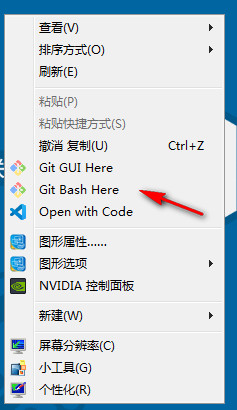
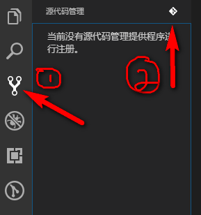
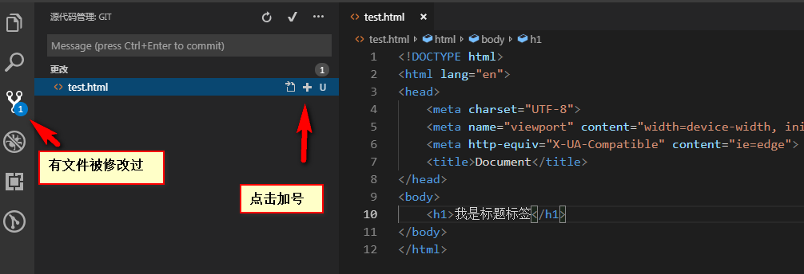
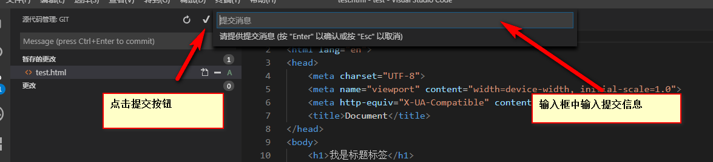
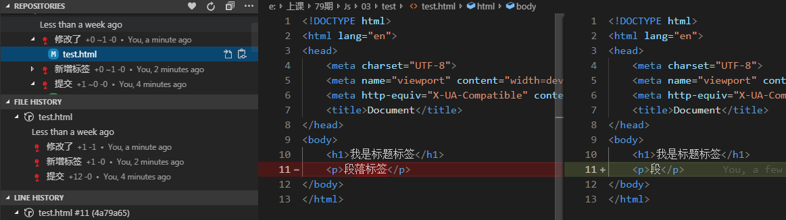

# 04JavaScript基础

## 核心知识点

> ### 操作数组

## 数组

```
思考如果我们希望同时保存多条数据该怎么办？【例如：如何将班上所有学生姓名保存起来】
```

## 学习数组的意义？

```
☞ 数组： 可以一次保存多条数据， 数组也是一个用来保存数据的容器。
```

## 学习数组

> #### 创建数组
>
> - #### 字面量创建数组
>
> ```
> var  自定义数组名称 = [] ;
> ```
>
> - #### 通过构造函数创建数组
>
> ```
> var   自定义数组名称  = new Array();
> ```
>
> #### 数组赋值
>
> - ##### 创建数组并赋值
>
> ```
> ☞ 构造函数方式
> 	  var  ary = new  Array (1,2,3,5,6);
> 
> ☞ 字面量方式赋值
> 	 var  ary = [1,2,3,4,6];
> ```
>
> - ##### 通过索引方式赋值
>
> ```
> var  ary = [];
> 	ary[0]=1;
> 	ary[1]=2;
> 
> 总结：
>     	 1. 数组中索引值是从 0 开始的
>          2. 通过索引的方式给数组赋值，要按照顺序个数设置
>          3. 通过  数组名.length 可以获取到当前数组的长度
> ```
>
> - #### 获取数组中的值
>
> ```
> ☞  通过索引的方式获取数组中的值，数组的索引从0开始
> 
> ☞  语法：
> 	    数组名[索引号]
> 
> 例如：
> 	   var  ary = [1,2,3,4,5];
> 	   ary[0];
> 	   ary[1];
> ```
>
> - #### 课堂案例
>
> ```
>   - 练习1：统计班级学生就业薪资，计算总薪资 和 平均薪资。
>   
>   - 练习2：统计班级学生就业薪资，计算薪资超过15000的人的个数。
>   
>   - 练习3：给一个不重复的数字数组，求最大值和最大值的在数组中的位置
>   
>   - 练习4：给一个字符串数组，将数组中的每一个数据拼接在一起，每个数据之间用 | 符合拼接。 如： ‘张三|李四|王五’
>   
>   
> 作业：
>   - 练习5：给一个数字数组，该数组中有很多数字0，将不为0的数据存入到一个新的数组中
>   - 练习6：给一个数组，将数组中的数据反转，存放到一个新的数组中。
>   - 练习7：给一个不重复的数字数组，求最大值和最大值的在数组中的位置 和 最小值和最小值的在数组中的位置
> ```
>
> - 冒泡排序
>
> ```js
> 		//数组
> 		var ary = [100,20,30,4,5];
> 		//控制要比较多少趟
> 		for(var i = 0; i < ary.length-1; i++) {
>         
> 			//每趟要比较的次数
> 			for(var j = 0; j < ary.length -1-i; j++) {
> 
> 				//如果当前值小于下一个值，那么就交换位置
> 				if(ary[j] < ary[j+1]) {
> 
> 					//交换位置
> 					var temp = ary[j];
> 					ary[j] = ary[j+1];
> 					ary[j+1] = temp;
> 				}
> 			}
> 		}
> 		console.log(ary);
> ```

## 操作字符串方式

> - 分割字符串
>
> ```js
> split()   //	以一个分割符,将一个字符串串分割成一个数组
> ```
>
> - 课堂案例
>
> ```js
>  1. https://www.test.com/login?uname=zs&&pwd=123; 获取用户名和密码
> ```

## 获取系统日期

> - 获取系统时间
>
>   ```js
>     var  日期变量 = new Date()
>   ```
>
> - 获取日期其他部分
>
>   ```js
>       日期变量.getSeconds()  //获取秒
>       日期变量.getMinutes()  //获取分钟
>       日期变量.getHours()    //获取小时
>       日期变量.getDay()      //返回周几   （0表示周日）
>       日期变量.getDate()     //返回当前月的第几天
>       日期变量.getMonth()    //返回月份   （从0开始）
>       日期变量.getFullYear()  //返回年份
>   备注：
>    	getYear()  返回从 1900年到当前系统时间的差，不推荐使用
>   ```
>
> - 课堂案例
>
>   ```js
>    1. 将当前系统时间以  yyyy-mm-dd HH:mm：ss 输出到控制台中
>   ```

## 与数学相关的操作

> - 获取随机数
>
> ```js
> Math.random()
> ```
>
> - 对数字取整
>
> ```js
> 1.Math.floor(x)
> 2.Math.ceil(x)
> ```
>
> - 课堂案例
>
> ```js
>   1. 求 1 到 10之间的随机整数【包括边界值】
>   2. 求 20 到 50 之间的随机整数【包括边界值】
>   3. 求m到n之间的随机整数(公式)
>     Math.floor(Math.random()*(n-m+1)+m);
> ```

## git基本使用

> - 什么是git？
>
> ```js
> git是一个代码版本管理工具软件
> ```
>
> - git目前学习目标
>
> ```js
> 知道如何将代码通过git方式进行管理
> ```
>
> - 如何使用
>
>   - 下载（<https://www.git-scm.com/download/>）
>
>   - 下载完成后，点击安装（一路下一步即可）
>
>   - 安装完成后点击鼠标右键出现如下效果即可
>
>  
>
>   - 点击Git Bash Here
>
>   - 在出现的窗口中输入
>
>  ```js
>     1. git config --global user.email "你自己的邮箱"
>     2. git config --global user.name "你自己的名字"
>     3. 查看信息  git config --list
>  ```
>
>   - 在vscode中使用git
>
>  ```js
> 1. 找到源代码管理器，并点击右上角图标（初始化存储厂库）
>  ```
>
>  
>
>   - 将修改后的文件提交到仓库中
>
>  
>
>   - 使用gitLens插件查看历史提交记录
>

## 传智小娜案例

> - 实现求和功能
> - 实现获取当前系统日期功能
> - 实现小娜讲笑话功能