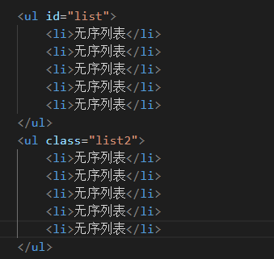

# JavaScript-DOM（BOM）操作

## JavaScript组成

> ### ECMASCRIPT (基础语法)
>
> ### DOM（文档对象模型）
>
> ### BOM（浏览器对象模型）

### DOM+BOM

> - #### 为啥要学DOM和BOM?
>
> ```html
>总结： 通过js中的DOM和BOM操作实现页面中的一些用户点击效果等
> 注意：
> 	 不要盲目的认为JS就是用来做网页特效的。
> ```
> 
> - #### 到底什么是DOM和BOM？
>
> ```html
>DOM： Document Object Model (文档对象模型)    操作页面元素
> BOM： Browser Object Model (浏览器器对象模型)  操作浏览器
> ```
> 
>   > #### 什么是文档对象模型（DOM）？
>  >
>   > 1. #### 概念部分理解
>   >
>   > ```
>   > 文档：HTML文件（document）
>   > 对象：对具体事务的抽象【属性+值】，将HTML抽象成对象
>   > 
>   > 总结：
>   > 	通过js操作html文档中的标签
>   > ```
>   >
>   > 2. #### 文档树
>   >
>   > ```html
>   > 将html文件中的标签，属性 等转化为对象，按照标签的关系以树状结构保存到内存中
>   > 
>   > ☞ 文档树中的元素: HTML标签 + 属性 + 内容信息 
>   > 
>   > ☞ 文档树中的节点： 所有的内容都叫节点（文本节点，标签节点，属性节点）
>   > ```
> 
> - #### 如何学习DOM和BOM？
>
> ```html
>掌握大量的方法（api），属性。
> ```

### 3.获取页面中的元素

- ### document.getElementById（元素ID）

  ```html
  通过标签ID获取页面中的元素
  
  备注：
  	 1. 页面中标签的ID值不能重复，必须唯一
  	 2. 通过document.getElementById只能获取满足条件的一个对应的标签
  ```

- #### document.getElementsByTagName（标签名）

  ```
  通过标签名获取页面中的元素
  
  备注：
  	 1. 通过该方法得到是一组符合条件的标签
  	 2. 通过该方法得到的结果其实就是一个伪数组。
  	 3. 伪数组是不能使用数组中的方法
  ```

- #### document.querySelector（css选择器）

  ```
  特点：
     通过选择器选中符合条件的唯一一个标签。
  ```

- #### document.querySelectorAll（css选择器）

  ```
  特点：
     通过选择器选中符合条件的所有标签，返回的是一个伪数组
  ```

- #### 课堂练习

  ```
  1. 在如下代码结构中将第一个列表中所有的文字输出到控制台中
  2. 在如下代码结构中将第二个列表中第3个li标签中的文字输出到控制台中
  ```
  
  

### 4.事件

> ##### 什么是事件？
>
> ```html
> 事件指的是一种行为动作： 比如 单击，双击，手指按压，滑动，移动，悬停。。。
> ```
>
> ##### 事件三要素
>
> ```html
>         事件源： 页面中的一个具体的标签
>       事件类型： 行为动作（单击，双击，悬停，滑动。。。） 
>  事件处理程序： 事件发生后的一个结果
> ```
>
> ##### 事件语法
>
> ```html
>   事件源.事件类型 = 事件处理程序
>   注意：
>   	  事件处理程序的本质就是一个函数。
> ```
>
> ##### 事件类型：
>
> - 单击onclick
> - 双击ondblclick
>
> ##### 事件处理程序中的this关键字
>
> ```
>  函数中的this指向的是外部构造函数指向的对象。
>  事件处理程序中的this指向的是当前事件源
> ```

### 5.操作元素中的属性

> - #### src属性【案例:换图片】
>
>   ```js
>    dom.src :  获取图片路径    ----> 绝对路径
>    dom.alt:   获取图片描述信息
>    
>    备注：
>    	dom 指的是通过js获取的页面中元素
>   ```
>
> - #### className【案例：动画效果】
>
> ```js
> //获取对象的类名
> dom.className
> 
> //给对象添加类名
> dom.className = '类名'
> 
> 注意：
> 1.通过className给元素添加类名会将原来的类名覆盖掉
> 2.如果要保证原来的类名依然存在，可以使用拼接字符串的方式
> 3.去掉类名，赋值为空字符串即可
> ```
>
> - #### innerText 和 innerHTML【案例：设置文字】
>
> ```js
> //获取方式
> 通过innerText获取,仅仅包含文本
> 通过innerHTML获取，若有子标签时，会包含文本和子标签
> 
> 备注：
> 	 1. 在老版本火狐浏览器中不支持innerText
>      2. 在老版本火狐浏览器中使用textContent设置获取标签内容信息
>      3. 2016年将innerText正式纳入标准属性
> 
> //设置结果
> 通过innerText设置,若设置中包含了子标签，该标签不会被渲染而是当做普通文本显示
> 通过innerHTML设置,若设置中包含了子标签，该标签会被渲染显示
> ```
>
> - #### textContent和 innerText
>
> ``` js
> 相同点：
> 	相同点：获取的都是文本，将html标签过滤掉
> 
> 不同点：
> textContent在获取内容的时候，将空格和换行效果都显示
> innerText 在获取内容的时候，没有空格和换行效果
> 
> 处理兼容性问题：
> 1.如果元素支持某个属性，那么会返回该属性的类型
>  2.如果元素不支持某个属性，那么会返回undefined类型
>  例如：
>  	<div id="one"></div>
> 	    console.log(typeof div.a);  //undefined
> 		console.log(typeof div.id); //string
> 
> 
> //兼容性代码
> function gettext (element) {
>  if(typeof element.innerText === "string") {
>      return element.innerText;
>  }else {
>      return element.textContent;
>  }
> }
> ```
>
> - ##### 取消a标签默认跳转行为[扩展]
>
> ```js
> 方式1：事件处理程序中最后设置return false; 
> 
> <a id="link" href="https://www.baidu.com">点击</a>
> <script>
> var link = document.getElementById('link');
> link.onclick = function(){
>   alert('你好');
>   // 方式1：取消a点击后的默认跳转行为 return false;
>   return false;
> };
> </script>
> 
> 
> 方式2：设置a标签的href属性值为：javascript: 
> <a href="javascript:">点击2</a>
> 备注：
> 	给a标签的herf值设置javascript: ,表示将来点击a时，会阻止默认跳转行为，并且仅仅会执行js代码
> ```
>

### 6.综合案例

- #### 美女相册案例

- #### 京东登录案例

- #### 京东注册案例

### 6.1总结

```html

```
