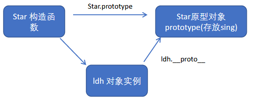
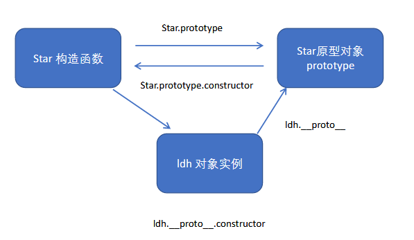

课程回顾：

​	事件：$(元素).click();

​			   $(元素).on('click','li',function () {});

​	解绑：off

​	自动：$(元素).click()，trigger，triggerHander

​	事件对象：event

​	JSON.parse(字符串);

​	JSON.stringify(数组)


# JavaScript面向对象

## 1.1两大编程思想：

### 	1、面向过程

​	**面向过程：POP(Process-oriented programming)**

> ​	面向过程就是分析出解决问题所需要的步骤，然后用函数把这些步骤一步一步实现，使用的时候再一个一个的依次调用就可以了。

​	**大象放到冰箱：打开冰箱==》放入大象==》关上冰箱**


### 	2、面向对象

​	**面向对象：OOP (Object Oriented Programming)**

> ​	面向对象是把事务分解成为一个个对象，然后由对象之间分工与合作。

​		大象，冰箱：都看成对象功能

**面向对象和过程区别**

​		面向过程：小项目【例如一个人盖一个小狗窝】

​		面向对象：多人合作大项目【要盖高楼，一个人完成太慢，而且其他事情等等待】

​		**比如：**

​			一个人盖小狗窝，直接和泥，方砖，修饰既可

​			但是盖高楼的话，需要打地基，需要运输材料，需要财务结算等，此时不需要等，个做个的，效率高【模块完成】

## 1.2面向对象三大特性

- 封装性【已经把扫把功能准备好，负责开即可】
- 继承性【继承与拖拉机，会开拖拉机就会弄这个，继承自拖拉机】
- 多态性【可以放到一起，也可以单独拿下来，而且那个扫把坏了换哪个不影响其他的】


## 面向对象和过优缺点

​	**面向过程：**

​		优点：性能比面向对象高，步骤练习紧密

​		缺点：不好维护，不易多次使用及扩展		

​	面向对象：

​		优点：易维护，可复用，可扩展，灵活性高

​		缺点性能没有面向过程高

> 面向过程就是一份蛋炒饭，味道均匀，但是假如有的人不喜欢吃鸡蛋，没办法分开
>
> 面向对象就是一个盖浇饭，但是味道不均匀，而不想吃某种味道，可以分开
>
> 简单程序面向过程，复杂程序用面向对象

# ES6中的类和对象

类是在ES6中新加进入的，学会区分类和对象的概念，

**类：抽象**

​	类模拟抽象的，泛指的，对象是具体的

​	面向对象模拟现实世界，更贴近实际生活，生活照分为抽象事物和具体事物

​	比如：手机【两层含义：具体某个手机，和笼统的概念手机】

​	1、抽取，把对象的属性和行为封装成一个类

​	2、对类进行实例化, 获取类的对象

**对象：具体**

​	现实生活中：万物皆对象，对象是一个具体的事物，看得见摸得着的实物。例如，一本书、一辆汽车、一个人可以是“对象”

​	在JavaScript 中，对象是一组无序的相关属性和方法的集合，所有的事物都是对象，例如字符串、数值、数组、函数等。

**对象是由属性和方法组成的：**

​	属性：事物的特征，在对象中用属性来表示（常用名词）

​	方法：事物的行为，在对象中用方法来表示（常用动词）

**面向对象的思维特点:**

​	 1.抽取（抽象）对象共用的属性和行为组织(封装)成一个类(模板)

​	 2.对类进行实例化, 获取类的对象【new】


## 类class

> 在ES6中新增加了类的概念，可以使用class关键字声明一个类，之后以这个类来实例化对象。【构造函数实例化对象】

- 类抽象了对象的公共部分，它泛指某一大类（class）
- 对象特指某一个，通过类实例化一个具体的对象

例如：人有身高，体重等，但是具体的某个人也有这个属性

**练习了解类和对象**

​	人==>姚明

​	电影明星==》周星驰


## 创建类

```javascript
语法：class 类名 {}【构造函数语法糖】

注意类名首字母大写

类要抽取公共属性方法，定义一个类

```


```javaScript
class Star {
};

var ldh = new Star();
类就是构造函数的语法糖
```
## 类constructor构造函数

语法：

```javascript
class Star {
	constructor (uname,age){
		this.uname = uname;
		this.age = age;
	}
}
```

```
注意：类里面的方法不带function，直接写既可

类里面要有属性方法，属性方法要是想放到类里面，我们用constructor构造器

构造函数作用：接收参数，返回实例对象，new的时候主动执行，主要放一些公共的属性
```


> constructor() 方法是类的构造函数(默认方法)，用于传递参数,返回实例对象，通过new命令生成对象实例时，自动调用该方法。
>
> 注意：每个类里面一定有构造函数，如果没有显示定义, 类内部会自动给我们创建一个constructor() ，
>
> 注意：this代表当前实力化对象，谁new就代表谁

------


## 类添加方法

语法：注意方法和方法之间不能加逗号

```javascript

class Star {

	constructor () {}

	sing () {}

	tiao () {}

}
```


```javascript
class 类名 { constructor(){}   方法名(){} }

注意：类中定义属性，调用方法都得用this
```

> 注意：方法之间不能加逗号分隔，同时方法不需要添加function 关键字

**总结：类有对象的公共属性和方法，用class创建，class里面包含constructor和方法，我们把公共属性放到constructor里面，把公共方法直接往后写既可，但是注意不要加逗号**

# 类的继承

## **extends**

```javascript
语法：

​	class Father {}

​	class Son extends Father{}

注意：是子类继承父类
```

## **super关键字**

我们应用的过程中会遇到父类子类都有的属性，此时，没必要再写一次，可以直接调用父类的方法就可以了

<u>super关键字用于访问和调用对象父类上的函数。可以调用父类的构造函数，也可以调用父类的普通函数</u>

```
当子类没有constructor的时候可以随意用父类的，但是如果子类也含有的话，constructor会返回实例，this的指向不同，不可以再直接使用父类的东西
```

**调用父类构造函数**

```
class F { constructor(name, age){} }

class S extends F { constructor (name, age) { super(name,age); } }

注意: 子类在构造函数中使用super, 必须放到this 前面(必须先调用父类的构造方法,在使用子类构造方法
```

**调用父类普通函数**

```
class F { constructor(name, age){} say () {} }

class S extends F { constructor (name, age) { super(name,age); } say () { super.say() } }

注意：如果子类也有相同的方法，优先指向子类，就近原则

```

**总结：super调用父类的属性和方法，那么查找属性和方法的原则就近原则**


## 三个注意点

- 在ES6中类没有变量提升，所以必须先定义类，才能通过类实例化对象.
- 类里面的共有属性和方法一定要加this使用.【this，对象调用属性和方法】按钮练习
- 类里面的this指向问题. 
- constructor 里面的this指向实例对象, 方法里面的this 指向这个方法的调用者

// 构造函数中的this代表当前实例对象// 普通方法里面的this代表的是，调用者

```
class Button {

	constructor () {
		var btn = document.querySelector('input');
		btn.onclick = this.cli;
	}

	cli () {
		console.log('点击了');
	}

}

var anniu = new Button();
```

## 类里面的this指向

- 构造函数的this指向实例对象

- 普通函数的this是调用者，谁调用this是谁

  

```javascript
	<input type="button" value="点击">
	var that;
		class F {
			constructor (name, age) {
				this.name = name;
				this.age = age;
				// console.log(this);
				that = this;
				this.btn = document.querySelector('input');
				this.btn.onclick = this.cli;
			}

			cli () {
				console.log(this);
			}

			say () {
				console.log(this);
			}
		}

		var obj = new F('刘德华',22);
```

# tab栏案例

this执行==》构造函数，new的对象，方法：this,调用者

**面向对象版tab 栏切换**

```javascript
1.tab栏切换的主要思路是：

2.点击当前li 添加liactive 类其余li移除类

3.根据当前li 的索引号当前section 添加类，其余section 删除类

4.这里可以把添加放入切换函数里面

5.新增一个清除类函数，专门移除其余li和section 类

6.注意里面this 指向问题
```

**面向对象版tab 栏切换添加功能**

```
1.点击+ 可以实现添加新的选项卡和内容

2.第一步: 创建新的选项卡li 和新的内容section

3.第二步: 把创建的两个元素追加到对应的父元素中.

4.以前的做法:  动态创建元素createElement, 但是元素里面内容较多, 需要innerHTML赋值,在appendChild追加到父元素里面.

5.现在高级做法:   利用insertAdjacentHTML() 可以直接把字符串格式元素添加到父元素中

6.appendChild不支持追加字符串的子元素, insertAdjacentHTML支持追加字符串的元素7.insertAdjacentHTML(追加的位置,‘要追加的字符串元素’)  

8.追加的位置有: beforeend插入元素内部的最后一个子节点之后

9.该方法地址:  https://developer.mozilla.org/zh-CN/docs/Web/API/Element/insertAdjacentHTML
```

# 构造函数和原型

## 构造函数和原型

```javascript
在典型的OOP 的语言中（如Java），都存在类的概念，类就是对象的模板，对象就是类的实例，但在ES6之前，JS 中并没用引入类的概念。

ES6，全称ECMAScript6.0 ，2015.06 发版。但是目前浏览器的JavaScript 是ES5 版本，大多数高版本的浏览器也支持ES6，不过只实现了ES6 的部分特性和功能。

在ES6之前，对象不是基于类创建的，而是用一种称为构建函数的特殊函数来定义对象和它们的特征。

```

## 创建对象可以通过以下三种方式：

- 对象字面量
- new Object()【构造函数】
- 自定义构造函数


# 构造函数和原型

```javascript
构造函数是一种特殊的函数，主要用来初始化对象，即为对象成员变量赋初始值，它总与new一起使用。我们可以把对象中一些公共的属性和方法抽取出来，然后封装到这个函数里面。
function Fn () {}
```

**在JS 中，使用构造函数时要注意以下两点：**

1.构造函数用于创建某一类对象，其首字母要大写

2.构造函数要和new 一起使用才有意义

```
练习判断构造函数还是普通函数
```

**new在执行时会做四件事情**

1. 在内存中创建一个新的空对象。
2. 让this指向这个新的对象。
3. 执行构造函数里面的代码，给这个新对象添加属性和方法。
4. 返回这个新对象（所以构造函数里面不需要return）。

## 静态成员和实例成员

```
JavaScript 的构造函数中可以添加一些成员，可以在构造函数本身上添加，也可以在构造函数内部的this 上添加。通过这两种方式添加的成员，就分别称为静态成员和实例成员。
```

- 静态成员：在构造函数本上添加的成员称为静态成员，只能由构造函数本身来访问
- 实例成员：在构造函数内部创建的对象成员称为实例成员，只能由实例化的对象来访问

```javascript
function Person (uname, age) {
			this.uname = uname;
			this.age = age;

		this.say = function () {
			console.log(123);
		}

}

	var obj = new Person('张三丰',22);	
	console.log(obj.uname);

	// console.log( Person.uname );
	Person.leibie = '人';

	console.log(Person.leibie);
	console.log(obj.leibie);
```

**构造函数小问题：**

```
当实例化对象的时候，属性好理解，属性名属性值，那么方法是函数，函数是复杂数据类型

那么保存的时候是保存地址，又指向函数，而每创建一个对象，都会有一个函数，每个函数都得开辟一个内

存空间，此时浪费内存了，那么如何节省内存呢，我们需要用到原型

方法放到构造函数里面，如果多次实例化，会浪费内存
```

	function Star (uname, age) {
		this.uname = uname;
		this.age = age;
		this.sing = function () {
			console.log(this.name + '在唱歌');
		}
	}
	
	var ldh = new Star('周星驰', 22);
	var ldh = new Star('刘德华', 22);
>   

## 构造函数原型prototype

什么是原型对象：就是一个属性，是构造函数的属性，这个属性是一个对象，我们也称呼，prototype 为原型对象。

每一个构造函数都有一个属性，prototype

作用：是为了共享方法，从而达到节省内存

**注意：每一个构造函数都有prototype属性**

例如：大家来学校上学，有的开车，有的汽车，有的开飞机，等等，此时浪费，那么准备一个大巴车，方便有节省

> 构造函数通过原型分配的函数是所有对象所共享的。
>
> JavaScript 规定，每一个构造函数都有一个prototype 属性，指向另一个对象。注意这个prototype 就是一个对象，这个对象的所有属性和方法，都会被构造函数所拥有。我们可以把那些不变的方法，直接定义在prototype 对
>
> 象上，这样所有对象的实例就可以共享这些方法。

```javascript
function Star (uname, age) {

​		this.uname = uname;
​		this.age = age;
​		// this.sing = function () {
​		// 	console.log(this.name + '在唱歌');
​		// }

​	}
​	Star.prototype.sing = function () {
​		console.log(this.uname + '在唱歌');
​	}

​	var zxc = new Star('周星驰', 22);
​	var ldh = new Star('刘德华', 22);
​	// console.log( Star.prototype );
​	ldh.sing();
​	zxc.sing();
```

**总结：所有的公共属性写到构造函数里面，所有的公共方法写到原型对象里面**

 疑问：为何创建一个对象，都可以自动的跑到原型对象上找方法

因为每一个对象都有一个属性，对象原型，执行原型对象

## 对象原型：____proto____

主要作用：指向prototype

构造函数和原型对象都会有一个属性__proto__ 指向构造函数的prototype 原型对象，之所以我们对象可以使用构造函数prototype 原型对象的属性和方法，就是因为对象有__proto__ 原型的存在。

> ```javascript
> 注意：____proto____是一个非标准属性，不可以拿来赋值或者设置【只读属性】
> ```

- ```
  1.____proto____对象原型和原型对象prototype 是等价的
  
  2.____proto____对象原型的意义就在于为对象的查找机制提供一个方向，或者说一条路线，但是它是一个非标准属性，因此实际开发中，不可以使用这个属性，它只是内部指向原型对象prototype
  ```

  




**总结：每一个对象都有一个原型，作用是指向原型对象prototype**

**统一称呼：____proto____原型，prototype成为原型对象**


## constructor  构造函数

> <u>**记录是哪个构造函数创建出来的**</u>
>
> 指回构造函数本身

原型（__proto__）和构造函数（prototype）原型对象里面都有一个属性constructor属性，constructor 我们称为构造函数，因为它指回构造函数本身。constructor 主要用于记录该对象引用于哪个构造函数，它可以让原型对象重新指向原来的构造函数。一般情况下，对象的方法都在构造函数的原型对象中设置。如果有多个对象的方法，我们可以给原型对象采取对象形式赋值，但是这样就会覆盖构造函数原型对象原来的内容，这样修改后的原型对象constructor  就不再指向当前构造函数了。此时，我们可以在修改后的原型对象中，添加一个constructor 指向原来的构造函数。

**总结：constructor  主要作用可以指回原来的构造函数**

## 构造函数、实例、原型对象三者之间的关系




**思考：如果传入一个对象给原型对象添加方法呢**

```javascript
Star.prototype = {
    sing : function () {},
    dance: function () {}
};

此时会覆盖原先prototype中的内容，传入一个新的对象，那么此时就不知道构造函数是哪个了
所以我们要指回构造函数：constructor：构造函数
```


## 原型链

```
作用：提供一个成员的查找机制，或者查找规则
```


## JavaScript 的成员查找机制(规则)

```
当访问一个对象的属性（包括方法）时，首先查找这个对象自身有没有该属性。

如果没有就查找它的原型（也就是__proto__指向的prototype 原型对象）。

如果还没有就查找原型对象的原型（Object的原型对象）。

依此类推一直找到Object 为止（null）。

__proto__对象原型的意义就在于为对象成员查找机制提供一个方向，或者说一条路线。

// console.log(Star.prototype.__proto__.__proto__);
// console.log(Object.prototype);
```

## 扩展内置对象

```
可以通过原型对象，对原来的内置对象进行扩展自定义的方法。比如给数组增加自定义求偶数和的功能。
```

```
console.log( Array.prototype );
	// 添加求和方法
	Array.prototype.sum = function () {
		var sum = 0;
		for (var i = 0; i < this.length; i++) {
			sum += this[i];
		}
		return sum;
	}

	var arr = [1,2,3];
	console.log( arr.sum() );

	var newArr = [6,7,8,9];
	console.log( newArr.sum() );
```

# 继承

```
ES6之前并没有给我们提供extends 继承。我们可以通过构造函数+原型对象模拟实现继承，被称为组合继承。
```

```
call()

调用这个函数, 并且修改函数运行时的this 指向

fun.call(thisArg, arg1, arg2, ...);call把父类的this指向子类

thisArg ：当前调用函数this 的指向对象

arg1，arg2：传递的其他参数
```

**利用构造函数实现子类的继承：**

## **属性的继承**

```
function Father (uname,age) {
			// this指向父类的实例对象
			this.uname = uname;
			this.age = age;
			// 只要把父类的this指向子类的this既可
		}
		function Son (uname, age,score) {
			// this指向子类构造函数
			// this.uname = uname;
			// this.age = age;
			// Father(uname,age);
			Father.call(this,uname,age);
			this.score = score;
		}
		Son.prototype.sing = function () {
			console.log(this.uname + '唱歌')
		}
		var obj = new Son('刘德华',22,99);
		console.log(obj.uname);
		console.log(obj.score);
		obj.sing();
```

## **方法的继承：**

**实现方法把父类的实例对象保存给子类的原型对象**

```
一般情况下，对象的方法都在构造函数的原型对象中设置，通过构造函数无法继承父类方法。核心原理：

①将子类所共享的方法提取出来，让子类的prototype 原型对象= new 父类()  

②本质：子类原型对象等于是实例化父类，因为父类实例化之后另外开辟空间，就不会影响原来父类原型对象

③将子类的constructor 
```

```

function Father () {

		}
		Father.prototype.chang = function () {
			console.log('唱歌');
		}

		function Son () {

		}
		// Son.prototype = Father.prototype;
		Son.prototype = new Father();
		var obj = new Son();
		obj.chang();

		Son.prototype.score = function () {
			console.log('考试');
		}

		// obj.score();
		// console.log(Son.prototype);
		console.log(Father.prototype);
```

**注意：一定要让Son指回构造函数**

```
实现继承后，让Son指回原构造函数

Son.prototype = new Father();

Son.prototype.constructor = Son;
```

**总结：用构造函数实线属性继承，用原型对象实线方法继承**

# 类的本质

```
class本质还是function

类的所有方法都定义在类的prototype属性上

类创建的实例,里面也有__proto__ 指向类的prototype原型对象

所以ES6的类它的绝大部分功能，ES5都可以做到，新的class写法只是让对象原型的写法更加清晰、更像面向对象编程的语法而已。

所以ES6的类其实就是语法糖.

语法糖:语法糖就是一种便捷写法.   简单理解, 有两种方法可以实现同样的功能, 但是一种写法更加清晰、方便,那么这个方法就是语法糖
```

```
	class Star {}
	console.log( typeof Star );
	var obj = new Star();
	console.log(obj.__proto__);
	console.log(Star.prototype);
```

# ES5 中的新增方法

```
ES5 中给我们新增了一些方法，可以很方便的操作数组或者字符串，这些方法主要包括：

数组方法

字符串方法
```

## 数组方法：

```
迭代(遍历)方法：forEach()、map()、filter()、some()、every()；

这些方法都是遍历数组的
```

**forEach()**

```
array.forEach(function(currentValue, index, arr))

currentValue：数组当前项的值
index：数组当前项的索引
arr：数组对象本身
```

```
var arr = ['red','blue','yellow','orange'];

arr.forEach(function (elm,i,arrAbc) {
	console.log(elm,i,arrAbc);
});
```

**filter()**

```
array.filter(function(currentValue, index, arr))

filter() 方法创建一个新的数组，新数组中的元素是通过检查指定数组中符合条件的所有元素,主要用于筛选数组

注意它直接返回一个新数组

currentValue: 数组当前项的值

index：数组当前项的索引

arr：数组对象本身回调函数里面添加return添加返回条件
```

```
var arr = [100,66,99,123,333,33,44,66];
	var reArr = arr.filter(function (elm, a, n) {

	// console.log(elm,a, n);
	return elm % 2 == 0;

	});

	console.log(reArr);
```

**some()**

```
array.some(function(currentValue, index, arr)) 【注意：找到或者满足条件立刻停止】

some() 方法用于检测数组中的元素是否满足指定条件. 通俗点查找数组中是否有满足条件的元素

注意它返回值是布尔值, 如果查找到这个元素, 就返回true , 如果查找不到就返回false.

如果找到第一个满足条件的元素,则终止循环. 不在继续查找.

currentValue: 数组当前项的值index：数组当前项的索引

arr：数组对象本身
```

```
var arr = [100,200,300,400];
var re = arr.some(function (elm,i,arr) {
		// console.log(elm,i,arr);
		console.log(i);
		return elm >= 200;
	});
console.log(re);
```


