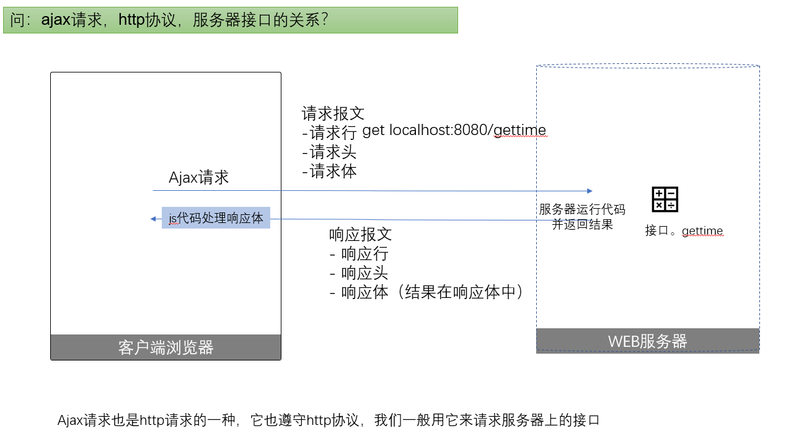

# 课程 ajax
ajax是前端开发人员必须要掌握的技能。它并不是一项新技术，应该说是一个比较老的技术了，它主要用于发送异步请求进行页面的局部更新，以提升用户体验。在目前前后端分离开发的大趋势下，ajax成为了前端人员与后端人员交流的手段，分工合作的基础。 


## 课程整体说明

我们前一个阶段的学习内容主要是在做**静态页面**，它有两个缺点：

- 网页只能自己看看，别人不能查看。
- 页面中的数据都是死的，没有活数据。

这个阶段，我们引入服务器和ajax的概念来解决这两个问题。
- 使用虚拟web服务器，让其它同学也可以访问我们的网页
- 通过ajax技术从web服务器上获取活数据

目标: 
- 能使用第三方的ajax库：jquery，axios；
- 能手写ajax去访问后端接口；
- 能使用模板引擎，配合JSON数据进行页面渲染。

整体案例展示：

- 留言板
- 会员管理系统
## 第1章 预备知识
### 第1节 服务器与客户端的概念
上一个阶段的学习内容都是静态网页的技术，没有后端数据参加，也`不能共享给其它人来访问`。 属于埋头`寒窗苦读无人晓`的阶段。学习了服务器的知识，我们就可以快速地启一个本地的服务器，让他人来访问我们的网页了
#### 服务器和客户端
我们在日常上网，聊天的过程中就已经在与服务器与客户端这两个部分打交道了。

**服务器(server)**

服务器是为其它设备提供服务的机器。生活中的例子：服务员是为顾客提供服务的员工。具体在计算机领域，我们可以理解：

> 服务器 = 硬件配置高的电脑 + 安装特殊软件

它之所以能够提供服务，一方面是硬件性能比较强，另一方面是因为安装了一些特殊的软件：

- web服务器： 安装了能提供`web服务`的软件。如iis, nginx, apache等。
- ftp服务器：装了ftp软件，提供文件上传下载服务。
- 数据库服务器：安装了mysql,sql server,mongodb等软件，能够提供数据库服务。

有两点要注意：
1. 一台服务器可以安装多个软件，来提供多种服务。
2. 服务器是一个相对的概念：如果某台计算机在某个时间给其它设置提供了某个服务，则可以称为它是充当了服务器的功能。例如，你的手机开了热点，别的同学可以通过你的手机来上网，则此时，也可以说你的手机就是一台wifi服务器。

**客户端（client)**
连接到服务器，享受服务的设备，就是客户端。一般来说，要**享受某个服务也是需要安装一些软件**的。例如：要想看电影：需要安装爱奇艺客户端软件（或者是通过浏览器软件来访问它的网站）。
在给大家演示留言板的功能时，我的计算机就充当了服务器的角色，而大家的电脑就是享受这个服务的客户端。

大家要注意这里有两个细节：
1. 服务器之所以能提供服务，是因为它安装了特殊的软件，客户端之所以享受服务，也是因为它安装了某些软件。
2. 服务器与客户端是相对的：你也可以把自己的电脑中安装软件器软件，让它也能够为其它同学提供服务。

好，现在我们对照日常的一些场景，来简单区别一下服务器与客户端的概念。
场景1：使用手机中的爱奇艺app观看电影；
场景2：使用百度上网搜索 什么是ajax；
场景3：使用qq邮箱给朋友发邮件；


### 第2节 请求与响应过程
#### web请求与响应
了解web服务器与浏览器之间的请求与响应过程;
能通过network面板观察请求和响应；

下面我们把**服务器**与**客户端**这两个概念具体到**web服务器**与**浏览器**上来。web服务器就是能提供web服务的服务器，在客户端中，我们要安装浏览器来访问web服务器。

在我们上网的过程中，一般来讲是客户端浏览器主动向web服务器发送请求（可能是通过在浏览器地址栏中直接输入地址，或者是点击了某个超链接），而web服务器收到请求之后将用户需要的请求进行返回。我们把这个过程简化一下：
 1. 客户端 ------  请求 ------> 服务器
 2. 服务器 ------  响应 ------> 客户端

基本流程

1. 确认地址。用户在浏览器（客户端）地址栏输入要访问的网站网址（URL）
2. 发送请求。浏览器向服务器发送请求(request)，告知服务器要获取的内容
3. 获取响应。服务端收到浏览器发送的请求，并把处理的结果返回给浏览器(response)
4. 显示内容。浏览器将服务端返回的结果显示到界面上

操作
- 在network面板中观察请求

注意：
如果一个html文件中还引用其它的文件：如样式文件,js文件,图片文件，则会发出多次请求。


### 第3节 本地web服务器的使用
为了方便学习，我们会在自己的电脑上安装web服务器软件，把自己的电脑虚拟成web服务器。换句话说，我们的电脑既是客户端，又是服务器。

我们可以安装一些第三方的web服务器软件例如:apche,ngix,iis等。但是为了后期学习的方便，我们这里是使用nodejs技术自己写了一个简单的web服务器，通过它我们就可以体现web服务器的功能了。目前来说，我们不用关心它的具体实现，而只需要学会如何使用它就行了。
#### 虚拟web服务器-访问网页
能够在本机上访问把自己开发的网页；
能够让其它同学在局域网内访问你的网页;
启动
   进入目录中，双击 “双击启动”这个文件，会自动弹出小黑窗；

访问网页
  - 上传网页到服务器。 把网页文件拷贝到public文件夹下。
  - 本机访问：在浏览器中输入地址来访问  http://localhost:3005/文件名  `(不要加public)`
  - 让其它同学访问： 把localhost改成你的本机的ip地址


#### 接口
在小黑窗服务器中，预置了几个可以用来操作业务，提供数据的特殊的url地址， 就是我们常说的接口。


作为一名前端程序员，我们日常的工作有一个重要的内容，就是调用接口。我们经常会听到类似于这样的对话。
- 开发经理问整体进度：你们组接口调通了几个？
- 前端程序员对后端程序员说：你的XXX接口有bug，我完全按接口文档上的要求调用的，老是出错。
- 开发经理问后端程序员说，我们的XX业务要给个接口给隔壁组调用哈，你跟一下哈。

上面几组场景中，都涉及了接口这个词， 那么接口是指什么呢？ 

这一部分，我们来介绍一些接口的概念，并使用一下小黑窗服务器中几个预置的接口。

我们访问网页的过程，就是浏览器向web服务器发请求，web服务器返回请求内容的过程。我们所请求的资源可以成分成两类：
- 文件：图片，css文件，html文件，视频文件等等，这是比较常见的资源，有些场合也称为静态资源。服务器处理这类请求的方式是取出文件的内容，并返回给浏览器。
- 代码：用服务器端语言写的一段代码，它会执行具体的业务功能，例如，用户登陆，检测用户名等。服务器处理这类请求的方式是执行这段代码，并把结果返回给浏览器。这就是我们上面谈及的接口。


我们可以这么来理解：
- 接口是一个网络url地址，我们通过http协议去访问这个url地址。
- 接口是由后端程序员写的一个函数，它负责接收前端传入的参数（也有可能不需要参数），进行业务处理之后，把处理结果返回给调用这个接口的请求。接口的返回值一般是纯数据。
- 接口可能有访问权限控制。
- 在前后端分离开发的背景下，我们可以理解是后端程序员写接口，前端程序员调用接口。
- 接口一般配合ajax技术来使用。

实操：
- 访问虚拟服务器中预置的接口。
- 访问网络公共接口。


### 第4节 http协议
浏览器向web服务器发请求的过程就是这两台计算机交流的过程，这个过程中是要遵守一定规则的。这个规则就是http协议。这里我们只是简单先了解一下http协议，了解它的组成部分，能够在network面板中查看这些组成部分即可。
#### 什么是http协议
浏览器与web服务器之间的请求与响应过程是遵守一定的规则的，浏览器向服务器请求什么内容，以什么方式发请求，服务器如何处理这些请求，返回的内容格式是什么，这些细节都有具体的约定，这就是我们要学习的http协议。
http(Hypertext transfer protocol)超文本传输协议。
 协议 就是规定，就像本朝的法律，必须遵守。http协议的双方就是浏览器和web服务器。http协议规定了通过浏览器和服务器进行数据交互，进行超文本（文本、图片、视频等）传输的规定。
	
	
HTTP 协议分成两个大的部分： 

  - `请求报文` : 浏览器 请求 资源 要遵守的http 协议
  - `响应报文` : 服务器 返回 资源 要遵守的http 协议   

#### 请求报文
说出请求报文的组成部分，及对应的含义；
能在浏览器开发者工具中找出请求报文对应的部分；
http协议规定了浏览器向服务器发请求时的格式。

- 它由三个部分组成

1. 请求行
2. 请求头
3. 请求体（可能是空）

请求行

构成格式： `请求方式  请求路径 协议及版本`
示例：
```http
GET / HTTP/1.1
GET /index.html HTTP/1.1
GET /common/get?id=123&name=jake HTTP/1.1
```

请求头

浏览器在向服务器发送请求的时候自动携带的信息，一般不需要主动去设置。
- 信息以键值对格式构成的

| 键              | 值                                      |
| --------------- | --------------------------------------- |
| Host            | 请求的主机                              |
| Cache-Control   | 控制缓存（例如：max-age=60 缓存 60 秒） |
| Accept          | 客户端想要接收的文档类型，逗号分隔      |
| User-Agent      | 客户端信息        |
| Referer         | 这次请求的来源                          |
| Accept-Encoding | 可以接受的压缩编码                      |
| content-type    | 设置传递给服务器的请求体的格式          |


[参考链接](https://developer.mozilla.org/zh-CN/docs/Web/HTTP/Headers)


请求体
请求体中保存本次请求附带的数据，例如，当用户登陆邮箱时，肯定需要把在登陆界面填入的用户名密码这些信息传递给服务器，以做下一步判断。需要注意的是：get请求没有请求体， post请求有请求体。 请求信息发送至服务器以后，服务器会获取传递过来的相关信息进行后端程序的处理。


#### 响应报文
掌握响应报文的组成部分；
能在浏览器中找出响应报文的内容；
http协议规定了服务器向浏览器返回数据时的格式。

- 它由三个部分组成

1. 响应行
2. 响应头
3. 响应体

响应行

格式：  协议及版本 状态码  说明

	-	状态码 ： 用来告诉浏览器服务器处理本次请求的结果。 不同的状态码对应不同的结果。

示例：

```js
HTTP/1.1 200 OK
HTTP/1.1 404 Not Found 
```

// 需要注意的是200，它表示状态码
// 状态码：
// - 描述了请求过程中所发生的情况
// - 每个状态码的第一位数字都用于描述状态的一般类别("成功"、"出错"等)
// - 常见状态码及含义
//   - 200 - 成功
//   - 302 - 重定向
//   - 304 - 读取缓存
//   - 404 - 请求的资源不存在
//   - 500 - 服务器内部错误
// 参考链接 https://developer.mozilla.org/zh-CN/docs/Web/HTTP/Status

响应头

- 服务器返回响应的时候携带了附加信息
- 由键值对组成
- 每个请求的响应头可能都不一样：它完全取决于服务器；

几个常见的响应头

| 键               | 值               |
| ---------------- | ---------------- |
| Date             | 响应时间         |
| Server           | 服务器信息       |
| **Content-Type** | 响应体的内容类型 |
| Content-Length   | 响应的内容大小   |

#### 响应体

本次请求返回的主体内容。根据请求的不同，返回的内容也不同：

- 如果请求的是网页返回网页的内容

- 如果请求的是图片返回图片的内容

- ......

  


## 第2章 认识ajax
### 第1节 ajax概述
ajax是前端实战开发的基本武器，是我们必备技能。本节会带大家看一下ajax的应用场景，体验一下ajax的好处，学习一下ajax的概念。
#### AJAX的应用场景
清晰表述ajax的应用场景；能够判断一个网页中是否使用了ajax技术；
在`不更新页面`的情况下（页面有没有更新可以观察浏览器中的后退按钮），浏览器从web服务器获取新数据以更新页面。此时就可以使用ajax技术。

先来对比更新和不更新页面，以分页为例

- 大学的公告页，没有使用AJAX技术：http://www.whut.edu.cn/tzgg/
- 博客园的主页,   使用了AJAX技术：<https://www.cnblogs.com/>

分页的目标是从服务器上取出新一页的数据，来更新当前的html，如果使用ajax技术的话，用户的体验会更好一些。 

下面通过网页中的两个案例我们来感受一下：
- 博客页的注册页：<https://account.cnblogs.com/signup>
- 购物网站：http://www.smzdm.com

#### AJAX是什么
能表述出AJAX是什么
AJAX ，全称是：**A**synchronous **J**avaScript **A**nd **X**ml，中文名是： 异步的JavaScript和XML。它是一种创建交互式网页应用的网页开发技术。并不是一种新技术，而是一种解决方案，早在在1998年就开始使用。

下面对其中涉及的概念进行说明：

1.  async：表示异步。
（sync：表示同步 ）。这个单词后面会经常看到到。如何理解异步呢？ 我们可以换一个词： 异步 =====不阻塞： 浏览器在发送ajax请求数据时，并不会阻塞用户后续的操作。理解为浏览器派了一个小弟去服务器拿数据了。以用户名验证为例，你在填入用户名，并离开输入框的那一瞬间，ajax请求就发出去了，这一点可以在network面板中观察到。同时，用户不必等待本次验证的结果是否从服务器中返回，用户还可以继续做后续的操作，例如继续填写地址信息。这个就称为不阻塞。

那么阻塞会是什么情况：用户填入用户名，并鼠标离开输入框的那一瞬间，ajax请求就发出去了，此时界面卡顿，用户不能移动鼠标，不能输入键盘，而必须等待ajax请求回来之后，才能恢复用户的控制。显然阻塞会影响用户的使用感受。

2. XML表示一种数据格式
发ajax请求的目标是为了从web服务器拿回数据，为了方便对数据的后续操作，这个数据最好是符合某个格式规范的。在最初设计AJAX时，从服务器返回的数据是XML格式的，但后面慢慢被JSON数据格式取代了，现在的ajax请求一般求回来的数据都是json格式，但ajax的这个缩写并没有改成ajaj。

更具体来说，`浏览器`通过内置对象 `XMLHttpRequest`  向服务器发起请求，并可以接收服务器返回给浏览器的数据，这一过程或实现这一过程的技术就是我们所说的 Ajax。

#### AJAX的优点
ajax是一种解决网页局部更新的方案。它有两个明显的好处：

1. 局部更新，提升用户体验。

2. 分离开发，提高开发效率。
- 局部更新，提升用户体验。
	
- 分离(前后端分离)开发，提高开发效率。
   1. 后端同学提供接口。这个接口我们可以理解是一个`函数`:它的内部进行业务处理，数据库访问等等操作，并返回结果。如何去实现这函数的功能就是后端同学的任务了。
   2. 前端同学用ajax技术调用接口获取数据（有其特定的格式），然后再把数据转化成的图文并茂的网页。


## 第3章 JQuery中的ajax
### 第1节 第一个ajax请求
本节，我们将使用jQuery框架中封装好的ajax函数来向服务器发送ajax请求。带大家直接认识一下ajax请求是如何发出去的。本节我们重点学习$.ajax的格式，并理解回调函数的概念。
#### $.ajax基本使用
前面介绍了很多概念：服务器，客户端，web服务器，http协议,ajax等等。现在我们终于可以动手写一个ajax代码了。
目标任务：
通过jquery库中提供的ajax()方法，发出第一个ajax类型的http请求：获取服务器上的时间，并显示在页面上。

前提条件：
web服务器上的接口已经就绪了。

基本流程：
1. 新建页面，引入jquery。[空白页 (public/learn/gettime.html)]
2. 点击按钮，发送ajax请求。


$.ajax()的基本格式
```javascript
$.ajax(
  {
	 url,//  '/common/getCurrentTime',
     type: 'get',// post
     data: {id:1},
     success: function (result) {
     	console.log(result)
  	 }
  }
)
```
- url : 表示请求的地址，可以省略域名。
- type: 表示请求的类型，常见取值 get，post。如果不写，默认为'get'
- data: 表示发送请求时附加的参数，如果没有参数，可省略
- success：它是一个回调函数。当请求成功之后会自动调用这个函数，它的第一个参数是服务器端返回的数据。


#### ajax中的回调函数
理解ajax中回调函数的功能；
掌握ajax()中success的用法；


回调函数(Callback Functions)是一学习ajax中的一个重要的概念。
两层含义：

```
- 1. 函数。表示它是一个函数，是可以被执行的，能做具体操作的函数。
- 2. 回调。在某个时刻，或者某个事件发生`自动去调用这个函数`。
```
通俗来讲，回调函数是**我们自己定义的，供别人调用的函数**，更具体来说，这个函数什么时间会被调用并不由我们来决定，而是"别人"来决定的。 在js中，回调函数通常用于对特定的事件或条件进行响应。 

我们先来看下生活中的例子：
陈老板安排小张去给他买咖啡，由于陈老板不知道小张具体什么时间会回来，所以，陈老板跟小张说，“你买回来之后，打电话给我。”  这个场景中就有一个回调函数的应用。

- 回调函数 ：打电话给陈老板。
- 定义回调函数的人：陈老板。
- 调用回调函数的人：小张。
- 调用回调函数的时机：小张买好了咖啡，并回到了公司。


代码示例：
	如下均是回调函数的使用

```javascript
$(function(){
     // 这是一个匿名函数，我们自己定义的，在它网页DOM结构绘制完毕后就被调用。我们并不知道准确的调用时机。
})


$("#btn").click(function(){
     // 这是一个匿名函数，我们自己定义的，在按钮点击被调用。我们并不知道用户什么时候点击按钮，所以我们不知道它准确的调用时机。
})

function ok(result){
    console.log(result);
		 // 这是一个具名函数，我们自己定义的
}
$.ajax(
  url,//  '/common/getCurrentTime',
  {
     type: 'get',// post
     data: {id:1},
     success: ok
		 //ajax请求完成之后，自动调用
  }
)
```

注意：

​	一般情况下，回调函数都是匿名函数。但，也是可以给它们起名字的。


### 第2节 ajax与http和接口
上一节，我们终于发出去了第一个ajax请求，值得高兴一下。本节我们将暂停写代码的冲动，站在一个观察者的角度，分析一下ajax和http协议和服务器接口之间的关系。
#### ajax与http协议
能够通过在network面板中分析和观察ajax请求；
对比ajax请求与其它类型请求的区别；
客户端浏览器向web服务器发请求的过程是要遵守http协议中的请求报文的格式的。 ajax请求是http请求的一种，我们可以在network面板中看到这一点。

访问一个使用了ajax技术的网站，打开开发者工具，切换到network面板，学习使用：
1. 清除所有请求记录
2. 筛选不同类型的请求:xhr,js,css,img...
3. 观察某个ajax请求的：
- 请求行，请求头，请求体；
- -应行，响应求，响应体；
4. 对比普通http请求与ajax请求在响应体上的区别

#### ajax与接口
理解接口与ajax的关系
接口是后端同学写好的一个函数，就放在web服务器上的一段代码。这个接口一般就是被别人调用的。在前端同学通过ajax来访问这个接口地址，并获取数据。
ajax请求是http请求的一种，它符合http协议。前端同学使用ajax请求实现页面的局部更新。

你可以使用ajax的方式来调接口，也可以使用普通的http请求来调接口（在地址栏中输入url地址）。它们的区别是:

ajax方式调用接口：
 - 控制何时发请求；
 - 控制响应的结果

普通http请求
- 不能控制何时发请求（浏览器自动控制）
- 不能处理响应的结果（浏览器自动控制）




### 第3节 $.ajax发请求

#### $中的get请求
掌握以get方式发ajax请求的业务场景；
仿照[博客园注册](<https://account.cnblogs.com/signup>)，实现用户名占用检测效果；学习使用带参数的get请求；

分析一下实现的效果：
1. 用户在文本框中，输入用户名
2. 当鼠标离开文本框时，去验证用户有效性。这里就涉及blur事件。
3. 提示验证的结果。


4. 测试接口。直接在地址栏中使用接口（localhost:3005/common/checkname），注意在问号后附加参数的问题
5. 给出静态代码
6. 分析要实现的功能;
7. 两种方法传参：
   - 在url中拼接参数实现

- 介绍$.ajax的参数中的data值，可以简化自己拼接参数的过程。


#### $中的post请求
掌握以post方式发ajax请求的业务场景；
目标：在登陆时，进行用户名密码验证。

用ajax的方式向指定的接口发请求，并根据服务器返回的结果，来决定显示的内容；


## 第4章 [案例]留言板
### 第1节 留言板-效果演示及分析

#### 留言板-演示及分析
效果演示
功能分析
功能分析：
展示留言
1. 在页面加载时，发ajax请求
2. 留言数据请求回来之后，组装留言，并显示在指定的dom中。


### 第2节 留言板功能实现

#### 留言板-获取留言
在打开网页时，就发一次ajax请求，把留言数据全显示出来。
获取数据之后
- 循环生成留言对应的html结构
- 把生成的html结构添加到页面的留言区域中

#### 留言板-添加留言
实现留言的添加功能
在点击添加按钮之后：
1. 收集用户的信息，并对信息进行简单的判断。例如，用户名，内容不能为空.
2. 按接口约定的格式，用$.ajax发出ajax请求，并把留言信息带过去。
3. 根据调用接口的返回结果，来决定是否要重新获取接口，并更新留言区域。


## 第5章 模板引擎
### 第1节 模板引擎介绍

#### 常见模板引擎
开发网页的过程中，我们会遇到一个典型的问题：如何把从数据库中取回的数据 转化成 html结构？ 这个过程也有一个专门的名称渲染(rending)。举个小例子，你拿到的数据是:
```
var data = {name:'jack',hobby:['吃饭','睡觉','打豆豆']}
```
而你要生成的对应的html结构是:

```
<h4>姓名:jack</h4>
<h4>爱好: 吃饭 睡觉 打豆豆</h4>
```
这是一个简单的需求，我们可以直接使用字符串拼接就能够完成。
```
var htmlStr = "<h4>姓名:"+data.name +"</h4><h4>爱好: "+data.hobby[0] +data.hobby[1] +data.hobby[2]</h4>
```

当然，还有可能你的结构要复杂一点，例如是：
```
<h4>姓名:jack</h4>
<dl>
	<dt>爱好</dt>
	<dd>吃饭</dd>
	<dd>睡觉</dd>
	<dd>打豆豆</dd>
</dl>
```
这样，使用字符串做拼接就会比较麻烦了。
好的，到此为止，我们面临了两个问题：
1. 把一个js对象转成一个html字符串
2. 把同一个js对象转成不同的html字符串

我们可以使用一个简单的公式来表达：
```
 html字符串 = 渲染函数(原数据，模板)
```
这里涉及的技术就是模板引擎。

模板引擎是为了使用户界面与业务数据（内容）分离而产生的，它可以生成特定格式的文档，用于网站的模板引擎就会生成一个标准的文档。

模板引擎的实现方式有很多，最简单的是“置换型”模板引擎，这类模板引擎只是将指定模板内容（字符串）中的特定标记（子字符串）替换一下便生成了最终需要的业务数据（比如网页）。置换型模板引擎实现简单，但其效率低下，无法满足高负载的应用需求（比如有海量访问的网站），因此还出现了“解释型”模板引擎和“编译型”模板引擎等。

模板引擎有很多：

- baiduTemplate: http://baidufe.github.io/Baid...
- artTemplate: https://github.com/aui/artTem...
- juicer: http://juicer.name/或https://github.com/PaulGuo/Juicer/zipball/master#download
- doT：doT source:https://github.com/olado/doT Docs:http://olado.github.com/doT/
- tmpl：https://github.com/BorisMoore...
- handlebars:http://handlebarsjs.com/或https://raw.github.com/wycats/handlebars.js/1.0.0-rc.4/dist/handlebars.js
- easyTemplate：https://github.com/qitupstudi...
- underscoretemplate: http://documentcloud.github.i...
- mustache:https://github.com/janl/musta...
- kissytemplate:https://github.com/ktmud/kissy

虽然模板引擎比例多，但它们的使用方法大多是相同的，下面来分别看下 baiduTemplate和artTemplate的使用。

```
<script id="tmp" type="text/html">
      <h4>姓名:<%= name %></h4>
      <dl>
        <% for(var i=0;i< hobby.length;i++) {%>
          <dt><%= hobby[i] %></dt>
        <%}%>
      </dl>
    </script>
    <script src="./baiduTemplate.js"></script>
    <script>
      var data = { name: 'jack', hobby: ['吃饭', '睡觉', '打豆豆'] };
      console.log(baidu.template('tmp', data));
    </script>
```

		```
		<script id="tmp" type="text/html">
	  <h4>姓名:{{name}}</h4>
	  <dl>
	    {{each hobby item}}
	      <dt>{{item}}</dt>
	      {{/each}}
	  </dl>
	</script>
	<script src="./template-web.js"></script>
	<script>
	  var data = { name: 'jack', hobby: ['吃饭', '睡觉', '打豆豆'] };
	  console.log(template('tmp', data));
	</script>
		```		


### 第2节 arttemplate

#### artemplate快速使用
我们来学习arttemplate的使用方法
官方文档地址：https://aui.github.io/art-template/zh-cn/docs/index.html

使用步骤
1. 引入template-web.js文件
2. 定义模板，注意指定script的id和type属性
3. 准备数据对象。(变量，数组等)
4. 调用template函数，为模板分配数据，获得渲染结果，template的格式如下：
 ```
 html字符串 = template(模板的id,数据对象)
 ```

参考代码如下：
```
<!-- 1. 引入template-web.js -->
<script src="/template-web.js"></script>
<!-- 2. 定义模板（注意script标签的id和type必须指定） -->
<script id="tmp" type="text/html">
  <h2>{{data}}</h2>
</script>
<script>
    // 3. 编译模板
   //  html字符串 = 模板 + 数据
    var htmlStr = template('tmp', {
        data: 'hello world'
    });
    console.log(htmlStr)
</script>
```


#### 模板语法
下面我们详情来说明arttemplate的语法。
它支持两种语法：
- 标准语法
- 原始语法

以输出变量的值为例，标准语法如下
```
{{value}}
{{data.key}}
{{data['key']}}
{{a ? b : c}}
{{a || b}}
{{a + b}}
```

原始语法如下
```
<%= value %>
<%= data.key %>
<%= data['key'] %>
<%= a ? b : c %>
<%= a || b %>
<%= a + b %>
```

下面我们来看两种常见的语法结构：
- 条件
- 循环

`条件`

```javascript
// 模板写法
<script id="tmp" type="text/html">
{{if age > 18}}
	大于18
{{else}}
	小于18
{{/if}}
</script>

// template函数写法
var html = template('tmp', {
    age: 20
});
```

`循环`

```
// 模板写法1
{{each arr}}
	{{$index}} -- 数组的下标
	{{$value}} -- 数组的值
{{/each}}

// 模板写法1
{{each arr item idx}}
	{{idx}} -- 数组的下标
	{{item}} -- 数组的值
{{/each}}

// template函数写法
var html = template('id', {
    arr: ['apple', 'banana', 'orange']
});
```

使用外部函数

以模板变量template.defaults.imports为桥梁，去调用外部的函数。
第一步：导入外部函数
```
function add1(a){return a+1;}
template.defaults.imports.add1 = add1
```
第二步：在模板中调用函数
模板通过 $imports 可以访问到模板外部的全局变量与导入的变量。

```
<% $imports.add1(100) %>
```

[参考](https://aui.github.io/art-template/zh-cn/docs/imports.html)


## 第6章 原生ajax
### 第1节 第一个原生ajax
在实际的开发中，我们会直接使用如jquery这样的第三方工具库来调用ajax，而不会自己去手写一个原生的。但对于学习者来说，深入学习原生ajax能帮助我们更好的理解和掌握 。
#### 原生ajax基本格式
掌握原生AJAX的基本格式; 
理解 XMLHttpRequest对象；
写一个原生的AJAX请求，用来获取服务器时间。

4步：

1. new 一个xhr对象
2. 设置请求信息
3. 设置回调函数，处理请求结果
4. 发送请求

```
// 第一步： 新建一个XMLHttpRequest对象(xhr)
var xhr = new XMLHttpRequest();

// 第二步： 设置请求。 xhr.open(请求的方式, 请求的url地址);
xhr.open('get', 'common/getCurrentTime');

// 第三步：设置回调函数
// 由于受网络速度及服务器处理请求的耗时不同，我们无法准确得知什么时候请求的数据会回到客户端来，所以，不能在获取在open之后，立即得到
数据，而必须通过回调函数的方式来获取。

// 打个比方。你想安排一个人去帮你买咖啡，但是，这个人也不知道咖啡店的生意是否需要排队，是否需要打车，几点几分回来，你都不知道，所以，我们会跟他说
// 你回来了，就跟我联系哈。
// 返回的数据存放在xhr.responseText中。

xhr.onload = function() {
    console.info('从服务器返回的数据',    xhr.responseText);
};
// 第四步： 发送请求。 xhr.send()
xhr.send();
```


`理解XMLHttpRequest对象`

- ajax的功能是基于XMLHttpRequest对象来实现的。
- 它是内置对象，充当构造器使用。
- 浏览器中的network中查看 `xhr`

属性和方法：

- open()
- send()
- onload(function(){})
- responseText

<https://developer.mozilla.org/zh-CN/docs/Web/API/XMLHttpRequest>


### 第2节 请求方式
124242
#### 原生ajax发get请求
掌握原生ajax发get请求；
如果get请求需要带参数的，就附加在请求的url地址后面。
例如：`localhost:3005/getapitest?a=1b=2`

格式：
```
url?参数1=值1&参数2=值2&参数3=值3...
```

注意：
1. 接口是否需要参数，并不是由调用接口的人（前端）决定的，而是定义这个接口的人(后端)决定的。要按照接口文档要求来使用。
2. 在network中观察参数出现的位置。
- 在http的请求行中可以看到
- 在请求的地址中也可以看到

#### 原生ajax发post请求
掌握原生ajax发post请求
请求post类型的接口时，有两点区别：
1. 参数写在send方法中
2. 要设置请求头。

```javascript
//1. 创建xhr对象
var xhr = new XMLHttpRequest();
//2. 初始化请求
xhr.open('post',服务器地址);
//3. 设置请求头，固定写法
xhr.setRequestHeader('Content-type','application/x-www-form-urlencoded');
//4. 监听响应的回调函数
xhr.onload = function(){
    console.log(xhr.responseText);
}
//5. 发送请求
xhr.send('提交给服务器数据字符串');// 'a=1&b=3'
```

注意：

- 要设置请求头
- 提交给服务器的数据写在send()中。

#### get和post的区别
一个接口到底是post类型还是get类型，是由写接口的人员（后端同学）决定的；
在前端使用get和post接口时，我们要注意两点：
- get的参数是url后面可以看到
- post的参数是通过http协议的请求体发送的
- post请求需要设置请求头（jquery中的ajax()已经悄悄地给我做了）
知识点的具体内容。支持markdown格式

#### 其它请求方式
接口的类型不仅有get,post，还有其它的：
- put
- delete
- option

到底是哪一个是由后端同学决定的。
测试使用put类型的接口。


### 第3节 处理服务器的返回值

#### 三种数据格式
学习目标
有什么用，能解决什么问题；在什么场景下使用
知识点的具体内容。支持markdown格式

#### JSON
学习目标
有什么用，能解决什么问题；在什么场景下使用
知识点的具体内容。支持markdown格式

#### XML
学习目标
有什么用，能解决什么问题；在什么场景下使用
知识点的具体内容。支持markdown格式


### 第4节 同步异步
同步和异步是面试中经常会被问到的知识点，下面我们通过ajax来学习这个概念。
#### 理解同步异步
我们通过生活中的例子来理解。


同步方式： 一个时刻只能做一件事；

- 我： 写代码 
- 我:   买咖啡，自己去买，花2小时
- 我：写代码

异步方式：不是一件接一件做，而是可能同时做多件事情；

```
- 我： 写代码
- 我： 买咖啡，安排别人去买，跳过这一步，我自己不做。
- 我： 写代码 
```


#### ajax中的同步异步
学习目标
有什么用，能解决什么问题；在什么场景下使用
原生的ajax中，xhr.open()方法的第三个参数就可以决定同步和异步的方式。

```javascript
xhr.open(参数1 ，参数2，参数3)
- 参数1 ：请求的方式.  get，post
- 参数2 ：请求的url地址。
- 参数3 ：是否启用异步模式，默认为true，即异步， `如果设置为false，就是同步`。
```

以请求黑盒服务器的接口sleep为例（这个接口已经预先写好了，直接调用即可）


```javascript
// 创建ajax，设置，并发送请求
var xhr = new XMLHttpRequest();
xhr.open('get', 'common/sleep');// 第三个参数不写，默认是异步
xhr.onload = function() {
    console.info('现在的时间是：', new Date().toLocaleTimeString());
};
xhr.send();// 发送。
```

改成true和false观察效果。


`异步的ajax`

xhr.open()默认是异步的。通过下面的代码来理解异步。

```javascript
// 1. 先输出一行提示代码
console.info('1  现在的时间是：', new Date().toLocaleTimeString());

// 2. 创建ajax，设置，并发送请求
var xhr = new XMLHttpRequest();
xhr.open('get', 'common/sleep');// 第三个参数不写，默认是异步
xhr.onload = function() {
    console.info('2 现在的时间是：', new Date().toLocaleTimeString());
};
xhr.send();// 发送。

// 3.再输出一行提示代码
console.info('3 现在的时间是：', new Date().toLocaleTimeString());
```

异步执行流程：

- 浏览器：输出1
- 浏览器：执行send(),发现是异步的，跳过这一步（不会阻塞代码，理解为：不用自己亲自做，找别人去做）
- 浏览器：输出3

注意：`异步ajax时，onload，可以写在send之后`

`同步的ajax`

```javascript
xhr.open(参数1 ，参数2，参数3)
- 参数1 ：请求的方式。 get，post
- 参数2 ：请求的url地址。
- 参数3 ：是否启用异步模式，默认为true，即异步， `如果设置为false，就是同步`。
```

```javascript
xhr.open('get', 'common/getCurrentTime');       // 异步
xhr.open('get', 'common/getCurrentTime'，true); // 异步
xhr.open('get', 'common/getCurrentTime', false);// 同步
```

- 同步代码中，onload必须写在send之前。
- 同步执行流程：
  - 浏览器：输出1
  - 浏览器：执行send(),发现是同步，`只能死等`。 整个代码块卡在send这句。
  - 浏览器：输出3

如果你设置成了同步的方式，你会在浏览器看到如下的错误信息：

`[Deprecation] Synchronous XMLHttpRequest on the main thread is deprecated because of its detrimental effects to the end user's experience. For more help, check https://xhr.spec.whatwg.org/.`

有几个单词：

- Synchronous: 同步的
- deprecate:反对的，不赞成
- detrimental：有害的，不利的

翻译一下就是：[deprecation]由于主线程上的同步xmlhttpRequest对最终用户的体验有不利影响，因此不推荐使用它。有关更多帮助，请查看https://xhr.spec.whatwg.org/


### 第5节 ajax错误处理

#### ajax错误处理
学习目标
有什么用，能解决什么问题；在什么场景下使用
1. 网络畅通，服务器端能接收到请求，服务器端返回的结果不是预期结果。

可以判断服务器端返回的状态码，分别进行处理。xhr.status 获取http状态码

2. 网络畅通，服务器端没有接收到请求，返回404状态码。

检查请求地址是否错误。

3. 网络畅通，服务器端能接收到请求，服务器端返回500状态码。

服务器端错误，找后端程序员进行沟通。

4. 网络中断，请求无法发送到服务器端。

不会触发onload事件，而只会触发xhr对象下面的onerror事件，在onerror事件处理函数中对错误进行处理


### 第6节 ie兼容性问题

#### onreadystatechange及ajax状态码
学习目标
有什么用，能解决什么问题；在什么场景下使用
`onload` 是 HTML5 （2014年9月）以后新增的方便获取响应的事件，一些老的浏览器(ie6,ie7,ie8)对onload是不支持的。通过代码来验证这一点:以下代码在ie6,ie7,ie8中并不能使用。

```javascript
var xhr = new XMLHttpRequest()
// open 方法的第一个参数的作用就是设置请求的 method
xhr.open('get', 'common/getCurrentTime')

xhr.onload = function () {
    alert('ok')
}
xhr.send()
```


在html5之前，获取服务器返回内容的时候使用的是 `onreadystatechange`事件，这个事件是在xhr对象状态变化时被触发，而一次请求过程中，`XMLHttpRequest`对象的状态会发生`多次变化`，也就意味着这个事件会被触发多次。

onreadystatechange

```javascript
var xhr = new XMLHttpRequest()
// open 方法的第一个参数的作用就是设置请求的 method
xhr.open('get', 'common/getCurrentTime')
// onreadystatechange
xhr.onreadystatechange = function () {
    console.log('事件被触发了')
}
xhr.send()
```

#### `xhr` 对象的状态

一共有5种，用`readyState`属性表示，详见下表

| readyState | 状态描述         | 说明                                                      |
| ---------- | ---------------- | --------------------------------------------------------- |
| 0          | UNSENT           | XHR被创建，但尚未调用 `open()` 方法。                     |
| 1          | OPENED           | `open()` 方法已经被调用，建立了连接。                     |
| 2          | HEADERS_RECEIVED | `send()` 方法已经被调用，并且已经可以获取状态行和响应头。 |
| 3          | LOADING          | 响应体下载中， `responseText` 属性可能已经包含部分数据。  |
| **4**      | **DONE**         | **响应体下载完成，可以直接使用 `responseText`             |

一次正常的send()话，xhr.readStatus的值的变化是：

```
0 -> 1 -> 2 -> 3 -> 4
```


#### get缓存问题
学习目标
有什么用，能解决什么问题；在什么场景下使用
如下代码，在`ie`中运行：

```javascript
<div>
    <button id="btn">获取时间</button>
<label for="" id="lblTimer"></label>
</div>
<script>
    document.getElementById('btn').onclick = function() {
    var xhr = new XMLHttpRequest();
    console.log(xhr.readyState);
    // open 方法的第一个参数的作用就是设置请求的 method
    xhr.open('get', 'common/getCurrentTime');
    console.log(xhr.readyState);
    xhr.send();
    xhr.onreadystatechange = function() {
        // 表示从服务器端返回的数据已经全部ok了。
        if (xhr.readyState == 4) {
            document.getElementById('lblTimer').innerHTML = xhr.responseText;
        }
    };
};
</script>
```


### 第7节 XMLHttpRequest2.0
XMLHttpRequest 2.0（2012年）中的新增功能一些功能我们重点给大家介绍如下两个内容：

<https://xhr.spec.whatwg.org/>

- responseType
- FormData
#### formdata
FormData：表单数据（[官方api参考](https://developer.mozilla.org/zh-CN/docs/Web/API/FormData)）。故名思义，它是用来处理html中与表单数据相关的操作的。

在ajax的使用过程， 一般先要收集用户的信息，然后再把信息通过post（或者get）的方式传递到后端。FormData的使用就是在收集用户信息这个部分。 

它主要有如下两个使用场景：

- 快速收集form表单中元素的信息，减少表单元素的拼接，提高工作效率
- 上传文件
`快速获取表单中的元素值`

静态页面代码 

```html
<form id="myform">
    <div>
        <label for="">姓名</label>
        <input type="text" id="userName" name="userName" />
    </div>
    <div>
        <label for="">密码</label>
        <input type="password" id="userPassword" name="userPassword" />
    </div>
    <div>
        <label for="">性别</label>
        <input
               type="radio"
               id="genderMale"
               name="userGender"
               value="male"
               />男
        <input
               type="radio"
               id="genderFemale"
               name="userGender"
               value="female"
               />女
    </div>
    <div><button id="btn" type="button">注册</button></div>
</form>
```

`不用FormData`

```javascript
document.getElementById('btn').onclick = function() {
    //收集用户信息
    var userName = document.getElementById('userName').value;
    var userPassword = document.getElementById('userPassword').value;
    var userGender = '';
    if (document.getElementById('genderMale').checked) {
        userGender = 'male';
    } else if (document.getElementById('genderFemale').checked) {
        userGender = 'famale';
    }
    console.info(userName, userPassword, userGender);

    // 通过post传值
    var xhr = new XMLHttpRequest();
    xhr.responseType = 'json';
    xhr.open('post', 'common/post');
    xhr.setRequestHeader(
        'Content-type',
        'application/x-www-form-urlencoded'
    );
    xhr.send(
        `userName=${userName}&userPassword=${userPassword}&userGender=${userGender}`
    );
    xhr.onload = function() {
        console.info(xhr.response);
    };
};
```

`使用FormData`

```javascript
document.getElementById('btn').onclick = function() {
    //收集用户信息
    var fd = new FormData(document.getElementById('myform'));
    // 通过post传值
    var xhr = new XMLHttpRequest();
    xhr.responseType = 'json';
    xhr.open('post', 'common/post');
    // 不用设置请求头 
    // xhr.setRequestHeader(
    //   'Content-type',
    //   'application/x-www-form-urlencoded'
    // );
    xhr.send(fd);
    xhr.onload = function() {
        console.info(xhr.response);
    };
};
```

要注意：

- FormData对象内部有一个键值对集合，其中的键名就是表单元素的name属性名，而值就是这个表单元素当前的值。

#### 文件上传
文件上传是一个非常常见的需求，例如，用户注册时，提交自己的头像信息。
在浏览器端，文件上传功能可以通过很简单的代码就能实现，而复杂的地方在服务器端。黑盒服务器已经预制了一个接口，可以用来上传文件。接口名地址是：`formdata/upload`

使用这个接口有两点注意：

- 这个接口只能接收formdata对象，并且你上传的文件信息必须是保存在名为`file`的键中。也就是说input 的name值必须是file 。 

- app.exe的同级目录下必须有`upload`文件夹。这个文件夹就是用来保存上传的文件的。


核心代码如下：

```javascript
<div class="container">
      <h1>FormData文件上传</h1>
      <form id="myForm">
        <label for="">请选择你要上传的文件</label>
        <input type="file" name="file" />
      </form>
      <div>
        <button id="btn">上传</button>
      </div>
    </div>

    <script>
      document.getElementById('btn').onclick = function() {
        var fd = new FormData(document.getElementById('myForm'));
        var xhr = new XMLHttpRequest();
        xhr.open('post', 'formdata/upload');
        xhr.onload = function() {
          console.info(xhr.responseText);
        };
        xhr.send(fd);
      };
    </script>
```


#### onprogress
上传文件时的预览效果
核心：

- xhr对象中有一个子对象upload，upload对象中有一个事件 onprogress。
- onprogress事件大约每100ms触发一次，其回调函数第一个参数是一个事件对象，这个事件对象中有两个属性 loaded 和 total
  - loaded：表示已上传文件的大小
  - total： 表示文件总大小

实现思路：

- 制作进度条，使用两层嵌套的div即可：第一层是进度条的外边框，第二层才是进度条
- 每次onprogress事件触发时：
  - 都计算当前已上传文件大小的百分比
  - 根据百分比去重绘进度条长度（宽度值可以是百分比值）

核心代码
```
document.getElementById('btn').onclick = function() {
    var innerDom = document.getElementById('inner');
    var fd = new FormData(document.getElementById('myForm'));
    var xhr = new XMLHttpRequest();
    xhr.open('post', 'formdata/upload');
	xhr.onload = function() {
        console.info(xhr.responseText);
    };
    xhr.upload.onprogress = function(ev) {
        console.info(Date.now());
        // 已上传 / 总大小
        console.info((ev.loaded / ev.total) * 100 + '%');
        // 设置百分比值
        innerDom.style.width = (ev.loaded / ev.total) * 100 + '%';
    };
    xhr.send(fd);
    
};
```


### 第8节 原生ajax封装
原生ajax的封装
#### 封装1-命名
学习目标
有什么用，能解决什么问题；在什么场景下使用
知识点的具体内容。支持markdown格式

#### 封装2-提取type参数
学习目标
有什么用，能解决什么问题；在什么场景下使用
知识点的具体内容。支持markdown格式

#### 封装3-提取url和data
学习目标
有什么用，能解决什么问题；在什么场景下使用
知识点的具体内容。支持markdown格式

#### 封装4-处理post请求
学习目标
有什么用，能解决什么问题；在什么场景下使用
知识点的具体内容。支持markdown格式

#### 封装5-处理回调函数
学习目标
有什么用，能解决什么问题；在什么场景下使用
知识点的具体内容。支持markdown格式


## 第7章 主流ajax库
### 第1节 jquery

#### $.ajax()的详细使用
学习目标
有什么用，能解决什么问题；在什么场景下使用
知识点的具体内容。支持markdown格式


### 第2节 axios

#### axios的使用方式
学习目标
有什么用，能解决什么问题；在什么场景下使用
知识点的具体内容。支持markdown格式


## 第8章 接口软件
### 第1节 接口测试软件


### 第2节 postman的使用

#### post基本使用
学习目标
有什么用，能解决什么问题；在什么场景下使用
基本操作
测试get接口；
测试post接口；

高级操作
建立项目保存接口；
建立对接口的测试样本；
导出接口；


## 第9章 [案例]会员管理系统
### 第1节 演示及分析


### 第2节 接口测试
在开始写代码之前，我们要确保服务器上的接口都是可用的。所以要先对接口进行测试；


### 第3节 功能实现

#### 显示会员列表
学习目标
有什么用，能解决什么问题；在什么场景下使用
发ajax请求；
使用template来解析内容；

#### 查看会员详情
学习目标
有什么用，能解决什么问题；在什么场景下使用
查看会员详细信息

- 整体分析
  - 流程分析
  - 接口测试
- 从url中取值
- 发送请求，更新页面元素

#### 删除会员
学习目标
有什么用，能解决什么问题；在什么场景下使用

思路：

- 给每个删除链接上，补充成员id。
- 给每个删除链接上，补充'href="javascript:;"'，这样可以阻止默认的跳转事件。
- 给弹出框中的删除按钮添加点击事件
  - 获取上面的label中的id。
  - 发ajax请求,进行删除

重点代码：

1. 取消a标签的跳转动作

```html
<a href="javascirpt:;" />
```

2. 添加事件委托

   问题描述：元素是动态生成的，无法直接给元素添加点击事件。解决方法：给其父元素添加事件监听。由于元素上的事件具有冒泡特性：在子元素上的点击事件最终也会冒泡到父元素上。所以可以直接在父元素上监听。

```javascript
$("#parent").on("click",".son",function(){
    // ....
})
```

知识点的具体内容。支持markdown格式

#### 添加会员
学习目标
有什么用，能解决什么问题；在什么场景下使用
- 文件控件
```
// 只允许看到jpeg图片
<input type="file" accept="image/jpeg" />
// 只允许看到png图片
<input type="file" accept=".png" />
// 允许所有的图片
<input type="file" accept="image/*" />
```
其它类型

| **文件类型** | **accept属性值**                        | **类型**                             |
| ------------ | --------------------------------------- | ------------------------------------ |
| *.3gpp       | audio/3gpp, video/3gpp                  | 3GPP Audio/Video                     |
| *.ac3        | audio/ac3                               | AC3 Audio                            |
| *.asf        | allpication/vnd.ms-asf                  | Advanced Streaming Format            |
| *.au         | audio/basic                             | AU Audio                             |
| *.css        | text/css                                | Cascading Style Sheets               |
| *.csv        | text/csv                                | Comma Separated Values               |
| *.doc        | application/msword                      | MS Word Document                     |
| *.dot        | application/msword                      | MS Word Template                     |
| *.dtd        | application/xml-dtd                     | Document Type Definition             |
| *.dwg        | image/vnd.dwg                           | AutoCAD Drawing Database             |
| *.dxf        | image/vnd.dxf                           | AutoCAD Drawing Interchange Format   |
| *.gif        | image/gif                               | Graphic Interchange Format           |
| *.htm        | text/html                               | HyperText Markup Language            |
| *.html       | text/html                               | HyperText Markup Language            |
| *.jp2        | image/jp2                               | JPEG-2000                            |
| *.jpe        | image/jpeg                              | JPEG                                 |
| *.jpeg       | image/jpeg                              | JPEG                                 |
| *.jpg        | image/jpeg                              | JPEG                                 |
| *.js         | text/javascript, application/javascript | JavaScript                           |
| *.json       | application/json                        | JavaScript Object Notation           |
| *.mp2        | audio/mpeg, video/mpeg                  | MPEG Audio/Video Stream, Layer II    |
| *.mp3        | audio/mpeg                              | MPEG Audio Stream, Layer III         |
| *.mp4        | audio/mp4, video/mp4                    | MPEG-4 Audio/Video                   |
| *.mpeg       | video/mpeg                              | MPEG Video Stream, Layer II          |
| *.mpg        | video/mpeg                              | MPEG Video Stream, Layer II          |
| *.mpp        | application/vnd.ms-project              | MS Project Project                   |
| *.ogg        | application/ogg, audio/ogg              | Ogg Vorbis                           |
| *.pdf        | application/pdf                         | Portable Document Format             |
| *.png        | image/png                               | Portable Network Graphics            |
| *.pot        | application/vnd.ms-powerpoint           | MS PowerPoint Template               |
| *.pps        | application/vnd.ms-powerpoint           | MS PowerPoint Slideshow              |
| *.ppt        | application/vnd.ms-powerpoint           | MS PowerPoint Presentation           |
| *.rtf        | application/rtf, text/rtf               | Rich Text Format                     |
| *.svf        | image/vnd.svf                           | Simple Vector Format                 |
| *.tif        | image/tiff                              | Tagged Image Format File             |
| *.tiff       | image/tiff                              | Tagged Image Format File             |
| *.txt        | text/plain                              | Plain Text                           |
| *.wdb        | application/vnd.ms-works                | MS Works Database                    |
| *.wps        | application/vnd.ms-works                | Works Text Document                  |
| *.xhtml      | application/xhtml+xml                   | Extensible HyperText Markup Language |
| *.xlc        | application/vnd.ms-excel                | MS Excel Chart                       |
| *.xlm        | application/vnd.ms-excel                | MS Excel Macro                       |
| *.xls        | application/vnd.ms-excel                | MS Excel Spreadsheet                 |
| *.xlt        | application/vnd.ms-excel                | MS Excel Template                    |
| *.xlw        | application/vnd.ms-excel                | MS Excel Workspace                   |
| *.xml        | text/xml, application/xml               | Extensible Markup Language           |
| *.zip        | application/zip                         | Compressed Archive                   |

`本地图片预览`
文件控件选中图片后，文件控件中会保存图片信息它的files属性中。files属性是一个数组，如果只选中了一张图片，这张图片就放在files[0]中，如选了多张图片，则类似后推。

对于这些文件信息（本例中的文件就是用户选中的图片），我们通过`window.URL.createObjectURL()`来创建一个临时的路径，这个路径可能是像这样：

```javascript
blob:http://localhost:3005/fc517910-1300-44f3-a6e8-d52f56f34e4e
```

你可以通过打一个新的浏览器窗口，并在地址栏中输入这个路径来访问这张图片。注意，它只是临时的，如果你关闭了选中图片的网页，这张图片也将会不可访问。

现在，我们拿到这个临时的url赋值给某一个img标签的src即可。

```javascript
// input_avatar就是file控件的内容发生变化执行
$('#input_avatar').change(function () {
    // console.log('xxx');
    // 如果没有选择文件，返回
    if (!this.files[0]) return;

    var url = URL.createObjectURL(this.files[0]);
   
    // 设置图片的src
    $('#avatar').attr('src', url);
});
```

`整体实现`
这里的上传不是一个简单的post请求，它其中包含了文件的上传，在技术选型上我们选择了html5中的FormData，并使用jquery中的ajax方法来实现上传操作。

这里要注意两点：

1. processData:false

不需要jquery去处理上传数据

2. contentType:false

jquery会自动给post请求设置请求头，content-type:'application-x-www-'。这种做法在大多数情况下，都是对的，但是，如果提交的数据是formdata，就不需要去设置了。

 

```javascript
// 2. 添加会员
// 2.1 给按钮注册事件  注意，这个是提交按钮
$('#btn_add').click(function () {
    // 2.2 获取用户输入的内容，还有用户选择的文件
    // 2.3 FormData  设置请求体，可以提交二进制数据，可以上传文件
    //     xhr.send(formData);
    var fd = new FormData($("#myform")[0])

    // 2.4 发送请求，添加数据
    $.ajax({
        type: 'post',
        url: '/member/add',
        data: fd,
        processData: false,
        // 不设置content-type，而是当设置了formdata上传文件的时候，xhr对象会自动把content-type设置为multipart/form-data;
        contentType: false,
        success: function (data) {
            // 判断添加是否成功...
            // 2.5 跳转回首页
            location.href = '/';
        }
    });

    // 取消默认行为，不进行表单提交
    return false;
});
```

#### 下拉加载
学习目标
有什么用，能解决什么问题；在什么场景下使用


- 分析加载数据的时机
- 基本完成
```
  全局变量来记录最大的last值
  // 注册滚动的事件
  $(window).scroll(function () {
     // 判断当前是否正在加载数据，如果正在加载数据，就不要再次发送请求了
     if (loading) return;
     // 获取文档的高度
    var documentH = $(document).height();
    // 获取浏览器窗口的高度
    var windowH = $(window).height();
    // 文档滚动出去的距离
    var scrollTop = $(document).scrollTop();
    // 判断当前滚动条距离底部的距离是否 <= 100，加载更多数据
    if (documentH - windowH - scrollTop <= 100) {
      // 加载更多
      loadData();
    }
  });
```

- 优化

  - 不要重复发请求
  - loading效果
  - 数据全部加载完成之后的处理


### 第4节 总结


