# 课程 ajax
ajax是前端开发人员必须要掌握的技能。它并不是一项新技术，应该说是一个比较老的技术了，它主要用于发送异步请求进行页面的局部更新，以提升用户体验。在目前前后端分离开发的大趋势下，ajax成为了前端人员与后端人员交流的手段，分工合作的基础。 


## 课程整体说明

我们前一个阶段的学习内容主要是在做**静态页面**，它有两个缺点：

- 网页只能自己看看，别人不能查看。
- 页面中的数据都是死的，没有活数据。

这个阶段，我们引入服务器和ajax的概念来解决这两个问题。
- 使用虚拟web服务器，让其它同学也可以访问我们的网页
- 通过ajax技术从web服务器上获取活数据

目标: 
- 能使用第三方的ajax库：jquery，axios；
- 能手写ajax去访问后端接口；
- 能使用模板引擎，配合JSON数据进行页面渲染。

整体案例展示：

- 留言板
- 会员管理系统
## 第1章 预备知识
### 第1节 服务器与客户端的概念
上一个阶段的学习内容都是静态网页的技术，没有后端数据参加，也`不能共享给其它人来访问`。 属于埋头`寒窗苦读无人晓`的阶段。学习了服务器的知识，我们就可以快速地启一个本地的服务器，让他人来访问我们的网页了
#### 服务器和客户端
我们在日常上网，聊天的过程中就已经在与服务器与客户端这两个部分打交道了。

**服务器(server)**

服务器是为其它设备提供服务的机器。生活中的例子：服务员是为顾客提供服务的员工。具体在计算机领域，我们可以理解：

> 服务器 = 硬件配置高的电脑 + 安装特殊软件

它之所以能够提供服务，一方面是硬件性能比较强，另一方面是因为安装了一些特殊的软件：

- web服务器： 安装了能提供`web服务`的软件。如iis, nginx, apache等。
- ftp服务器：装了ftp软件，提供文件上传下载服务。
- 数据库服务器：安装了mysql,sql server,mongodb等软件，能够提供数据库服务。

有两点要注意：
1. 一台服务器可以安装多个软件，来提供多种服务。
2. 服务器是一个相对的概念：如果某台计算机在某个时间给其它设置提供了某个服务，则可以称为它是充当了服务器的功能。例如，你的手机开了热点，别的同学可以通过你的手机来上网，则此时，也可以说你的手机就是一台wifi服务器。

**客户端（client)**
连接到服务器，享受服务的设备，就是客户端。一般来说，要**享受某个服务也是需要安装一些软件**的。例如：要想看电影：需要安装爱奇艺客户端软件（或者是通过浏览器软件来访问它的网站）。

在给大家演示留言板的功能时，我的计算机就充当了服务器的角色，而大家的电脑就是享受这个服务的客户端。

要注意这里有两个细节：

1. 服务器之所以能提供服务，是因为它安装了特殊的软件，客户端之所以享受服务，也是因为它安装了某些软件。
2. 服务器与客户端是相对的：你也可以把自己的电脑中安装软件器软件，让它也能够为其它同学提供服务。


### 第2节 请求与响应过程
#### web请求与响应
下面我们把**服务器**与**客户端**这两个概念具体到**web服务器**与**浏览器**上来。web服务器就是能提供web服务的服务器，在客户端中，我们要安装浏览器来访问web服务器。

在我们上网的过程中，一般来讲是客户端浏览器主动向web服务器发送请求（可能是通过在浏览器地址栏中直接输入地址，或者是点击了某个超链接），而web服务器收到请求之后将用户需要的请求进行返回。我们把这个过程简化一下：
 1. 客户端 ------  请求 ------> 服务器

 2. 服务器 ------  响应 ------> 客户端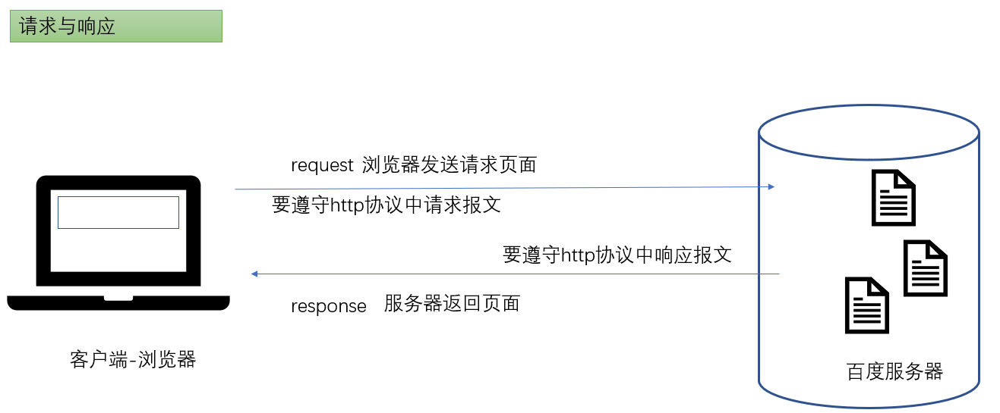

    

基本流程

1. 确认地址。用户在浏览器（客户端）地址栏输入要访问的网站网址（URL）
2. 发送请求。浏览器向服务器发送请求(request)，告知服务器要获取的内容
3. 获取响应。服务端收到浏览器发送的请求，并把处理的结果返回给浏览器(response)
4. 显示内容。浏览器将服务端返回的结果显示到界面上

操作
- 在network面板中观察请求

注意：
如果一个html文件中还引用其它的文件：如样式文件,js文件,图片文件，则会发出多次请求。

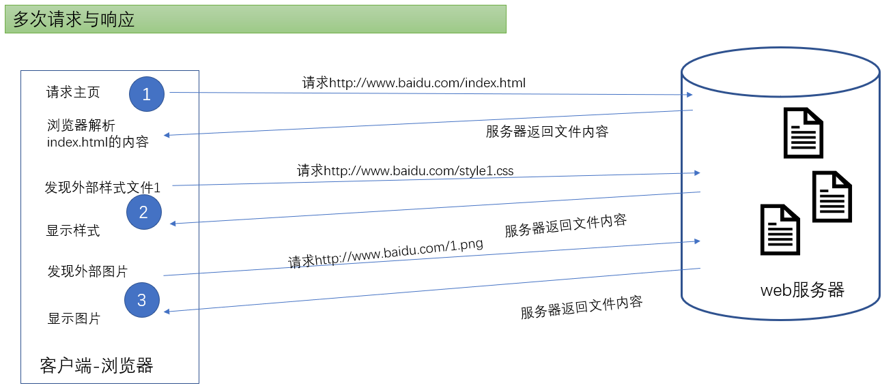


### 第3节 本地web服务器的使用
为了方便学习，我们会在自己的电脑上安装web服务器软件，把自己的电脑虚拟成web服务器。换句话说，我们的电脑既是客户端，又是服务器。

我们可以安装一些第三方的web服务器软件例如:apche,ngix,iis等。但是为了后期学习的方便，我们这里是使用nodejs技术自己写了一个简单的web服务器，通过它我们就可以体现web服务器的功能了。目前来说，我们不用关心它的具体实现，而只需要学会如何使用它就行了。
#### 虚拟web服务器-访问网页

`启动`
   进入目录中，双击 “双击启动”这个文件，会自动弹出小黑窗；

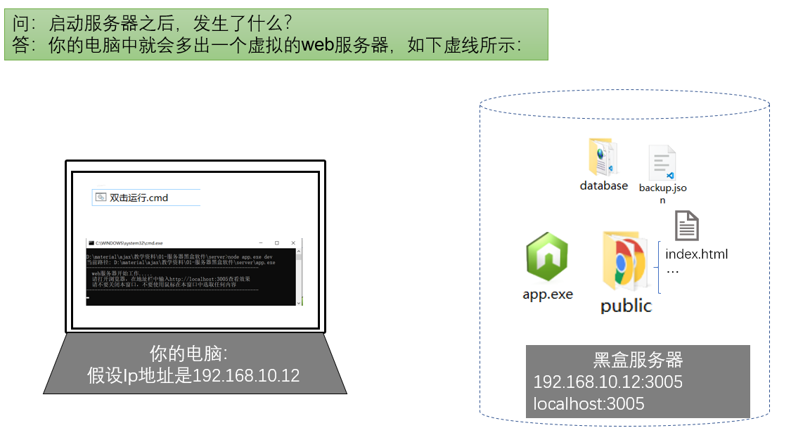

`访问网页`

  - 上传网页到服务器。 把网页文件拷贝到**public**文件夹下。

  - 本机访问：在浏览器中输入地址来访问  http://localhost:3005/文件名  `(不要加public)`

    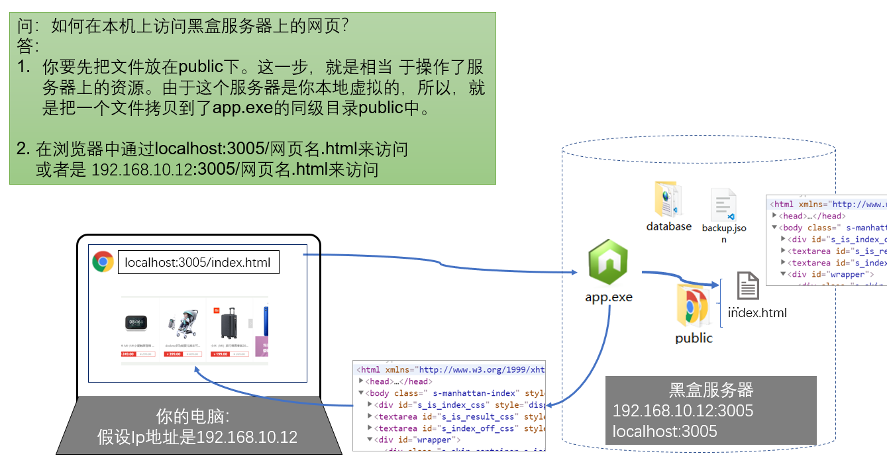

  - 让其它同学访问： 把localhost改成你的本机的ip地址(关闭本机防火墙)

    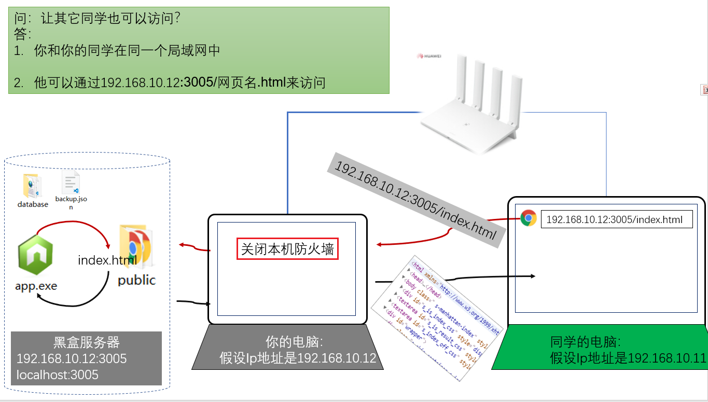


#### 接口
在小黑窗服务器中，预置了几个可以用来操作业务，提供数据的特殊的url地址， 就是我们常说的接口。


作为一名前端程序员，我们日常的工作有一个重要的内容，就是调用接口。我们经常会听到类似于这样的对话。
- 开发经理问整体进度：你们组接口调通了几个？
- 前端程序员对后端程序员说：你的XXX接口有bug，我完全按接口文档上的要求调用的，老是出错。
- 开发经理问后端程序员说，我们的XX业务要给个接口给隔壁组调用哈，你跟一下哈。

上面几组场景中，都涉及了接口这个词， 那么接口是指什么呢？ 

这一部分，我们来介绍一些接口的概念，并使用一下小黑窗服务器中几个预置的接口。

我们访问网页的过程，就是浏览器向web服务器发请求，web服务器返回请求内容的过程。我们所请求的资源可以成分成两类：
- 文件：图片，css文件，html文件，视频文件等等，这是比较常见的资源，有些场合也称为静态资源。服务器处理这类请求的方式是取出文件的内容，并返回给浏览器。

- 代码：用服务器端语言写的一段代码，它会执行具体的业务功能，例如，用户登陆，检测用户名等。服务器处理这类请求的方式是执行这段代码，并把结果返回给浏览器。这就是我们上面谈及的接口。

  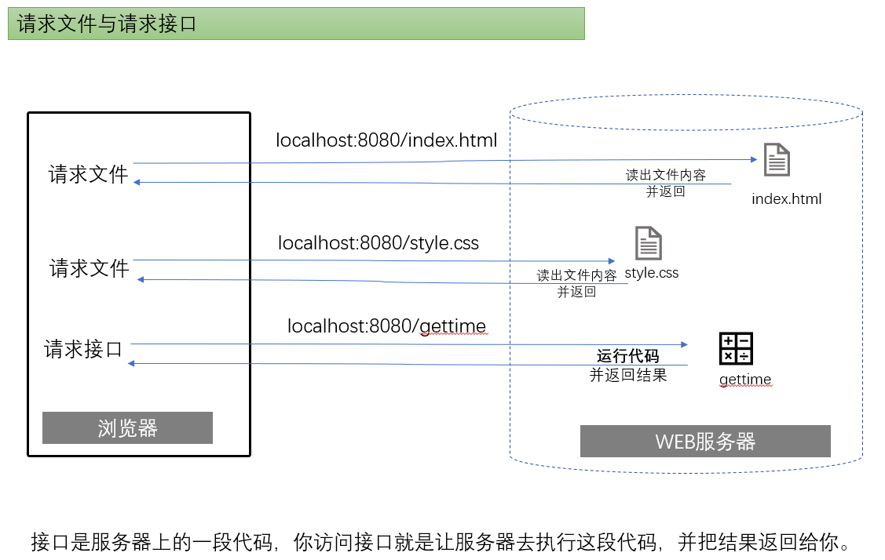


我们可以这么来理解：
- 接口是一个网络url地址，我们通过http协议去访问这个url地址。
- 接口是由**后端程序员写的一个函数**，它负责接收前端传入的参数（也有可能不需要参数），进行业务处理之后，把处理结果返回给调用这个接口的请求。接口的返回值一般是纯数据。
- 接口可能有访问权限控制。
- 在前后端分离开发的背景下，我们可以理解是后端程序员写接口，前端程序员调用接口。
- 接口一般配合ajax技术来使用。

实操：访问虚拟服务器中预置的接口。

`启动`
   进入目录中，双击 “双击启动”这个文件，会自动弹出小黑窗；

`访问接口`

- 对get类型的请求，直接在地址栏中访问

`查看接口文档`

- 小黑窗服务器的接口文档。


### 第4节 http协议
浏览器向web服务器发请求的过程就是这两台计算机交流的过程，这个过程中是要遵守一定规则的。这个规则就是http协议。这里我们只是简单了解一下http协议，了解它的组成部分，能够在network面板中查看这些组成部分即可。
#### 什么是http协议
浏览器与web服务器之间的请求与响应过程是遵守一定的规则的，浏览器向服务器请求什么内容，以什么方式发请求，服务器如何处理这些请求，返回的内容格式是什么，这些细节都有具体的约定，这就是我们要学习的http协议。
http(Hypertext transfer protocol)超文本传输协议。
 协议 就是规定，就像本朝的法律，必须遵守。http协议的双方就是浏览器和web服务器。http协议规定了通过浏览器和服务器进行数据交互，进行超文本（文本、图片、视频等）传输的规定。
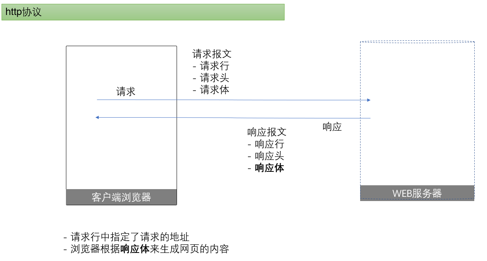
	
HTTP 协议分成两个大的部分： 

  - `请求报文` : 浏览器 请求 资源 要遵守的http 协议
  - `响应报文` : 服务器 返回 资源 要遵守的http 协议   

#### 请求报文
说出请求报文的组成部分，及对应的含义；
能在浏览器开发者工具中找出请求报文对应的部分；
http协议规定了浏览器向服务器发请求时的格式。

- 它由三个部分组成

1. 请求行
2. 请求头
3. 请求体（可能是空）

 `请求行`

构成格式： 请求方式  请求路径 协议及版本
示例：

```http
GET / HTTP/1.1
GET /index.html HTTP/1.1
GET /common/get?id=123&name=jake HTTP/1.1
```

`请求头`

浏览器在向服务器发送请求的时候自动携带的信息，一般不需要主动去设置。
- 信息以键值对格式构成的

| 键              | 值                                      |
| --------------- | --------------------------------------- |
| Host            | 请求的主机                              |
| Cache-Control   | 控制缓存（例如：max-age=60 缓存 60 秒） |
| Accept          | 客户端想要接收的文档类型，逗号分隔      |
| User-Agent      | 客户端信息        |
| Referer         | 这次请求的来源                          |
| Accept-Encoding | 可以接受的压缩编码                      |
| content-type    | 设置传递给服务器的请求体的格式          |


[参考链接](https://developer.mozilla.org/zh-CN/docs/Web/HTTP/Headers)

`请求体`
请求体中保存本次请求附带的数据，例如，当用户登陆邮箱时，肯定需要把在登陆界面填入的用户名密码这些信息传递给服务器，以做下一步判断。需要注意的是：get请求没有请求体， post请求有请求体。 请求信息发送至服务器以后，服务器会获取传递过来的相关信息进行后端程序的处理。


#### 响应报文
http协议规定了服务器向浏览器返回数据时的格式。

- 它由三个部分组成

1. 响应行
2. 响应头
3. 响应体

`响应行`

格式：  协议及版本 状态码  说明

	-状态码 ： 用来告诉浏览器服务器处理本次请求的结果。 不同的状态码对应不同的结果。

示例：

```js
HTTP/1.1 200 OK
HTTP/1.1 404 Not Found 
```


状态码：

- 描述了请求过程中所发生的情况
- 每个状态码的第一位数字都用于描述状态的一般类别("成功"、"出错"等)
- 常见状态码及含义
  - 200 - 成功
  - 301 - 资源不在这里
  - 302 - 重定向
  - 304 - 读取缓存
  - 403 - 不能访问
  -  404 - 请求的资源不存在
  - 500 - 服务器内部错误

全部状态码参考链接 https://developer.mozilla.org/zh-CN/docs/Web/HTTP/Status

`响应头`

- 服务器返回响应的时候携带了附加信息
- 由键值对组成
- 每个请求的响应头可能都不一样：它完全取决于服务器；

几个常见的响应头

| 键               | 值               |
| ---------------- | ---------------- |
| Date             | 响应时间         |
| Server           | 服务器信息       |
| **Content-Type** | 响应体的内容类型 |
| Content-Length   | 响应的内容大小   |

`响应体`

本次请求返回的主体内容。根据请求的不同，返回的内容也不同：

- 如果请求的是网页返回网页的内容

- 如果请求的是图片返回图片的内容

- ......

  


## 第2章 认识ajax
### 第1节 ajax概述
ajax是前端实战开发的基本武器，是我们必备技能。本节会带大家看一下ajax的应用场景，体验一下ajax的好处，学习一下ajax的概念。
#### AJAX的应用场景
清晰表述ajax的应用场景；能够判断一个网页中是否使用了ajax技术；
在`不更新页面`的情况下（页面有没有更新可以观察浏览器中的后退按钮），浏览器从web服务器获取新数据以更新页面。此时就可以使用ajax技术。

先来对比更新和不更新页面，以分页为例

- 大学的公告页，没有使用AJAX技术：http://www.whut.edu.cn/tzgg/
- 博客园的主页,   使用了AJAX技术：<https://www.cnblogs.com/>

分页的目标是从服务器上取出新一页的数据，来更新当前的html，如果使用ajax技术的话，用户的体验会更好一些。 

下面通过网页中的两个案例我们来感受一下：
- 博客页的注册页：<https://account.cnblogs.com/signup>
- 购物网站：http://www.smzdm.com

#### AJAX是什么
能表述出AJAX是什么
AJAX ，全称是：**A**synchronous **J**avaScript **A**nd **X**ml，中文名是： 异步的JavaScript和XML。它是一种创建交互式网页应用的网页开发技术。并不是一种新技术，而是一种解决方案，早在在1998年就开始使用。

下面对其中涉及的概念进行说明：

1. async：表示异步。
   （sync：表示同步 ）。这个单词后面会经常看到到。如何理解异步呢？ 我们可以换一个词： 异步 =====不阻塞： 浏览器在发送ajax请求数据时，并不会阻塞用户后续的操作。理解为浏览器派了一个小弟去服务器拿数据了。以用户名验证为例，你在填入用户名，并离开输入框的那一瞬间，ajax请求就发出去了，这一点可以在network面板中观察到。同时，用户不必等待本次验证的结果是否从服务器中返回，用户还可以继续做后续的操作，例如继续填写地址信息。这个就称为不阻塞。

   那么阻塞会是什么情况：用户填入用户名，并鼠标离开输入框的那一瞬间，ajax请求就发出去了，此时界面卡顿，用户不能移动鼠标，不能输入键盘，而必须等待ajax请求回来之后，才能恢复用户的控制。显然阻塞会影响用户的使用感受。

2. XML表示一种数据格式
发ajax请求的目标是为了从web服务器拿回数据，为了方便对数据的后续操作，这个数据最好是符合某个格式规范的。在最初设计AJAX时，从服务器返回的数据是XML格式的，但后面慢慢被JSON数据格式取代了，现在的ajax请求一般求回来的数据都是json格式，但ajax的这个缩写并没有改成ajaj。

更具体来说，`浏览器`通过内置对象 `XMLHttpRequest`  向服务器发起请求，并可以接收服务器返回给浏览器的数据，这一过程或实现这一过程的技术就是我们所说的 Ajax。

#### AJAX的优点
ajax是一种解决网页局部更新的方案。它有两个明显的好处：

1. 局部更新，提升用户体验。

2. 分离开发，提高开发效率。
- 局部更新，提升用户体验。
	
- 分离(前后端分离)开发，提高开发效率。
   1. 后端同学提供接口。这个接口我们可以理解是一个`函数`:它的内部进行业务处理，数据库访问等等操作，并返回结果。如何去实现这函数的功能就是后端同学的任务了。
   2. 前端同学用ajax技术调用接口获取数据（有其特定的格式），然后再把数据转化成的图文并茂的网页。
   
   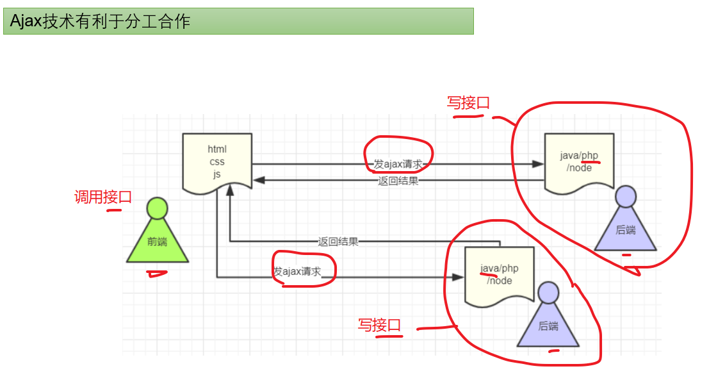


## 第3章 JQuery中的ajax
### 第1节 第一个ajax请求
本节，我们将使用jQuery框架中封装好的ajax函数来向服务器发送ajax请求。带大家直接认识一下ajax请求是如何发出去的。本节我们重点学习$.ajax的格式，并理解回调函数的概念。
#### $.ajax基本使用
前面介绍了很多概念：服务器，客户端，web服务器，http协议,ajax等等。现在我们终于可以动手写一个ajax代码了。
`目标任务`
通过jquery库中提供的ajax()方法，发出第一个ajax类型的http请求：获取服务器上的时间，并显示在页面上。

`前提条件`
web服务器上的接口已经就绪了。

基本流程：
1. 新建页面，引入jquery。[空白页 (public/learn/gettime.html)]
2. 点击按钮，发送ajax请求。


$.ajax()的基本格式
```javascript
$.ajax(
  {
	 url,//  '/common/getCurrentTime',
     type: 'get',// post
     data: {id:1},
     success: function (result) {
     	console.log(result)
  	 }
  }
)
```
- url : 表示请求的地址，可以省略域名。
- type: 表示请求的类型，常见取值 get，post。如果不写，默认为'get'
- data: 表示发送请求时附加的参数，如果没有参数，可省略
- success：它是一个回调函数。当请求成功之后会自动调用这个函数，它的第一个参数是服务器端返回的数据。


#### ajax中的回调函数
回调函数(Callback Functions)是学习ajax中的一个重要的概念。
两层含义：

```
- 1. 函数。表示它是一个函数，是可以被执行的，能做具体操作的函数。
- 2. 回调。在某个时刻，或者某个事件发生`自动去调用这个函数`。
```
通俗来讲，回调函数是**我们自己定义的，供别人调用的函数**，更具体来说，这个函数什么时间会被调用并不由我们来决定，而是"别人"来决定的。 在js中，回调函数通常用于对特定的事件或条件进行响应。 

我们先来看下生活中的例子：
陈老板安排小张去给他买咖啡，由于陈老板不知道小张具体什么时间会回来，所以，陈老板跟小张说，“你买回来之后，打电话给我。”  这个场景中就有一个回调函数的应用。

- 回调函数 ：打电话给陈老板。
- 定义回调函数的人：陈老板。
- 调用回调函数的人：小张。
- 调用回调函数的时机：小张买好了咖啡，并回到了公司。


代码示例：
	如下均是回调函数的使用

```javascript
$(function(){
     // 这是一个匿名函数，我们自己定义的，在它网页DOM结构绘制完毕后就被调用。我们并不知道准确的调用时机。
})


$("#btn").click(function(){
     // 这是一个匿名函数，我们自己定义的，在按钮点击被调用。我们并不知道用户什么时候点击按钮，所以我们不知道它准确的调用时机。
})

function ok(result){
    console.log(result);
		 // 这是一个具名函数，我们自己定义的
}
$.ajax(
  url,//  '/common/getCurrentTime',
  {
     type: 'get',// post
     data: {id:1},
     success: ok
		 //ajax请求完成之后，自动调用
  }
)
```

注意：

​	一般情况下，回调函数都是匿名函数。但，也是可以给它们起名字的。


### 第2节 ajax与http和接口
上一节，我们终于发出去了第一个ajax请求，值得高兴一下。本节我们将暂停写代码的冲动，站在一个观察者的角度，分析一下ajax和http协议和服务器接口之间的关系。
#### ajax与http协议

客户端浏览器向web服务器发请求的过程是要遵守http协议中的请求报文的格式的。 ajax请求是http请求的一种，我们可以在network面板中看到这一点。

访问一个使用了ajax技术的网站，打开开发者工具，切换到network面板，学习使用：
1. 清除所有请求记录
2. 筛选不同类型的请求:xhr,js,css,img...
3. 观察某个ajax请求的：
- 请求行，请求头，请求体；
- -应行，响应求，响应体；
4. 对比普通http请求与ajax请求在响应体上的区别

#### ajax请求与普通请求


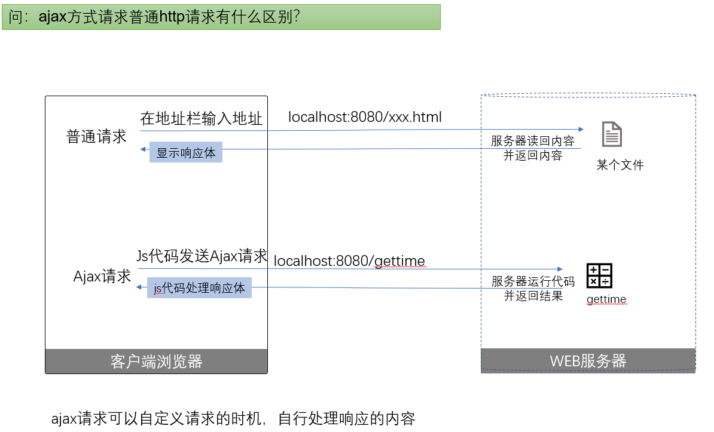

#### ajax与接口

- 接口是后端同学写好的一个函数，就放在web服务器上的一段代码。这个接口一般就是被别人调用的。在前端同学通过ajax来访问这个接口地址，并获取数据。
- ajax请求是http请求的一种，它符合http协议。前端同学使用ajax请求接口，获取数据来实现页面的局部更新。

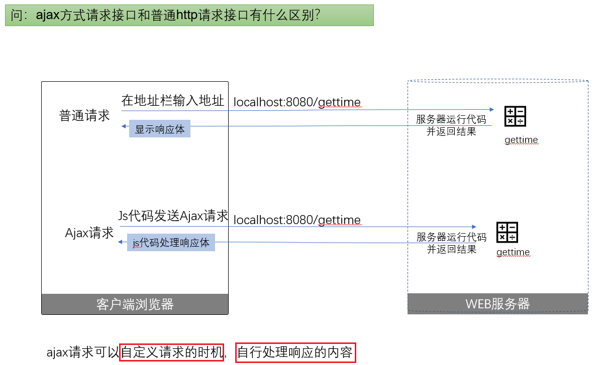

你可以使用ajax的方式来调接口，也可以使用普通的http请求来调接口（在地址栏中输入url地址）。它们的区别是:

ajax方式调用接口：
 - 控制何时发请求；
 - 控制响应的结果

普通http请求调用接口：
- 不能控制何时发请求（浏览器自动控制）

- 不能处理响应的结果（浏览器自动控制）

  

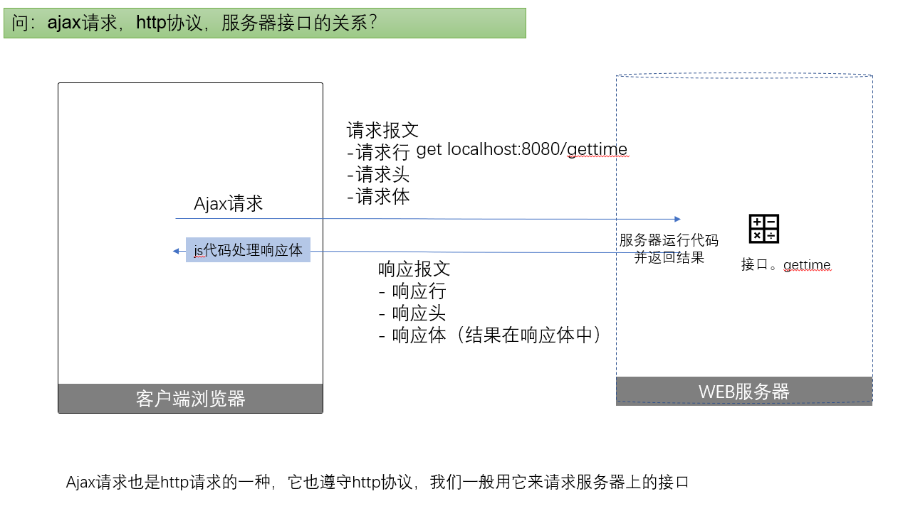


### 第3节 $.ajax发请求

#### $中的get请求
掌握以get方式发ajax请求的业务场景；
仿照[博客园注册](<https://account.cnblogs.com/signup>)，实现用户名占用检测效果；学习使用带参数的get请求；

分析一下实现的效果：
1. 用户在文本框中，输入用户名
2. 当鼠标离开文本框时，去验证用户有效性。这里就涉及blur事件。
3. 提示验证的结果。


4. 测试接口。直接在地址栏中使用接口（localhost:3005/common/checkname），注意在问号后附加参数的问题
5. 给出静态代码
6. 分析要实现的功能;
7. 介绍$.ajax的参数中的data值


#### $中的post请求
掌握以post方式发ajax请求的业务场景；
目标：在登陆时，进行用户名密码验证。

用ajax的方式向指定的接口发请求，并根据服务器返回的结果，来决定显示的内容；


## 如何运行代码

1. 启动服务器

   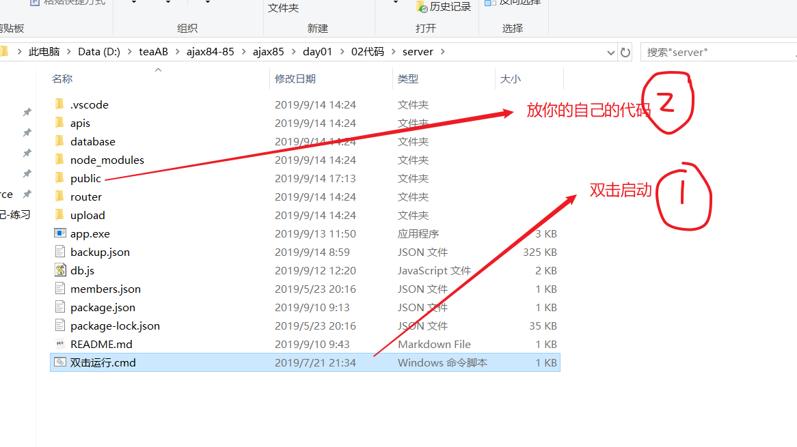

2. 写的自己页面，放在public下。

   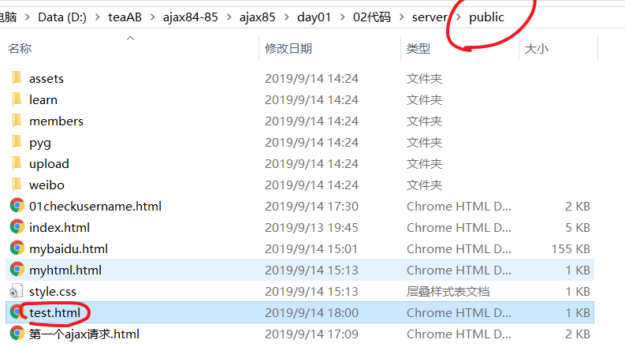

3. 访问这个自己写的文件

   http://localhost:3005/test.html


错误：

- 没有启动服务器
- 双击打开文件
- 右键，liveserver：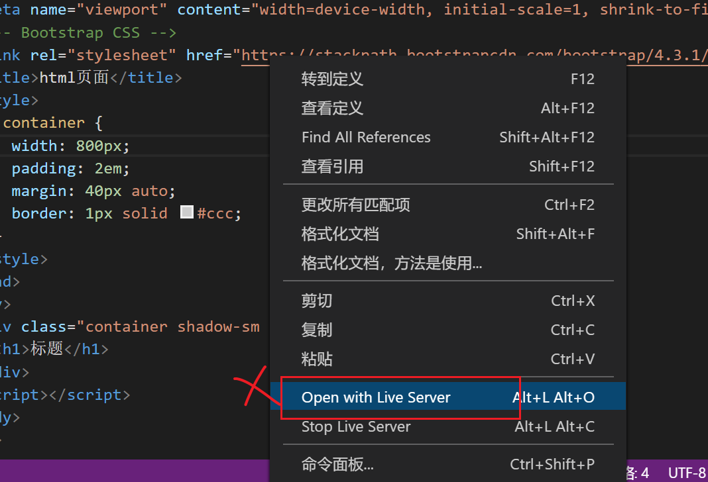

- 


## 第4章 [案例]留言板

### 第1节 留言板-效果演示及分析

#### 留言板-演示及分析

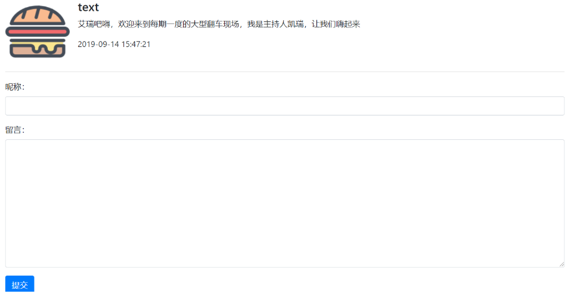


### 第2节 留言板功能实现

#### 留言板-获取留言

在打开网页时，就发一次ajax请求，把留言数据全显示出来。

接口地址：localhost:3009/message/getmsg

获取数据之后，循环：

1. 对时间戳进行转换（new Date().to）生成留言对应的html结构
2. 把生成的html结构添加到页面的留言区域中

#### 留言板-添加留言

实现留言的添加功能，在点击添加按钮之后：  

1. 收集用户的信息，并对信息进行简单的判断。

   例如，用户名，内容不能为空.

2. 按接口约定的格式和地址，用$.ajax发出ajax请求，并把留言信息带过去。

3. 根据调用接口的返回结果，来决定是否要

   - 重新获取并显示留言
   - 清空发布留言区域


## 第5章 模板引擎

### 第1节 模板引擎介绍

#### 常见模板引擎

开发网页的过程中，我们会遇到一个典型的问题：如何把从数据库中取回的数据 转化成 html结构？ 这个过程也有一个专门的名称渲染(rending)。举个小例子，你拿到的数据是:

```
var data = {name:'jack',hobby:['吃饭','睡觉','打豆豆']}
```

而你要生成的对应的html结构是:

```
<h4>姓名:jack</h4>
<h4>爱好: 吃饭 睡觉 打豆豆</h4>
```

这是一个简单的需求，我们可以直接使用字符串拼接就能够完成。

```
var htmlStr = "<h4>姓名:"+data.name +"</h4><h4>爱好: "+data.hobby[0] +data.hobby[1] +data.hobby[2]</h4>
```

当然，还有可能你的结构要复杂一点，例如是：

```
<h4>姓名:jack</h4>
<dl>
	<dt>爱好</dt>
	<dd>吃饭</dd>
	<dd>睡觉</dd>
	<dd>打豆豆</dd>
</dl>
```

这样，使用字符串做拼接就会比较麻烦了。
好的，到此为止，我们面临了两个问题：

1. 把一个js对象转成一个html字符串
2. 把同一个js对象转成不同的html字符串

我们可以使用一个简单的公式来表达：

```
 html字符串 = 渲染函数(原数据，模板)
```

这里涉及的技术就是模板引擎。

模板引擎是为了使用户界面与业务数据（内容）分离而产生的，它可以生成特定格式的文档，用于网站的模板引擎就会生成一个标准的文档。

模板引擎的实现方式有很多，最简单的是“置换型”模板引擎，这类模板引擎只是将指定模板内容（字符串）中的特定标记（子字符串）替换一下便生成了最终需要的业务数据（比如网页）。置换型模板引擎实现简单，但其效率低下，无法满足高负载的应用需求（比如有海量访问的网站），因此还出现了“解释型”模板引擎和“编译型”模板引擎等。

模板引擎有很多：

- baiduTemplate
- artTemplate
- juicer: http://juicer.name/或https://github.com/PaulGuo/Juicer/zipball/master#download
- doT：doT source:https://github.com/olado/doT Docs:http://olado.github.com/doT/
- tmpl
- handlebars:http://handlebarsjs.com/或https://raw.github.com/wycats/handlebars.js/1.0.0-rc.4/dist/handlebars.js
- easyTemplate：
- underscoretemplate: 
- mustache:
- kissytemplate

虽然模板引擎的产品比较多，但它们的使用方法大多是相同的，下面来分别看下 baiduTemplate和artTemplate的使用。

```
<script id="tmp" type="text/html">
      <h4>姓名:<%= name %></h4>
      <dl>
        <% for(var i=0;i< hobby.length;i++) {%>
          <dt><%= hobby[i] %></dt>
        <%}%>
      </dl>
    </script>
    <script src="./baiduTemplate.js"></script>
    <script>
      var data = { name: 'jack', hobby: ['吃饭', '睡觉', '打豆豆'] };
      console.log(baidu.template('tmp', data));
    </script>
```

```
<script id="tmp" type="text/html">
  <h4>姓名:{{name}}</h4>
  <dl>
    {{each hobby item}}
      <dt>{{item}}</dt>
      {{/each}}
  </dl>
</script>
<script src="./template-web.js"></script>
<script>
  var data = { name: 'jack', hobby: ['吃饭', '睡觉', '打豆豆'] };
  console.log(template('tmp', data));
</script>
```

它们的语法非常像，是吧。基本上，学会了一个，其它的也差不了太多了。


### 第2节 arttemplate

我们以arttemplate作为代表，来学习模板引擎的作用。 

#### artemplate快速使用

官方文档地址：https://aui.github.io/art-template/zh-cn/docs/index.html

使用步骤

1. 引入template-web.js文件
2. 定义模板，注意指定script的id和type属性
3. 准备数据对象。(变量，数组等)
4. 调用template函数，为模板分配数据，获得渲染结果，template的格式如下：

```
 html字符串 = template(模板的id,数据对象)
```

参考代码如下：

```
<!-- 1. 引入template-web.js -->
<script src="/template-web.js"></script>
<!-- 2. 定义模板（注意script标签的id和type必须指定） -->
<script id="tmp" type="text/html">
  <h2>{{data}}</h2>
</script>
<script>
   // 3. 编译模板
   //  html字符串 = 模板 + 数据
    var htmlStr = template('tmp', {
        data: 'hello world'
    });
    console.log(htmlStr)
</script>
```


#### 模板语法

下面我们详细说明arttemplate的语法。
它支持两种语法：

- 标准语法
- 原始语法

以输出变量的值为例，标准语法如下

```
{{value}}
{{data.key}}
{{data['key']}}
{{a ? b : c}}
{{a || b}}
{{a + b}}
```

原始语法如下

```
<%= value %>
<%= data.key %>
<%= data['key'] %>
<%= a ? b : c %>
<%= a || b %>
<%= a + b %>
```

下面我们来看两种常见的语法结构：

- 条件
- 循环

`条件`

```javascript
// 模板写法
<script id="tmp" type="text/html">
{{if age > 18}}
	大于18
{{else}}
	小于18
{{/if}}
</script>

// template函数写法
var html = template('tmp', {
    age: 20
});
```

`循环`

```
// 模板写法1
{{each arr}}
	{{$index}} -- 数组的下标
	{{$value}} -- 数组的值
{{/each}}

// 模板写法2
{{each arr item idx}}
	{{idx}} -- 数组的下标
	{{item}} -- 数组的值
{{/each}}

// template函数写法
var html = template('id', {
    arr: ['apple', 'banana', 'orange']
});
```

#### 使用外部函数

如果你希望在模板内部使用模板之外定义的函数，可以以模板变量template.defaults.imports为桥梁，去调用外部的函数。
第一步：导入外部函数。这一步相当于把函数挂载在template.defaults.imports对象上。

```
function add1(a){return a+1;}
template.defaults.imports.add1 = add1
```

第二步：在模板中调用函数
模板通过 $imports 可以访问到模板外部的全局变量与导入的变量。

```
<% $imports.add1(100) %>
```

[参考](https://aui.github.io/art-template/zh-cn/docs/imports.html)


## 第6章 原生ajax

### 第1节 第一个原生ajax

在实际的开发中，我们会直接使用如jquery这样的第三方工具库来调用ajax，而不会自己去手写一个原生的。但对于学习者来说，深入学习原生ajax能帮助我们更好的理解和掌握一些细节。

#### 原生ajax基本格式

`目标`

写一个原生的AJAX请求，用来获取服务器时间。

`步骤4步`

1. new 一个xhr对象
2. 设置请求信息
3. 设置回调函数，处理请求结果
4. 发送请求

```
// 第一步： 新建一个XMLHttpRequest对象(xhr)
var xhr = new XMLHttpRequest();

// 第二步： 设置请求。 xhr.open(请求的方式, 请求的url地址);
xhr.open('get', 'common/getCurrentTime');

// 第三步：设置回调函数
// 由于受网络速度及服务器处理请求的耗时不同，我们无法准确得知什么时候请求的数据会回到客户端来，所以，不能在获取在open之后，立即得到
数据，而必须通过回调函数的方式来获取。

// 打个比方。你想安排一个人去帮你买咖啡，但是，这个人也不知道咖啡店的生意是否需要排队，是否需要打车，几点几分回来，你都不知道，所以，我们会跟他说
// 你回来了，就跟我联系哈。
// 返回的数据存放在xhr.responseText中。

xhr.onload = function() {
    console.info('从服务器返回的数据',    xhr.responseText);
};
// 第四步： 发送请求。 xhr.send()
xhr.send();
```

`理解XMLHttpRequest对象`

- ajax的功能是基于XMLHttpRequest对象来实现的。
- 它是内置对象，充当构造器使用。
- 浏览器中的network中查看 `xhr`

属性和方法：

- open()
- send()
- onload(function(){})
- responseText

<https://developer.mozilla.org/zh-CN/docs/Web/API/XMLHttpRequest>


### 第2节 请求方式

#### 原生ajax发get请求

如果get请求需要带参数的，就附加在请求的url地址后面。
例如：`localhost:3005/getapitest?a=1b=2`

格式：

```
url?参数1=值1&参数2=值2&参数3=值3...
```

注意：

1. 接口是否需要参数，并不是由调用接口的人（前端）决定的，而是定义这个接口的人(后端)决定的。要按照接口文档要求来使用。
2. 在network中观察参数出现的位置。

- 在本次请求的请求行中可以看到
- 在请求的地址中也可以看到

#### 原生ajax发post请求

请求post类型的接口时，有两点区别：

1. 参数写在send方法中
2. 要设置请求头。

```javascript
//1. 创建xhr对象
var xhr = new XMLHttpRequest();
//2. 初始化请求
xhr.open('post',服务器上接口的地址);
//3. 设置请求头，固定写法
xhr.setRequestHeader('Content-type','application/x-www-form-urlencoded');
//4. 监听响应的回调函数
xhr.onload = function(){
    console.log(xhr.responseText);
}
//5. 发送请求
xhr.send('提交给服务器数据字符串');// 'a=1&b=3'
```

注意：

- 要设置请求头
- 提交给服务器的数据写在send()中。

#### get和post的区别

一个接口到底是post类型还是get类型，是由写接口的人员（后端同学）决定的；
在前端使用get和post接口时，我们要注意两点：

- get的参数是url后面可以看到
- post的参数是通过http协议的请求体发送的
- post请求需要设置请求头（在jquery中的使用$.ajax ()时，它已经悄悄地给我们设置了）
  

#### 其它请求方式

接口的类型不仅有get,post，还有其它的：

- get: 获取信息
- post: 向服务器提供新数据
- put：修改数据
- delete：修改数据
- options: 测试服务器

由后端同学决定接口类型的。
在小黑窗服务器中，我们提供了put类型的接口。

### 第3节 处理服务器的返回值

通过ajax请求接口返回的数据都是字符串。

#### 三种格式的字符串

- 普通字符串

- JSON字符串

- XML字符串

#### JSON字符串

使用ajax请求接口时，从服务器端返回的数据在格式要统一，这样才能让不同的后端语言，不同的前端人员都能读懂，都方便操作，这里，我们约定使用JSON格式的字符串。

##### 如何判断返回值是JSON字符串

从服务器返回的数据都是字符串格式的，如何判断数据是JSON字符串格式的？

方法一：在线检测

[在线验证json格式](<http://www.bejson.com/>）

方法二：观察response

典型的特征是:

- 长的和js中的对象很像
- 对象的属性使用了""

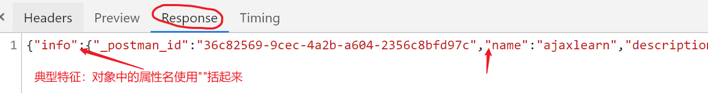

##### JSON是什么

JSON:  JavaScript Object Notation(JavaScript 对象表示法) 。 

- JSON 是一种通过**字符串**描述数据的手段，用于表示有结构的数据。
- JSON 是轻量级的文本数据交换格式,类似 XML。
- JSON `独立于编程语言`  （php,java,go,js 都会通过它来进行数据交流）
- JSON 具有自我描述性，更易理解


##### JSON字符串相关的两个操作

- 把JSON字符串转成具体某个编程语言中的数据格式，称为把JSON字符串转成JSON对象。
- 在某个编程语言中，把数据格式转成JSON字符串。称为把JSON对象转成JSON字符串。


|      | 从JSON字符串转成编程语言支持的数据   | 从数据类型转成JSON字符串 |
| ---- | ------------------------------------ | ------------------------ |
| js   | JSON.parse()                         | JSON.stringify()         |
| php  | json_decode()                        | json_encode()            |
| java | JSON.parseObject(),JSON.parseArray() | JSON.toJSONString        |

js中提供了一个静态对象JSON来处理json（它与Math对象相似，不需要new）而是直接通过对象名.方法来调用。

##### JSON.stringify

功能：把js数据，转成JSON格式的字符串

格式：`var JSON字符串 = JSON.stringify(js数据)`

```javascript
var arr = [1, 2, 3, 'ok', 'hello'];
var arr_jsonStr = JSON.stringify(arr);
console.info(arr, typeof arr);
console.info(arr_jsonStr, typeof arr_jsonStr);
```


##### JSON.parse      

功能：把JSON格式的字符串，还原成JS中的数据

格式：`var JS数据 = JSON.parse(JSON字符串)`


小结

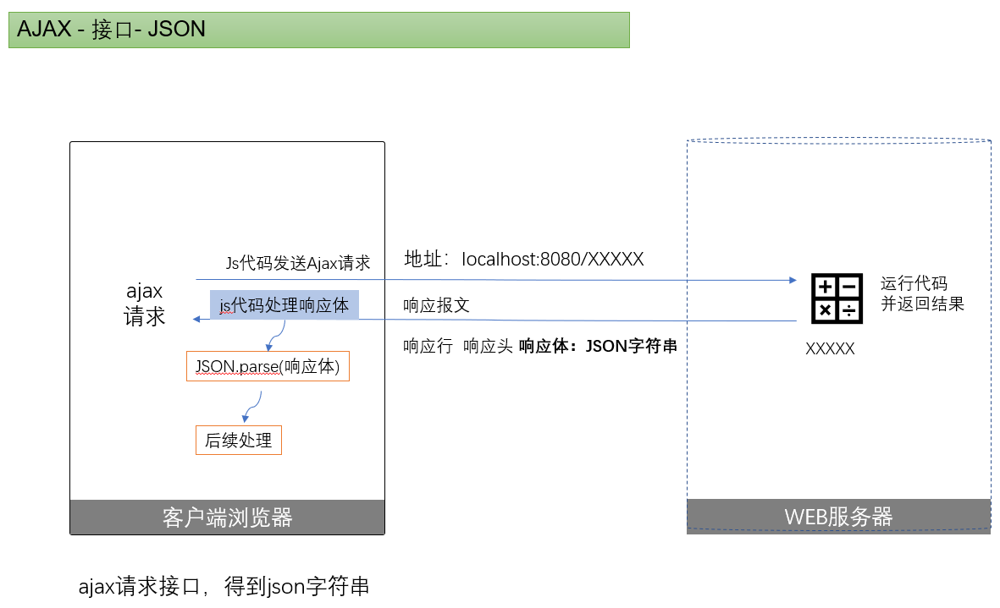

#### XML字符串（简单了解）

可扩展标记语言（E**x**tensible Markup Language）

- XML 于 1998 年 2 月 10 日成为 [W3C](https://baike.baidu.com/item/W3C) 的推荐标准。AJAX（异步的javascript和XML）中的 X 就是 XML

- 它提供了一种描述结构数据的格式，简化了网络中[数据交换](https://baike.baidu.com/item/数据交换)和表示，使得代码、数据和表示分离，并作为数据交换的标准格式。

- 独立于编程语言的。（php,java,go,js 都会通过它来进行数据交流）


`示例`

假设这个文件的名字为books.xml

```
<?xml version="1.0" encoding="utf-8" ?>
<booklist>
<book>
	<author>吴承恩</author>
	<name>西游记</name>
</book>
<book>
	<author>施耐庵</author>
	<name>水浒传</name>
</book>
<book>
	<author>罗贯中</author>
	<name>三国演义</name>
</book>
<book>
	<author>曹雪芹</author>
	<name>红楼梦</name>
</book>
</booklist>
```

`操作`

如果ajax所请求的接口，明确规定返回值是xml格式，你可以通过：

- 通过xhr.responseXML来获取内容。

  

- 拿到这个内容之后，就像操作dom元素一样去访问其中的内容。

```
var books = xhr.responseXML.getElementsByTagName('book')
for (var index = 0; index < books.length; index++) {
    var element = books[index]
    console.info(element.getElementsByTagName('author')[0].innerHTML)
}
```

#### XML 和 JSON

相同点：

- 都用来`描述数据格式`
- 与具体的`编程语言无关`
- 有自己文件格式的后缀名.xml和.json的文件

区别

- JSON 有简易的语法（javascript基因）；XML有规范的标签（html基因）
- JSON存储效率更高


### 第4节 同步异步

ajax中的第一个字母a表异步的意思。

#### 理解同步异步

我们通过生活中的例子来理解。

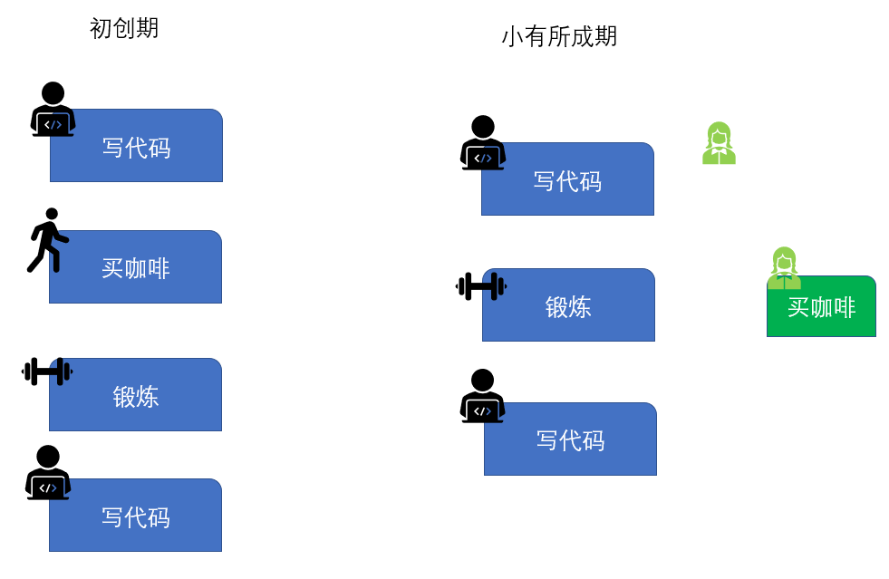

同步方式： 一个时刻只能做一件事；

- 我： 写代码 
- 我:   买咖啡，自己去买，花2小时
- 我：写代码

异步方式：不是一件做完再做下一件，而是可能同时做多件事情；

```
- 我： 写代码
- 我： 买咖啡，安排别人去买，跳过这一步，我自己不做。
- 我： 写代码 
```

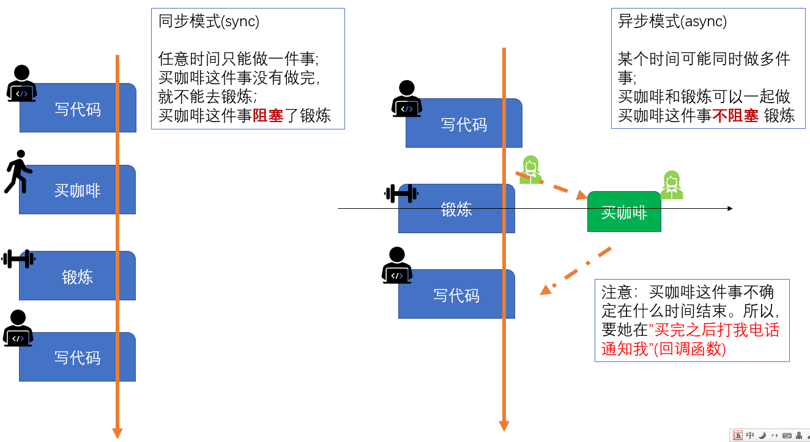

#### ajax中的同步异步

xhr.open()方法的第三个参数就可以决定同步和异步的方式。

```
xhr.open(类型，地址，是否异步)
```

默认情况下，第三个参数的值是true，即启用异步模式； 如果设置为false，就是同步模式。


以请求黑盒服务器的接口sleep为例（这个接口已经预先写好了，直接调用即可，地址是localhost:3005/common/sleep），我们来观察效果

```javascript
// 1. 先输出一行提示代码
console.info('1  现在的时间是：', new Date().toLocaleTimeString());

// 2. 创建ajax，设置，并发送请求
var xhr = new XMLHttpRequest();
xhr.open('get', 'common/sleep');
xhr.onload = function() {
    console.info('2 现在的时间是：', new Date().toLocaleTimeString());
};
xhr.send();// 发送

// 3.再输出一行提示代码
console.info('3 现在的时间是：', new Date().toLocaleTimeString());
```

改成true和false观察效果。


异步执行流程：

- 浏览器：输出1
- 浏览器：执行send(),发现是异步的，跳过这一步（不会阻塞代码，理解为：不用自己亲自做，找别人去做）
- 浏览器：输出3
- 浏览器：ajax请求返回，执行回调函数，输出2

注意：`异步ajax时，onload，可以写在send之后`

同步执行流程：

- 浏览器：输出1

- 浏览器：执行send(),发现是同步的，阻塞代码

- 浏览器：ajax请求返回，执行回调函数，输出2

- 浏览器：输出3

  

设置成了同步的方式，你会在浏览器看到如下的错误信息：

`[Deprecation] Synchronous XMLHttpRequest on the main thread is deprecated because of its detrimental effects to the end user's experience. For more help, check https://xhr.spec.whatwg.org/.`

有几个单词：

- Synchronous: 同步的
- deprecate:反对的，不赞成
- detrimental：有害的，不利的

翻译一下就是：[deprecation]由于主线程上的同步xmlhttpRequest对最终用户的体验有不利影响，因此不推荐使用它。有关更多帮助，请查看https://xhr.spec.whatwg.org/


### 第6节 ie兼容性问题

#### onreadystatechange及ajax状态码

`onload` 是 HTML5 （2014年9月）以后新增的事件，一些老的浏览器(ie6,ie7,ie8)对onload是不支持的。通过代码来验证这一点：以下代码在ie6,ie7,ie8中并不能使用。

```javascript
var xhr = new XMLHttpRequest()

xhr.open('get', 'common/getCurrentTime')

xhr.onload = function () 
    //onload在低版本的ie中并不能使用。
    alert('ok')
}
xhr.send()
```

在html5之前，获取服务器返回内容的时候使用的是 `onreadystatechange`事件，这个事件是在xhr对象状态变化时被触发，而一次请求过程中，`XMLHttpRequest`对象的状态会发生`多次变化`，也就意味着这个事件会被触发多次。

onreadystatechange

```javascript
var xhr = new XMLHttpRequest()
xhr.open('get', 'common/getCurrentTime')
xhr.onreadystatechange = function () {
    console.log('事件被触发了'xhr.readyState)
}
xhr.send()
```

#### `xhr` 对象的状态

一共有5种，用`readyState`属性表示，详见下表

| readyState | 状态描述         | 说明                                                      |
| ---------- | ---------------- | --------------------------------------------------------- |
| 0          | UNSENT           | XHR被创建，但尚未调用 `open()` 方法。                     |
| 1          | OPENED           | `open()` 方法已经被调用，建立了连接。                     |
| 2          | HEADERS_RECEIVED | `send()` 方法已经被调用，并且已经可以获取状态行和响应头。 |
| 3          | LOADING          | 响应体下载中， `responseText` 属性可能已经包含部分数据。  |
| **4**      | **DONE**         | 响应体下载完成，可以直接使用 `responseText`               |

一次正常的send()，xhr.readStatus的值的变化是：

```
0 -> 1 -> 2 -> 3 -> 4
```

### 第7节 ajax异常处理

在访问接口的过程中，可能出各种异常，如接口不存在，服务器错误等。遇到这些异常时，我们可以进一步进行处理，以提高代码的健壮性。

#### ajax处理

通过状态码来处理不同的异常情况。

典型的有:404错误, 500错误。

### ie浏览器对get类型接口缓存问题


如下代码，在`ie`中运行：

```javascript
<div>
    <button id="btn">获取时间</button>
<label for="" id="lblTimer"></label>
</div>
<script>
    document.getElementById('btn').onclick = function() {
    var xhr = new XMLHttpRequest();
    xhr.open('get', 'common/getCurrentTime');
    xhr.send();
    xhr.onreadystatechange = function() {
        if (xhr.readyState == 4) {
            document.getElementById('lblTimer').innerHTML = xhr.responseText;
        }
    };
};
</script>
```

第一次点击获取时间，结果是正确的，而之后的结果却保持不变。

出现这个问题的原因：

- 每次**get请求**的接口地址都一样，**ie浏览器**使用了第一次请求的结果来代替之后的请求结果。

解决方式：

- 给请求地址中补充一个无效的，随机的参数及值
  - 无效是指这个参数后端接口不需要
  - 随机是为了保存每次请求的地址都不相同

示例：

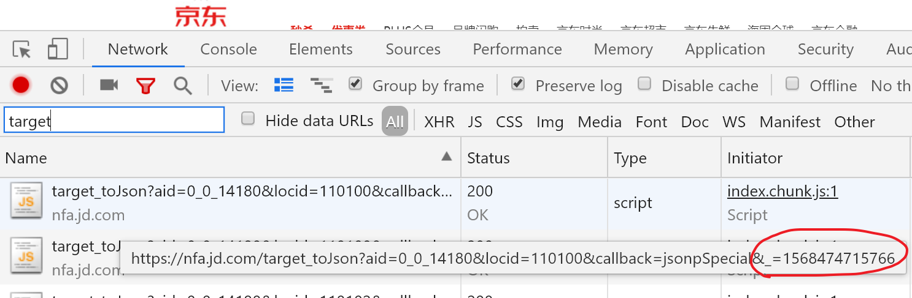

### 第8节FormData对象

（[官方api参考](https://developer.mozilla.org/zh-CN/docs/Web/API/FormData)）

FormData：表单数据。它是用来处理html中与表单数据相关的操作的内置对象。

一个典型的ajax的使用过程， 一般是：

1. **收集用户的输入的参数**
2. 按接口文档的要求把参数传递到后端接口
3. 根据后端接口的返回值来局部更新页面。

以上三个步骤中，我们可以使用FormData来帮助我们收集用户信息这个部分。 

除此之外，它还有一个典型的应用场景:上传文件

#### 快速获取表单中的元素值

假设有一个静态页面如下，它有三项信息要收集起来：姓名，密码，性别。

```html
<form id="myform">
    <div>
        <label for="">姓名</label>
        <input type="text" id="userName" name="userName" />
    </div>
    <div>
        <label for="">密码</label>
        <input type="password" id="userPassword" name="userPassword" />
    </div>
    <div>
        <label for="">性别</label>
        <input
               type="radio"
               id="genderMale"
               name="userGender"
               value="male"
               />男
        <input
               type="radio"
               id="genderFemale"
               name="userGender"
               value="female"
               />女
    </div>
    <div><button id="btn" type="button">注册</button></div>
</form>
```

点击注册按钮之后，我们会把这三项数据发送给后端口请口，这里我们的重点不是实现注册功能，我们把注意力放在如何去收集这三项信息上。

- 手动一个一个收集，再拼接
- 使用formData收集

`不用FormData`

```javascript
document.getElementById('btn').onclick = function() {
    //收集用户信息
    var userName = document.getElementById('userName').value;
    var userPassword = document.getElementById('userPassword').value;
    var userGender = '';
    if (document.getElementById('genderMale').checked) {
        userGender = 'male';
    } else if (document.getElementById('genderFemale').checked) {
        userGender = 'famale';
    }
    console.info(userName, userPassword, userGender);

    // 通过post传值
    var xhr = new XMLHttpRequest();
    xhr.responseType = 'json';
    xhr.open('post', 'common/postapitest');
    xhr.setRequestHeader(
        'Content-type',
        'application/x-www-form-urlencoded'
    );
    xhr.send(
        `userName=${userName}&userPassword=${userPassword}&userGender=${userGender}`
    );
    xhr.onload = function() {
        console.info(xhr.response);
    };
};
```

`使用FormData`

```javascript
document.getElementById('btn').onclick = function() {
    //收集用户信息
    var fd = new FormData(document.getElementById('myform'));
    // 通过post传值
    var xhr = new XMLHttpRequest();
    xhr.responseType = 'json';
    xhr.open('post', 'common/postapitest');
    // 不用设置请求头 
    // xhr.setRequestHeader(
    //   'Content-type',
    //   'application/x-www-form-urlencoded'
    // );
    xhr.send(fd);
    xhr.onload = function() {
        console.info(xhr.response);
    };
};
```

要注意：

- FormData对象内部有一个键值对集合，其中的键名就是表单元素的name属性名，而值就是这个表单元素当前的值。

- 在设置表单元素的name属性值时，要最好与后端接口中需要的参数名一一对应起来。

- 如果传递的参数是formdata对象，则不需要需要单独设置请求头content-type:application/x-www-form-urlencoded,原因是：它会设置自己的请求头 content-type: application/json。

  

#### FormData对象的api

参考地址：https://developer.mozilla.org/zh-CN/docs/Web/API/FormData

```javascript
var fd = new Formdata();
fd.append(key,value);
// 向 FormData 中添加新的属性值，如果FormData 对应的属性值存在则覆盖原值，否则新增一项属性值。
fd.delete(key);
// 从 FormData 对象里面删除一个键值对。

fd.get(key)
//返回在 FormData 对象中与给定键关联的第一个值。

fd.has(key)
//返回一个布尔值表明 FormData 对象是否包含某些键。
fd.set(key,value)
//给 FormData 设置属性值，如果FormData 对应的属性值存在则覆盖原值，否则新增一项属性值。
```


#### 文件上传

文件上传是一个非常常见的需求，例如，用户注册时，提交自己的头像信息。小黑窗服务器已经预置了一个接口可以用来上传文件。接口的地址是：`formdata/upload`

使用这个接口有两点注意：

- 这个接口只能接收formdata对象，并且你上传的文件信息必须是保存在名为`file`的键中。也就是说**input 的name值必须是file** 。 
- 小黑窗服务器的根目录下，必须要放置一个`upload`文件夹。这个文件夹就是用来保存上传的文件的。

核心代码如下：

```javascript
<div class="container">
    <h1>FormData文件上传</h1>
    <form id="myForm">
       <label for="">请选择你要上传的文件</label>
       <input type="file" name="file" />
    </form>
     <button id="btn">上传</button>
</div>

<script>
   document.getElementById('btn').onclick = function() {
     var fd = new FormData(document.getElementById('myForm'));
     var xhr = new XMLHttpRequest();
     xhr.open('post', 'formdata/upload');
     xhr.onload = function() {
       console.info(xhr.responseText);
     };
     xhr.send(fd);
   };
</script>
```


#### onprogress事件

我们在上传文件时，还可以使用xhr.upload.onprogress来展示上传进度条的效果。

原理：

- xhr对象中有一个子对象upload，upload对象中有一个事件 onprogress。
- onprogress事件大约每100ms触发一次，其回调函数第一个参数是一个事件对象，这个事件对象中有两个属性 loaded 和 total
  - loaded：表示已上传文件的大小
  - total： 表示文件总大小

实现思路：

- 制作进度条。

  - 自己做。使用两层嵌套的div即可：第一层是进度条的外边框，第二层才是进度条。

  - 使用bootstrap[http://bs4.ntp.org.cn/pages/components.html#striped]

    ```
    <div class="progress">
      <div class="progress-bar progress-bar-striped" role="progressbar" style="width: 10%" aria-valuenow="10" aria-valuemin="0" aria-valuemax="100"></div>
    </div>
    ```

- 每次onprogress事件触发时：
  - 计算当前已上传文件大小的百分比
  - 根据百分比去重绘进度条长度

核心代码

```
document.getElementById('btn').onclick = function() {
    var innerDom = document.getElementById('inner');
    var fd = new FormData(document.getElementById('myForm'));
    var xhr = new XMLHttpRequest();
    xhr.open('post', 'formdata/upload');
	xhr.onload = function() {
        console.info(xhr.responseText);
    };
    xhr.upload.onprogress = function(ev) {
        console.info(Date.now());
        // 已上传 / 总大小
        console.info((ev.loaded / ev.total) * 100 + '%');
        // 设置百分比值
        innerDom.style.width = (ev.loaded / ev.total) * 100 + '%';
    };
    xhr.send(fd);
    
};
```


### 第9节 原生ajax封装

封装的目标：$.ajax({url,type,data,success:function(){} })

#### 封装1-命名


#### 封装2-提取type参数


#### 封装3-提取url和data


#### 封装4-处理post请求


#### 封装5-处理回调函数


## 第7章 主流ajax库

在实际开发中，我们一般会采用已经封装好的ajax库来帮助我们去处理ajax请求。

- jquery $.ajax
- axios

### 第1节 jquery

#### $.ajax

```
$.ajax({
  url:'',
  type: 'get',
  data: { id: 1 },
  beforeSend: function (xhr) {
    console.log('before send')
  },
  success: function (data) {
    console.log(data)
  },
  error: function (xhr) {
    console.log(xhr)
  },
  complete: function (xhr) {
    console.log('request completed')
  }
})
```

参数介绍 [官网地址](http://jquery.cuishifeng.cn/jQuery.Ajax.html)：

- url：请求地址

- type / method：请求方法，默认为 `get`

- data：需要传递到服务端的数据。字符串和对象均可。如果是对象会自动拼接成查询字符串

- success：请求成功之后触发

- cache: 解决ie浏览器的缓存问题。默认为true，表示缓存。  cache: false 不缓存，会在地址后面补一个_参数。

- contentType：发送参数到服务器时，采用的编码类型，默认 `application/x-www-form-urlencoded`

- timeout：本次请求最大长时间。以毫秒为单位。如果请求超时，会触发error。

- beforeSend：请求发起之前触发

- complete：请求完成触发（不管成功与否）

- error：function(xhr,)请求失败触发。如果接口返回500错误，它会被触发。

- processData:boolean。是否让jquery帮助处理data参数

#### $.ajax方法的简便用法

- $.get()  
- $.post()
- $.getJSON()

##### $.get的格式

对于比较简单的get请求，jquery提供了一个快捷方法$.get()

```javascript
$.get(url,[,data][,success]);
参数：
 - url     ：字符串方式。指要请求的 URL 地址。
 - data    : js对象，或者字符串方式。 可选的。 指发请求带给服务器的信息。
 - success : function(result){} 。 可选的。它是一个回调函数，当请求成功时被自动调用，它的第一个参数是从服务器返回的数据。
```

##### $.post的格式

```
$.post(url,[,data][,success]);
参数：
- url     ：字符串方式。指要请求的 URL 地址。
- data    : js对象，或者字符串方式。 可选的。 指发请求带给服务器的信息。
- success : function(result){} 。 可选的。它是一个回调函数，当请求成功时被自动调用，它的第一个参数是从服务器返回的数据。
```

##### $.getJSON

```javascript
$.getJSON(url,[,data][,success]);
参数：
 - url     ：字符串方式。指要请求的 URL 地址。
 - data    : js对象，或者字符串方式。 可选的。 指发请求带给服务器的信息。
 - success : function(json){} 。它是一个回调函数，当请求成功时被自动调用，它的参数是从服务器返回的JSON数据。
```

### 第2节 axios库

jquery中封装了ajax功能，但是它的体积比较大。如果我们只希望使用ajax功能，而不需要dom操作的话，我们可以选择使用axios库。

- 它比jquery的体积小的多，适用于只需要ajax请求的业务场景；
- 后期学习前端框架(vue, react)时也会用到；


#### 使用示例

通过官网查看其使用方法。

与jquery一样，要使用它，必须先引入这个文件。然后就可以按如下的格式去使用了。

中文网站：<http://www.axios-js.com/zh-cn/docs/

```javascript
// 获取服务器的返回值
axios.get('/common/getapitest?id=123').then(function(res) {
    // res 就是本次请求的信息
    console.info(res);
    // 获取 从服务器返回的数据
    console.info(res.data);
});

axios.get('/common/getapitest', { params: { id: 123, name: 'jake' } }).then(function(res) {
    // res 就是本次请求的信息
    console.info(res);
    // 获取 从服务器返回的数据
    console.info(res.data);
});

// post请求，不带参数
axios.post('/common/postapitest').then(function(res) {
    console.info(res.data);
});
// post请求，带参数
axios.post('/common/postapitest', { id: 123, name: 'jake' }).then(function(res) {
    console.info(res.data);
});
```

注意：

- 它对返回值做了一些封装，需要进一步进行解析。


## 第8章 接口软件

### 第1节 接口测试软件

在前后端分离开发的大背景下，前端程序员和后端程序员之间通过接口进行协同工作，这样，接口测试软件必不可少了。

后端程序员：接口是产出物。在交付接口给前端时，必须确保接口是正常工作的。此时使用接口测试软件先对接口进行测试；

前端程序员：调用接口接口完成功能；在使用接口之前，先用接口测试软件先对其进行测试；

### 第2节 postman的使用

#### post基本使用

基本操作

测试get接口

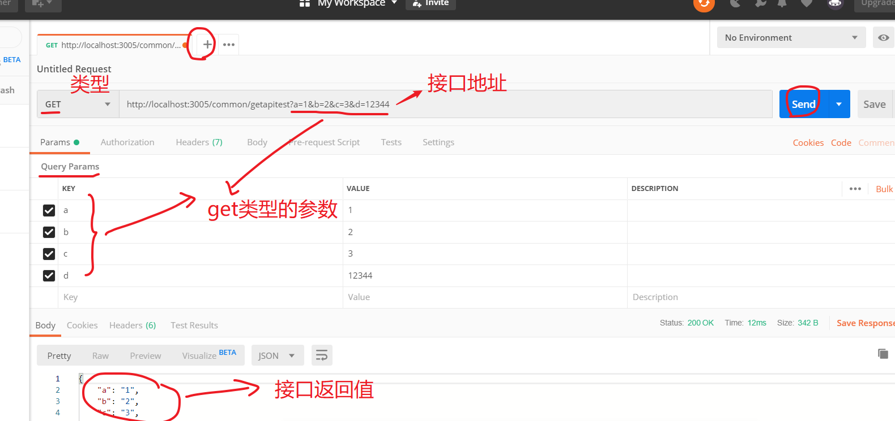

测试post接口

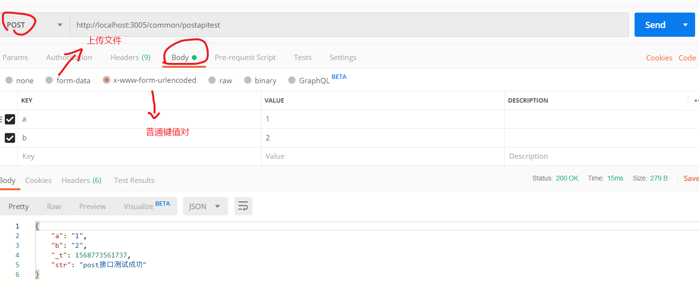

高级操作
建立项目保存接口；
建立对接口的测试样本；

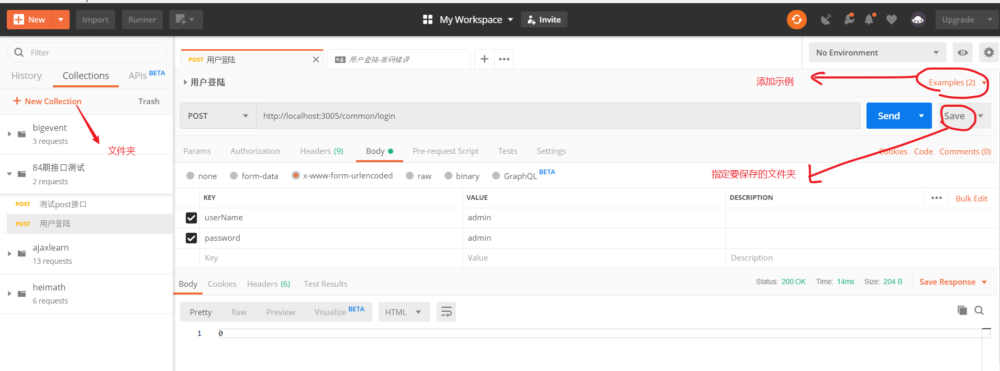


导出接口；

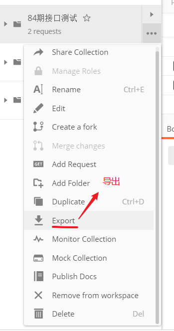

## 第9章 [案例]会员管理系统

### 第1节 演示及分析


### 第2节 接口测试

在开始写代码之前，我们要确保服务器上的接口都是可用的，所以要先对接口进行测试；

### 第3节 功能实现

#### 显示会员列表

基本思路：

- 发ajax请求；

- 数据回来之后，使用arttemplate来解析内容；

实现步骤：

- 引入jquery.js
- 在网页打开时，发请求。
- 数据回来之后，用arttemplate来生成对应的成员。

#### 查看会员详情

从主页中点击超链接进行跳转(index.html ---> detail.html)

- 整体分析
  - 流程分析
  - 接口测试
- 从地址url中取值
- 发送请求，更新页面元素

#### 删除会员

基本思路：

- 获取要删除的会员的编号；

- 调用接口去实现删除功能； 

基本步骤：

- 给每个删除链接上，补充成员id。
- 给每个删除链接上，补充'href="javascript:;"'，这样可以阻止默认的跳转事件。
- 给弹出框中的删除按钮添加点击事件
  - 获取上面的label中的id。
  - 发ajax请求,进行删除

重点代码：

1. 取消a标签的跳转动作

```html
<a href="javascirpt:;" />
```

2. 添加事件委托

   问题描述：元素是动态生成的，无法直接给元素添加点击事件。

   解决方法：给其父元素添加事件监听。由于元素上的事件具有冒泡特性：在子元素上的点击事件最终也会冒泡到父元素上。所以可以直接在父元素上监听。

```javascript
$("#parent").on("click",".son",function(){
    // ....
})
```

#### 添加会员

`文件控件`

使用文件控件来上传头像文件

```
// 只允许看到jpeg图片
<input type="file" accept="image/jpeg" />
// 只允许看到png图片
<input type="file" accept="image/png" />
// 允许所有的图片
<input type="file" accept="image/*" />
```

其它类型

| **文件类型** | **accept属性值**                        | **类型**                             |
| ------------ | --------------------------------------- | ------------------------------------ |
| *.asf        | allpication/vnd.ms-asf                  | Advanced Streaming Format            |
| *.au         | audio/basic                             | AU Audio                             |
| *.css        | text/css                                | Cascading Style Sheets               |
| *.csv        | text/csv                                | Comma Separated Values               |
| *.doc        | application/msword                      | MS Word Document                     |
| *.dot        | application/msword                      | MS Word Template                     |
| *.dtd        | application/xml-dtd                     | Document Type Definition             |
| *.dwg        | image/vnd.dwg                           | AutoCAD Drawing Database             |
| *.dxf        | image/vnd.dxf                           | AutoCAD Drawing Interchange Format   |
| *.gif        | image/gif                               | Graphic Interchange Format           |
| *.htm        | text/html                               | HyperText Markup Language            |
| *.html       | text/html                               | HyperText Markup Language            |
| *.jp2        | image/jp2                               | JPEG-2000                            |
| *.jpe        | image/jpeg                              | JPEG                                 |
| *.jpeg       | image/jpeg                              | JPEG                                 |
| *.jpg        | image/jpeg                              | JPEG                                 |
| *.js         | text/javascript, application/javascript | JavaScript                           |
| *.json       | application/json                        | JavaScript Object Notation           |
| *.mp2        | audio/mpeg, video/mpeg                  | MPEG Audio/Video Stream, Layer II    |
| *.mp3        | audio/mpeg                              | MPEG Audio Stream, Layer III         |
| *.mp4        | audio/mp4, video/mp4                    | MPEG-4 Audio/Video                   |
| *.mpeg       | video/mpeg                              | MPEG Video Stream, Layer II          |
| *.mpg        | video/mpeg                              | MPEG Video Stream, Layer II          |
| *.mpp        | application/vnd.ms-project              | MS Project Project                   |
| *.ogg        | application/ogg, audio/ogg              | Ogg Vorbis                           |
| *.pdf        | application/pdf                         | Portable Document Format             |
| *.png        | image/png                               | Portable Network Graphics            |
| *.pot        | application/vnd.ms-powerpoint           | MS PowerPoint Template               |
| *.pps        | application/vnd.ms-powerpoint           | MS PowerPoint Slideshow              |
| *.ppt        | application/vnd.ms-powerpoint           | MS PowerPoint Presentation           |
| *.rtf        | application/rtf, text/rtf               | Rich Text Format                     |
| *.svf        | image/vnd.svf                           | Simple Vector Format                 |
| *.tif        | image/tiff                              | Tagged Image Format File             |
| *.tiff       | image/tiff                              | Tagged Image Format File             |
| *.txt        | text/plain                              | Plain Text                           |
| *.wdb        | application/vnd.ms-works                | MS Works Database                    |
| *.wps        | application/vnd.ms-works                | Works Text Document                  |
| *.xhtml      | application/xhtml+xml                   | Extensible HyperText Markup Language |
| *.xlc        | application/vnd.ms-excel                | MS Excel Chart                       |
| *.xlm        | application/vnd.ms-excel                | MS Excel Macro                       |
| *.xls        | application/vnd.ms-excel                | MS Excel Spreadsheet                 |
| *.xlt        | application/vnd.ms-excel                | MS Excel Template                    |
| *.xlw        | application/vnd.ms-excel                | MS Excel Workspace                   |
| *.xml        | text/xml, application/xml               | Extensible Markup Language           |
| *.zip        | application/zip                         | Compressed Archive                   |

`本地图片预览`
文件控件选中图片后，文件控件中会保存图片信息它的files属性中。files属性是一个数组，如果只选中了一张图片，这张图片就放在files[0]中，如选了多张图片，则类似后推。

对于这些文件信息（本例中的文件就是用户选中的图片），我们通过`window.URL.createObjectURL()`来创建一个临时的路径，这个路径可能是像这样：

```javascript
blob:http://localhost:3005/fc517910-1300-44f3-a6e8-d52f56f34e4e
```

你可以通过打一个新的浏览器窗口，并在地址栏中输入这个路径来访问这张图片。注意，它只是临时的，如果你关闭了选中图片的网页，这张图片也将会不可访问。

现在，我们拿到这个临时的url赋值给某一个img标签的src即可。

```javascript
// input_avatar就是file控件的内容发生变化执行
$('#input_avatar').change(function () {
    // console.log('xxx');
    // 如果没有选择文件，返回
    if (!this.files[0]) return;

    var url = URL.createObjectURL(this.files[0]);
   
    // 设置图片的src
    $('#avatar').attr('src', url);
});
```

`整体实现`
这里的上传不是一个简单的post请求，它其中包含了文件的上传，我们使用FormData对象来上传图片，会员名，会员说明，并使用$.ajax()方法来实现上传操作。

与原生的ajax传递formdata对象不同，在使用$.ajax()上传formdata对象时，要额外补充两个设置：

1. processData:false

不需要jquery去处理上传数据

2. contentType:false

jquery会自动给post请求设置请求头，content-type:'application-x-www-form-urlencoded'。这种做法在大多数情况下，都是对的，但是，如果提交的数据是formdata，就不需要去设置了。

```javascript
// 2. 添加会员
// 2.1 给按钮注册事件  注意，这个是提交按钮
$('#btn_add').click(function () {
    // 2.2 获取用户输入的内容，还有用户选择的文件
    // 2.3 FormData  设置请求体，可以提交二进制数据，可以上传文件
    //     xhr.send(formData);
    var fd = new FormData($("#myform")[0])

    // 2.4 发送请求，添加数据
    $.ajax({
        type: 'post',
        url: '/member/add',
        data: fd,
        processData: false,
        // 不设置content-type，而是当设置了formdata上传文件的时候，xhr对象会自动把content-type设置为multipart/form-data;
        contentType: false,
        success: function (data) {
            // 判断添加是否成功...
            // 2.5 跳转回首页
            location.href = '/';
        }
    });
});
```

#### 下拉加载


- 分析加载数据的时机

  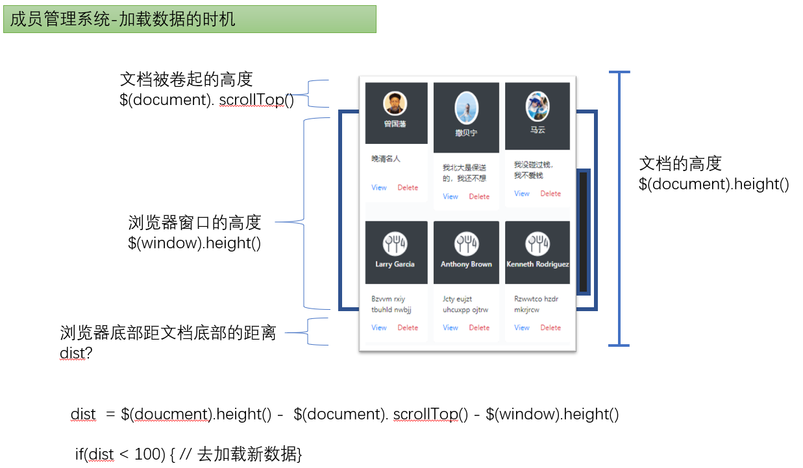

- 基本完成

```
  全局变量来记录最大的last值
  // 注册滚动的事件
  $(window).scroll(function () {
     // 判断当前是否正在加载数据，如果正在加载数据，就不要再次发送请求了
     if (loading) return;
     // 获取文档的高度
    var documentH = $(document).height();
    // 获取浏览器窗口的高度
    var windowH = $(window).height();
    // 文档滚动出去的距离
    var scrollTop = $(document).scrollTop();
    // 判断当前滚动条距离底部的距离是否 <= 100，加载更多数据
    if (documentH - windowH - scrollTop <= 100) {
      // 加载更多
      loadData();
    }
  });
```

- 优化
  - 不要重复发请求
  - loading效果
  - 数据全部加载完成之后的处理


