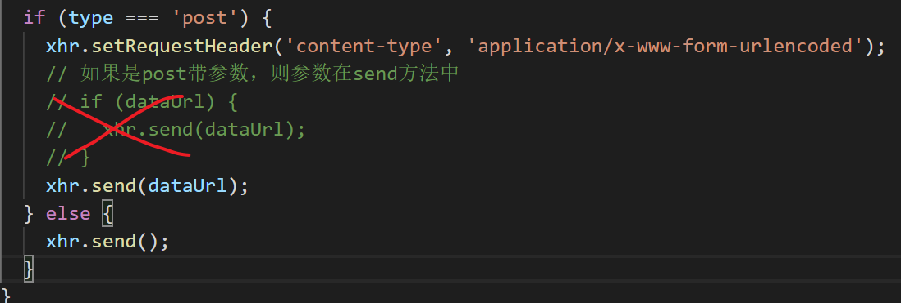

| 姓名 | 意见或建议                                                   |
| ---- | ------------------------------------------------------------ |
| ***  | 基础不好 前期也没用功 现在想好好学了 又跟着费劲 老师 如果我照你的代码写N 边   会有提高吗 |
| ***  | form Data快速获取表单元素的信息中，注释掉   xhr.setRequestHeader('content-type',   'application/x-www-form-urlencoded');form data变为request   payload，响应体里正常，但payload下的数据还有分隔符，是什么原因？还有二者有啥区别。 |
| ***  | 海星吧                                                       |
| ***  | XHR 2.0 是啥？？？                                           |
| ***  | 老师辛苦了！（详细）                                         |
| ***  | 希望老师规定一个具体的下课时间 要不 上50分钟或者45分钟 这个憋尿吧 很难受 还有同学的注意力需要调整一下才能聚精会神的听接下来的课程，谢谢老师 |
| ***  | 1.每次判断xhr.status的值都是与xhr.onreadystatechange一起使用,是有特殊的规定吗? 2.原生ajax的封装最后一步 if (type === 'post') { if (dataUrl) {xhr.send(dataUrl);}} else {   xhr.send(); }判断dataUrl如果为空post情况下不就不存在xhr.send(), |
| ***  | 小黑窗总是闪退找不到问题.`是否没有安装nodejs`                |
| ***  | 使用FormData获取表单信息还不太明白，想老师再讲一哈~          |
| ***  | ajax封装不太会。                                             |
| ***  | +++\| 能够掌握使用 XHR 2.0 完成异步上传文件   \|+++ 这个题目略显高端（采用了全大写的XHR,加上2.0让人捉摸不定）。网上查询了一番，发现指的是使用XMLHttpRequest中的FormData对象来实现上传功能。( 发现:这个函数在IE中仅支持IE10及以上的版本 ) |
| ***  | 自己要好好多敲几遍代码，嗨。。。我太难了！                   |
| ***  | 昨晚咋没来ne❓                                                |
| ***  | 希望老师讲案例前1，先带我们看下html页面结构；2，说下我们要做什么事情，描述下呈现什么效果；上面2条过渡的太快了，1秒钟就上代码了，没反应过来。 另外想问下老师，get url路径(加参数，字符串拼接)不知道什么时候该加参数，什么时候不加 |
| ***  | 哈哈哈哈哈哈                                                 |
| ***  | IE是专门来给我们加工作量的吧，都用谷歌不好么，不能愉快地和IE玩耍了 |
| ***  | 1.老师可不可以少用一些语气词：嗯，啊，是吧等。 2.能不能不要老一句话说两遍。 3.吐字能否清晰一点？ 有时候会有吞字的情况。 4.语速能否加快一点点，每句话能不能突出想要表达的重点？比如，“写一个原生的AJAX请求，用来获取服务器时间。 `步骤共4步` ” 这句话中   （原生的AJAX请求）和（共4步） 应该加重语气，您体会一下。 |
| ***  | 凡哥，1.我知道原生ajax发请求需要四步：1）创建对象2）设置请求3）回调函数4）发送请求。不清楚的是，为什么要设置回调函数，以及回调函数的内容为什么是console.log()。打印出来有什么用呢？ 2.post类型的ajax需要加请求头，为啥get不用？那put等其他类型的需要加吗？ 3.单标签的写法问题：之前h5，css写的单标签都没有带反斜杠，发现您写的单标签内容最后都要加条/，例如<input type="text"   id="userName" name="userName" />，求问/的作用。 4.想要一下预习笔记，可以给我们发一下吗？ |
| ***  | 1.在input控件中，name属性是用来设置参数的键还是用来干什么？ name= "userName",之后在输入框中的admin等   在后台显示为 userName = admin。 2.为啥name="userName"可以变为name="userName12344"等，而在上传文件中 name只能等于file。 |
| 孙雪 | 对于封装ajax错误处理部分不太理解。为什么要设置参数event404：？对应的值写成了123，不明白后面又怎么处理的？为什么不能直接判断xhr.status == 404，写成   xhr.onreadystatechange = function () { if (xhr.readyState == 4) { if   (xhr.status == 404) { alert('接口404,请联系管理员') } else if (xhr.status == 200) { var jsonObj = JSON.parse(xhr.responseText);   success(jsonObj); } } }; |




```

```

