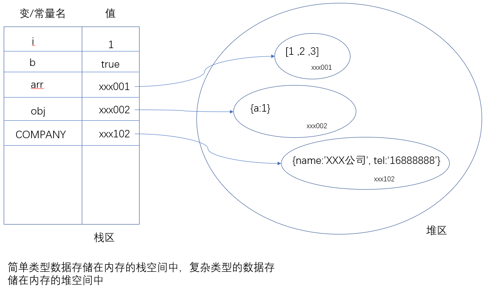
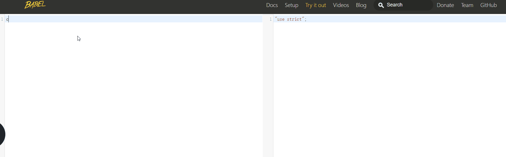

# ES6

## ES6 介绍

### ES6 是什么

- [ECMAScript](https://baike.baidu.com/item/ECMAScript/1889420) 6，简称ES6 。是javascript语言下一代标准。它的目标是`使得JavaScript语言可以用来编写复杂的大型应用程序，成为企业级开发语言 `。它是一种语言标准，6表示版本号。
- ECMA（European Computer Manufacturers Association）的第39号技术专家委员会（Technical Committee 39，简称TC39）负责制订ECMAScript标。每年都会发布ECMAScript的版本：
  - ES2015：称为es6。
  - ES2018:   https://www.ecma-international.org/ecma-262/8.0/index.html
  - ES2019：https://www.ecma-international.org/ecma-262/9.0/index.html
- ES6与javascript的关系：ECMAScript是一种语言标准，javascript实现了这个标准（还有JScript和ActionScript也实现这个标准）。
  - 1996年11月，javascript的创造者-----netscape公司，决定将javascript提交给ECMA，以便使之成为国际标准。
  - 1997年，ECMA发布ECMA-262号标准文件，规定了浏览器脚本语言的标准，并将这种语言称为ECMAScript，这个版本就是1.0版本。
  - 这个标准开始就是针对javascript语言制定的，但没有称其为javascript，主要原因如下：
    - 商标。javascript本身已经被Netscape公司注册为商标。
    - ECMA比javascript更开放，更中立。
- ES6与ECMAScript2015的关系
  - ECMAScript2015是具体到2015年6月发布的那一版。
  - ES6有两层含义
    - 特指ECMAScript2015
    - 泛指ES2015及之后的新增特性，虽然之后的版本应当称为ES2018，ES2019...es6。

### 学习内容

es6新增了很多强大的语法，如下是比较常使用的：

1. let 和 const
2. 解构赋值
3. 函数扩展
4. 字符串扩展
5. 数组扩展
6. 对象的简写

其它内容，请自行补充学习。

### 学习参考

1. 各种环境中对es6的支持程度： <http://kangax.github.io/compat-table/es6/>
2. ES6电子书： <http://es6.ruanyifeng.com/#docs/intro>

## let 和 const

我们之前定义变量的关键字是`var`，它定义的变量有很多奇怪的特点，如下有两点比较突出：

- 变量先使用再定义------ 变量提升。

  ```
  console.log(a);
  var a = 1;
  console.log(a)
  ```

- 缺少块级作用域。

  ```
  // 此处为了使用循环，定义一个循环变量i。
  for(var i=1; i<10;i++){}
  // i在循环体之外也能使用。
  console.info(i);
  ```

这两个问题都容易让初学者混淆，也容易让从其它语言转过来的程序员混淆。为了解决这些问题，ES6中新增了let。ES6引入const的原因是，因为ES5中并没有提供`常量`的功能。


### let 变量

作用：定义变量。（var也是用来定义变量）

### let基本使用

格式： let 变量名 = 变量值；

它用来定义变量，基本使用格式与var关键字一样。在可以在使用var 的地方改成let。

### 与var的区别

- 不能重复定义
- 没有变量提升（var定义的变量是有变量提升的），必须`先定义再使用`
- 全局变量不会附加到window对象的属性中
- 具有块级作用域

#### 代码演示

##### 不能重复定义

```js
// 1. let 定义变量，变量不可以再次定义
let name = 'zhangsan';
name = 'lisi';
console.log(name); // lisi
let name = 'wangwu'; // 再次定义，报错：Identifier 'name' has already been declared
```

##### 块级作用域

作用域

- 全局作用域：变量不属于任何函数，处处可用。
- 局部作用域：特指在函数内部定义的变量，它的作用域受function {}所限制。
- 块级作用域（ES6中提出的）：在{}内定义的变量，它的作用域受{}所限制。
  - 在{} 内部，通过let关键字定义的变量就具有块级作用域。

如果是通过let关键字来定义变量的，则js代码中就可以通过{}来切分作用域了。

```js
// 具有块级作用域，块就是大括号
{
    let age = 18;
    console.log(age); // 18
}
console.log(age); // 报错，此作用域中没有age的定义

// 块级作用域的嵌套
{
    let a = 1;
    {
        let a = 2;
        console.log(a);
        a = 3;
        console.log(a);
    }
    console.log(a)
}

// 隐藏的块级作用域
for (let i = 0; i < 10; i++) {
    // i 只能在此范围内使用，因为有块级作用域
}
console.log(i);  // 报错，此作用域中没有age的定义
```


##### 没有变量提升

通过let定义的变量，不再有没有变量提升，必须严格遵守先定义再使用的原则。

```js
console.log(gender); // 报错，此时还没有定义gender
let gender = '男'; 

console.log(1); // 不报错，输出undefined
var a = 1; 
```


##### 全局变量不会赋值加在window对象中

let声明的全局变量不会以属性的形式附加在window对象中，全局变量与window对象再无关系。

```js
let hobby = '吃饭';
var a = 1
console.log(window.hobby); 
console.log(window.a); 
```

ES6中保留了对var的支持，你可以在代码中同时使用var和let。当然，建议使用let。

### const 常量

#### 使用场景

程序员在协同开发项目时，会遇到一种场景：有一些数据大家都需要用到，但是都不能修改，即数据是`只读的`。举个例子：在开发公司的网站时，公司的基本信息：地址，公司名，电话等等信息可以在多个地方都需要使用，但不允许去修改。 显示，使用变量来保存这些信息是不适合的，因为变量不是只读的。这种情况下， 我们就可以把这些数据保存在常量中。

#### 语法格式及命名规范

作用：定义一个只读的常量。

格式： `const 常量名 = 常量值;`

示例：`const COMPANY_NAME = "XXX公司"`

注意：

- 区别于变量名，常量名一般采用全大写的方式，多个单词之间使用_划线分隔。

#### const特点

所谓常量，就是不能修改，即：

- 一旦定义就不能修改；


```javascript
const a = 1;
a = 2; // 报错
```

- 一旦声明，就必须立即初始化；

  ```
  const a ; // 报错，没有初值
  ```

  

其它与let相似的特点

- 具有块级作用域
- 没有变量提升，必须先定义再使用
- 常量也是独立的，定义后不会压入到window对象中，不是window对象的属性

#### 本质

`const`实际上保证的，并不是常量的值不得改动，而是`常量指向的那个内存地址所存的数据不得改动`。

```javascript
const obj = {a:1};
obj.a = 2;
console.log(obj); // 问题：obj对象的属性值a是否修改了。
```

- 对于简单类型的数据（数值、字符串、布尔值），它的值直接保存在栈区。就保存在常量名指向的那个内存地址中，因此等同于常量值。

- 对于复合类型的数据（如对象和数组），常量指向的内存地址，保存的只是一个指向实际数据的指针，`const`只能保证这个指针是固定的（即总是指向一个固定的地址），至于它指向的数据结构是不是可变的，就不能控制了。因此，`将一个对象声明为常量必须非常小心,它的属性是可以修改的`。

  

如果你真的希望定义一个不能修改的对象（属性不能添加，修改，删除），你可以使用Object.freeze()。下面是一段参考代码：它一个可以把一个对象全部冻结的函数:

```javascript
function makeConst(obj){
	Object.freeze(obj);
	Object.keys(obj).forEach(function(key){
		if(typeof obj[key] === 'object'){
			makeConst(obj[key])
		}
	})
}
var obj = {a:1,b:2};
makeConst(obj);
obj.a = 200; //不报错，但是不生效
obj.c = 100; //不报错，但是不生效
console.log(obj); //值保持不变
```


### 小结

| 关键字 | 变量提升 | 块级作用域 | 初始值 | 更改值 | 通过window调用 |
| :----: | :------: | :--------: | :----: | :----: | :------------: |
|  let   |    ×     |     √      |   -    |  Yes   |       No       |
| const  |    ×     |     √      |  Yes   |   No   |       No       |
|  var   |    √     |     ×      |   -    |  Yes   |      Yes       |

## 解构赋值

我们经常会遇到一个场景：从对象中取出它的属性值，并保存在一个变量中。

例如：

```
// 这里的item是一个对象{ }，其中包含属性name和age
let name = item.name; 
let age = item.age;
```

另外，如ajax请求的回调函数

```
$.ajax({
	// 省略其它参数
	success:function(res){
		// 这里的res是一个对象，其中有code属性和data属性
		if(res.code === 200){
			let data = res.data;
			data.forEach(){

			}
		}
	}
})
```

ES6提供了一个更加方便的方式从对象中取出属性值来，这就解构赋值。

### 定义

ES 6 允许按照一定**模式**，从数组和对象中提取值，对变量进行赋值，这被称为解构（Destructuring）。

它有两个动作：

	- 解构：意思是把有结构的数据分解开成为一个一个的值
	- 赋值：把解构之后的值保存到变量

基本示例

```javascript
let arr = [1,2,3,4];
// 需求，快速地从数组中取出值来赋值给变量a,b,c,d
let a = arr[0];
let c = arr[1];
console.log(a,b,c,d)
```


### 数组的解构赋值

它能够快速从数组中取出值保存到变量中。它的本质是给变量赋值。

内容：

- 语法格式及解构规则
- 常规使用:变量个数等于数组长值
- 非常规使用
  - 变量个数大于数组长度
  - 变量个数小于数组长度
- 高级使用
  - 用空跳过不需要的值
  - 剩余值
  - 复杂嵌套场景
- 小面试题

#### 语法格式及解构规则

格式

```javascript
let [变量1=默认值1，变量2=默认值2，省略其它，变量n=默认值n ] = [数组元素1，数组元素2,省略其它,数组元素n]
```

默认值是可选的：可以设置，也可以不设置；

规则：

- 赋值符号左右两边都是数组，把右边的数组按下标从小到大取出来，放入左边的数组中。
- 如果左边的变量并没有分配到某一个值：
  - 有默认值，使用其默认值。
  - 无默认值，其值是undefined

#### 基本示例

```js
//最简单的场景： 变量个数和数组中元素的是相等的
let arr = [5, 9, 10];
let [a, b, c] = arr;
console.log(a, b, c); // 输出 5 9 10
// 等价于：
let a = arr[0];
let b = arr[1];
let c = arr[2];
```

注意：

- ​	“=”左右两边的格式要统一。

#### 闯关练习

我们可以通过如下练习来掌握数组的解构赋值。

```
// 变量多，值少
let arr = [5, 9, 10];
let [a, b, c, d] = arr;
console.log(a, b, c, d); 
// 结论：没有匹配上的值是undefined

// 默认值
let arr = [5, 9];
let [a, b, c, d=4] = arr;
console.log(a, b, c, d); 
// 结论：对于没有匹配上的变量，有默认值就使用默认值，否则就是 undefined，

// 变量少，值多
let arr = [5, 9, 10, 8, 3, 2];
let [a, b] = arr;
console.log(a, b); 
// 结论：多余的忽略

// 用空跳过不需要的值
let arr = [5, 9, 10, 8, 3, 2];
let [, , a, , b] = arr; 
console.log(a, b); 
// 结论：不需要用变量接收的值，用空位占位

// 复杂的场景，只要符合模式，即可解构
let arr = ['zhangsan', 18, ['175cm', '65kg']];
// 如何让a的值是175cm,b的值是65kg
console.log(a, b); // 175cm 65kg

```


#### 剩余值

```js
let arr = [5, 9, 10, 8, 3, 2];
let [a, b, ...c] = arr; // ...c 接收剩余的其他值，得到的c是一个数组
console.log(a, b, c); 
// 结果：
// a = 5, 
// b = 9, 
// c = [10, 8, 3, 2]
```

注意：

1. ...  只能用在最后一个变量上。这个变量是一个数组，在解构赋值的过程中，如果有出现数组元素个数大于变量个数的情况，它将会把多余的参数起来，保存在这个数组。

#### 一个小面试题

交换两个变量的值？

```javascript
var a = 1, b = 2;
// 写代码,实现互换a,b的值
// ???? 

console.info(a,b); // 要求输出 2, 1
```


### 对象的解构赋值

作用：快速从对象中获取值(属性值)保存到变量中。它的本质是给变量赋值。

#### 使用格式及规则

`完整格式`

```javascript
let {"属性名1"：变量名1=默认值1, "属性名2"：变量名2=默认值2,... } = {"属性名1"：属性值1,"属性名2"：属性值2,...}
```

默认值是可选的。你可以指定默认值，也可以不指定。

解析规则：对于左边的变量名

- 如果在右边的对象中能找出与左边属性名相同的项，则把右边的属性值赋值给左边的变量名。

- 如果找不到，则看是否有使用默认值，有默认值就使用默认值，没有就是undefined。

`精简格式`

如果左侧对象中属性名与变量名相同，则可左侧合并：

```javascript
let {变量名1=默认值1，变量名2=默认值2} = {"属性名1"：属性值1,"属性名2"：属性值2,...}
```


#### 基本使用

场景1，变量名和属性名一样

```js
// 场景1，默认要求变量名和属性名一样
let { name, age } = {age: 27, name: '阳明'};
console.log(name, age); 

let {a, c} = {a: 'hello', b: 'world'};
console.log(a, c); // hello, undefined
```

注意：

- “=” 左右两边的格式一致。
- 对象是属性的无序集合，所以不需要管顺序

场景2，变量改名

```js
// 场景2，可以通过:为变量改名
let {b, name:a} = {name: '王阳明'};
console.log(b, a,name); 
```

##### 闯关练习

```
// 默认值
var {b=1, name:a,age:b=1 } = {name: '王阳明'};
console.log(b, a,name); 


// 复杂的嵌套，只要符合模式，即可解构
let obj = {
    name: 'zhangsan',
    age: 22,
    dog: {
        name: '毛毛',
        age: 3
    }
};
// 如何才能把age和name解析出来
let {dog: {name, age}} = obj;
console.log(name, age); // 毛毛 3


// 假设从服务器上获取的数据如下
let res = {
    data: ['a', 'b', 'c'],
    meta: {
        code: 200,
        msg: '获取数据成功'
    }
}
// 如何获取到 code 和 msg
let { meta: { code, msg } } = res;
console.log(code, msg); // 200, 获取数据成功


let {max,min,PI} = Math;
```


#### 剩余值

```js
// 把其它的属性全收集起来
let obj = {name:'zs', age:20, gender:'男'};
let {name, ...a} = obj;
console.log(name, a);
// 结果：
// name = zs
// a = {age: 20, gender: "男"};
```


## 函数的拓展

es6对函数的功能进行了一些拓展，补充了很多功能。学习这个部分的内容我们就可以更加灵活优雅地使用函数啦。

### 参数默认值

在定义一个函数时，我们可以给形参设置默认值：当用户不填入这个值时，我们有一个保底的值可以使用。这个特性在很多其它的编程语言中一个基础的特性，而在ES6之前，是不支持的，我们需要通过一些变通的方式来实现。

#### 理解默认值

参数的默认值在之前的课程内容已经涉及，例如在`xhr.open(type,url,是否异步) `方法中，第3个参数默认是true，即表示异步ajax。

默认值的意思是：

- 如果传入，就用你传的值
- 如果不传入，就使用某一个特殊的、事先定义好的值。这个值也就是默认值。

#### ES5的实现

```js
// ES5 中给参数设置默认值的变通做法
function open(type, url,isAsync) {
    if(isAsync === undefined){
        isAsync = true;
    }
    console.log(type, url, isAsync);
}
// 下面这两句是等价的
open("get","common/get")；// 
open("get","common/get",true)；
open("get","common/get",false)；
```

以上代码主要是利用形参的一个特点：没有赋值的话，其默认值是undefined。代码是可以工作的，但是显得很累赘，es6提供了更简单的实现。

#### ES6的实现

##### 格式

在定义一个函数时，在形参列表中对参数进行赋值操作。

```javascript
function 函数名(参数名1='默认值1'，参数名2='默认值2'，参数名3='默认值3'){
    
}
```

##### 示例

```
function open(type, url,isAsync=true) {
    console.log(type, url, isAsync);
}
// 下面这两句是等价的
open("get","common/get")；// 第三个参数使用默认值
open("get","common/get",true);

open("get","common/get",false); 
```

思考：能否跳过isAsync,url，而只给type设置默认值？

注意:

- 带默认值的形参放在形参列表的**最右边**。

#### 练习

```javascript
function f(a=1,b=2){
	console.log(a,b,a+b);
}
f(10)
f(10,20)
f()

function f2(a=1,b){
	console.log(a,b,a+b);
}
f2(10)
f2(10,20)
f2(,3)
f2()

// 与解析赋值一起使用
function f1({a:1,b:2}={}){
   console.log(a,b,a+b);
}

f1({a:10,b:20})
f1({a:20})
f1({c:1})
f1()
```


### rest 参数

rest （其它的，剩余的）参数 用于获取函数多余参数，并把它们放在一个数组中。

#### 语法格式

在定义函数时，在`最后一个参数`前面加上`...`， 则这个参数就是剩余参数；

```javascript
let fn = function(参数1，参数2，...rest参数){}

let fn = (参数1，参数2，...rest参数)=>{ }
```

只是在定义函数时，在形参列表中区别一下，而在调用函数时并无区别。

#### 示例

回答如下问题

```javascript
function f2 (x,...y){
    console.log(x,y)
}
f2(1,2);
f2(2,3,4);

function f1 (x,y){
    console.log(x,y)
}
f1(1,2);
f1(2,3,4);
```

#### 应用--代替arguments

问题：编写一个函数，求所有参数之和；

方法一：arguments

方法二：rest参数

```javascript
function getSum (){
    //  在这里写你的代码
    var sum = 0 ; 
    for(var i = 0; i < arguments.length; i++){
        console.info( arguemnts[i])
        sum += arguments[i];
    }
}
```

如果以箭头函数 的方式去定义这个函数，则内部不可以使用arguments这个对象了。此时，我们就可以使用

rest 参数，它可以替代 arguments 的使用。 代码如下：

```js
// 参数很多，不确定多少个，可以使用剩余参数
const  getSum = (...values) => {
    var sum = 0 ; 
    for(var i = 0; i < values.length; i++){
        console.info( values[i])
        sum += values[i];
    }
}
// 调用
console.log(fn(6, 1, 100, 9, 10));
```

与arguments相比，它是一个真正的数组，可以使用全部的数组的方法。

### 箭头函数

箭头函数能让代码更简洁；箭头函数能让函数的功能更加纯粹；

```javascript
let fn3 = x => x * 2;
```


#### 什么是箭头函数

ES6 中允许使用箭头函数的方式来定义一个函数。前面学习的定义一个函数有两种方式:

1. 函数声明式
2. 函数表达式

现在有了一个新的方式：

​	3. 箭头函数

#### 格式

```javascript
let 函数名 = （形参1，...形参n）=>{
    // 函数体
}
```


#### 定义一个箭头函数

```js
// 1. 函数声明式
function fu1(x){
    return x * 2;
}
// 2. 函数表达式
let fn2 = function (x) {
    return x * 2;
}
// 3. 箭头函数
let fn3 = (x) => {
    return x * 2;
}
```

第一眼看到这个箭头函数时，会觉得很奇怪。如果从函数表达式的格式出发， 经过如下`2步演化`步骤就可以得到。

1. 把function 关键字 后移动到 （）和  {} 中间
2. 把function 改写成 =>

注意：

	- `=>`是一个整体，不要加空格
	- 箭头函数只在定义上有些区别，但在函数调用格式上，是没有区别的。


#### 简化写法

- 当形参有且只有一个，可以省略小括号

  ```
  let f = (x) => {console.log(x)}
  // 可以简化成：
  let f = x => {console.log(x)}
  ```

- 当函数体只有一条语句，可以省略大括号;

  ```
  let f = x => {console.log(x)}
  // 可以简化成：
  let f = x => console.log(x)
  ```

- 当函数体只有一条语句，并且就是return语句，则可以省略return和大括号。

  ```
  let f = x => {return x*2 }
  // 可以简化成：
  let f = x => x*2
  ```

  注意如果返回值是一个对象，要加()

  ```
  let f = x => {return {a:1}  }
  // 可以简化成：
  let f = x => {a:1} // 报错
  let f = x =>({a:1})
  ```


#### 箭头函数与普通函数的区别

- 内部没有arguments
- 内部没有this
- 不能作为构造器

##### 没有 arguments

```js
let fn = (a,b) => {
    console.log(arguments); // 报错，arguments is not defined
};
fn(1, 2);
```

##### 内部的`this`对象，指向定义时所在的对象，而不是使用时所在的对象。

1.箭头函数可以访问this对象，但这个this对象指向在定义箭头函数时它时所处的对象(宿主对象),而不是运行时的对象。

```js
var name = 'lisi'; // 测试时，这里必须用var，因为用let声明的变量不能使用window调用
let obj = {
    name: 'zhangsan',
    f1 : () => {
        console.log(this); // window对象
        console.log(this.name); // lisi
    },
    f2 : function(){
        console.log(this); // obj
        console.log(this.name); // zhangsan
    },
    f2 : function(){
        console.log(this); // obj
        console.log(this.name); // zhangsan
    }
};
obj.f1();
```

箭头函数中的this指向是**固定化**的，并不是因为箭头函数内部有绑定this的机制，实际原因是箭头函数根本没有自己的this，导致内部的this就是外层代码块的this。

```
var obj = {};
var f1 = functoin(){console.log(this)}
var f2 = ()=>{console.log(this)}

f1();
f1.call(obj)// call可以修改普通函数内部的this的值
f2();
f2.call(obj);// call并不能修改箭头函数内部的this的值
```

##### 箭头函数不能作为构造函数

```js
let Person = () => {
	
};
let obj = new Person(); // 报错，Person is not a constructor
// 换个角度理解，箭头函数中都没有自己的this，怎么处理成员，所以不能当构造函数
```

在javascript中，函数是一等公民 ,它除了起到最基本的提炼代码之外，还可以当做构造器来使用，它能做的事件太多了。在ES6提出的箭头函数给函数减负了。


##  数组的扩展

数组对象是js中非常重要的对象，它本身提供了非常多的方法，例如：sort，push，pop，unshift, splice,concat，map,forEach,filter,some,.... 。由于前端的主要工作内容之一是与后端进行数据交互，而数据交互的载体大多是数组，所以我们对数组的操作要求也非常高。

曾经有一道面试题：写出10个你用过的与数组相关的方法。

这一小节的学习会让我们多掌握几个数组的方法。

### 扩展运算符

功能：它的作用是把数组中的元素一项项地展开：把一个整体的数组拆开成单个的元素。

格式：`...数组`

基本用法

```javascript
console.info(...[1,2,3]);
```

应用1：数组拷贝

```
var arr1 = [1,2,3]
var arr2 = [...arr1]
```

应用2： 数组合并

从把一个数组中的值全取出来，放在另一个数组中的

```javascript
var arr0 = ['a','b'];
var arr1 = [1,2,3];
var arr2 = [4, ...arr1];
var arr3 = [..arr0 ,...arr1];
```

应用3：Math.max()

```javascript
Math.max(1,3,4,6);
var arr = [1,3,4,6];
Math.max(...arr);
// 或者 Math.max.apply(this,[1,2,3,566])
```

### Array.from()

功能：把其它非数组的对象转成数组。

格式： `数组 = Array.from(非数组对象)`

它的实参有三种情况：

1. 自定义的，特殊格式的对象。

```js
let fakeArr = {
  0: 'a',
  1: 'b',
  2: 'c',
  length: 3
};
```

就是为了演示，并无实际应用价值。

2. arguments对象
3. DOM 操作返回的 NodeList 集合

### find方法

在实际的开发中，我们经常会遇到一种场景：从一个数组中找出符合条件的元素。我们要的讨论的重点是如何从数组中找出符合条件的元素，当然，我们可以通过手写循环的方式来实现这个功能，但是现在es6中提供了现成的功能。find/findIndex

作用：从数组中找出我们符合条件的**第一个元素**（或者是下标）。

#### 格式

find和findIndex的格式是一致的。

```javascript
let result = 数组.find(function(item,index,self){ 
    //.... 
    // 如果满足查找的条件
    return true;
})
```

- 回调函数有三个参数，分别表示：数组元素的值、索引及整个数组
- 如果某次循环返回的是true，find和findIndex方法的返回值就是满足这个条件的第一个元素或索引

#### 执行流程

- find和findIndex方法，会遍历传递进来的数组
- 如果在回调函数体内，某个时刻return true，则表示查找过程结果，返回值就是本轮循环中的元素（或者是下标）；如果全部的循环结束，也没有return true，则表示没有找到，没有找到会返回undefined。

- **findIndex** 找到数组中第一个满足条件的成员并**返回该成员的索引**，如果找不到返回 **-1**。

```js
let arr = [1, 2, 4, 0, -4, 3, -2, 9];
arr.find(function (item, index, self) {
    console.log(item); // 数组中的每个值
    console.log(index); // 数组中的每个索引/下标
    console.log(self); // 当前的数组
});
```

#### 简单示例

```js
// 用法：找数组中第一个小于0的数字
let arr = [1, 2, 4, 0, -4, 3, -2, 9];
let result = arr.find(function (item) {
    return item < 0; //遍历过程中，根据这个条件去查找
});
console.log(result); // -4
```

注意通过箭头函数来简化代码。

```
// 用法：找数组中第一个小于0的数字
let arr = [1, 2, 4, 0, -4, 3, -2, 9];
let result = arr.find(item => item < 0);
console.log(result); // -4
```


#### 实践应用

从一个复杂的对象数组中找出符合条件的对象。

```javascript
let data = [
    {id:2,name:'严嵩',age:15},
    {id:3,name:'徐阶',age:17},
    {id:4,name:'高拱',age:18},
    {id:1,name:'张居正',age:12},
]
```


### findIndex

findIndex 的使用和 find 类似，只不过它查找的不是数组中的元素，而是元素的下标。


### includes()

功能：判断数组是否包含某个值，返回 true / false

格式：`数组.includes(参数1，参数2)`

- 参数1，必须，表示查找的内容
- 参数2，可选，表示开始查找的位置，0表示从第一个元素开始找。默认值是0。

示例：

```js
let arr = [1, 4, 3, 9];
console.log(arr.includes(4)); // true
console.log(arr.includes(4, 2)); // false， 从2的位置开始查，所以没有找到4
console.log(arr.includes(5)); // false
```

##  String的扩展

es6中对字符串提供了新的特性，我们介绍其中几个方法：

- 模板字符串
- includes
- startsWith
- endWith
- repeat

### 模板字符串

在做字符串拼接时，使用`+`来拼接复杂内容是很麻烦的，而模板字符串可以解决这个问题。

格式：\``${变量}` `${表达式}`\` 

语法：

- 模板字 符串使用反引号 **`** 把内容括起来，类似于普通字符串的""。
- ${}充当界定符的作用，其中可以写变量名，表达式等。
- 允许字符串内部进行**换行**，代码有更好的阅读体验

示例：

```javascript
let name = 'zs';
let age = 18;
// 拼接多个变量，在模板字符串中使用占位的方式，更易懂
let str = `我是${name}，今年${age}`;


let obj = [{name: 'flex', age: 20},{name: 'james', age: 21}];

let arr = ['175cm', '60kg'];
// 内容过多可以直接换行
let html = `
	<div>
		<ul>
			<li>${obj.name}</li>
			<li>${obj.age}</li>
			<li>${arr[0]}</li>
			<li>${arr[1]}</li>
		</ul>
	</div>
```

### includes()

- 格式：`str.includes(searchString, [position])`		
- 功能：返回布尔值，表示是否找到了参数字符串
  - position: 从当前字符串的哪个索引位置开始搜寻子字符串，默认值为0。

### startsWith()

- 格式：`str.startsWidth(searchString, [position])`         
- 功能：返回布尔值，表示参数字符串是否在原字符串的头部或指定位置
  - position: 在 `str` 中搜索 `searchString` 的开始位置，默认值为 0，也就是真正的字符串开头处。

### endsWith()

- 格式：`str.endsWith(searchString, [len])`            
- 功能：返回布尔值，表示参数字符串是否在原字符串的尾部或指定位置.
  - len:可选。作为 `str` 的长度。默认值为 `str.length`。

### repeat()

`repeat`方法返回一个新字符串，表示将原字符串重复`n`次。

语法:`str.repeat(n)`

```js
let html = '<li>itheima</li>';
html = html.repeat(10);
```

##  Set对象

Set是集合的意思。是ES6 中新增的内置对象，它类似于数组，但是`成员的值都是唯一的，即没有重复的值`。使用它可以方便地实现用它就可以实现数组去重的操作。

### 创建set对象

- 创建空set；

- 根据已有数组创建set

```js
// 1. 基本使用
let set = new Set();
// 得到一个空的Set对象

let set = new Set([1,2,3])
```


### Set 的成员方法

- `size`：属性，获取 `set` 中成员的个数，相当于数组中的 `length`
- `add(value)`：添加某个值，返回 Set 结构本身。
- `delete(value)`：删除某个值，返回一个布尔值，表示删除是否成功。
- `has(value)`：返回一个布尔值，表示该值是否为`Set`的成员。
- `clear()`：清除所有成员，没有返回值。
- ` forEach`:遍历

### 应用-数组去重

```javascript
let arr = [1,1,2,3,3];
console.info([...new Set(arr)])
```


## 对象的扩展

### ...对象

与数组中的...一样，可以把小对象拼接成大对象

```
var obj1 = { a: 1, name: 'ok' };
var obj2 = { b: 2, a: 10 };

var obj3 = {...obj1, ...obj2};
console.log(obj3);
```


### 定义对象的简洁方式

- 对属性名的简化

  如果对象的属性值是一个变量的值，而恰好对象的属性名与这个变量的名一致，则可以简写。

  ```
  function f(){
  	var content = "abc";
  	return {"content":content}
  	// 简写为
  	return {content}
  }
  ```

- 对方法的简化
	```js
let name = 'zhangsan', age = 20, gender = '女';
let obj = {
    name: name, // 原来的写法
    age, // 对象属性和变量名相同，可以省略后面的 “:age”，下面的gender同理
    gender,
    fn1:function(){  // 常规写法
        console.log(123);
    },
    fn2 () { // 可以省略 
        console.log(456);
    }
};
console.log(obj.age); // 20
obj.fn2(); // 456
	```


##  ECMAScript 6 降级处理

###  ES 6 的兼容性问题 ###

- ES6 (2015年10月)虽好，但是有兼容性问题，IE7-IE11 基本不支持 ES6

  [ES6 兼容性列表](http://kangax.github.io/compat-table/es6/)

- 在最新的现代浏览器、移动端、Node.js 中都支持 ES6


###  ES 6 降级处理 ###

因为 ES 6 有浏览器兼容性问题，可以使用一些工具进行降级（把ES6的代码转成ES5的代码），例如：**babel**



babel官网](https://www.babeljs.cn/)

实时转码：https://babeljs.io/repl

