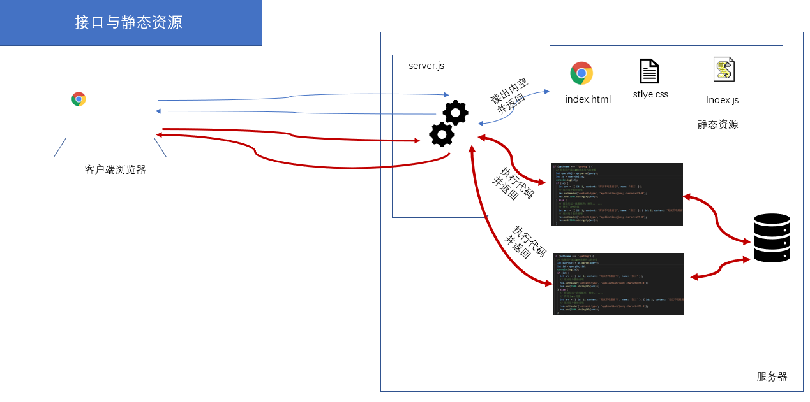

# nodejs讲义

从前端到后端；扩展前端技能栈；

## 安装并使用nodejs

### 安装nodejs

#### 下载

官网： https://Nodejs.org/en/  中文网：http://Nodejs.cn/

- 版本说明

  - **LTS**： 长期稳定版(Long Term Support))。 项目开发建议使用长期稳定版
  - **Current**： 最新版。最新版包含了一些新功能，如果想学习最新的功能，则可以使用该版本。最新版可能会有一些未知的bug。


#### 安装

1) 双击安装文件开始安装（不同系统选择对应的安装文件）

2) 傻瓜式安装，一路 'next' 即可

注意：

- 建议安装目录所使用`英文路径`

#### 测试是否安装成功

打开任意一个**小黑窗**，输入`node  -v`能够看到Nodejs版本号即为安装成功。

- cmd窗口(window+R, --->运行-->录入cmd,回车)

- powershell（window10操作系统）

  

### 在node环境下运行js代码

我们前面的学习中，js代码都是在浏览器中运行的，现在开始学习nodejs后，我们有了第二个环境中可以运行js代码。

有两种方式可以运行js代码：

- 在nodejs 提供的repl中环境
- 单独执行外部的js文件

#### 方法1：在 REPL中运行

REPL(Read Eval Print Loop:交互式解释器) 表示一个电脑的环境，类似 Window 系统的终端或 Unix/Linux shell，我们可以在终端中输入命令，并接收系统的响应。

Node 自带了交互式解释器，可以执行以下任务：

- **读取** - 读取用户输入，解析输入了Javascript 数据结构并存储在内存中。
- **执行** - 执行输入的数据结构
- **打印** - 输出结果
- **循环** - 循环操作以上步骤直到用户两次按下 **ctrl+c** 按钮退出。

具体操作：

1. 在任意控制台中输入node 并回车确定，即可进行入node自带的REPL环境。
2. 此时，你可以正常写入js代码，并执行。
3. 如果要退出，连续按下两次ctrl+c


#### 方法2：执行一个JS文件

1. 请事先准备好一个js文件。
   - 例设这的路径是：e:/index.js
   - 具体内容是

```javascript
var a = 1;
console.info(a + 2);
```

2. 打开小黑窗，进入到这个文件的目录
   - 技巧，在资源管理器中按下shift，同时点击鼠标右键，可以选择在此处打开powershell/命令行窗口。
   - cd 命令可以用来切换当前目录。
3. 接下来 通过  ` node  js文件` 的格式来执行这个js文件。

```javascript
node index.js
```

注意:

- 执行js文件时，如果当前命令行目录和js文件**不在**同一个盘符下，要先切换盘符
- 执行js文件时，如果当前命令行目录和js文件**在**同一个盘符中，则可以使用相对路径找到js文件并执行

### nodejs的helloworld程序

下面，我们来通过一个最基本的http服务器程序来见识nodejs的作用。

第一步：新建一个文件，名为  `d:/http.js`( 文件名及路径名可以自行设置，建议均不使用中文字符)

第二步：在文件中录入如下代码。

```javascript
// 引入http模块
const http = require('http');

// 创建服务
const server = http.createServer(function(req, res) {
  console.log(`来自${req.connection.remoteAddress}的客户端在${new Date().toLocaleTimeString()}访问了本服务器`);
  res.end('<h1>hello world! very good!!</h1> <p>' + req.connection.remoteAddress + '</p>');
});
// 启动服务
server.listen(8081, function() {
  console.log('服务器启动成功，请在http://localhost:8081中访问....');
});
```

第三步：在小黑窗中进入到d盘根目录，键入命令 `node http.js`

第四步：打开一个浏览器页面，输入'http://localhost:8081'，观察效果

第五步：把localhost改成你自己电脑的ip地址，再把这个路径发你的同学来访问。

- 如果不能访问，有可能你需要手动关闭你自己计算机的防火墙。

## node.js基本介绍

### node.js是什么

> Node.js® is a JavaScript runtime built on [Chrome's V8 JavaScript engine](https://v8.dev/).
>
> ------
>
> Node.js® 是一个基于 [Chrome V8 引擎](https://v8.dev/) 的 JavaScript 运行时

- Node全名是Node.js，但它不是一个js文件，而是一个**软件**
- Node.js是一个基于Chrome V8引擎的ECMAScript的运行环境，在这个环境中可以执行js代码
- Node.js提供了大量的工具（API），能够让我们完成文件读写、Web服务器创建等功能。


### nodejs和浏览器和javascript的关系

#### nodejs和浏览器的关系

相同之处：

- 都可以运行js(严格来讲是ECMAScript)代码

不同之处：


- 安装了浏览器这个软件，它不但可以执行ECMAScript，浏览器这个软件内置了window对象，所以浏览器有处理DOM和BOM的能力。
- 安装了NodeJs这个软件，它不但可以执行ECMAScript，NodeJS这个软件也内置了一些东西，包括全局成员和模块系统，同时还可以载入第三方模块来完成更强大的功能。


#### nodejs和javascript的区别？

- nodejs是一个容器（不是一个新语言），ECAMScript程序可以在这个容器中运行。
  - 不能在nodejs使用window对象，也不能在nodejs使用dom操作。因为nodejs中并不包含这个对象。
- javascript是由三个部分组成：ECAMScrtipt,Bom,Dom

### 学习Nodejs的意义

在我们熟悉的浏览器上执行JS不是很好吗？为什么要学习Nodejs呢？主要原因：

- 大前端必备技能
- 使得JS能够和操作系统 “互动” （读取文件，写入文件等，管理进程）
- 为JavaScript提供了服务端编程的能力
  - 文件IO
  - 网络IO
  - 数据库
- 了解接口开发，进一步理解Web开发，了解后端同学的工作内容


### 学习的主要内容

不是学新语法，es6就是语法；

主要是学模块及模块的使用；

## node中的模块化

在项目的开发过程中，随着功能的不断增强，代码量，文件数量也急剧增加，我们需要把一个大函数拆成小函数，把一个大文件拆成小文件，把一个大功能拆成若干个小功能。这里很自然地就涉及到模块化的想法：一个复杂的系统分成几个子系统，体现在几个小的文件在一起组成一个大的文件，集成强大的功能。


遗憾的是es5不支持模块化：就是在一个js文件内不能引入其他js文件。不能通过一个大文件去集成若干个小文件。（不是说一个html文件中不能包含多个js文件）。


这样就会带来多个问题：

1. 文件的加载先后顺序
2. 不同的文件内部定义的变量共享


### 模块化

一个js文件中可以引入其他的js文件，能使用引入的js文件的中的变量、数据，这种特性就称为模块化。使用模块化开发可以很好的解决变量、函数名冲突问题，也能灵活的解决文件依赖问题。

- 以前

  es5不支持模块化，让前端人员很为难。为了让支持模块化，我们一般会借用第三方库来实现：

  - sea.js. https://www.zhangxinxu.com/sp/seajs/
  - require.js. https://requirejs.org/

- 现在
  - es6原生语法也支持模块化（并不表示浏览器也支持模块化）
  - Nodejs内部也支持模块化（与es6的模块化有些不同之处），具体的语法在后面来介绍

### nodejs中的模块

每个模块都是一个独立的文件。每个模块都可以完成特定的功能，我们需要时就去引入它们，并调用。不需要时也不需要管它。（理解于浏览器的js中的Math对象）

nodejs模块的分类

- 核心模块
  - 就是nodejs自带的模块，在安装完nodejs之后，就可以随意使用啦。相当于学习js时使用的Array对象。
  - 全部模块的源代码 https://github.com/nodejs/node/tree/master/lib
- 自定义模块
  - 程序员自己写的模块。就相当于我们在学习js时的自定义函数。
- 第三方模块
  - 其他程序员写好的模块。nodejs生态提供了一个专门的工具npm来管理第三方模块，后面我们会专门讲到。
  - 相当于别人写好的函数或者库。例如我们前面学习的JQuery库，arttemplate等。

#### 核心模块

> 官网文档 https://nodejs.org/dist/latest-v10.x/docs/api/
>
> 中文文档 http://nodejs.cn/api/
>
> 学会查 API，远远比会几个 API 更重要

- 核心模块就是 Node 内置的模块，需要通过唯一的标识名称来进行获取。
- 每一个核心模块基本上都是暴露了一个对象，里面包含一些方法供我们使用
- 一般在加载核心模块的时候，变量（或常量）的起名最好就和核心模块的标识名同名
  - 例如：`const fs = require('fs')`

示例：用fs模块读取文件

```javascript
const fs = require('fs');
let htmlStr = fs.readFileSync( 'index.html')).toString();
console.log(htmlStr)
```

注意：require()中直接写模块的名字

- 不要加.js
- 不要加其它路径


#### 第三方模块

所谓第三方模块，顾名思义，就是别人写的模块（不是自己写的，也不是nodejs自带的）。这一点和在浏览器环境中使用使用第三方函数或者是库非常类似 。一般有两步：

1. 去官网下载js文件。
2. 在自己的html页面中引入。

以jquery为例

1. 去jquery官网中下载jquery.js文件。
2. 在html页面中使用 script link标签引入这个js文件
3. 开始使用啦

这个过程中很容易，我们也慢慢习惯了，但这种使用方式是有问题的：

- 随着引入的第三方库越来越多，你得每一个库都去他们各自的官网上下载，引入10个库，都得下载10次
- 各个库的版本号在升级更新时，你也无法准确得知。

> 阿爷无大儿，*木兰*无长兄，愿为市鞍马，从此替爷征。
> 东市买骏马，西市买鞍鞯，南市买辔头，北市买长鞭。旦*辞*爷娘去，暮宿黄河边，不闻爷娘唤女声，但闻黄河流水鸣溅溅。旦*辞*黄河去，暮至黑山头，不闻爷娘唤女声，但闻燕山胡骑鸣啾啾。

木兰词中所述的场景：木兰替父从军，要买参战装备要四处奔走。我们做个效果，要实现某个功能，要四处下载包，难到就没有一个类似于京东超市一样的地方，可以实现一站式配齐吗？

有，这个超市就是 大名鼎鼎的 `npm`。 在node中，我们通过npm来解决下载、使用、管理第三方模块的问题。

 

## fs模块

fs模块是nodejs用来进行文件操作的模块。fs是 FileSystem的简写。它属于核心模块，你引入之后就可以直接使用了。

官方手册：http://nodejs.cn/api/fs.html

使用步骤：

1. 引入模块

   ```
   // 引入模块
   const fs = require('fs');
   // 可以使用var、let，但是建议使用const，因为我们不希望它被改变。
   // 名字不必大写成FS，一般也就叫fs这个名字。
   ```

2. 调用api实现自己的要求

   ```
   fs.apiName()
   ```

   

fs模块中操作文件(或者文件夹)的方法，大多都提供了两种选择：

- 同步版本的
- 异步版本的

### 文件内容读取 - readFile

#### 异步格式

```js
fs.readFile('文件路径'[,选项], (err, data) => {
  if (err) throw err;
  console.log(data);
});
```

说明：

- 参数1：文件路径。 相对路径和绝对路径均可。
- 参数2： 配置项，它可选参数，可不写。主要用来配置字符集。一般可设置为'utf8'

​      如果不设置该参数，文件内容会以二进制形式返回。

- 参数3: 读取完成后触发的回调函数。这个回调函数在读完文件后自动被nodejs自动调用，并传入 err 和 data

  - 如读取成功

    - err: null

    - data: 文件内容，如果不设置参数2,则返回二进制数据。可以使用 toString() 方法将二进制数据

      转为正常字符串

  - 如读取失败

    - err: 错误对象
    - data: undefined

示例：

```javascript
const fs = require("fs")
fs.readFile('文件路径',"utf8", (err, data) => {
  if (err) throw err;
  console.log(data);
});
```

#### 同步格式

与异步格式不同在于：

- api的名字后面有Sync（async是异步的，sync表示同步的）
- 不是通过回调函数来获取值，而是像一个普通的函数调用一样，直接获取返回值

```javascript
const fs = require("fs")
let rs = fs.readFileSync('文件路径',"utf8");
console.log(rs)
```


### 文件写入 

#### 覆盖写入 writeFile

功能：向指定文件中写入字符串（覆盖写入）， 如果没有该文件则尝试创建该文件。它把把文件中的内容全部删除，再填入新的内容。

格式：`fs.writeFile(var1, var2, var3, var4);`

参数1: 要写入的文件路径 --- 相对路径和绝对路径均可，推荐使用绝对路径

参数2: 要写入文件的内容

参数3: 配置项，设置写入的字符集，默认utf-8

参数4: 写入完成后触发的回调函数，有一个参数 --- err （错误对象）

```javascript
const fs = require('fs')
fs.writeFile('./a.txt', 'hello world niahi \n 换一行', err => {
  if (err) {
    console.info(err)
    throw err
  }
})
```


#### 文件追加 appendFile

功能 ：向指定文件中写入字符串（追加写入）， 如果没有该文件则尝试创建该文件

格式：`fs.appendFile(var1, var2, var3, var4);`

参数1: 要写入的文件路径 --- 相对路径和绝对路径均可，推荐使用绝对路径

参数2: 要写入文件的字符串

参数3: 配置项，设置写入的字符集，默认utf-8

参数4: 写入完成后触发的回调函数，有一个参数 --- err （错误对象）

```javascript
const fs = require('fs')

fs.appendFile('./a.txt', '\n 为天地立命', err => {
  if (err) {
    console.info(err)
    throw err
  }
})
```


### 路径问题

在读取文件时，写相对路径是容易出问题的。下面我们来看会出什么问题。

假设有如下两个文件，它们所处的目录及文件名如下所示：

```
day02/js/fs.js
day02/js/text.txt
```

fs.js代码的作用是读出text.txt中的内容，并显示出来。

```
const fs = require('fs');
fs.readfilesync("./text.txt",'utf8'); 
//注意这里对text.txt的访问使用的是相对"fs.js" 本身的路径
```


现在，我们想要运行fs.js这个文件有多种方式，根据当前处在的位置不同：

- 如果终端中的路径定位在`day02/js`目录下，则通过`node fs.js`

- 如果终端中的路径定位在`day02`目录下，则通过：`node js/fs.js` 

  此时就不能正确找到文件了。

我们分析一下这个问题： 我们在fs中读取文件时，由于使用的是相对路径，所以在读这个文件的时，nodejs会去这里：`运行这个js文件的小黑窗的路径 + 代码中的相对路` 找它。而由于我们通过cd命令修改了运行这个js文件的小黑窗的路径，所以导致nodejs不能找到这个文件了。

解决方法: 就是在操作文件时，使用**绝对路径**来定位文件。

#### \__dirname __filename 获取绝对路径

绝对路径： 从磁盘根目录开始到指定文件的路径。

相对路径：是以某个文件的位置为起点，相对于这个位置来找另一个文件。

nodejs中提供了两个全局变量来获取获取绝对路径：

- __dirname：获取当前被执行的文件的文件夹所处的绝对路径
- __filename：获取当前被执行的文件的绝对路径

全局变量的含义是：

- 变量：它们的值是变化的。在不同的文件中值就不同。
- 全局：在任意地方都可以直接使用。

#### path模块

文档地址：http://nodejs.cn/api/path.html#path_path

它是也是node中的核心模块，作用是用来处理路径问题：拼接，分析，取后缀名。

 使用步骤：

1. 引入模块。`const path = require('path')`
2. 使用模块。下面是几个常用的api。

- path.basename（） 

  此方法返回 `path` 的最后一部分。一般可用来获取路径中的文件名。

- path.join() ：路径拼接。

- path.parse(path) 把一个路径转成一个对象

```
path.basename('/foo/bar/baz/asdf/quux.html');// 返回: 'quux.html'
path.basename('/foo/bar/baz/asdf/quux.html', '.html');// 返回: 'quux'
path.dirname('/foo/bar/baz/asdf/quux');// 返回: '/foo/bar/baz/asdf'
path.extname('index.html');// 返回: '.html'
```


### 附：fs模块中的常用方法

| API                                         | 作用              | 备注           |
| ------------------------------------------- | ----------------- | -------------- |
| fs.access(path, callback)                   | 判断路径是否存在  |                |
| fs.appendFile(file, data, callback)         | 向文件中追加内容  |                |
| fs.copyFile(src, callback)                  | 复制文件          |                |
| fs.mkdir(path, callback)                    | 创建目录          |                |
| fs.readDir(path, callback)                  | 读取目录列表      |                |
| fs.rename(oldPath, newPath, callback)       | 重命名文件/目录   |                |
| fs.rmdir(path, callback)                    | 删除目录          | 只能删除空目录 |
| fs.stat(path, callback)                     | 获取文件/目录信息 |                |
| fs.unlink(path, callback)                   | 删除文件          |                |
| fs.watch(filename[, options]\[, listener])  | 监视文件/目录     |                |
| fs.watchFile(filename[, options], listener) | 监视文件          |                |
| fs.existsSync(absolutePath)                 | 判断路径是否存在  |                |

### 附：path模块其它方法列表

| 方法                       | 作用                               |
| -------------------------- | ---------------------------------- |
| path.basename(path[, ext]) | 获取返回 path 的最后一部分(文件名) |
| path.dirname(path)         | 返回目录名                         |
| path.extname(path)         | 返回路径中文件的扩展名(包含.)      |
| path.format(pathObject)    | 将一个对象格式化为一个路径字符串   |
| path.join([...paths])      | 拼接路径                           |
| path.parse(path)           | 把路径字符串解析成对象的格式       |
| path.resolve([...paths])   | 基于当前**工作目录**拼接路径       |


## http模块-基本使用

http是nodejs的核心模块，它的能让我们能够通过简单的代码创建一个Web服务器，处理http请求。

------

### 快速搭建Web服务器

1. 新建文件，写入如下代码。

```js
// http.js
// 引入核心模块http
const http = require('http');

// 创建服务
const server = http.createServer(function(req, res) {
  console.log(req.connection.remoteAddress);
  res.end('hello world');
});
// 启动服务
server.listen(8081, function() {
  console.log('success');
});
```

2. 运行代码。打开小黑窗，键入 `node http.js`
3. 在浏览器地址栏中输入：localhost:8081 观察效果。

说明

1. 把localhost改成本机ip地址，让同一局域网的同学访问。
2. 如果你修改了代码，必须先停止服务，然后再启动。这样才能生效。
   - 停止服务： 在小黑窗中按下ctrl+c 停止服务。
   - 重启服务：在小黑窗中运行 `node http.js`
3. 更改res.end()的内容，`重启`后，再次观察。

   - 获取ip，返回给浏览器

### 基本网络概念

ip地址和域名

全称：`I`nternet `P`rotocol Address。作用：标识一个网络设备（计算机、手机、电视）在**某一个具体的网络**当中的地址。要访问某个电脑上的资源，先要找到它的ip。

分类：ipV4,ipV6 (<http://www.gov.cn/xinwen/2018-09/03/content_5318951.htm>)

格式：`[0-255].[0-255].[0-255].[0-255]` 即为四个 0-255 的数字组成（以ip4为例）。在同一个网络中，计算机的IP是不允许相同的，都是唯一的。`220.181.38.149` 

127.0.0.1 特指本机ip地址。

域名

​	ip地址的别名，由于ip地址不好记忆，我就给它们取个好忆的别名。localhost这个域名特指127.0.0.1这个地址

​	域名解析系统。把域名翻译成Ip地址的系统。

端口

一个IP地址的端口可以有65536个，范围是从[0，65535]） 。 不同的端口被不同的软件占用，以提供不同的服务。 一台主机可以通过安装多个服务器端软件来提供服务，比如[Web服务](https://baike.baidu.com/item/Web服务)、FTP服务、SMTP服务等。显然，通过ip地址是无法区分不同的服务的。`这里就需要用到 “IP地址+端口号”来区分不同的服务`。

对比理解

- 如果理解IP地址（一台服务器）是一栋大商场，端口就是商场中的商铺的编号。
- 如果理解IP地址（一台服务器）是公司的前台电话，端口就是公司中各个部门的分机号。

不同的软件使用不同的端口号。

协议

制定通讯规则。不同的协议的作用也不同。http协议.

- HTTP(HyperText Transfer Protocol) 超文本传输协议。
- 协议双方： 浏览器与web服务器都要遵守的协议
- 请求通常是由像浏览器这样的接受方发起的
- HTTP 协议中明确规定了`请求数据`和`响应数据`的格式(**报文**)
  - 浏览器 请求 资源 要遵守 http 协议：  请求报文
  - 服务器 返回 资源 要遵守 http 协议：  响应报文

### 理解http请求与响应

在上面的代码中，我们通过http.createServer方法创建一个http服务。

```javascript
// 创建服务
const server = http.createServer((req, res) => {
  console.log(req.connection.remoteAddress);
  res.end('hello world');
});
```

其中的参数是一个匿名的回调函数：当有人发http请求进来时，它会自动被调用。发一次请求，它就被调用一次。


这个回调函数有它有两个参数，这是我们要重点学习的。

- 第一个参数表示`来自客户端浏览器的请求`，第二个参数用来`设置对本次请求的响应`。它们的形参名并不重要，但是一般约定第一个参数名使用req或者request表示，第二个参数使用res或者resposne表示。

- 当某个客户端来请求这个服务器时，这个函数会自动调用，同时会自动给这两个参数赋值。第一个参数中包括本次请求的信息。
  - req：请求对象。其中有很多的属性，例如：
    - req.url。本次请求的地址
    - req.method。   获取请求行中的请求方法
    - req.headers。    获取请求头
  
- 第二个参数用来设置本服务器对这次请求的处理。

  - 这个参数一般命名是res或者response，它是一个对象，其中有很多方法和属性。

  - res.end() 

    - 把把本次的处理结果返回给客户端浏览器
    - 如果不写这一句，则客户端浏览器`永远收不到响应`。

  - res.setHeader()  设置响应头，比如设置响应体的编码

    `res.setHeader('content-type', 'text/html;charset=utf-8');`

  - res.statusCode 设置状态码


### 根据不同 url 地址处理不同请求

前面已经可以对浏览器的请求做出响应了，但是响应的内容总是一样的。能不能根据url的不同，做出合适的响应呢？当然可以，那么首先就需要知道浏览器请求的url是什么。

涉及到和请求相关的信息，都是通过请求响应处理函数的第一个参数完成的。代码示例

```javascript
// http.js
// 引入核心模块http
const http = require('http');

// 创建服务
const server = http.createServer(function(req, res) {
  if(req.url === "/a.html"){
      res.setHeader('content-type', 'text/html;charset=utf-8');
      // 读出文件内容
      // 通过res.end()返回
  }
  else if(req.url === "/b.html"){
      
  }
    else{
        res.end("");
    }
});
// 启动服务
server.listen(8081, function() {
  console.log('success');
});
```


## 使用 nodemon来自动重启http服务【自行练习】

我们每次修改了代码，要想代码生效都需要重启http服务器:

1. 进入小黑窗
2. 按下ctrl+c，停止已有http服务器。
3. 手动运行：node index.js 来重启服务器。

这会很麻烦。

有没有一个工具会自动检测到我们的修改并自动重新运行我们的代码呢？

有，它叫nodemon。https://www.npmjs.com/package/nodemon

### 安装 nodemon

通过npm包管理工具来进行安装。任意打开一个小黑窗，输入如下命令

```bash
npm install -g nodemon
```

此操作`需要联网`，根据网络速度所耗时间不同。

- npm是一个工具。用来管理node代码中要使用的第三方模块。它是随着node的安装而自动安装的：如果你安装node，则npm也已经安装过了，你可以直接使用。

  

### 使用nodemon

等待安装成功之后，使用方法也非常简单：在命令中，`使用nodemon来代替node`。

例如，

```bash
node server.js  // 
// 改成 nodemon server.js
nodemon server.js
```

它的好处在于会自动监听server.js这个文件的变化，如果变化了，就会重新自动再去运行。相当于是：

```bash
while(server.js 变化了){
  node server.js
}
```

说明：

- 它是一个第三方的包（其它程序员写的工具）
- 我们这里是通过全局安装的方式进行。

## http模块-处理静态资源

静态资源指的是html文件中链接的外部资源，如css、js、image文件等等。

### 处理二次请求

从服务器获取html文件之后，如果这个html文件中还引用了其它的外部资源（图片，样式文件等），则浏览器会重新再发请求。

假设在index.html中还引入了 style.css 1.png 或者 .js文件，则：

浏览器请求localhost:index.html之后，得到的从服务器反馈的内容，解析的过程中还发现有外部的资源，所以浏览器会再次发出第二次请求，再去请求相应的资源。

一个最朴素的想法是根据不同的请求来返回不同的文件。

```javascript
const http = require('http');
const fs = require('fs');
const path = require('path');

//创建服务器
const app = http.createServer((req, res) => {

  if (req.url === '/index.html') {
    let htmlString = fs.readFileSync(path.join(__dirname, 'index.html'));
    res.end(htmlString);
  }
  else if (req.url === '/style.css') {
    let cssString = fs.readFileSync(path.join(__dirname, 'style.css'));
    res.setHeader('content-type', 'text/css');
    res.end(cssString);
  } else if (req.url === '/1.png') {
    let pngString = fs.readFileSync(path.join(__dirname, '/1.png'));
    res.end(pngString);
  } else {
    res.setHeader('content-type', 'text/html;charset=utf-8');
    res.statusCode = 404;
    res.end('<h2>可惜了, 找不到你要的资源' + req.url + '</h2>');
  }
}); 
//启动服务器，监听8082端口
app.listen(8082, () => {
  console.log('8082端口启动');
});
```

### 为不同的文件类型设置不同的 Content-Type

通过使用res对象中的setHeader方法，我们可以设置content-type这个响应头。这个响应头的作用是告诉浏览器，本次响应的内容是什么格式的内容。以方便浏览器进行处理。

常见的几中文件类型及content-type如下。

- .html：` res.setHeader('content-type', 'text/html;charset=utf-8') `
- .css：`res.setHeader('content-type', 'text/css;charset=utf-8')`
- .js：`res.setHeader('content-type', 'application/javascript') `
- .png：`res.setHeader('content-type', 'image/png')`

其它类型，参考这里：https://developer.mozilla.org/en-US/docs/Web/HTTP/Basics_of_HTTP/MIME_types

### 批量处理请求

由于我们无法事先得知一个.html文件中会引用多少个静态资源，所以，我们不能像处理某个页面一样去处理它们。我们的解决办法有两大类是：

1. 把这类静态资源连同所有的.html文件全放在固定的文件夹中。在用户请求时，当判断当前的req.url是在这个文件夹下就是直接读内容，并返回。

```javascript
01-server.js
// 创建服务器

const fs = require('fs');

// 1. 加载http
const http = require('http');
// 2. 创建server对象
const server = http.createServer((req, res) => {
    // 浏览器请求的是 /message.html
    console.log(req.url);


    fs.readFile('./public' + req.url, (err, data) => {
        if (err) return console.log(err);
        // 没有错误，将读取的结果响应给浏览器
        res.end(data);
    });

    /* if (req.url === '/message.html') {
        fs.readFile('./public/message.html', (err, data) => {
            if (err) return console.log(err);
            // 没有错误，将读取的结果响应给浏览器
            res.end(data);
        });
    } else if (req.url === '/assets/bootstrap.css') {
        fs.readFile('./public/assets/bootstrap.css', (err, data) => {
            if (err) return console.log(err);
            // 没有错误，将读取的结果响应给浏览器
            res.end(data);
        });
    } else if (req.url === '/assets/avatar.png') {
        fs.readFile('./public/assets/avatar.png', (err, data) => {
            if (err) return console.log(err);
            // 没有错误，将读取的结果响应给浏览器
            res.end(data);
        });
    } */
});
// 3. 监听端口，开启服务
server.listen(4000, () => console.log('开始监听 4000'));
```

- 2. 分析后缀名，如果是允许的，就直接返回

```javascript
const http = require('http');
const fs = require('fs');
const path = require('path');
const url = require('url');
//创建服务器
const app = http.createServer((req, res) => {
  //实现静态web服务器的效果
  // 对于每一个请求，如果它的req.url是.html,.css,.png 这类资源
  // 1. 判断一个url的后缀是不是.html,css。。
  //    获取后缀;
  //    判断
  // 2.我们就直接读入文件，并返回
  console.log(req.url);

  let urlObj = url.parse(req.url);
  let extName = path.extname(urlObj.pathname);
  if (extName === '.html' || extName === '.css' || extName === '.png' || extName === '.bmp') {
    // 拼接绝对路径;
    // console.log(path.join(__dirname, req.url));
    let absolutePath = path.join(__dirname, urlObj.pathname);
    // 如果这个文件存在，就读出并返回
    if (fs.existsSync(absolutePath)) {
      let str = fs.readFileSync(absolutePath);
      res.end(str);
    } else {
      res.statusCode = 404;
      res.end(urlObj.pathname + ' not found!');
    }
  } else {
    res.statusCode = 404;
    res.end(urlObj.pathname + ' not found!');
  }
});
//启动服务器，监听8082端口
app.listen(8082, () => {
  console.log('8082端口启动');
});
```


## http模块-实现接口功能

在前面学习ajax时，我们说接口是后端同学写好的，我们前端同学只需要调用即可。现在，我们学习了nodejs，我们就可以客串一把后端同学的角色，来试着写写接口了。

### get类型的接口-无参数

现在假设我们自己就是一名后端程序员，现在要实现一个get类型的接口。具体要求如下：

地址：/gettime

功能：以json字符串格式返回服务器的时间戳。

示例：

```
输入:localhost:8080/gettime;
返回:{_t:1563265441778}
```

要使用postman软件进行测试。

参考代码：

```javascript
const http = require('http');
const app = http.createServer((req, res) => {
  if (pathname === '/gettime') {
    let obj = {_t : Date.now()}
    res.end(JSON.stringify(obj));//  把对象转成字符串之后再返回
  } else {
    res.end('error');
  }
});
app.listen(8083, () => {
  console.log(8083);
});
```

说明：

- req.method 可以判断请求的类型
- res.end()的参数只能是字符串，而不能是对象

### 接口与静态资源的区别




服务器上有很多的资源，每个资源都有自己的url。客户端浏览器想要访问某个资源就要向服务器发起对应的请求。

资源的分类：

- 静态资源。
  - 它们一般表现为一个一个的文件。例如index.html, style.css, index.js。
  - 处理请求静态资源时，服务器一般就直接读出资源的内容，再返回给客户端浏览器
- 动态资源：接口
  - 它们不是以某个具体的文件存在的，而是服务器上的一段代码，访问接口时，服务器会执行这段代码，然后把代码的执行结果返回给客户端浏览器。

目前学习过的发送请求有两种途径：

- 在地址栏中直接访问这个url
- 通过某个a标签进行进行跳转
- 通过表单进行提交
- 通过ajax技术访问这个url。

发送请求有很多类型：

- get
  - 在地址栏中直接访问这个url就是get方式
- post
  - 通过表单提交，可以设置form的method为post
- delete
- ....


url的作用是确定用户要访问的资源的位置，在地址栏中输入回车之后，这个请求会到web服务器中来，然后由web服务器来决定此时返回什么数据给用户。但是，我们能够根据url来推测服务器会返回什么信息吗？

```javascript
url:http://nodejs.cn/api/querystring.html
请求一个页面，名是querystring.html

url:http://oa.itcast.cn/seeyon/main.do?method=main

url:https://mail.qq.com/cgi-bin/frame_html?sid=aLqnlljMxF54DgtW&r=d281ced83329f34caae9786fcb5d4934

```

显然，不能，你能从服务器上获得什么，完全是由服务器决定的。

### 理解url

全称：Uniform Resource Locator，统一资源定位符。

作用： 定位资源(css,html,js,png, avi......)。

格式：`协议://主机地址[:端口]/路径?查询字符串#锚点`

- 协议
  - http
  - https
- 主机地址
  - IP地址 或者 域名
- 端口
  - http请求，默认端口80
  - https请求，默认端口443
  - MySQL默认端口3306
- 路径
  - 服务器文件夹上的资源。（.html/.css/.images/.js/接口）
- 参数（查询字符串）
  - ? 后面的部分，是键值对的形式
- 锚点
  - 网页内部的锚点链接

例如：http://itcast.cn:80/schools/students?id=18&name=zs#photo

经典用法：访问文件时传递参数。

```html
// index.html
<a href='detail.html?id=1'>新闻1</a>
<a href='detail.html?id=2'>新闻2</a>
```


```html
// detail.html
<script>
// 1. 获取id
// 2. 根据id值去获取这个新闻的详情 
</script>
```


### nodejs中的url模块

作用:url模块用来对url（例如：http://itcast.cn:80/schools/students?id=18&name=zs#photo）进行解析，进而得到各种信息。

手册地址：http://nodejs.cn/api/url.html

步骤：

- 引入

  `const url = require('url');`

- 使用它的方法
  
  - obj = url.parse(地址栏中输入的url)
  
  > ```
  > let urlobj = url.parse(req.url); // urlobj对象中，就有我们需要的信息
  > urlobj.pathname :获取用户输入的url的路径名 ('/schools/students')
  > urlobj.search: '?id=18&name=zs',
  >   urlobj.query: 获取用户输入的url中的查询字符串( 'id=18&name=zs' )
  >   urlobj.path: '/schools/students?id=18&name=zs',
  >   urlobj.href: '/schools/students?id=18&name=zs' 
  >   ```

上面urlobj.query只是获得了传递的全部参数，我们一般还需从地址栏中分析传递的数据。即从 `http://itcast.cn:80/schools/students?id=18&name=zs#phot`中分析出id和name的值来。这个操作是如何实现的呢？

### nodejs中的querystring模块

用来对url中的查询字符串这部分进行处理。nodejs中提供了querystring这个核心模块来帮助我们处理这个需求。

地址：https://nodejs.org/api/querystring.html#querystring_querystring_parse_str_sep_eq_options

#### 基本示例

```javascript
const qs= require('querystring');
let obj = qs.parse('id=18&name=zs');
console.log(obj)
```


### get类型的接口-带参数

现在假设我们自己就是一名后端程序员，现在要实现一个get类型的接口。具体要求如下：

> 地址：localhost:8080/get
>
> 功能：获取用户传入的参数，并以json字符串格式返回，在返回的信息中要加上时间戳.
>
> 示例：
>
> ```
> 1.不加参数
> 输入:localhost:8080/get;
> 返回:{_t:1563265441778}
> 2.带参数
> 输入:localhost:8080/get?name=filex&age=30;
> 返回:{name:filex,age:30,_t:1563265441778}
> ```
>
> 要求：能通过postman软件的测试。


分析：get请求的参数附加在url中，我们可以使用url模块来取出用户url中的参数部分，再使用querystring模块取出具体的参数值。


这里我们直接使用两个核心模块`url`和`querystring`来实现上述的需求。

```javascript
const http = require('http');
const queryString = require('querystring');
const url = require('url');

const server = http.createServer(function(req, res) {
  var { pathname, query } = url.parse(req.url);
  var obj = queryString.parse(query);

  console.log(p, url.parse(req.url));
  if (pathname === '/get' && req.method === 'GET') {
    res.setHeader('content-type', 'application/json');
    obj.d: Date.now() };
    res.end(JSON.stringify(str));
  } else {
    res.setHeader('content-type', 'text/html;charset=utf-8');
    res.end('大家好');
  }
});
server.listen(8088, function() {
  console.log('success', 8088);
});
```

### post接口

假设我们自己就是一名后端程序员，现在要实现一个post类型的接口。具体要求如下：

> 地址：/post
>
> 功能：获取用户传入的参数，并以json字符串格式返回，在返回的信息中要加上时间戳.
>
> 示例：
>
> ```
> 接口地址:localhost:8080/post
> 参数：name=filex&age=30;
> 返回:{name:filex,age:30,_t:1563265441778}
> ```
>
> 要求：通过postman软件的测试。


post类型与get类型的接口区别较大，主要在两个方面：

1. 类型不同

   对于类型不同还比较好判断，我们可以通过 req.method 来获取

2. 传参不同
   - get请求参数在请求行中（附加在url后面）
   - post请求参数在`请求体`中

对于获取post参数就相对复杂一些，主要是用到request对象的两个事件data,end。

基本流程是：

1. 在req对象上添加两个事件，用来收集参数
   1. req.on("data",function(chunk){ })
   
      每次收到一部分数据就会触发一次这个事件，回调函数也会相应的执行一次。其中的chunk是一个形参（你也可以换个参数名），它是一个buffer。
   
   2. req.on("end",function(){})
2. 解析参数
   
   1. queryString

```javascript
const http = require('http');
const url = require('url');
const queryString = require('querystring');
const server = http.createServer(function(req, res) {
  var { pathname } = url.parse(req.url);
  if (pathname === '/post' && req.method === 'POST') {
    let data = '';
    req.on('data', chunk => {
      data += chunk;
    });
    req.on('end', () => {
      res.setHeader('content-type', 'application/json');
      var str = { ...queryString.parse(data), d: Date.now() };
      res.end(JSON.stringify(str));
    });
  } else {
    res.setHeader('content-type', 'text/html;charset=utf-8');
    res.end('大家好');
  }
});

server.listen(8088, function() {
  console.log('success', 8088);
});
```

在发post请求时，传递的数据会在请求体中，它也是字符串格式，并且是一点一点上传到web服务器的（是积小成多，而不是一蹴而就）每上传一部分就会触发data事件，而最后全部上传完成之后，会触发end事件。

下面是一个示例代码，用来模拟使用post请求发送大量的数据，以观察req.on('data', chunk => {})多次触发的现象。

```javascript
var xhr =new XMLHttpRequest();
xhr.open('post','http://localhost:8080/post');
xhr.setRequestHeader('content-type','application/x-www-form-urlencoded');
xhr.send("name="+"imissyou".repeat(100000));
```


