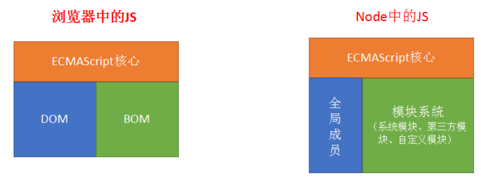
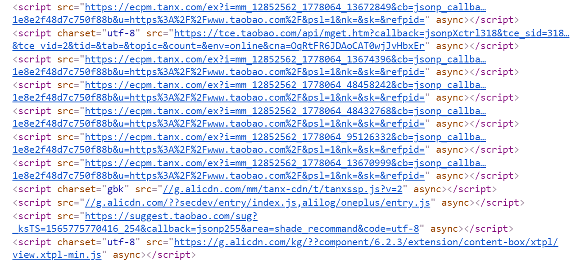

# nodejs讲义

从前端到后端；扩展前端技能栈；

## 安装并使用nodejs

### 安装nodejs

#### 下载

官网： https://Nodejs.org/en/  中文网：http://Nodejs.cn/

- 版本说明

  - **LTS**： 长期稳定版(Long Term Support))。 项目开发建议使用长期稳定版
  - **Current**： 最新版。最新版包含了一些新功能，如果想学习最新的功能，则可以使用该版本。最新版可能会有一些未知的bug。


#### 安装

1) 双击安装文件开始安装（不同系统选择对应的安装文件）

2) 傻瓜式安装，一路 'next' 即可

注意：

- 建议安装目录所使用`英文路径`

#### 测试是否安装成功

打开任意一个**小黑窗**，输入`node  -v`能够看到Nodejs版本号即为安装成功。

- cmd窗口(window+R, --->运行-->录入cmd,回车)

- powershell（window10操作系统）

  

### 在node环境下运行js代码

我们前面的学习中，js代码都是在浏览器中运行的，现在开始学习nodejs后，我们有了第二个环境中可以运行js代码。

有两种方式可以运行js代码：

- 在nodejs 提供的repl中环境
- 单独执行外部的js文件

#### 方法1：在 REPL中运行

REPL(Read Eval Print Loop:交互式解释器) 表示一个电脑的环境，类似 Window 系统的终端或 Unix/Linux shell，我们可以在终端中输入命令，并接收系统的响应。

Node 自带了交互式解释器，可以执行以下任务：

- **读取** - 读取用户输入，解析输入了Javascript 数据结构并存储在内存中。
- **执行** - 执行输入的数据结构
- **打印** - 输出结果
- **循环** - 循环操作以上步骤直到用户两次按下 **ctrl+c** 按钮退出。

具体操作：

1. 在任意控制台中输入node 并回车确定，即可进行入node自带的REPL环境。
2. 此时，你可以正常写入js代码，并执行。
3. 如果要退出，连续按下两次ctrl+c


#### 方法2：执行一个JS文件

1. 请事先准备好一个js文件。
   - 例设这的路径是：e:/index.js
   - 具体内容是

```javascript
var a = 1;
console.info(a + 2);
```

2. 打开小黑窗，进入到这个文件的目录
   - 技巧，在资源管理器中按下shift，同时点击鼠标右键，可以选择在此处打开powershell/命令行窗口。
   - cd 命令可以用来切换当前目录。
3. 接下来 通过  ` node  js文件` 的格式来执行这个js文件。

```javascript
node index.js
```

注意:

- 执行js文件时，如果当前命令行目录和js文件**不在**同一个盘符下，要先切换盘符
- 执行js文件时，如果当前命令行目录和js文件**在**同一个盘符中，则可以使用相对路径找到js文件并执行

### nodejs的helloworld程序

下面，我们来通过一个最基本的http服务器程序来见识nodejs的作用。

第一步：新建一个文件，名为  `d:/http.js`( 文件名及路径名可以自行设置，建议均不使用中文字符)

第二步：在文件中录入如下代码。

```javascript
// 引入http模块
const http = require('http');

// 创建服务
const server = http.createServer(function(req, res) {
  console.log(`来自${req.connection.remoteAddress}的客户端在${new Date().toLocaleTimeString()}访问了本服务器`);
  res.end('<h1>hello world! very good!!</h1> <p>' + req.connection.remoteAddress + '</p>');
});
// 启动服务
server.listen(8081, function() {
  console.log('服务器启动成功，请在http://localhost:8081中访问....');
});
```

第三步：在小黑窗中进入到d盘根目录，键入命令 `node http.js`

第四步：打开一个浏览器页面，输入'http://localhost:8081'，观察效果

第五步：把localhost改成你自己电脑的ip地址，再把这个路径发你的同学来访问。

- 如果不能访问，有可能你需要手动关闭你自己计算机的防火墙。

## node.js基本介绍

### node.js是什么

> Node.js® is a JavaScript runtime built on [Chrome's V8 JavaScript engine](https://v8.dev/).
>
> ------
>
> Node.js® 是一个基于 [Chrome V8 引擎](https://v8.dev/) 的 JavaScript 运行时

- Node全名是Node.js，但它不是一个js文件，而是一个**软件**
- Node.js是一个基于Chrome V8引擎的ECMAScript的运行环境，在这个环境中可以执行js代码
- Node.js提供了大量的工具（API），能够让我们完成文件读写、Web服务器创建等功能。


### nodejs和浏览器和javascript的关系

#### nodejs和浏览器的关系

相同之处：

- 都可以运行js(严格来讲是ECMAScript)代码

不同之处：



- 安装了浏览器这个软件，它不但可以执行ECMAScript，浏览器这个软件内置了window对象，所以浏览器有处理DOM和BOM的能力。
- 安装了NodeJs这个软件，它不但可以执行ECMAScript，NodeJS这个软件也内置了一些东西，包括全局成员和模块系统，同时还可以载入第三方模块来完成更强大的功能。


#### nodejs和javascript的区别？

- nodejs是一个容器（不是一个新语言），ECAMScript程序可以在这个容器中运行。
  - 不能在nodejs使用window对象，也不能在nodejs使用dom操作。因为nodejs中并不包含这个对象。
- javascript是由三个部分组成：ECAMScrtipt,Bom,Dom

### 学习Nodejs的意义

在我们熟悉的浏览器上执行JS不是很好吗？为什么要学习Nodejs呢？主要原因：

- 大前端必备技能
- 使得JS能够和操作系统 “互动” （读取文件，写入文件等，管理进程）
- 为JavaScript提供了服务端编程的能力
  - 文件IO
  - 网络IO
  - 数据库
- 了解接口开发，进一步理解Web开发，了解后端同学的工作内容


### 学习的主要内容

不是学新语法，es6就是语法；

主要是学模块及模块的使用；

## node中的模块化

在项目的开发过程中，随着功能的不断增强，代码量，文件数量也急剧增加，我们需要把一个大函数拆成小函数，把一个大文件拆成小文件，把一个大功能拆成若干个小功能。这里很自然地就涉及到模块化的想法：一个复杂的系统分成几个子系统，体现在几个小的文件在一起组成一个大的文件，集成强大的功能。


遗憾的是es5不支持模块化：就是在一个js文件内不能引入其他js文件。不能通过一个大文件去集成若干个小文件。（不是说一个html文件中不能包含多个js文件）。



这样就会带来多个问题：

1. 文件的加载先后顺序
2. 不同的文件内部定义的变量共享


### 模块化

一个js文件中可以引入其他的js文件，能使用引入的js文件的中的变量、数据，这种特性就称为模块化。使用模块化开发可以很好的解决变量、函数名冲突问题，也能灵活的解决文件依赖问题。

- 以前

  es5不支持模块化，让前端人员很为难。为了让支持模块化，我们一般会借用第三方库来实现：

  - sea.js. https://www.zhangxinxu.com/sp/seajs/
  - require.js. https://requirejs.org/

- 现在
  - es6原生语法也支持模块化（并不表示浏览器也支持模块化）
  - Nodejs内部也支持模块化（与es6的模块化有些不同之处），具体的语法在后面来介绍

### nodejs中的模块

每个模块都是一个独立的文件。每个模块都可以完成特定的功能，我们需要时就去引入它们，并调用。不需要时也不需要管它。（理解于浏览器的js中的Math对象）

nodejs模块的分类

- 核心模块
  - 就是nodejs自带的模块，在安装完nodejs之后，就可以随意使用啦。相当于学习js时使用的Array对象。
  - 全部模块的源代码 https://github.com/nodejs/node/tree/master/lib
- 自定义模块
  - 程序员自己写的模块。就相当于我们在学习js时的自定义函数。
- 第三方模块
  - 其他程序员写好的模块。nodejs生态提供了一个专门的工具npm来管理第三方模块，后面我们会专门讲到。
  - 相当于别人写好的函数或者库。例如我们前面学习的JQuery库，arttemplate等。

#### 核心模块

> 官网文档 https://nodejs.org/dist/latest-v10.x/docs/api/
>
> 中文文档 http://nodejs.cn/api/
>
> 学会查 API，远远比会几个 API 更重要

- 核心模块就是 Node 内置的模块，需要通过唯一的标识名称来进行获取。
- 每一个核心模块基本上都是暴露了一个对象，里面包含一些方法供我们使用
- 一般在加载核心模块的时候，变量（或常量）的起名最好就和核心模块的标识名同名
  - 例如：`const fs = require('fs')`

示例：用fs模块读取文件

```javascript
const fs = require('fs');
let htmlStr = fs.readFileSync( 'index.html')).toString();
console.log(htmlStr)
```

注意：require()中直接写模块的名字

- 不要加.js
- 不要加其它路径


#### 第三方模块

所谓第三方模块，顾名思义，就是别人写的模块（不是自己写的，也不是nodejs自带的）。这一点和在浏览器环境中使用使用第三方函数或者是库非常类似 。一般有两步：

1. 去官网下载js文件。
2. 在自己的html页面中引入。

以jquery为例

1. 去jquery官网中下载jquery.js文件。
2. 在html页面中使用 script link标签引入这个js文件
3. 开始使用啦

这个过程中很容易，我们也慢慢习惯了，但这种使用方式是有问题的：

- 随着引入的第三方库越来越多，你得每一个库都去他们各自的官网上下载，引入10个库，都得下载10次
- 各个库的版本号在升级更新时，你也无法准确得知。

> 阿爷无大儿，*木兰*无长兄，愿为市鞍马，从此替爷征。
> 东市买骏马，西市买鞍鞯，南市买辔头，北市买长鞭。旦*辞*爷娘去，暮宿黄河边，不闻爷娘唤女声，但闻黄河流水鸣溅溅。旦*辞*黄河去，暮至黑山头，不闻爷娘唤女声，但闻燕山胡骑鸣啾啾。

木兰词中所述的场景：木兰替父从军，要买参战装备要四处奔走。我们做个效果，要实现某个功能，要四处下载包，难到就没有一个类似于京东超市一样的地方，可以实现一站式配齐吗？

有，这个超市就是 大名鼎鼎的 `npm`。 在node中，我们通过npm来解决下载、使用、管理第三方模块的问题。

 

## fs模块

fs模块是nodejs用来进行文件操作的模块。fs是 FileSystem的简写。它属于核心模块，你引入之后就可以直接使用了。

官方手册：http://nodejs.cn/api/fs.html

使用步骤：

1. 引入模块

   ```
   // 引入模块
   const fs = require('fs');
   // 可以使用var、let，但是建议使用const，因为我们不希望它被改变。
   // 名字不必大写成FS，一般也就叫fs这个名字。
   ```

2. 调用api实现自己的要求

   ```
   fs.apiName()
   ```

   

fs模块中操作文件(或者文件夹)的方法，大多都提供了两种选择：

- 同步版本的
- 异步版本的

### 文件内容读取 - readFile

#### 异步格式

```js
fs.readFile('文件路径'[,选项], (err, data) => {
  if (err) throw err;
  console.log(data);
});
```

说明：

- 参数1：文件路径。 相对路径和绝对路径均可。
- 参数2： 配置项，它可选参数，可不写。主要用来配置字符集。一般可设置为'utf8'

​      如果不设置该参数，文件内容会以二进制形式返回。

- 参数3: 读取完成后触发的回调函数。这个回调函数在读完文件后自动被nodejs自动调用，并传入 err 和 data

  - 如读取成功

    - err: null

    - data: 文件内容，如果不设置参数2,则返回二进制数据。可以使用 toString() 方法将二进制数据

      转为正常字符串

  - 如读取失败

    - err: 错误对象
    - data: undefined

示例：

```javascript
const fs = require("fs")
fs.readFile('文件路径',"utf8", (err, data) => {
  if (err) throw err;
  console.log(data);
});
```

#### 同步格式

与异步格式不同在于：

- api的名字后面有Sync（async是异步的，sync表示同步的）
- 不是通过回调函数来获取值，而是像一个普通的函数调用一样，直接获取返回值

```javascript
const fs = require("fs")
let rs = fs.readFileSync('文件路径',"utf8");
console.log(rs)
```


### 文件写入 

#### 覆盖写入 writeFile

功能：向指定文件中写入字符串（覆盖写入）， 如果没有该文件则尝试创建该文件。它把把文件中的内容全部删除，再填入新的内容。

格式：`fs.writeFile(var1, var2, var3, var4);`

参数1: 要写入的文件路径 --- 相对路径和绝对路径均可，推荐使用绝对路径

参数2: 要写入文件的内容

参数3: 配置项，设置写入的字符集，默认utf-8

参数4: 写入完成后触发的回调函数，有一个参数 --- err （错误对象）

```javascript
const fs = require('fs')
fs.writeFile('./a.txt', 'hello world niahi \n 换一行', err => {
  if (err) {
    console.info(err)
    throw err
  }
})
```


#### 文件追加 appendFile

功能 ：向指定文件中写入字符串（追加写入）， 如果没有该文件则尝试创建该文件

格式：`fs.appendFile(var1, var2, var3, var4);`

参数1: 要写入的文件路径 --- 相对路径和绝对路径均可，推荐使用绝对路径

参数2: 要写入文件的字符串

参数3: 配置项，设置写入的字符集，默认utf-8

参数4: 写入完成后触发的回调函数，有一个参数 --- err （错误对象）

```javascript
const fs = require('fs')

fs.appendFile('./a.txt', '\n 为天地立命', err => {
  if (err) {
    console.info(err)
    throw err
  }
})
```


### 路径问题

在读取文件时，写相对路径是容易出问题的。下面我们来看会出什么问题。

假设有如下两个文件，它们所处的目录及文件名如下所示：

```
day02/js/fs.js
day02/js/text.txt
```

fs.js代码的作用是读出text.txt中的内容，并显示出来。

```
const fs = require('fs');
fs.readfilesync("./text.txt",'utf8'); 
//注意这里对text.txt的访问使用的是相对"fs.js" 本身的路径
```


现在，我们想要运行fs.js这个文件有多种方式，根据当前处在的位置不同：

- 如果终端中的路径定位在`day02/js`目录下，则通过`node fs.js`

- 如果终端中的路径定位在`day02`目录下，则通过：`node js/fs.js` 

  此时就不能正确找到文件了。

我们分析一下这个问题： 我们在fs中读取文件时，由于使用的是相对路径，所以在读这个文件的时，nodejs会去这里：`运行这个js文件的小黑窗的路径 + 代码中的相对路` 找它。而由于我们通过cd命令修改了运行这个js文件的小黑窗的路径，所以导致nodejs不能找到这个文件了。

解决方法: 就是在操作文件时，使用**绝对路径**来定位文件。

#### \__dirname __filename 获取绝对路径

绝对路径： 从磁盘根目录开始到指定文件的路径。

相对路径：是以某个文件的位置为起点，相对于这个位置来找另一个文件。

nodejs中提供了两个全局变量来获取获取绝对路径：

- __dirname：获取当前被执行的文件的文件夹所处的绝对路径
- __filename：获取当前被执行的文件的绝对路径

全局变量的含义是：

- 变量：它们的值是变化的。在不同的文件中值就不同。
- 全局：在任意地方都可以直接使用。

#### path模块

文档地址：http://nodejs.cn/api/path.html#path_path

它是也是node中的核心模块，作用是用来处理路径问题：拼接，分析，取后缀名。

 使用步骤：

1. 引入模块。`const path = require('path')`
2. 使用模块。下面是path模块中提供的几个常用的api。

- path.basename（） 

  此方法返回 `path` 的最后一部分。一般可用来获取路径中的文件名。

- path.join() ：路径拼接。

- path.parse(path) 把一个路径转成一个对象

```
// 示例
const path = require('path')
path.basename('/foo/bar/baz/asdf/quux.html');// 返回: 'quux.html'
path.basename('/foo/bar/baz/asdf/quux.html', '.html');// 返回: 'quux'
path.dirname('/foo/bar/baz/asdf/quux');// 返回: '/foo/bar/baz/asdf'
path.extname('index.html');// 返回: '.html'
```


### 附：fs模块中的常用方法

| API                                         | 作用              | 备注           |
| ------------------------------------------- | ----------------- | -------------- |
| fs.access(path, callback)                   | 判断路径是否存在  |                |
| fs.appendFile(file, data, callback)         | 向文件中追加内容  |                |
| fs.copyFile(src, callback)                  | 复制文件          |                |
| fs.mkdir(path, callback)                    | 创建目录          |                |
| fs.readDir(path, callback)                  | 读取目录列表      |                |
| fs.rename(oldPath, newPath, callback)       | 重命名文件/目录   |                |
| fs.rmdir(path, callback)                    | 删除目录          | 只能删除空目录 |
| fs.stat(path, callback)                     | 获取文件/目录信息 |                |
| fs.unlink(path, callback)                   | 删除文件          |                |
| fs.watch(filename[, options]\[, listener])  | 监视文件/目录     |                |
| fs.watchFile(filename[, options], listener) | 监视文件          |                |
| fs.existsSync(absolutePath)                 | 判断路径是否存在  |                |

### 附：path模块其它方法列表

| 方法                       | 作用                               |
| -------------------------- | ---------------------------------- |
| path.basename(path[, ext]) | 获取返回 path 的最后一部分(文件名) |
| path.dirname(path)         | 返回目录名                         |
| path.extname(path)         | 返回路径中文件的扩展名(包含.)      |
| path.format(pathObject)    | 将一个对象格式化为一个路径字符串   |
| path.join([...paths])      | 拼接路径                           |
| path.parse(path)           | 把路径字符串解析成对象的格式       |
| path.resolve([...paths])   | 基于当前**工作目录**拼接路径       |


## http模块-基本使用

http是nodejs的核心模块，它能让我们能够通过简单的代码创建一个Web服务器，处理http请求。具体来说：

1. 让其它人访问本机上的网页
2. 提供接口功能

------

### 快速搭建Web服务器

快速体验web服务器的功能：

1. 新建文件，写入如下代码。

```js
// http.js
// 引入核心模块http
const http = require('http');

// 创建服务
const server = http.createServer(function(req, res) {
  console.log(req.connection.remoteAddress);
  res.end('hello world');
});
// 启动服务
server.listen(8081, function() {
  console.log('success');
});
```

2. 运行代码。打开小黑窗，键入 `node http.js`
3. 在浏览器地址栏中输入：localhost:8081 观察效果。

说明

1. 把localhost改成本机ip地址，让同一局域网的同学访问。
2. 如果你修改了代码，必须先停止服务，然后再启动。这样才能生效。
   - 停止服务： 在小黑窗中按下ctrl+c 停止服务。
   - 重启服务：在小黑窗中运行 `node http.js`
3. 更改res.end()的内容，`重启`后，再次观察。

   - 获取ip，返回给浏览器

### 基本网络概念

#### URL

全称：Uniform Resource Locator，统一资源定位符。

作用： 定位资源(css,html,js,png, avi......)。

http://nodejs.cn/api/path.html#path_path

格式：`协议://主机地址[:端口]/路径?查询字符串#锚点`

- 协议
  - http
  - https
- 主机地址
  - IP地址 或者 域名
- 端口
  - http请求，默认端口80
  - https请求，默认端口443
  - MySQL默认端口3306
  - 访问一个网页的时候，默认端口可以省略
- 路径
  - 服务器文件夹上的资源。（html/css/images/js/接口）
- 参数（查询字符串）
  - ? 后面的部分，是键值对的形式
- 锚点
  - 网页内部的锚点链接

例如：http://itcast.cn:80/schools/students?id=18&name=zs#photo

经典用法：访问文件时传递参数。

```html
// index.html
<a href='detail.html?id=1'>新闻1</a>
<a href='detail.html?id=2'>新闻2</a>
```


```html
// detail.html
<script>
// 1. 获取id
// 2. 根据id值去获取这个新闻的详情 
</script>
```


#### IP 地址

- 全称：`I`nternet `P`rotocol Address。
- 作用：标识一个网络设备（计算机、手机、电视）在**某一个具体的网络**当中的地址。我们通过地址去找到对应的资源。
- 分类：ipV4,ipV6 (<http://www.gov.cn/xinwen/2018-09/03/content_5318951.htm>)
- 格式：`[0-255].[0-255].[0-255].[0-255]` 即为四个 0-255 的数字组成（以ip4为例）。在同一个网络中，计算机的IP是不允许相同的，都是唯一的。`220.181.38.149` 
- 127.0.0.1 特指本机ip地址。

`外网IP 和 内网IP`

举例：北京市顺义区京顺路99号，这个就是`外网IP`，用于表示学校在外部世界的地址。我们教学楼在学校里面的 8楼808室 , 这个就是`内网IP`。

外网ip地址是有限的，也没有必要人人有一个，我们可以通过路由器来分成内网。我们一般提到的IP地址是指外网IP地址。

`三个常用的命令`

打开小黑窗，输入如下三个命令，就可以看到效果。

- ping www.baidu.com
  - 作用: 查看本机与指定地址是否连通
- tracert www.baidu.com
  - 跟踪路由过程
- ipconfig 查看本机ip设置

#### 域名

全称： Domain Name。

作用：它是ip地址的别名，比ip地址好记忆，作用与ip地址一样用来标记一台计算机。由于 IP 地址都是没有规律的一些数字组成的，很难被人记住，不利于广泛传播，所以就有人想出来要给 IP 起名字（别名）。

> 360.com 2015年 1700万美元

**tip:抢注域名也可以发大财**

域名有关的参考：

- (现在投资域名还有机会吗)[http://www.360doc.com/content/18/0909/16/32351304_785169851.shtml]
- 爱名网。<https://www.22.cn/> 一个域名交易网站

顶级域名

- .com: 商业机构 最常见的。
- .cn: 中国国家、地区域名 .hk,
- .gov: 政府网站。 北京政府官网：  <http://www.beijing.gov.cn/>
- .edu: 教育网站。北京大学官网：  <https://www.pku.edu.cn/>
- .net: 网络服务商。 

特殊的域名 

`localhost` 含义为本地主机，对应127.0.0.1 。这是一个保留域名，主要用于本地测试。

#### DNS

DNS: Domain Name System  域名系统。

作用：在DNS服务器中保存了域名和IP的映射关系。主要工作是将域名转换为IP地址，因为我们通过浏览器访问网站时，实际上是去找对应的IP地址。

| 域名      | IP            |
| --------- | ------------- |
| baidu.com | 61.135.169.12 |
| baidu.com | 202.22.35.66  |
| sina.com  | 45.22.45.45   |

通过宽带运营商提供的服务器解析一个域名背后对应的 IP，这个过程叫做 **DNS 寻址**，帮你完成 DNS 寻址过程的服务器叫做 **DNS 服务器**。

通俗的讲：DNS服务器能够通过你输入的域名返回该域名对应的IP。然后我们通过IP去访问网络上的资源。

- 查看和设置本机DNS：

通过`控制面板\网络和 Internet\网络和共享中心 > 查看活动网络 > 详细`

一般使用默认设置，也可以自己去设置自己指定的DNS服务器的ip；

#### 端口

一个IP地址的端口可以有65536个，范围是从[0，65535]） 。 不同的端口被不同的软件占用，以提供不同的服务。 一台主机可以通过安装多个服务器端软件来提供服务，比如[Web服务](https://baike.baidu.com/item/Web服务)、FTP服务、SMTP服务等。显然，通过ip地址是无法区分不同的服务的。`这里就需要用到 “IP地址+端口号”来区分不同的服务`。

- 如果理解IP地址（一台服务器）是一栋大商场，端口就是商场中的商铺的编号。
- 如果理解IP地址（一台服务器）是公司的前台电话，端口就是公司中各个部门的分机号。

默认的端口

- `http` 默认的端口 `80` 。访问http网站时，可以省略80。（http://www.php.cn）
- `https` 默认的端口是 `443`。访问https网站时，可以省略443。
- `mysql` 默认端口是`3306`


网络的三个要素：

- ip:确定服务器的位置。
- 端口：确定服务的软件。
- 协议：通过什么规则来提供服务。

#### 访问网站时请求响应流程(掌握)

我们在浏览器输入一个网址后，按下回车，最后看到一个页面，这个过程是怎样的？

三步：

1. 寻址。 确定服务器的ip地址。
2. 建立连接。tcp/ip协议建立连接。
3. 发http请求/响应http请求。


1. 用户打开浏览器，在地址栏输入我们需要访问的网站网址（`URL`）
2. DNS 寻址。把URL中的域名换成IP地址
   - 检测`浏览器DNS缓存`，看是否有域名和IP的对应关系，有直接用，没有下一步；
   - 检查`本机hosts 文件`，看是否有域名和IP的对应关系，有直接用，没有下一步；
   - 浏览器通过  `DNS 服务器` 获取即将访问的网站  `IP 地址`
3. 建立连接。客户端和目标服务器进行tcp的三次握手，建立连接
   	
   

客户端在向服务器发http请求之前，会先向服务器发送TCP请求，过程可以理解为：

- 客户端：hello，你在吗?

- 服务器：嗯，我在

- 客户端：好的，我知道了

  此过程又称之为客户端和服务器三次握手。
  	

4. 3次握手成功后,使用http协议发送请求数据发起一个对这个 IP地址的 `请求`
5. 服务端监听指定的 `端口` 的服务器软件接收到这个请求，**进行相应的处理**
6. 服务端将处理完的结果返回给客户端浏览器（`响应`）
7. 浏览器根据自己的渲染功能，将服务端返回的结果呈现到页面上。

#### C/S 与 B/S(了解)

应用软件架构一般分为两类：

- B/S 架构：Browser（浏览器） ←→ Server（服务器），这种软件都是通过浏览器访问一个网站使用，服务器提供数据存储等服务。 `12306网站`
- C/S 架构：Client（客户端） ←→ Server（服务器），这种软件通过安装一个软件到电脑，然后使用，服务器提供数据存储等服务。`12306app`

优缺点

- b/s架构
  - 优点：  用户无感知升级；用户无需安装软件；
  - 缺点：没有独立入口；
- c/s架构
  - 优点：可以调用系统api；功能更加强大；
  - 缺点：成本高

#### 静态网站和动态网站


静态网站

- web服务器将**网页文件(纯文本)原封不动的返回给浏览器**
- **无法满足让网页内容动起来（随着数据动态变化）的需求**

动态网站

- 不再将 HTML 固定写死，每次用户请求时，动态执行一段代码，临时生成一个用户想要的 HTML 页面。
- **动态网站指的也就是每次请求时服务端动态生成 HTML 返回给用户。**
- 实现动态网站的技术有很多，例如：JSP、ASP.NET、PHP、**Node.js**、go、python 等等。

### 理解http请求与响应

在上面的代码中，我们通过http.createServer方法创建一个http服务。

```javascript
// 创建服务
const server = http.createServer((req, res) => {
  console.log(req.connection.remoteAddress);
  res.end('hello world');
});
```

其中的参数是一个匿名的回调函数：当有人发http请求进来时，它会自动被调用。发一次请求，它就被调用一次。

这个回调函数有它有两个参数，这是我们要重点学习的。

- 第一个参数表示`来自客户端浏览器的请求`，第二个参数用来`设置对本次请求的响应`。它们的形参名并不重要，但是一般约定第一个参数名用req或者request表示，第二个参数名用使用res或者response表示。

- 当某个客户端来请求这个服务器时，这个函数会自动调用，同时会自动给这两个参数赋值。第一个参数中包括本次请求的信息。
  - req：请求对象。其中有很多的属性，例如：
    - req.url。客户端浏览器本次请求的地址
    - req.method。   获取请求行中的请求方法
    - req.headers。    获取请求头
  
- 第二个参数用来设置本服务器对这次请求的处理。

  - 这个参数一般命名是res或者response，它是一个对象，其中有很多方法和属性。

  - res.end() 

    - 设置响应体。把把本次的处理结果返回给客户端浏览器
    - 如果不写这一句，则客户端浏览器`永远收不到响应`。

  - res.setHeader()  设置响应头，比如设置响应体的编码

    `res.setHeader('content-type', 'text/html;charset=utf-8');`

  - res.statusCode 设置状态码
  
     `res.statusCode=500`

### 根据不同 url 地址处理不同请求

前面已经可以对浏览器的请求做出响应了，但是响应的内容总是一样的。能不能根据url的不同，做出合适的响应呢？当然可以，那么首先就需要知道浏览器请求的url是什么。

涉及到和请求相关的信息，都是通过请求响应处理函数的第一个参数完成的。代码示例

```javascript
// http.js
// 引入核心模块http
const http = require('http');

// 创建服务
const server = http.createServer(function(req, res) {
  if(req.url === "/a.html"){
      res.setHeader('content-type', 'text/html;charset=utf-8');
      // 读出文件内容
      // 通过res.end()返回
  }
  else if(req.url === "/b.html"){
      
  }
    else{
        res.end("");
    }
});
// 启动服务
server.listen(8081, function() {
  console.log('success');
});
```


## 使用 nodemon来自动重启http服务【自行练习】

我们每次修改了代码，要想代码生效都需要重启http服务器:

1. 进入小黑窗
2. 按下ctrl+c，停止已有http服务器。
3. 手动运行：node index.js 来重启服务器。

这会很麻烦。

有没有一个工具会`自动检测到我们的修改并自动重新运行我们的代码`呢？

有，它叫nodemon。https://www.npmjs.com/package/nodemon

### 安装 nodemon

通过npm包管理工具来进行安装。任意打开一个小黑窗，输入如下命令

```bash
npm install -g nodemon
```

此操作`需要联网`，根据网络速度所耗时间不同。

- npm是一个工具。用来管理node代码中要使用的第三方模块。它是随着node的安装而自动安装的：如果你安装node，则npm也已经安装过了，你可以直接使用。

  

### 使用nodemon

等待安装成功之后，使用方法也非常简单：在命令中，`使用nodemon来代替node`。

例如，

```bash
node server.js  // 
// 改成 nodemon server.js
nodemon server.js
```

它的好处在于会自动监听server.js这个文件的变化，如果变化了，就会重新自动再去运行。相当于是：

```bash
while(server.js 变化了){
  node server.js
}
```

说明：

- 它是一个第三方的包（其它程序员写的工具）
- 我们这里是通过全局安装的方式进行。

## http模块-处理静态资源

静态资源指的是html文件中链接的外部资源，如css、js、image文件等等。

### 处理二次请求

从服务器获取html文件之后，如果这个html文件中还引用了其它的外部资源（图片，样式文件等），则浏览器会重新再发请求。

假设在index.html中还引入了 style.css 1.png 或者 .js文件，则：

浏览器请求localhost:8080/index.html之后，得到的从服务器反馈的内容，在解析的过程中还发现有外部的资源，所以浏览器会再次发出第二次（第三次,第四次.....）请求，再去请求相应的资源。

一个最朴素的想法是根据不同的请求来返回不同的文件。

```javascript
const http = require('http');
const fs = require('fs');
const path = require('path');

//创建服务器
const app = http.createServer((req, res) => {

  if (req.url === '/index.html') {
    let htmlString = fs.readFileSync(path.join(__dirname, 'index.html'));
    res.end(htmlString);
  }
  else if (req.url === '/style.css') {
    let cssString = fs.readFileSync(path.join(__dirname, 'style.css'));
    res.setHeader('content-type', 'text/css');
    res.end(cssString);
  } else if (req.url === '/1.png') {
    let pngString = fs.readFileSync(path.join(__dirname, '/1.png'));
    res.end(pngString);
  } else {
    res.setHeader('content-type', 'text/html;charset=utf-8');
    res.statusCode = 404;
    res.end('<h2>可惜了, 找不到你要的资源' + req.url + '</h2>');
  }
}); 
//启动服务器，监听8082端口
app.listen(8082, () => {
  console.log('8082端口启动');
});
```

### 为不同的文件类型设置不同的 Content-Type

通过使用res对象中的setHeader方法，我们可以设置content-type这个响应头。这个响应头的作用是告诉浏览器，本次响应的内容是什么格式的内容。以方便浏览器进行处理。

常见的几中文件类型及content-type如下。

- .html：` res.setHeader('content-type', 'text/html;charset=utf-8') `
- .css：`res.setHeader('content-type', 'text/css;charset=utf-8')`
- .js：`res.setHeader('content-type', 'application/javascript') `
- .png：`res.setHeader('content-type', 'image/png')`

其它类型，参考这里：https://developer.mozilla.org/en-US/docs/Web/HTTP/Basics_of_HTTP/MIME_types

### 批量处理请求

由于我们无法事先得知一个.html文件中会引用多少个静态资源，所以，我们不能像处理某个页面一样去处理它们。我们的解决办法有两大类是：

1. 把这类静态资源连同所有的.html文件全放在某个特定的文件夹中。在用户请求时，当判断当前的req.url是否在这个文件夹下就是直接读内容，并返回。
2. 根据请求资源的后缀名来判断。

```javascript
01-server.js
const http = require('http');
const path = require('path');
const fs = require('fs');

const server = http.createServer((req, res) => {
  let extName = path.extname(req.url);
  console.log(req.url, extName);
  // 思路：
  // 1. 根据req.url拼接真正的地址
  //  req.url ===> /index.html
  //  真正的地址：  /static/index.html
  // 2. 读出内容，设置响应体
  let filePath = path.join(__dirname, 'static', req.url);
  fs.readFile(filePath, (err, data) => {
    if (err) {
      res.statusCode = 404;
      res.setHeader('content-type', 'text/html;charset=utf8');
      res.end('没有你要的资源');
    } else {
      // 根据后缀名，设置content-type
      if (extName === '.css') {
        res.setHeader('content-type', 'text/css;charset=utf8');
      }
      res.end(data);
    }
  });
});
server.listen(8084, () => {
  console.log('8084');
});
```


## http模块-实现接口功能

在前面学习ajax时，我们说接口是后端同学写好的，我们前端同学只需要调用即可。现在，我们学习了nodejs，我们就可以客串一把后端同学的角色，来试着写写接口了。


### 接口与静态资源的区别


在web服务器上放置有很多的资源，每个资源都有自己的url，客户端浏览器想要访问某个资源就要向服务器发起对应的请求。

资源的分类：

- 静态资源。
  - 它们一般表现为一个一个的文件。例如index.html, style.css, index.js。
  - 服务器处理这类请求时，一般就直接读出资源的内容，并返回给客户端浏览器
- 动态资源：接口
  - 它们不是以某个具体的文件存在的，而是服务器上的一段代码，客户端浏览器访问接口时，服务器会执行这段代码，然后把代码的执行结果返回给客户端浏览器。

目前学习过的向web服务器请求某个资源有如下途径：

- **在地址栏中直接访问这个url**
- 通过某个a标签进行进行跳转
- 通过表单进行提交
- **通过ajax技术访问这个url。**

发送请求有很多类型：

- get
  - 在地址栏中直接访问这个url就是get方式
- post
  - 通过表单提交，可以设置form的method为post
- delete
- put

### get类型的接口-无参数

现在假设我们自己就是一名后端程序员，现在要实现一个get类型的接口。具体要求如下：

地址：/gettime

功能：以json字符串格式返回服务器的时间戳。

示例：

```
输入:localhost:8080/gettime;
返回:{_t:1563265441778}
```

要求：使用postman软件进行测试。

参考代码：

```javascript
const http = require('http');
const app = http.createServer((req, res) => {
  if (req.url === '/gettime') {
    let obj = {_t : Date.now()}
    res.end(JSON.stringify(obj));//  把对象转成字符串之后再返回
  } else {
    res.end('error');
  }
});
app.listen(8083, () => {
  console.log(8083);
});
```

说明：

- req.method 可以判断请求的类型
- req.url中的内容还需要进行处理
  - req.url中的内容是用户在浏览器地址栏中输入的url中 去掉 域名及锚点链接之后的部分。

### nodejs中的url模块

作用:url模块用来对url（例如：http://itcast.cn:80/schools/students?id=18&name=zs#photo）进行解析，进而得到更加详情的各种信息。

手册地址：http://nodejs.cn/api/url.html

步骤：

- 引入

  `const url = require('url');`

- 使用它的方法
  
  - obj = url.parse(地址栏中输入的url)
  
  > ```
  > let urlobj = url.parse(req.url); // urlobj对象中，就有我们需要的信息
  > urlobj.pathname :获取用户输入的url的路径名 ('/schools/students')
  > urlobj.search: '?id=18&name=zs',
  >   urlobj.query: 获取用户输入的url中的查询字符串( 'id=18&name=zs' )
  >   urlobj.path: '/schools/students?id=18&name=zs',
  >   urlobj.href: '/schools/students?id=18&name=zs' 
  >   ```

上面urlobj.query只是获得了传递的全部参数，我们一般还需从地址栏中分析传递的数据。即从 `http://itcast.cn:80/schools/students?id=18&name=zs#phot`中分析出id和name的值来。这个操作是如何实现的呢？

### nodejs中的querystring模块

用来对url中的查询字符串这部分进行处理。nodejs中提供了querystring这个核心模块来帮助我们处理这个需求。

地址：https://nodejs.org/api/querystring.html#querystring_querystring_parse_str_sep_eq_options

#### 基本示例

```javascript
const qs= require('querystring');
let obj = qs.parse('id=18&name=zs');
console.log(obj)
```


### get类型的接口-带参数

现在假设我们自己就是一名后端程序员，现在要实现一个get类型的接口。具体要求如下：

> 地址：localhost:8080/get
>
> 功能：获取用户传入的参数，并以json字符串格式返回，在返回的信息中要加上时间戳.
>
> 示例：
>
> ```
> 1.不加参数
> 输入:localhost:8080/get;
> 返回:{_t:1563265441778}
> 2.带参数
> 输入:localhost:8080/get?name=filex&age=30;
> 返回:{name:filex,age:30,_t:1563265441778}
> ```
>
> 要求：能通过postman软件的测试。


分析：get请求的参数附加在url中，我们可以使用url模块来取出用户url中的参数部分，再使用querystring模块取出具体的参数值。


这里我们直接使用两个核心模块`url`和`querystring`来实现上述的需求。

```javascript
const http = require('http');
const queryString = require('querystring');
const url = require('url');

const server = http.createServer(function(req, res) {
  var { pathname, query } = url.parse(req.url);
  var obj = queryString.parse(query);

  console.log(p, url.parse(req.url));
  if (pathname === '/gettime' && req.method === 'GET') {
    res.setHeader('content-type', 'application/json');
    obj.d: Date.now() };
    res.end(JSON.stringify(str));
  } else {
    res.setHeader('content-type', 'text/html;charset=utf-8');
    res.end('大家好');
  }
});
server.listen(8088, function() {
  console.log('success', 8088);
});
```

### post接口

假设我们自己就是一名后端程序员，现在要实现一个post类型的接口。具体要求如下：

> 地址：/post
>
> 功能：获取用户传入的参数，并以json字符串格式返回，在返回的信息中要加上时间戳.
>
> 示例：
>
> ```
> 接口地址:localhost:8080/post
> 参数：name=filex&age=30;
> 返回:{name:filex,age:30,_t:1563265441778}
> ```
>
> 要求：通过postman软件的测试。


post类型与get类型的接口区别较大，主要在两个方面：

1. 类型不同

   对于类型不同还比较好判断，我们可以通过 req.method 来获取

2. 传参不同
   - get请求参数在请求行中（附加在url后面）
   - post请求参数在`请求体`中

对于获取post参数就相对复杂一些，主要是用到request对象的两个事件data,end。

基本流程是：

1. 在req对象上添加两个事件，用来收集参数
   1. req.on("data",function(chunk){ })
   
      每次收到一部分数据就会触发一次这个事件，回调函数也会相应的执行一次。其中的chunk是一个形参（你也可以换个参数名），它是一个buffer。
   
   2. req.on("end",function(){})
2. 解析参数
   
   1. queryString

```javascript
const http = require('http');
const url = require('url');
const queryString = require('querystring');
const server = http.createServer(function(req, res) {
  var { pathname } = url.parse(req.url);
  if (pathname === '/post' && req.method === 'POST') {
    let data = '';
    req.on('data', chunk => {
      data += chunk;
    });
    req.on('end', () => {
      res.setHeader('content-type', 'application/json');
      var str = { ...queryString.parse(data), d: Date.now() };
      res.end(JSON.stringify(str));
    });
  } else {
    res.setHeader('content-type', 'text/html;charset=utf-8');
    res.end('大家好');
  }
});

server.listen(8088, function() {
  console.log('success', 8088);
});
```

在发post请求时，传递的数据会在请求体中，它也是字符串格式，并且是一点一点上传到web服务器的（是积小成多，而不是一蹴而就）每上传一部分就会触发data事件，而最后全部上传完成之后，会触发end事件。

下面是一个示例代码，用来模拟使用post请求发送大量的数据，以观察req.on('data', chunk => {})多次触发的现象。

```javascript
var xhr =new XMLHttpRequest();
xhr.open('post','http://localhost:8080/post');
xhr.setRequestHeader('content-type','application/x-www-form-urlencoded');
xhr.send("name="+"imissyou".repeat(100000));
```


## 留言板案例

我们在前面学习ajax时，学习了如何去实现一个留言板，当时，我们是通过ajax调用现有的接口来实现的，现在我们采用全服务器端的思想来实现。


### 整体目录结构

```
|msg
|--server.js    主程序
|--db.json      以json字符串格式保存留言信息
|--/public/message.html 页面
|--/public/assets/bootstrap.css
```


### 实现一个静态web服务器

1. 新建一个文件夹，命名为msg
2. 将使用到的html文件、css文件、图片文件、js文件等复制到准备好的文件夹msg下的public中
3. 将模拟数据db.json文件复制到msg中
4. 在msg文件夹中，创建server.js，搭建Web服务环境

### 实现留言列表

- 当输入地址`localhost:8008/message.html`，回车，会向服务器发送一次GET请求
- 服务器接收到请求，要给浏览器返回它要的数据
  - 读出message.html中的内容
  - 取出db.json中的数据，拼接成htmlstr

### 实现添加留言功能

1. 给表单设置action和method属性
2. 添加post接口, 用于处理action
   1. 获取用户提交的数据
   2. 写入到message.json中
      1. 先读出来
      2. 转成数组
      3. 使用数组push，来追加
      4. 转成字符串，写回去

- 点击界面中的“添加”时，向服务器发送请求，并提交数据给服务器，注意设置表单的action和method
- 服务器接收到请求，完成数据添加，并作出响应，告知浏览器添加成功与否


参考代码

```
// 1、让用户能够通过localhost:8080/public/message.html来访问
const http = require('http');
const fs = require('fs');
const path = require('path');
const url = require('url');
const qs = require('querystring');

// 全局变量，表示db.json的绝对路径
const MESSAGE_PATH = path.join(__dirname, 'db.json');
http
  .createServer((req, res) => {
    //获取用户的req.url，判读是否以/public/开头
    let { pathname } = url.parse(req.url);
    console.log(pathname, req.method);
    if (req.method === 'GET') {
      let filepath = path.join(__dirname, 'public', pathname);
      fs.readFile(filepath, function(err, data) {
        if (err) {
          console.log(err);
          res.statusCode = 404;
          res.end('服务器错误');
        } else {
          if (pathname === '/message.html') {
            // 1. 读出之前的全部留言信息，转成一个数组

            let msgStr = fs.readFileSync(MESSAGE_PATH, 'utf8');
            let msgList = JSON.parse(msgStr);

            // 2. 组装成指定格式的留言字符串
            // 使用模板字符串
            let msgListStr = '';
            msgList.forEach(item => {
              let itemStr = `<li class="media">
             
             <div class="media-body">
               <h4>${item.name}</h4>
               <p>${item.content}</p>
               <p>${item.dt}</p>
             </div>
           </li>`;
              msgListStr += itemStr;
            });
            console.log(msgListStr);
            // 3. 替换message.html中预留的占位符：把真正的留言换进去
            // 3.1 读出message.html的内容

            // 3.2 替换
            messageHtmlStr = data.toString().replace('明天看电影', msgListStr);
            console.log(messageHtmlStr);
            // 4. 返回
            res.end(messageHtmlStr);
          } else {
            res.end(data);
          }
        }
      });
    } else if (pathname === '/addMsg' && req.method === 'POST') {
      // 添加留言
      //1.取出post传递的参数
      let paramStr = '';
      req.on('data', rs => {
        paramStr += rs;
      });
      req.on('end', () => {
        let paramObj = qs.parse(paramStr);
        console.log(paramObj);
        let { name, content } = paramObj;
        //2.把数据保存在db.json中
        // 2.1读出数据，转成数组
        let msgStr = fs.readFileSync(MESSAGE_PATH, 'utf8');
        let msgList = JSON.parse(msgStr);
        // 2.2向数组的头部，添加一个对象（本条留言信息）
        // 新留言的内容在最上面
        msgList.unshift({
          name,
          content,
          dt: Date.now()
        });
        // 2.3把数组转回字符串
        let msgListStr = JSON.stringify(msgList);
        console.log(msgListStr);
        // 2.4 写回 db.json
        fs.writeFileSync(MESSAGE_PATH, msgListStr);
      });
      res.setHeader('content-type', 'text/html;charset=utf8');
      res.end('添加成功 <a href="./message.html">这里返回</a>');
    }
  })
  .listen(8080, () => {
    console.log('8080');
  });
```


## 自定义模块

我们自己写的模块就是自定义模块。在nodejs中 ，我们对代码的封装是以模块（一个一个的文件）为单位进行的。一般的做法是实现好某一个功能之后，封装成一个模块，然后在其它文件中使用这个模块。


### 基本步骤

1.定义模块

新建一个js文件，用模块名给它命名。例如，你的模块叫myModule，则这个js文件最好叫myModule.js

2.导出模块

在myModule.js内部，我们定义一些函数，变量，它们会根据我们的业务要求做一些不同的工作。最后根据情况导出这些函数，变量。

```javascript
//myModule.js
const myPI = 3;
function add(a, b) {
  return a + b;
}
// 通过module.exports来导出
module.exports = {
  myPI,
  add
};
```

注意：

- module.exports 是固定写法，一般放在文件的最末尾，也只用一次。
- modules.exports表示当前模块要暴露给其它模块的功能。你当然不必须要所有在模块中定义的函数都暴露出来。

3.引入模块

在你需要使用模块的文件中，使用require语句引入你定义好的模块，注使用相对路径。假设我们当前的文件是index.js，而我们希望在index.js文件中使用myModule.js中的add方法。

我们的做法是：

```javascript
// index.js
const myMath = require('./myMath');
```

上面的require()就是用来引入模块的。这里要注意使用自定义模块时，使用相对路径，而使用核心模块时，不需要写路径。

4.使用模块

当一个模块被成功引入之后，就可以按使用核心模块的过程一样去使用它们了。

```javascript
// index.js
const myMath = require('./myMath');

// 在使用之前请先打印出来看看。
console.log(myMath);

let rs = myMath.add(23,45);
console.log(rs)
```


### 导出模块的两种方式

在自定义模块过程中，有两种导出模块的内容的方式：

- exports
- module.exports

参考：https://nodejs.org/api/modules.html#modules_exports_shortcut

它们的关系是：  exports是module.exports的别名，即：

```javascript
exports === module.exports
```

所以下面两种写法的效果是一样的：

> ```
> //1 mymodule.js
> exports.f = function(){ }
> exports.pi = 3.1415926
> ```
>
> ```
> //2 mymodule.js
> module.exports.f = function(){ }
> module.exports.pi = 3.1415926
> ```


区别在于：

- 在引入某模块时，以该模块中module.exports指向的内容为准。
- 在定义模块时：
  - 在初始时，exports和module.exports是指向同一块内存区域，其内容都是一个空对象。
  - 如果直接给exports对象赋值（例如：exports={a:1,b:2}），此时，exports就不会再指向module.exports，而转而指向这个新对象，此时，exports与module.exports不是同一个对象。而在引入模块时，是以模块的中的module.exports为准，因此，此时写在exports上的对象是无法导出的。
- 在导出模块过程中，建议只用一种方式（建议直接使用module.exports）。


### 通过自定义模块对留言板案例进行改造

