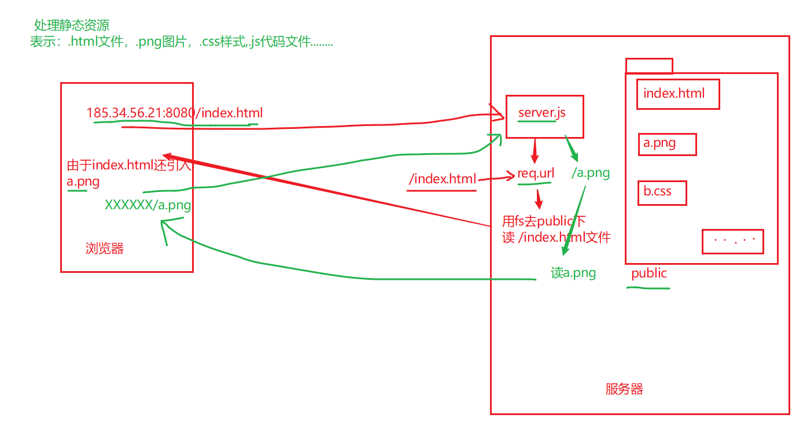

| 姓名 | 意见或建议                                                   |
| ---- | ------------------------------------------------------------ |
| ***  | 从url字符串中解析出参询的数据,以对象格式返回。 这个不会了    |
| ***  | 对于req.url === /a.png 有些迷。因为看到有时候不写这个判断也可以读出文件..难道浏览器已经帮忙做了么？？ |
| ***  | 抽象                                                         |
| ***  | 总是学不会                                                   |
| ***  | let url = 'http://itcast.cn:80/schools/students?id=18&name=zs#phot'; 麻烦凡哥讲一下这道题 |
| ***  | 凡哥, 1.能说一下读文件在什么情况下不用加'utf8'吗? 2.能说一下什么时候加响应头吗?品优购案例没有给图片设置响应头 。 utf8是用来对`文本内容`进行编码设置。如果读的是图片就不用设置了。 如果读的是全英文，也不用设置。 fs.readFile('文件的路径‘，'utf8' ,(err,data)=>{ })  ；`content-type` |
| ***  | 能够统一处理静态思`资`源？ C.有点模糊                        |
| ***  | 发现一个很奇怪的问题，服务器打开之后访问找不到的资源应该在console窗口有一个报错（数次快速截图后发现报错为： GET http://localhost:8080/ 404 （Not Found） localhost/:1），但是我写的代码虽然有报错，但是只有刷新的那一瞬间闪了一下这个报错就消失了。我的代码******//引入http模块 const http = require('http'); const fs = require('fs'); const path = require('path'); // 创建服务器 const server = http.createServer(function (req, res) { console.log('该网站被访问了'); console.log(req.url); let filePath = path.join(__dirname, 'static', req.url); // res.end('ok'); fs.readFile(filePath, function (err, data) { if (err) { console.log(err); res.statusCode = 404; res.setHeader('content-type','text/html;charset=utf8'); res.end('404: 请求资源找不到'); } else { switch (path.extname) { case '.html': res.setHeader('content-type', 'text/html;charset=uft8'); break; case '.css': res.setHeader('content-type', 'text/css;charset=utf8'); break; case '.js': res.setHeader('content-type', 'application/javascript'); break; case '.png': res.setHeader('content-type', 'image/png'); default: break; } console.log(data); res.end(data); } }) }) // 开启服务器 server.listen(8080, function () { console.log('服务器已启动！'); })************** |
| ***  | 当统一访问的时候，index.html里所有的引用的外部链接是怎么去访问的？ |
| ***  | 在终端中开启服务的时候特别的慢，是为什么啊？                 |
| ***  | 感觉这几天学的还可以，不错！                                 |
| ***  | 凡哥，我想问下您的那个自动补全分号用的是什么插件啊？？       |
| ***  | 老师function(err,data)中err,data两个参数是固定写法么？例如：arr ，dada 。 fs.readFile() `位置是固定；名字是可以改的。` |
| ***  | 老师能把笔记的名称按照内容写的更详细一些吗，所有的都叫笔记，找起知识点和代码来有些困难 |
| ***  | 想要之前练习题的答案～                                       |

