nodejs讲义

从前端到后端；扩展前端技能栈；

## 安装并使用nodejs

### 安装nodejs

#### 下载

官网： https://Nodejs.org/en/  中文网：http://Nodejs.cn/

- 版本说明

  - **LTS**： 长期稳定版(Long Term Support))。 项目开发建议使用长期稳定版
  - **Current**： 最新版。最新版包含了一些新功能，如果想学习最新的功能，则可以使用该版本。最新版可能会有一些未知的bug。


#### 安装

1) 双击安装文件开始安装（不同系统选择对应的安装文件）

2) 傻瓜式安装，一路 'next' 即可

注意：

- 建议安装目录所使用`英文路径`

#### 测试是否安装成功

打开任意一个**小黑窗**，输入`node  -v`能够看到Nodejs版本号即为安装成功。

- cmd窗口(window+R, --->运行-->录入cmd,回车)

- powershell（window10操作系统）

  

### 在node环境下运行js代码

我们前面的学习中，js代码都是在浏览器中运行的，现在开始学习nodejs后，我们有了第二个环境中可以运行js代码。

有两种方式可以运行js代码：

- 在nodejs 提供的repl中环境
- 单独执行外部的js文件

#### 方法1：在 REPL中运行

REPL(Read Eval Print Loop:交互式解释器) 表示一个电脑的环境，类似 Window 系统的终端或 Unix/Linux shell，我们可以在终端中输入命令，并接收系统的响应。

Node 自带了交互式解释器，可以执行以下任务：

- **读取** - 读取用户输入，解析输入了Javascript 数据结构并存储在内存中。
- **执行** - 执行输入的数据结构
- **打印** - 输出结果
- **循环** - 循环操作以上步骤直到用户两次按下 **ctrl+c** 按钮退出。

具体操作：

1. 在任意控制台中输入node 并回车确定，即可进行入node自带的REPL环境。
2. 此时，你可以正常写入js代码，并执行。
3. 如果要退出，连续按下两次ctrl+c


#### 方法2：执行一个JS文件

1. 请事先准备好一个js文件。
   - 例设这的路径是：e:/index.js
   - 具体内容是

```javascript
var a = 1;
console.info(a + 2);
```

2. 打开小黑窗，进入到这个文件的目录
   - 技巧，在资源管理器中按下shift，同时点击鼠标右键，可以选择在此处打开powershell/命令行窗口。
   - cd 命令可以用来切换当前目录。
3. 接下来 通过  ` node  js文件` 的格式来执行这个js文件。

```javascript
node index.js
```

注意:

- 执行js文件时，如果当前命令行目录和js文件**不在**同一个盘符下，要先切换盘符
- 执行js文件时，如果当前命令行目录和js文件**在**同一个盘符中，则可以使用相对路径找到js文件并执行

### nodejs的helloworld程序

下面，我们来通过一个最基本的http服务器程序来见识nodejs的作用。

第一步：新建一个文件，名为  `d:/http.js`( 文件名及路径名可以自行设置，建议均不使用中文字符)

第二步：在文件中录入如下代码。

```javascript
// 引入http模块
const http = require('http');

// 创建服务
const server = http.createServer(function(req, res) {
  console.log(`来自${req.connection.remoteAddress}的客户端在${new Date().toLocaleTimeString()}访问了本服务器`);
  res.end('<h1>hello world! very good!!</h1> <p>' + req.connection.remoteAddress + '</p>');
});
// 启动服务
server.listen(8081, function() {
  console.log('服务器启动成功，请在http://localhost:8081中访问....');
});
```

第三步：在小黑窗中进入到d盘根目录，键入命令 `node http.js`

第四步：打开一个浏览器页面，输入'http://localhost:8081'，观察效果

第五步：把localhost改成你自己电脑的ip地址，再把这个路径发你的同学来访问。

- 如果不能访问，有可能你需要手动关闭你自己计算机的防火墙。

## node.js基本介绍

### node.js是什么

> Node.js® is a JavaScript runtime built on [Chrome's V8 JavaScript engine](https://v8.dev/).
>
> ------
>
> Node.js® 是一个基于 [Chrome V8 引擎](https://v8.dev/) 的 JavaScript 运行时

- Node全名是Node.js，但它不是一个js文件，而是一个**软件**
- Node.js是一个基于Chrome V8引擎的ECMAScript的运行环境，在这个环境中可以执行js代码
- Node.js提供了大量的工具（API），能够让我们完成文件读写、Web服务器创建等功能。


### nodejs和浏览器和javascript的关系

#### nodejs和浏览器的关系

相同之处：

- 都可以运行js(严格来讲是ECMAScript)代码

不同之处：


- 安装了浏览器这个软件，它不但可以执行ECMAScript，浏览器这个软件内置了window对象，所以浏览器有处理DOM和BOM的能力。
- 安装了NodeJs这个软件，它不但可以执行ECMAScript，NodeJS这个软件也内置了一些东西，包括全局成员和模块系统，同时还可以载入第三方模块来完成更强大的功能。


#### nodejs和javascript的区别？

- nodejs是一个容器（不是一个新语言），ECAMScript程序可以在这个容器中运行。
  - 不能在nodejs使用window对象，也不能在nodejs使用dom操作。因为nodejs中并不包含这个对象。
- javascript是由三个部分组成：ECAMScrtipt,Bom,Dom

### 学习Nodejs的意义

在我们熟悉的浏览器上执行JS不是很好吗？为什么要学习Nodejs呢？主要原因：

- 大前端必备技能
- 使得JS能够和操作系统 “互动” （读取文件，写入文件等，管理进程）
- 为JavaScript提供了服务端编程的能力
  - 文件IO
  - 网络IO
  - 数据库
- 了解接口开发，进一步理解Web开发，了解后端同学的工作内容


### 学习的主要内容

不是学新语法，es6就是语法；

主要是学模块及模块的使用；

## node中的模块化

在项目的开发过程中，随着功能的不断增强，代码量，文件数量也急剧增加，我们需要把一个大函数拆成小函数，把一个大文件拆成小文件，把一个大功能拆成若干个小功能。这里很自然地就涉及到模块化的想法：一个复杂的系统分成几个子系统，体现在几个小的文件在一起组成一个大的文件，集成强大的功能。


遗憾的是es5不支持模块化：就是在一个js文件内不能引入其他js文件。不能通过一个大文件去集成若干个小文件。（不是说一个html文件中不能包含多个js文件）。


这样就会带来多个问题：

1. 文件的加载先后顺序
2. 不同的文件内部定义的变量共享


### 模块化

一个js文件中可以引入其他的js文件，能使用引入的js文件的中的变量、数据，这种特性就称为模块化。使用模块化开发可以很好的解决变量、函数名冲突问题，也能灵活的解决文件依赖问题。

- 以前

  es5不支持模块化，让前端人员很为难。为了让支持模块化，我们一般会借用第三方库来实现：

  - sea.js. https://www.zhangxinxu.com/sp/seajs/
  - require.js. https://requirejs.org/

- 现在
  - es6原生语法也支持模块化（并不表示浏览器也支持模块化）
  - Nodejs内部也支持模块化（与es6的模块化有些不同之处），具体的语法在后面来介绍

### nodejs中的模块

每个模块都是一个独立的文件。每个模块都可以完成特定的功能，我们需要时就去引入它们，并调用。不需要时也不需要管它。（理解于浏览器的js中的Math对象）

nodejs模块的分类

- 核心模块
  - 就是nodejs自带的模块，在安装完nodejs之后，就可以随意使用啦。相当于学习js时使用的Array对象。
  - 全部模块的源代码 https://github.com/nodejs/node/tree/master/lib
- 自定义模块
  - 程序员自己写的模块。就相当于我们在学习js时的自定义函数。
- 第三方模块
  - 其他程序员写好的模块。nodejs生态提供了一个专门的工具npm来管理第三方模块，后面我们会专门讲到。
  - 相当于别人写好的函数或者库。例如我们前面学习的JQuery库，arttemplate等。

#### 核心模块

> 官网文档 https://nodejs.org/dist/latest-v10.x/docs/api/
>
> 中文文档 http://nodejs.cn/api/
>
> 学会查 API，远远比会几个 API 更重要

- 核心模块就是 Node 内置的模块，需要通过唯一的标识名称来进行获取。
- 每一个核心模块基本上都是暴露了一个对象，里面包含一些方法供我们使用
- 一般在加载核心模块的时候，变量（或常量）的起名最好就和核心模块的标识名同名
  - 例如：`const fs = require('fs')`

示例：用fs模块读取文件

```javascript
const fs = require('fs');
let htmlStr = fs.readFileSync( 'index.html')).toString();
console.log(htmlStr)
```

注意：require()中直接写模块的名字

- 不要加.js
- 不要加其它路径


#### 第三方模块

所谓第三方模块，顾名思义，就是别人写的模块（不是自己写的，也不是nodejs自带的）。这一点和在浏览器环境中使用使用第三方函数或者是库非常类似 。一般有两步：

1. 去官网下载js文件。
2. 在自己的html页面中引入。

以jquery为例

1. 去jquery官网中下载jquery.js文件。
2. 在html页面中使用 script link标签引入这个js文件
3. 开始使用啦

这个过程中很容易，我们也慢慢习惯了，但这种使用方式是有问题的：

- 随着引入的第三方库越来越多，你得每一个库都去他们各自的官网上下载，引入10个库，都得下载10次
- 各个库的版本号在升级更新时，你也无法准确得知。

> 阿爷无大儿，*木兰*无长兄，愿为市鞍马，从此替爷征。
> 东市买骏马，西市买鞍鞯，南市买辔头，北市买长鞭。旦*辞*爷娘去，暮宿黄河边，不闻爷娘唤女声，但闻黄河流水鸣溅溅。旦*辞*黄河去，暮至黑山头，不闻爷娘唤女声，但闻燕山胡骑鸣啾啾。

木兰词中所述的场景：木兰替父从军，要买参战装备要四处奔走。我们做个效果，要实现某个功能，要四处下载包，难到就没有一个类似于京东超市一样的地方，可以实现一站式配齐吗？

有，这个超市就是 大名鼎鼎的 `npm`。 在node中，我们通过npm来解决下载、使用、管理第三方模块的问题。

 

## fs模块

fs模块是nodejs用来进行文件操作的模块。fs是 FileSystem的简写。它属于核心模块，你引入之后就可以直接使用了。

官方手册：http://nodejs.cn/api/fs.html

使用步骤：

1. 引入模块

   ```
   // 引入模块
   const fs = require('fs');
   // 可以使用var、let，但是建议使用const，因为我们不希望它被改变。
   // 名字不必大写成FS，一般也就叫fs这个名字。
   ```

2. 调用api实现自己的要求

   ```
   fs.apiName()
   ```

   

fs模块中操作文件(或者文件夹)的方法，大多都提供了两种选择：

- 同步版本的
- 异步版本的

### 文件内容读取 - readFile

#### 异步格式

```js
fs.readFile('文件路径'[,选项], (err, data) => {
  if (err) throw err;
  console.log(data);
});
```

说明：

- 参数1：文件路径。 相对路径和绝对路径均可。
- 参数2： 配置项，它可选参数，可不写。主要用来配置字符集。一般可设置为'utf8'

​      如果不设置该参数，文件内容会以二进制形式返回。

- 参数3: 读取完成后触发的回调函数。这个回调函数在读完文件后自动被nodejs自动调用，并传入 err 和 data

  - 如读取成功

    - err: null

    - data: 文件内容，如果不设置参数2,则返回二进制数据。可以使用 toString() 方法将二进制数据

      转为正常字符串

  - 如读取失败

    - err: 错误对象
    - data: undefined

示例：

```javascript
const fs = require("fs")
fs.readFile('文件路径',"utf8", (err, data) => {
  if (err) throw err;
  console.log(data);
});
```

#### 同步格式

与异步格式不同在于：

- api的名字后面有Sync（async是异步的，sync表示同步的）
- 不是通过回调函数来获取值，而是像一个普通的函数调用一样，直接获取返回值

```javascript
const fs = require("fs")
let rs = fs.readFileSync('文件路径',"utf8");
console.log(rs)
```


### 文件写入 

#### 覆盖写入 writeFile

功能：向指定文件中写入字符串（覆盖写入）， 如果没有该文件则尝试创建该文件。它把把文件中的内容全部删除，再填入新的内容。

格式：`fs.writeFile(var1, var2, var3, var4);`

参数1: 要写入的文件路径 --- 相对路径和绝对路径均可，推荐使用绝对路径

参数2: 要写入文件的内容

参数3: 配置项，设置写入的字符集，默认utf-8

参数4: 写入完成后触发的回调函数，有一个参数 --- err （错误对象）

```javascript
const fs = require('fs')
fs.writeFile('./a.txt', 'hello world niahi \n 换一行', err => {
  if (err) {
    console.info(err)
    throw err
  }
})
```


#### 文件追加 appendFile

功能 ：向指定文件中写入字符串（追加写入）， 如果没有该文件则尝试创建该文件

格式：`fs.appendFile(var1, var2, var3, var4);`

参数1: 要写入的文件路径 --- 相对路径和绝对路径均可，推荐使用绝对路径

参数2: 要写入文件的字符串

参数3: 配置项，设置写入的字符集，默认utf-8

参数4: 写入完成后触发的回调函数，有一个参数 --- err （错误对象）

```javascript
const fs = require('fs')

fs.appendFile('./a.txt', '\n 为天地立命', err => {
  if (err) {
    console.info(err)
    throw err
  }
})
```


### 路径问题

在读取文件时，写相对路径是容易出问题的。下面我们来看会出什么问题。

假设有如下两个文件，它们所处的目录及文件名如下所示：

```
day02/js/fs.js
day02/js/text.txt
```

fs.js代码的作用是读出text.txt中的内容，并显示出来。

```
const fs = require('fs');
fs.readfilesync("./text.txt",'utf8'); 
//注意这里对text.txt的访问使用的是相对"fs.js" 本身的路径
```


现在，我们想要运行fs.js这个文件有多种方式，根据当前处在的位置不同：

- 如果终端中的路径定位在`day02/js`目录下，则通过`node fs.js`

- 如果终端中的路径定位在`day02`目录下，则通过：`node js/fs.js` 

  此时就不能正确找到文件了。

我们分析一下这个问题： 我们在fs中读取文件时，由于使用的是相对路径，所以在读这个文件的时，nodejs会去这里：`运行这个js文件的小黑窗的路径 + 代码中的相对路` 找它。而由于我们通过cd命令修改了运行这个js文件的小黑窗的路径，所以导致nodejs不能找到这个文件了。

解决方法: 就是在操作文件时，使用**绝对路径**来定位文件。

#### \__dirname __filename 获取绝对路径

绝对路径： 从磁盘根目录开始到指定文件的路径。

相对路径：是以某个文件的位置为起点，相对于这个位置来找另一个文件。

nodejs中提供了两个全局变量来获取获取绝对路径：

- __dirname：获取当前被执行的文件的文件夹所处的绝对路径
- __filename：获取当前被执行的文件的绝对路径

全局变量的含义是：

- 变量：它们的值是变化的。在不同的文件中值就不同。
- 全局：在任意地方都可以直接使用。

#### path模块

文档地址：http://nodejs.cn/api/path.html#path_path

它是也是node中的核心模块，作用是用来处理路径问题：拼接，分析，取后缀名。

 使用步骤：

1. 引入模块。`const path = require('path')`
2. 使用模块。下面是path模块中提供的几个常用的api。

- path.basename（） 

  此方法返回 `path` 的最后一部分。一般可用来获取路径中的文件名。

- path.join() ：路径拼接。

- path.parse(path) 把一个路径转成一个对象

```
// 示例
const path = require('path')
path.basename('/foo/bar/baz/asdf/quux.html');// 返回: 'quux.html'
path.basename('/foo/bar/baz/asdf/quux.html', '.html');// 返回: 'quux'
path.dirname('/foo/bar/baz/asdf/quux');// 返回: '/foo/bar/baz/asdf'
path.extname('index.html');// 返回: '.html'
```


### 附：fs模块中的常用方法

| API                                         | 作用              | 备注           |
| ------------------------------------------- | ----------------- | -------------- |
| fs.access(path, callback)                   | 判断路径是否存在  |                |
| fs.appendFile(file, data, callback)         | 向文件中追加内容  |                |
| fs.copyFile(src, callback)                  | 复制文件          |                |
| fs.mkdir(path, callback)                    | 创建目录          |                |
| fs.readDir(path, callback)                  | 读取目录列表      |                |
| fs.rename(oldPath, newPath, callback)       | 重命名文件/目录   |                |
| fs.rmdir(path, callback)                    | 删除目录          | 只能删除空目录 |
| fs.stat(path, callback)                     | 获取文件/目录信息 |                |
| fs.unlink(path, callback)                   | 删除文件          |                |
| fs.watch(filename[, options]\[, listener])  | 监视文件/目录     |                |
| fs.watchFile(filename[, options], listener) | 监视文件          |                |
| fs.existsSync(absolutePath)                 | 判断路径是否存在  |                |

### 附：path模块其它方法列表

| 方法                       | 作用                               |
| -------------------------- | ---------------------------------- |
| path.basename(path[, ext]) | 获取返回 path 的最后一部分(文件名) |
| path.dirname(path)         | 返回目录名                         |
| path.extname(path)         | 返回路径中文件的扩展名(包含.)      |
| path.format(pathObject)    | 将一个对象格式化为一个路径字符串   |
| path.join([...paths])      | 拼接路径                           |
| path.parse(path)           | 把路径字符串解析成对象的格式       |
| path.resolve([...paths])   | 基于当前**工作目录**拼接路径       |


## http模块-基本使用

http是nodejs的核心模块，它能让我们能够通过简单的代码创建一个Web服务器，处理http请求。具体来说：

1. 让其它人访问本机上的网页
2. 提供接口功能

------

### 快速搭建Web服务器

快速体验web服务器的功能：

1. 新建文件，写入如下代码。

```js
// http.js
// 引入核心模块http
const http = require('http');

// 创建服务
const server = http.createServer(function(req, res) {
  console.log(req.connection.remoteAddress);
  res.end('hello world');
});
// 启动服务
server.listen(8081, function() {
  console.log('success');
});
```

2. 运行代码。打开小黑窗，键入 `node http.js`
3. 在浏览器地址栏中输入：localhost:8081 观察效果。

说明

1. 把localhost改成本机ip地址，让同一局域网的同学访问。
2. 如果你修改了代码，必须先停止服务，然后再启动。这样才能生效。
   - 停止服务： 在小黑窗中按下ctrl+c 停止服务。
   - 重启服务：在小黑窗中运行 `node http.js`
3. 更改res.end()的内容，`重启`后，再次观察。

   - 获取ip，返回给浏览器

### 基本网络概念

#### URL

全称：Uniform Resource Locator，统一资源定位符。

作用： 定位资源(css,html,js,png, avi......)。

http://nodejs.cn/api/path.html#path_path

格式：`协议://主机地址[:端口]/路径?查询字符串#锚点`

- 协议
  - http
  - https
- 主机地址
  - IP地址 或者 域名
- 端口
  - http请求，默认端口80
  - https请求，默认端口443
  - MySQL默认端口3306
  - 访问一个网页的时候，默认端口可以省略
- 路径
  - 服务器文件夹上的资源。（html/css/images/js/接口）
- 参数（查询字符串）
  - ? 后面的部分，是键值对的形式
- 锚点
  - 网页内部的锚点链接

例如：http://itcast.cn:80/schools/students?id=18&name=zs#photo

经典用法：访问文件时传递参数。

```html
// index.html
<a href='detail.html?id=1'>新闻1</a>
<a href='detail.html?id=2'>新闻2</a>
```


```html
// detail.html
<script>
// 1. 获取id
// 2. 根据id值去获取这个新闻的详情 
</script>
```


#### IP 地址

- 全称：`I`nternet `P`rotocol Address。
- 作用：标识一个网络设备（计算机、手机、电视）在**某一个具体的网络**当中的地址。我们通过地址去找到对应的资源。
- 分类：ipV4,ipV6 (<http://www.gov.cn/xinwen/2018-09/03/content_5318951.htm>)
- 格式：`[0-255].[0-255].[0-255].[0-255]` 即为四个 0-255 的数字组成（以ip4为例）。在同一个网络中，计算机的IP是不允许相同的，都是唯一的。`220.181.38.149` 
- 127.0.0.1 特指本机ip地址。

`外网IP 和 内网IP`

举例：北京市顺义区京顺路99号，这个就是`外网IP`，用于表示学校在外部世界的地址。我们教学楼在学校里面的 8楼808室 , 这个就是`内网IP`。

外网ip地址是有限的，也没有必要人人有一个，我们可以通过路由器来分成内网。我们一般提到的IP地址是指外网IP地址。

`三个常用的命令`

打开小黑窗，输入如下三个命令，就可以看到效果。

- ping www.baidu.com
  - 作用: 查看本机与指定地址是否连通
- tracert www.baidu.com
  - 跟踪路由过程
- ipconfig 查看本机ip设置

#### 域名

全称： Domain Name。

作用：它是ip地址的别名，比ip地址好记忆，作用与ip地址一样用来标记一台计算机。由于 IP 地址都是没有规律的一些数字组成的，很难被人记住，不利于广泛传播，所以就有人想出来要给 IP 起名字（别名）。

> 360.com 2015年 1700万美元

**tip:抢注域名也可以发大财**

域名有关的参考：

- (现在投资域名还有机会吗)[http://www.360doc.com/content/18/0909/16/32351304_785169851.shtml]
- 爱名网。<https://www.22.cn/> 一个域名交易网站

顶级域名

- .com: 商业机构 最常见的。
- .cn: 中国国家、地区域名 .hk,
- .gov: 政府网站。 北京政府官网：  <http://www.beijing.gov.cn/>
- .edu: 教育网站。北京大学官网：  <https://www.pku.edu.cn/>
- .net: 网络服务商。 

特殊的域名 

`localhost` 含义为本地主机，对应127.0.0.1 。这是一个保留域名，主要用于本地测试。

#### DNS

DNS: Domain Name System  域名系统。

作用：在DNS服务器中保存了域名和IP的映射关系。主要工作是将域名转换为IP地址，因为我们通过浏览器访问网站时，实际上是去找对应的IP地址。

| 域名      | IP            |
| --------- | ------------- |
| baidu.com | 61.135.169.12 |
| baidu.com | 202.22.35.66  |
| sina.com  | 45.22.45.45   |

通过宽带运营商提供的服务器解析一个域名背后对应的 IP，这个过程叫做 **DNS 寻址**，帮你完成 DNS 寻址过程的服务器叫做 **DNS 服务器**。

通俗的讲：DNS服务器能够通过你输入的域名返回该域名对应的IP。然后我们通过IP去访问网络上的资源。

- 查看和设置本机DNS：

通过`控制面板\网络和 Internet\网络和共享中心 > 查看活动网络 > 详细`

一般使用默认设置，也可以自己去设置自己指定的DNS服务器的ip；

#### 端口

一个IP地址的端口可以有65536个，范围是从[0，65535]） 。 不同的端口被不同的软件占用，以提供不同的服务。 一台主机可以通过安装多个服务器端软件来提供服务，比如[Web服务](https://baike.baidu.com/item/Web服务)、FTP服务、SMTP服务等。显然，通过ip地址是无法区分不同的服务的。`这里就需要用到 “IP地址+端口号”来区分不同的服务`。

- 如果理解IP地址（一台服务器）是一栋大商场，端口就是商场中的商铺的编号。
- 如果理解IP地址（一台服务器）是公司的前台电话，端口就是公司中各个部门的分机号。

默认的端口

- `http` 默认的端口 `80` 。访问http网站时，可以省略80。（http://www.php.cn）
- `https` 默认的端口是 `443`。访问https网站时，可以省略443。
- `mysql` 默认端口是`3306`


网络的三个要素：

- ip:确定服务器的位置。
- 端口：确定服务的软件。
- 协议：通过什么规则来提供服务。

#### 访问网站时请求响应流程(掌握)

我们在浏览器输入一个网址后，按下回车，最后看到一个页面，这个过程是怎样的？

三步：

1. 寻址。 确定服务器的ip地址。
2. 建立连接。tcp/ip协议建立连接。
3. 发http请求/响应http请求。


1. 用户打开浏览器，在地址栏输入我们需要访问的网站网址（`URL`）
2. DNS 寻址。把URL中的域名换成IP地址
   - 检测`浏览器DNS缓存`，看是否有域名和IP的对应关系，有直接用，没有下一步；
   - 检查`本机hosts 文件`，看是否有域名和IP的对应关系，有直接用，没有下一步；
   - 浏览器通过  `DNS 服务器` 获取即将访问的网站  `IP 地址`
3. 建立连接。客户端和目标服务器进行tcp的三次握手，建立连接
   	
   

客户端在向服务器发http请求之前，会先向服务器发送TCP请求，过程可以理解为：

- 客户端：hello，你在吗?

- 服务器：嗯，我在

- 客户端：好的，我知道了

  此过程又称之为客户端和服务器三次握手。
  	

4. 3次握手成功后,使用http协议发送请求数据发起一个对这个 IP地址的 `请求`
5. 服务端监听指定的 `端口` 的服务器软件接收到这个请求，**进行相应的处理**
6. 服务端将处理完的结果返回给客户端浏览器（`响应`）
7. 浏览器根据自己的渲染功能，将服务端返回的结果呈现到页面上。

#### C/S 与 B/S(了解)

应用软件架构一般分为两类：

- B/S 架构：Browser（浏览器） ←→ Server（服务器），这种软件都是通过浏览器访问一个网站使用，服务器提供数据存储等服务。 `12306网站`
- C/S 架构：Client（客户端） ←→ Server（服务器），这种软件通过安装一个软件到电脑，然后使用，服务器提供数据存储等服务。`12306app`

优缺点

- b/s架构
  - 优点：  用户无感知升级；用户无需安装软件；
  - 缺点：没有独立入口；
- c/s架构
  - 优点：可以调用系统api；功能更加强大；
  - 缺点：成本高

#### 静态网站和动态网站


静态网站

- web服务器将**网页文件(纯文本)原封不动的返回给浏览器**
- **无法满足让网页内容动起来（随着数据动态变化）的需求**

动态网站

- 不再将 HTML 固定写死，每次用户请求时，动态执行一段代码，临时生成一个用户想要的 HTML 页面。
- **动态网站指的也就是每次请求时服务端动态生成 HTML 返回给用户。**
- 实现动态网站的技术有很多，例如：JSP、ASP.NET、PHP、**Node.js**、go、python 等等。

### 理解http请求与响应

在上面的代码中，我们通过http.createServer方法创建一个http服务。

```javascript
// 创建服务
const server = http.createServer((req, res) => {
  console.log(req.connection.remoteAddress);
  res.end('hello world');
});
```

其中的参数是一个匿名的回调函数：当有人发http请求进来时，它会自动被调用。发一次请求，它就被调用一次。

这个回调函数有它有两个参数，这是我们要重点学习的。

- 第一个参数表示`来自客户端浏览器的请求`，第二个参数用来`设置对本次请求的响应`。它们的形参名并不重要，但是一般约定第一个参数名用req或者request表示，第二个参数名用使用res或者response表示。

- 当某个客户端来请求这个服务器时，这个函数会自动调用，同时会自动给这两个参数赋值。第一个参数中包括本次请求的信息。
  - req：请求对象。其中有很多的属性，例如：
    - req.url。客户端浏览器本次请求的地址
    - req.method。   获取请求行中的请求方法
    - req.headers。    获取请求头
  
- 第二个参数用来设置本服务器对这次请求的处理。

  - 这个参数一般命名是res或者response，它是一个对象，其中有很多方法和属性。

  - res.end() 

    - 设置响应体。把把本次的处理结果返回给客户端浏览器
    - 如果不写这一句，则客户端浏览器`永远收不到响应`。

  - res.setHeader()  设置响应头，比如设置响应体的编码

    `res.setHeader('content-type', 'text/html;charset=utf-8');`

  - res.statusCode 设置状态码
  
     `res.statusCode=500`

### 根据不同 url 地址处理不同请求

前面已经可以对浏览器的请求做出响应了，但是响应的内容总是一样的。能不能根据url的不同，做出合适的响应呢？当然可以，那么首先就需要知道浏览器请求的url是什么。

涉及到和请求相关的信息，都是通过请求响应处理函数的第一个参数完成的。代码示例

```javascript
// http.js
// 引入核心模块http
const http = require('http');

// 创建服务
const server = http.createServer(function(req, res) {
  if(req.url === "/a.html"){
      res.setHeader('content-type', 'text/html;charset=utf-8');
      // 读出文件内容
      // 通过res.end()返回
  }
  else if(req.url === "/b.html"){
      
  }
    else{
        res.end("");
    }
});
// 启动服务
server.listen(8081, function() {
  console.log('success');
});
```


## 使用 nodemon来自动重启http服务【自行练习】

我们每次修改了代码，要想代码生效都需要重启http服务器:

1. 进入小黑窗
2. 按下ctrl+c，停止已有http服务器。
3. 手动运行：node index.js 来重启服务器。

这会很麻烦。

有没有一个工具会`自动检测到我们的修改并自动重新运行我们的代码`呢？

有，它叫nodemon。https://www.npmjs.com/package/nodemon

### 安装 nodemon

通过npm包管理工具来进行安装。任意打开一个小黑窗，输入如下命令

```bash
npm install -g nodemon
```

此操作`需要联网`，根据网络速度所耗时间不同。

- npm是一个工具。用来管理node代码中要使用的第三方模块。它是随着node的安装而自动安装的：如果你安装node，则npm也已经安装过了，你可以直接使用。

  

### 使用nodemon

等待安装成功之后，使用方法也非常简单：在命令中，`使用nodemon来代替node`。

例如，

```bash
node server.js  // 
// 改成 nodemon server.js
nodemon server.js
```

它的好处在于会自动监听server.js这个文件的变化，如果变化了，就会重新自动再去运行。相当于是：

```bash
while(server.js 变化了){
  node server.js
}
```

说明：

- 它是一个第三方的包（其它程序员写的工具）
- 我们这里是通过全局安装的方式进行。

## http模块-处理静态资源

静态资源指的是html文件中链接的外部资源，如css、js、image文件等等。

### 处理二次请求

从服务器获取html文件之后，如果这个html文件中还引用了其它的外部资源（图片，样式文件等），则浏览器会重新再发请求。

假设在index.html中还引入了 style.css 1.png 或者 .js文件，则：

浏览器请求localhost:8080/index.html之后，得到的从服务器反馈的内容，在解析的过程中还发现有外部的资源，所以浏览器会再次发出第二次（第三次,第四次.....）请求，再去请求相应的资源。

一个最朴素的想法是根据不同的请求来返回不同的文件。

```javascript
const http = require('http');
const fs = require('fs');
const path = require('path');

//创建服务器
const app = http.createServer((req, res) => {

  if (req.url === '/index.html') {
    let htmlString = fs.readFileSync(path.join(__dirname, 'index.html'));
    res.end(htmlString);
  }
  else if (req.url === '/style.css') {
    let cssString = fs.readFileSync(path.join(__dirname, 'style.css'));
    res.setHeader('content-type', 'text/css');
    res.end(cssString);
  } else if (req.url === '/1.png') {
    let pngString = fs.readFileSync(path.join(__dirname, '/1.png'));
    res.end(pngString);
  } else {
    res.setHeader('content-type', 'text/html;charset=utf-8');
    res.statusCode = 404;
    res.end('<h2>可惜了, 找不到你要的资源' + req.url + '</h2>');
  }
}); 
//启动服务器，监听8082端口
app.listen(8082, () => {
  console.log('8082端口启动');
});
```

### 为不同的文件类型设置不同的 Content-Type

通过使用res对象中的setHeader方法，我们可以设置content-type这个响应头。这个响应头的作用是告诉浏览器，本次响应的内容是什么格式的内容。以方便浏览器进行处理。

常见的几中文件类型及content-type如下。

- .html：` res.setHeader('content-type', 'text/html;charset=utf-8') `
- .css：`res.setHeader('content-type', 'text/css;charset=utf-8')`
- .js：`res.setHeader('content-type', 'application/javascript') `
- .png：`res.setHeader('content-type', 'image/png')`

其它类型，参考这里：https://developer.mozilla.org/en-US/docs/Web/HTTP/Basics_of_HTTP/MIME_types

### 批量处理请求

由于我们无法事先得知一个.html文件中会引用多少个静态资源，所以，我们不能像处理某个页面一样去处理它们。我们的解决办法有两大类是：

1. 把这类静态资源连同所有的.html文件全放在某个特定的文件夹中。在用户请求时，当判断当前的req.url是否在这个文件夹下就是直接读内容，并返回。
2. 根据请求资源的后缀名来判断。

```javascript
01-server.js
const http = require('http');
const path = require('path');
const fs = require('fs');

const server = http.createServer((req, res) => {
  let extName = path.extname(req.url);
  console.log(req.url, extName);
  // 思路：
  // 1. 根据req.url拼接真正的地址
  //  req.url ===> /index.html
  //  真正的地址：  /static/index.html
  // 2. 读出内容，设置响应体
  let filePath = path.join(__dirname, 'static', req.url);
  fs.readFile(filePath, (err, data) => {
    if (err) {
      res.statusCode = 404;
      res.setHeader('content-type', 'text/html;charset=utf8');
      res.end('没有你要的资源');
    } else {
      // 根据后缀名，设置content-type
      if (extName === '.css') {
        res.setHeader('content-type', 'text/css;charset=utf8');
      }
      res.end(data);
    }
  });
});
server.listen(8084, () => {
  console.log('8084');
});
```


## http模块-实现接口功能

在前面学习ajax时，我们说接口是后端同学写好的，我们前端同学只需要调用即可。现在，我们学习了nodejs，我们就可以客串一把后端同学的角色，来试着写写接口了。


### 接口与静态资源的区别


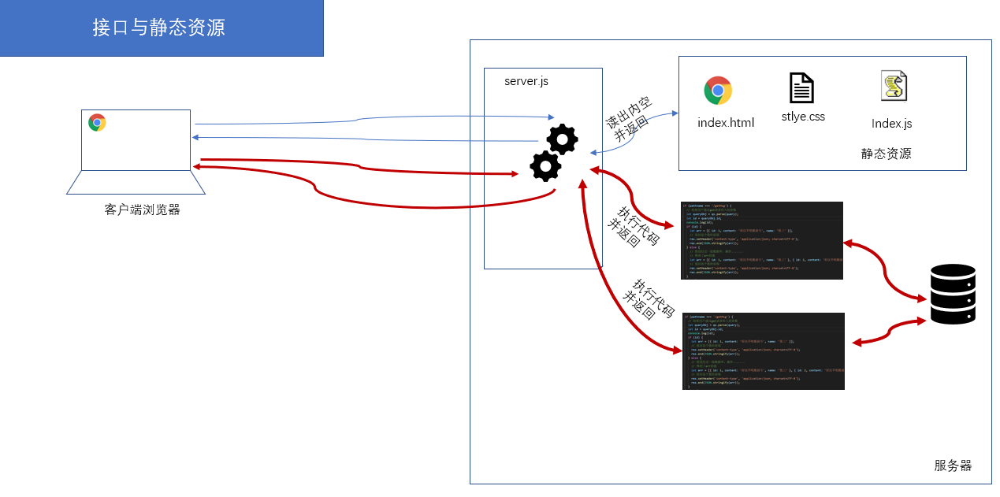

在web服务器上放置有很多的资源，每个资源都有自己的url，客户端浏览器想要访问某个资源就要向服务器发起对应的请求。

资源的分类：

- 静态资源。
  - 它们一般表现为一个一个的文件。例如index.html, style.css, index.js。
  - 服务器处理这类请求时，一般就直接读出资源的内容，并返回给客户端浏览器
- 动态资源：接口
  - 它们不是以某个具体的文件存在的，而是服务器上的一段代码，客户端浏览器访问接口时，服务器会执行这段代码，然后把代码的执行结果返回给客户端浏览器。

目前学习过的向web服务器请求某个资源有如下途径：

- **在地址栏中直接访问这个url**
- 通过某个a标签进行进行跳转
- 通过表单进行提交
- **通过ajax技术访问这个url。**

发送请求有很多类型：

- get
  - 在地址栏中直接访问这个url就是get方式
- post
  - 通过表单提交，可以设置form的method为post
- delete
- put

### get类型的接口-无参数

现在假设我们自己就是一名后端程序员，现在要实现一个get类型的接口。具体要求如下：

地址：/gettime

功能：以json字符串格式返回服务器的时间戳。

示例：

```
输入:localhost:8080/gettime;
返回:{_t:1563265441778}
```

要求：使用postman软件进行测试。

参考代码：

```javascript
const http = require('http');
const app = http.createServer((req, res) => {
  if (req.url === '/gettime') {
    let obj = {_t : Date.now()}
    res.end(JSON.stringify(obj));//  把对象转成字符串之后再返回
  } else {
    res.end('error');
  }
});
app.listen(8083, () => {
  console.log(8083);
});
```

说明：

- req.method 可以判断请求的类型
- req.url中的内容还需要进行处理
  - req.url中的内容是用户在浏览器地址栏中输入的url中 去掉 域名及锚点链接之后的部分。

### nodejs中的url模块

url模块用来对url（例如：http://itcast.cn:80/schools/students?id=18&name=zs#photo）进行解析，进而得到更加详情的信息。

手册地址：http://nodejs.cn/api/url.html

步骤：

- 引入

  `const url = require('url');`

- 使用它的方法
  
  - obj = url.parse(地址栏中输入的url)
  
  > ```
  > let urlobj = url.parse(req.url); // urlobj对象中，就有我们需要的信息
  > urlobj.pathname :获取用户输入的url的路径名 ('/schools/students')
  > urlobj.search: '?id=18&name=zs',
  >   urlobj.query: 获取用户输入的url中的查询字符串( 'id=18&name=zs' )
  >   urlobj.path: '/schools/students?id=18&name=zs',
  >   urlobj.href: '/schools/students?id=18&name=zs' 
  >   ```

上面urlobj.query只是获得了传递的全部参数，我们一般还需从地址栏中分析传递的数据。即从 `http://itcast.cn:80/schools/students?id=18&name=zs#phot`中分析出id和name的值来。这个操作是如何实现的呢？

### nodejs中的querystring模块

用来对url中的查询字符串这部分进行处理。nodejs中提供了querystring这个核心模块来帮助我们处理这个需求。

地址：https://nodejs.org/api/querystring.html#querystring_querystring_parse_str_sep_eq_options

#### 基本示例

```javascript
const qs= require('querystring');
let obj = qs.parse('id=18&name=zs');
console.log(obj)
```


### get类型的接口-带参数

现在假设我们自己就是一名后端程序员，现在要实现一个get类型的接口。具体要求如下：

> 地址：localhost:8080/get
>
> 功能：获取用户传入的参数，并以json字符串格式返回，在返回的信息中要加上时间戳.
>
> 示例：
>
> ```
> 1.不加参数
> 输入:localhost:8080/get;
> 返回:{_t:1563265441778}
> 2.带参数
> 输入:localhost:8080/get?name=filex&age=30;
> 返回:{name:filex,age:30,_t:1563265441778}
> ```
>
> 要求：能通过postman软件的测试。


分析：get请求的参数附加在url中，我们可以使用url模块来取出用户url中的参数部分，再使用querystring模块取出具体的参数值。


这里我们直接使用两个核心模块`url`和`querystring`来实现上述的需求。

```javascript
const http = require('http');
const queryString = require('querystring');
const url = require('url');

const server = http.createServer(function(req, res) {
  var { pathname, query } = url.parse(req.url);
  var obj = queryString.parse(query);

  console.log(p, url.parse(req.url));
  if (pathname === '/gettime' && req.method === 'GET') {
    res.setHeader('content-type', 'application/json');
    obj.d: Date.now() };
    res.end(JSON.stringify(str));
  } else {
    res.setHeader('content-type', 'text/html;charset=utf-8');
    res.end('大家好');
  }
});
server.listen(8088, function() {
  console.log('success', 8088);
});
```

### post接口

假设我们自己就是一名后端程序员，现在要实现一个post类型的接口。具体要求如下：

> 地址：/post
>
> 功能：获取用户传入的参数，并以json字符串格式返回，在返回的信息中要加上时间戳.
>
> 示例：
>
> ```
> 接口地址:localhost:8080/post
> 参数：name=filex&age=30;
> 返回:{name:filex,age:30,_t:1563265441778}
> ```
>
> 要求：通过postman软件的测试。


post类型与get类型的接口区别较大，主要在两个方面：

1. 类型不同

   对于类型不同还比较好判断，我们可以通过 req.method 来获取

2. 传参不同
   - get请求参数在请求行中（附加在url后面）
   - post请求参数在`请求体`中

对于获取post参数就相对复杂一些，主要是用到request对象的两个事件data,end。

基本流程是：

1. 在req对象上添加两个事件，用来收集参数
   1. req.on("data",function(chunk){ })
   
      每次收到一部分数据就会触发一次这个事件，回调函数也会相应的执行一次。其中的chunk是一个形参（你也可以换个参数名），它是一个buffer。
   
   2. req.on("end",function(){})
2. 解析参数
   
   1. queryString

```javascript
const http = require('http');
const url = require('url');
const queryString = require('querystring');
const server = http.createServer(function(req, res) {
  var { pathname } = url.parse(req.url);
  if (pathname === '/post' && req.method === 'POST') {
    let data = '';
    req.on('data', chunk => {
      data += chunk;
    });
    req.on('end', () => {
      res.setHeader('content-type', 'application/json');
      var str = { ...queryString.parse(data), d: Date.now() };
      res.end(JSON.stringify(str));
    });
  } else {
    res.setHeader('content-type', 'text/html;charset=utf-8');
    res.end('大家好');
  }
});

server.listen(8088, function() {
  console.log('success', 8088);
});
```

在发post请求时，传递的数据会在请求体中，并且是一点一点上传到web服务器的（是积小成多，而不是一蹴而就）每上传一部分就会触发一次data事件，而最后全部上传完成之后，会触发end事件。

下面是一个示例代码，用来模拟使用post请求发送大量的数据，以观察req.on('data', chunk => {})多次触发的现象。

```javascript
var xhr =new XMLHttpRequest();
xhr.open('post','http://localhost:8080/post');
xhr.setRequestHeader('content-type','application/x-www-form-urlencoded');
xhr.send("name="+"imissyou".repeat(100000));
```


## 留言板案例

我们在前面学习ajax时，学习了如何去实现一个留言板，当时，我们是通过ajax调用现有的接口来实现的. 其实现 思路如下：

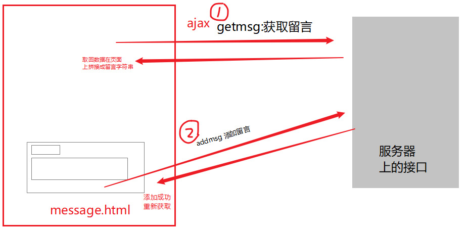

当时我们并不知道后端接口是如何实现的，

现在我们采用全服务器端的思想来实现。


### 整体目录结构

完成之后的整体目录结构如下：

```
|msg
|--server.js    主程序
|--db.json      以json字符串格式保存留言信息
|--/public/message.html 页面
|--/public/assets/bootstrap.css
```

### 实现步骤

要实现这个功能，一共可分成三步：

1. 实现一个静态web服务器。这个功能就是让客户端浏览器能够浏览到留言板的静态页面。
2. 实现显示留言功能。在第一步的基础上，把保存在db.json这个文件中的留言数据读出来，拼接在message.html页面上。
3. 实现添加留言功能。

#### 实现一个静态web服务器

1. 新建一个空文件夹，命名为msg
2. 将使用到的message.html文件、css文件、图片文件等复制到msg下的public中。
4. 在msg文件夹中，创建server.js，搭建Web服务环境

#### 实现留言列表

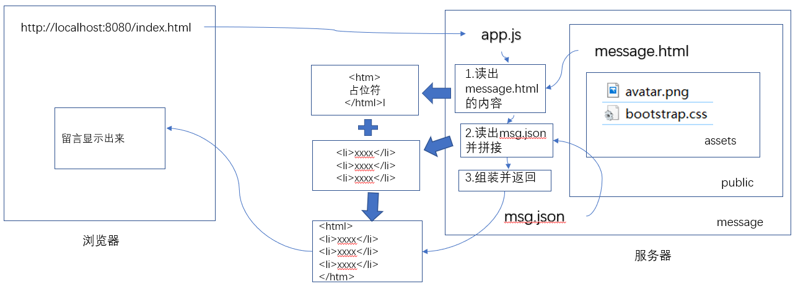

- 当输入地址`localhost:8008/message.html`，回车，会向服务器发送一次GET请求
- 服务器接收到请求，要给浏览器返回它要的数据
  - 读出message.html中的内容
  - 取出db.json中的数据，拼接成htmlstr

#### 实现添加留言功能


1. 给表单设置action和method属性
2. 添加post接口, 用于处理action
   1. 获取用户提交的数据
   2. 写入到message.json中
      1. 先读出来
      2. 转成数组
      3. 使用数组push，来追加
      4. 转成字符串，写回去

- 点击界面中的“添加”时，向服务器发送请求，并提交数据给服务器，注意设置表单的action和method
- 服务器接收到请求，完成数据添加，并作出响应，告知浏览器添加成功与否


参考代码

```
// 1、让用户能够通过localhost:8080/public/message.html来访问
const http = require('http');
const fs = require('fs');
const path = require('path');
const url = require('url');
const qs = require('querystring');

// 全局变量，表示db.json的绝对路径
const MESSAGE_PATH = path.join(__dirname, 'db.json');
http
  .createServer((req, res) => {
    //获取用户的req.url，判读是否以/public/开头
    let { pathname } = url.parse(req.url);
    console.log(pathname, req.method);
    if (req.method === 'GET') {
      let filepath = path.join(__dirname, 'public', pathname);
      fs.readFile(filepath, function(err, data) {
        if (err) {
          console.log(err);
          res.statusCode = 404;
          res.end('服务器错误');
        } else {
          if (pathname === '/message.html') {
            // 1. 读出之前的全部留言信息，转成一个数组

            let msgStr = fs.readFileSync(MESSAGE_PATH, 'utf8');
            let msgList = JSON.parse(msgStr);

            // 2. 组装成指定格式的留言字符串
            // 使用模板字符串
            let msgListStr = '';
            msgList.forEach(item => {
              let itemStr = `<li class="media">
             
             <div class="media-body">
               <h4>${item.name}</h4>
               <p>${item.content}</p>
               <p>${item.dt}</p>
             </div>
           </li>`;
              msgListStr += itemStr;
            });
            console.log(msgListStr);
            // 3. 替换message.html中预留的占位符：把真正的留言换进去
            // 3.1 读出message.html的内容

            // 3.2 替换
            messageHtmlStr = data.toString().replace('明天看电影', msgListStr);
            console.log(messageHtmlStr);
            // 4. 返回
            res.end(messageHtmlStr);
          } else {
            res.end(data);
          }
        }
      });
    } else if (pathname === '/addMsg' && req.method === 'POST') {
      // 添加留言
      //1.取出post传递的参数
      let paramStr = '';
      req.on('data', rs => {
        paramStr += rs;
      });
      req.on('end', () => {
        let paramObj = qs.parse(paramStr);
        console.log(paramObj);
        let { name, content } = paramObj;
        //2.把数据保存在db.json中
        // 2.1读出数据，转成数组
        let msgStr = fs.readFileSync(MESSAGE_PATH, 'utf8');
        let msgList = JSON.parse(msgStr);
        // 2.2向数组的头部，添加一个对象（本条留言信息）
        // 新留言的内容在最上面
        msgList.unshift({
          name,
          content,
          dt: Date.now()
        });
        // 2.3把数组转回字符串
        let msgListStr = JSON.stringify(msgList);
        console.log(msgListStr);
        // 2.4 写回 db.json
        fs.writeFileSync(MESSAGE_PATH, msgListStr);
      });
      res.setHeader('content-type', 'text/html;charset=utf8');
      res.end('添加成功 <a href="./message.html">这里返回</a>');
    }
  })
  .listen(8080, () => {
    console.log('8080');
  });
```


## 自定义模块

我们自己写的模块就是自定义模块。在nodejs中 ，我们对代码的封装是以模块（`一个独立的.js文件`）为单位进行的。一般的做法是实现好某一个功能之后，封装成一个模块，然后在其它文件中使用这个模块。

类比于js自定义函数，自定义模块的使用场景是：

- 代码需要重用
- 代码虽然不需要重用，但封装成模块有利于简化代码结构


### 基本步骤

一共有两步：

1. 定义模块

2. 使用模块

   

#### 1.定义模块

所谓定义模块，就是新建一个js文件，在给这个js文件取名时，要注意一下：

-  我们一般会用模块名给它命名。类比于核心模块，例如，你的模块叫myModule，则这个js文件最好叫myModule.js
- 不要与核心模块的名字重复了。就像我们定义变量不要与核心关键字重名一样，你自己定义的模块也要叫fs.js,因为nodejs有一个核心模块就叫fs.js。
- 要记得导出模块

示例：我们定义一个模块，文件名是myModule.js。 在js文件内我们定义一些函数，变量，它们会根据我们的业务要求做一些不同的工作。最后根据情况导出这些函数，变量。

```javascript
//myModule.js
const myPI = 3;
function add(a, b) {
  return a + b;
}
// 通过module.exports来导出模块
module.exports = {
  myPI,
  add
};
```

注意：

- module.exports 是固定写法，一般放在文件的最末尾，也只用一次。
- module.exports表示当前模块要暴露给其它模块的功能。你当然不必须要所有在模块中定义的函数都暴露出来。

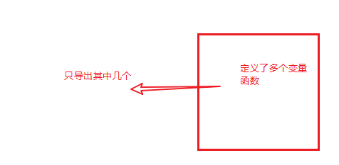


#### 2. 引入模块

在一个文件中定义了模块之后，我们就可以在另一个文件（也可以是另一个模块）中使用这个模块。

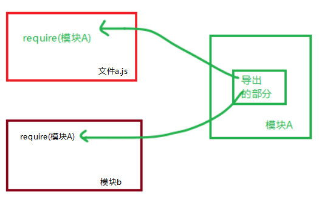

使用模块

当一个模块被成功引入之后，就可以按使用核心模块的过程一样去使用它们了。

```javascript
// index.js
const myMath = require('./myMath');

// 在使用之前请先打印出来看看。
console.log(myMath);

let rs = myMath.add(23,45);
console.log(rs)
```

- 使用require语句引入你定义好的模块，注意这里是使用`相对路径`的格式。

### 导出模块的两种方式

在自定义模块过程中，有两种导出模块的内容的方式：

- exports
- module.exports

参考：https://nodejs.org/api/modules.html#modules_exports_shortcut。在阅读其它人的代码时，可能会遇到这两种不同的写法。所以我们还是有必要了解一下的。

它们的关系是：  exports是module.exports的别名，即：

```javascript
exports === module.exports
```

所以下面两种写法的效果是一样的：

> ```
> //1 mymodule.js
> exports.f = function(){ }
> exports.pi = 3.1415926
> ```
>
> ```
> //2 mymodule.js
> module.exports.f = function(){ }
> module.exports.pi = 3.1415926
> ```


区别在于：

- 在定义模块时：
  - 在初始时，exports和module.exports是指向同一块内存区域，其内容都是一个空对象。
  - 如果直接给exports对象赋值（例如：exports={a:1,b:2}），此时，exports就不会再指向module.exports，而转而指向这个新对象，此时，exports与module.exports不是同一个对象。而在引入模块时，是以模块的中的module.exports为准，因此，此时写在exports上的对象是无法导出的。
- 在引入某模块时，以该模块中module.exports指向的内容为准。
- 在导出模块过程中，建议只用一种方式（建议直接使用module.exports）。

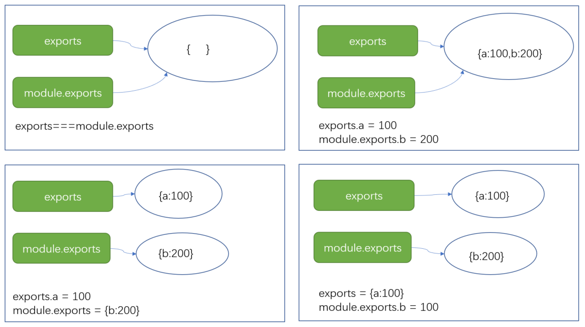

### 通过自定义模块对留言板案例进行改造

以下代码是我们在前面学习大事件项目时所封装的代码，接下来，我们把它们按nodejs中自定义模块的要求进行改造，以对留言板案例中的时间戳进行处理。

```
var tools = {
  formatObj: function(str) {
    // 新建一个工具函数，把查询字符串转成对象
    var obj = {};
    //var str = 'article_id=283&a=1&b=2';
    var arr1 = str.split('&'); //["article_id=283","a=1","b=2"]
    arr1.forEach(function(item) {
      // "article_id=283"
      var arr2 = item.split('='); // ["article_id","283"]
      obj[arr2[0]] = arr2[1];
    });
    // console.log(obj);
    return obj;
  },
  formatTime: function(dt) {
    // dt: 1569384400535 ---> a天b小时c分  前
    // 这是一个过去时间的时间戳，所以，我们可以：
    // diffSec = （ 用此时的时间戳 - dt ）  ====>  从dt开始，到现在已经经过的 毫秒数

    // var dt = 1569421556559; //过去时间的时间戳
    var nowDt = Date.now(); // 此时的时间戳
    var diffSec = Math.floor((nowDt - dt) / 1000); // 到现在已经经过的 秒数

    if (diffSec < 60) {
      return '刚刚';
    }

    // 把秒数 --->   day天 hour小时 mint分
    // 一天的秒数： (24 * 60 * 60)
    var day = Math.floor(diffSec / (24 * 60 * 60));

    // (diffSec - day天对应的秒) /  1小时对应的秒数
    // 一小时的秒数：60 * 60
    var hour = Math.floor((diffSec - day * 24 * 60 * 60) / (60 * 60));

    // (diffSec - day天对应的秒 - hour小时对应的秒) /  1分对应的秒数
    var mint = Math.floor((diffSec - day * 24 * 60 * 60 - hour * 60 * 60) / 60);

    console.log(diffSec, day, hour, mint);
    var str = '';
    if (day > 0) {
      str += day + '天';
    }

    if (hour > 0) {
      str += hour + '小时';
    }

    if (mint > 0) {
      str += mint + '分';
    }
    return str;
  }
};
```

1. 定义模块

   新建mytools.js文件，其中内容如下：

   ```
   var tools = {
     formatObj: function(str) {
       // 代码同上，省略
     },
     formatTime: function(dt) {
     // 代码同上，省略
     }   
   };
   // 导出模块
   moudule.exports = tools;
   ```

2. 使用模块

   ```
   const tools = require('./mytools');
   let str = tools.formatTime(时间戳)
   ```

   

## npm

nodejs通过自带的`npm`(node package manager)工具来管理第三方模块，所以，在学习使用第三方模块时，我们先要学习npm的使用。

- `npm` 全称 `Node Package Manager`(node 包管理器)，它的诞生是为了解决 Node 中第三方包共享的问题。
- `npm` 不需要单独安装。在安装Node的时候，会连带一起安装`npm`。
- [官网](https://www.npmjs.com/)

当我们谈到npm时，我们在说两个东西： 

- 命令行工具。这个工具在安装node时，已经自动安装过了。
- npm网站。这是一个第三方模块的"超市"，我们可以自由地下载，上传模块。

### 包（package）与模块关系


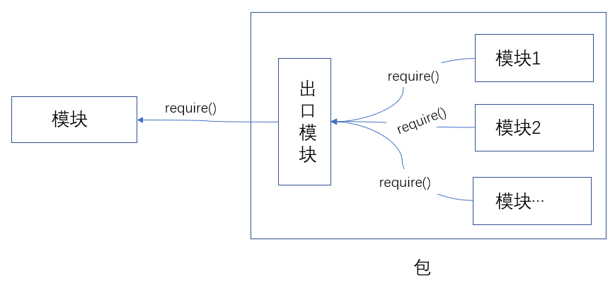


nodejs中一个模块就是一个单独的js文件

- 包是多个模块的集合。一个模块能够解决的问题比较单一，一个包中有多个模块。
- npm 管理的单位就是包

类似于网站和网页的区别：一个网站一般会包含多个网页。

### 通过npm命令行下载第三方模块（包）

分成三步：

- 初始化项目。如果之前已经初始化，则可以省略
- 安装包。 npm install 包
- 引入模块，使用。

#### 第一步：初始化项目

进入到项目所在的根目录下，启动小黑窗（按下shift键，点击右键，在弹出的菜单中选择 在此处打开命令行）

输入如下命令：

```javascript
npm init --yes
// 或者是 npm init -y
```

init命令用来在根目录下生成一个package.json文件，这个文件中记录了我们当前项目的基本信息。它是一切工作的开始。

#### 第二步：安装包

生成了package.json文件之后，我们就可以来安装第三方包了。在npm官网中，有上百万个包，供我们使用。


根据我们遇到的实际问题，我们来引入相应的包来解决它们。例如，我们在开发一个项目，其中涉及一些对货币金额的计算，格式化等问题。需要一些功能：

- 对货币数值进行格式化
- 精确运算货币数值

```
1234567元  ---> ￥1,234,567
0.1 + 0.2  ---> 0.3
```

此时，我们就可以去使用currency.js这个包。

npm地址：<https://www.npmjs.com/package/currency.js> 主页：<https://currency.js.org/>


##### 安装currency.js包

```
npm install  currency.js
```

注意：

- currency.js是包名。不要省略.js，它也是有效包名的一部分。（ 不要认为这是后缀名。如果你写currency其实表示另一个包）。

#### 第三包：使用包

当我们已经下载好一个包之后，就可以向使用核心模块一样去使用它。

格式是：`const 常量名 = require('包名')`

```javascript
// 1. 引入包
const currency = require('curency.js')

// 先打出来看看
console.log(currency)

// 2. 使用包
console.info(currency(1.23, { formatWithSymbol: true }).format());
```

### npm init 命令

在某个目录下开启小黑窗，输入如下命令：

```
npm init 
```

它会启动一个交互式的程序，让你填入一些关于本项目的信息。最后会生成一个package.json文件。

如果你希望直接采用默认信息，可以使用:

```javascript
npm init --yes
// 或者是 npm init -y
```

说明：

- 这个命令只需要运行一次，它的目的仅仅是生成一个package.json文件。这个package.json文件是可以手动修改的。
- 如果项目根目录下已经有了package.json文件，就不需要再去运行这个命令了。

#### package.json文件

它的内容整体是一个json字符串，对当前项目的整体描述。其中最外层可以看作是一个js的对象（每一个属性名都加了""，这就是一个典型的json标记）。这个文件中有非常多的内容，我们目前学习如下几个：

- name

  表示这个项目的名字。如是它是一个第三方包的话，它就决定了我们在require()时应该要写什么内容。

- version

  版本号

- keywords：关键字
- author: 作者
- descrption: 描述

详细参考

1.http://javascript.ruanyifeng.com/nodejs/packagejson.html

2.http://caibaojian.com/npm/files/package.json.html

### node_modules文件夹

这个文件夹中保存着我们从npm中下载来的第三方包。在使用npm install 命令时，会修改这个文件夹中的内容。具体如下来说，当键入`npm install XXX`之后（这里假设这个XXX包是存在的，也没有出现任何的网络错误）：

1. 如果有package.json

   (1) 修改package.json文件。根据开发依赖和生产依赖的不同，决定把这句记录在加在devDependencies或者是dependencies列表中。

   (2) 修改node_modules文件夹

   1. 如果有node_modules文件夹，则直接在下面新建名为XXX的文件夹，并从npm中下来这个包
   2. 如果没有node_modules，则先创建这个文件夹，再去下载相应的包

2. 如果没有package.json。会给一个警告信息

说明：

```
- 建议先创建package.json之后，再去install
- 在分享代码时，我们一般不需要把node_modules也给别人（就像你不需要把jquery.js给别人，因为他们可以自己去下载）。对方拿到我们的代码之后，先运行`npm install`(后面不接任何的包名)，自己去安装这些个依赖包。
```

### 全局安装包和本地安装包

我们通过`npm install` 命令来安装包，简单说就是把包从npm的官网（或者是指定的镜像源）下载到我们自己的电脑中。那具体这个包下载到哪里了，还是有一点讲究的。

分成两类：

- 全局安装: 包被安装到了系统目录（一般在系统盘的node_modules中），本机都可以使用使用。

  - 命令：`npm install -g 包名`

  - 辅助提示：

    - ```
      where node   // 查看node的安装目录
      where npm   // 查看npm的安装目录
      npm root -g // 查看全局包的安装目录
      npm list -g --depth 0 //查看全局安装过的包
      ```

- 局部安装（或者叫本地安装)，包并安装在当前项目的根目录下，与package.json同级目录的node_modules。就只在这个项目中可以使用。

  - ​	命令：`npm install 包名`


#### 全局包与本地包的区别

- 全局安装的包一般可提供直接执行的命令。我们通过对一些工具类的包采用这种方式安装，如：

  gulp, nodemon, live-server,nrm等。

- 本地安装的包是与具体的项目有关的， 我们需要在开发过程中使用这些具体的功能。


一个经验法则：

- 要用到该包的命令执行任务的就需要全局安装
- 要通过require引入使用的就需要本地安装


#### 全局安装nrm包

因为下载包时，默认是从npm官网（国外的网站）下载，速度可能会比较慢。在npm超市里有一个工具可以来手动设置从哪里去下载包。这个工具就是`nrm`。这个工具是帮助我们切换安装包的来源的，不应该只限于某个具体的项目，所以我们采用全局安装的方式来安装它。

nrm包的地址：<https://www.npmjs.com/package/nrm>

nrm的使用方法，共三步：

```javascript
// 第一步： 全局安装 
npm install nrm -g

// 第二步：列出所有的源信息
// （*）标注的就是当前使用的源
nrm ls

// 第三步：根据需要切换源 
// 例如：指定使用taobao源
nrm use taotao
```


### 开发依赖和生产依赖(了解)

在本地安装包时，表示我们这个项目要用到这个包，换句话说，我们这个项目要想成功运行，要依赖于这些个包。

但在，具体在项目进行的哪一阶段依赖于这些包呢？也有具体的差异。

#### 理解

举个生活中建房子的场景：

在建房子时，我们依赖：

- 辅助工具：尺子，水平仪，脚手架
- 原材料：钢筋，水泥

在住房子时，我们依赖：

- 原材料：钢筋，水泥

在房子进入到了使用阶段时，我们就不再需要尺子，水平仪，脚手架等这些个辅助工具了。我们买一所房子时，也不应该支付巨型脚手架的费用。  在开发前端项目的过程中也存在类似的问题：我们的开发过程和使用过程是分开的，开发项目时需要用到的包可能在使用项目时就不需要用到了。

假设有这么两个包：

- gulp-htmlmin。这个工具是用来把html代码进行压缩的（去掉空格，换行等），我们需要在开发时使用它，而项目一旦上线，我们就不再需要它了。，因此将它归类为"开发依赖"。
- jquery。在开发时参与源码编写，在发布上线的生产环境中也是需要它的。不仅在开发环境编写代码时要依赖它、线上环境也要依赖它，因此将它归类为"生产依赖"。


这个差异就表现在，我们在打包项目时，就不需要打包“开发依赖”的包，这样减少成本。


#### 操作

这两种依赖关系，在具体操作的过程中，有如下区别

1. 保存到开发依赖(devDependencies)

```javascript
npm install 包名 --save-dev
// 或者 npm install 包名 -D
```

通过这种方式安装的包出会现在package.json文件中的`devDependencies`字段中。

2. 保存到生产依赖(dependencies): 

```javascript
npm install 包名 --save
// 或者 npm install 包名
// 或者 npm install 包名 -S
```

通过这种方式安装的包出会现在package.json文件中的`dependencies`字段中。


### require的加载机制

在我们使用一个模块时，我们会使用require命令来加载这个模块。以加载一个自定义模块为例，require(文件名)的效果是：

1. 执行这个文件中的代码
2. 把这个文件中的module.exports对象中的内容返回出来。

以如下代码为例：

```
// moudule1.js
var a = 1;
var b = 2;
console.log(a+b);
var c = a+b;
module.exports = {
	data: c
}
```

在index.js中使用模块

```
// index.js
const obj = require('./moudule1.js');
console.log(obj);

这里的obj对象就是moudule1.js中的module.exports对象
```


- `require` 优先加载**缓存**中的模块。同一个包第一次require之后，就会缓存一份，下一次require时就直接从缓存中去取。
- 如果是**相对路径**，则根据路径加载**自定义模块**，并缓存
  - `require('./main')`  省略扩展名的情况
  - 先加载 `main.js`，如果没有再加载 `main.json`，如果没有再加载 `main.node`(c/c++编写的模块)
- 如果不是相对路径，则加载核心模块，并缓存
- 如果不是自定义模块，也不是核心模块，则加载**第三方模块**
  - node 会去本级 node_modules 目录中找
  - 如果在 node_modules 目录中找到 `moment` 目录，则加载该模块并缓存
  - 如果过程都找不到，node 则取上一级目录下找 `node_modules` 目录，规则同上
  - 如果一直找到代码文件的文件系统的根路径还找不到，则报错


### 附npm 常用命令

- 查看

  ```bash
  npm --version
  npm -v  // 查看npm 版本
  where node   // 查看node的安装目录
  where npm   // 查看npm的安装目录
  npm root -g // 查看全局包的安装目录
  npm list -g --depth 0 //查看全局安装过的包
  ```

- 升级 npm

  ```bash
  npm install npm --global
  npm install npm -g
  ```

- 初始化 `package.json`

  ```bash
  npm init -y // 或者是npm init --yes
  ```

- 安装第三方包

  ```javascript
  // 安装package.json中列出的所有的包
  npm install
  
  // 全局安装
  npm install 包名 -g
  
  // 本地安装，没有指定版本，默认安装最新的版本
  npm install 包名
  // 一次安装多个包
  npm install 包名1 包名2 包名3
  
  // 安装指定版本的包
  npm install 包名@版本号
  
  // 简写。把install简写成 i
  npm i 包名
  ```

- 删除已安装的包 

  ```bash
  npm uninstall 本地安装的包名
  npm uninstall -g 全局安装的包名
  ```

- 设置npm的register

  如果你不想用 `nrm` ，下面这个原生的命令也可以切换镜像源。
  
  ```
  npm config set registry https://registry.npm.taobao.org
  ## 配置后可通过下面方式来验证是否成功
  npm config get registry
  ```

## Express框架

### Express 介绍

- Express 是一个基于 Node.js 平台，快速、开放、极简的 **web 开发框架**
- Express 是一个第三方模块，有丰富的 API 支持，强大而灵活的**中间件**特性
- Express 不对 Node.js 已有的特性进行二次抽象，只是在它之上扩展了 Web 应用所需的基本功能
- 链接
  - [Express 官网](http://expressjs.com/)
  - [Express 中文文档（非官方）](http://www.expressjs.com.cn/)
  - [Express GitHub仓库](https://github.com/expressjs/express)

### 运行第一个express程序

由于它是第三方包，我们需要先下载它。

#### 下载express包

> 参考文档：http://expressjs.com/en/starter/installing.html

```shell
# 在你的项目根目录下，打开小黑窗

# 1. 初始化 package.json 文件
npm init -y

# 2. 本地安装 express 到项目中
# npm install express
npm i express
```

注意：

- 项目目录名字不要取中文，也不要取express
- 如果安装不成功
  - 换个网络环境
  - 运行下`npm cache clean -f`，再重新运行下载命令试试

#### 使用

> 参考文档：http://expressjs.com/en/starter/hello-world.html


在项目根目录下新建一个js文件，例如app.js，其中输入代码如下：

```javascript
// 0. 加载 Express
const express = require('express')

// 1. 调用 express() 得到一个 app
//    类似于 http.createServer()
const app = express()

// 2. 设置请求对应的处理函数
//    当客户端以 GET 方法请求 / 的时候就会调用第二个参数：请求处理函数
app.get('/', (req, res) => {
  res.send('hello world')
})

// 3. 监听端口号，启动 Web 服务
app.listen(3000, () => console.log('app listening on port 3000!'))
```

说明：

- app.get('/')相当于添加个事件监听：当用户以get方式求"/"时，它后面的回调函数会执行，其回调函数中的req,res与前面所学http模块保持一致。
- res.send()是exprss提供的方法，用于结束本次请求。类似的还有res.json(),res.sendFile() 。


### 托管静态资源

参考文档：http://expressjs.com/en/starter/static-files.html

让用户直接访问静态资源是一个web服务器最基本的功能。

```javascript
http://localhost:3000/1.png
http://localhost:3000/css/style.css
http://localhost:3000/js/index.js
```

例如，如上url分别是请求一张图片，一份样式文件，一份js代码。我们实现的web服务器需要能够直接返回这些文件的内容给客户端浏览器。


在前面学习http模块时，我们已经实现了这些功能了，但是要写很多代码，现在使用express框架，只需一句代码就可以搞定了，这句代码是  `express.static('public')`

#### 忽略前缀

```javascript
// 0. 加载 Express
const express = require('express')

// 1. 调用 express() 得到一个 app
//    类似于 http.createServer()
const app = express();

// 2. 设置请求对应的处理函数
app.use(express.static('public'))


// 3. 监听端口号，启动 Web 服务
app.listen(3000, () => console.log('app listening on port 3000!'))
```

此时，所有放在public下的内容可以直接访问，注意，此时在url中并不需要出现public这级目录

- 在public下新建index.html。可以直接访问到。

#### 限制前缀

```
// 限制访问前缀
app.use('/public', express.static('public'))
```

这意味着想要访问public下的内容，必须要在请求url中加上/public

### 路由

参考文档：http://expressjs.com/en/starter/basic-routing.html

路由（**Routing**）是由一个 **URL**（或者叫路径标识）和一个特定的 **HTTP 方法**（GET、POST 等）组成的，涉及到应用如何处理响应客户端请求。每一个路由都可以有一个或者多个处理器函数，当匹配到路由时，这些个函数将被执行。

#### 格式

```javascript
app.METHOD(PATH, HANDLER)
```

其中：

- `app` 是 express 实例 。（const app = express（））

- `METHOD` 是一个 [HTTP 请求方法](https://en.wikipedia.org/wiki/Hypertext_Transfer_Protocol#Request_methods)。 全小写格式。如：post,get,delete等

- `PATH` 是请求路径（相当于在http模块中用到过的 `url.parse(req.url).pathname`）

  | 浏览器url                                 | 服务端路径           |
  | ----------------------------------------- | -------------------- |
  | http://localhost:8080                     | /                    |
  | http://localhost:8080/public/a/index.html | /public/a/index.html |
  | http://localhost:8080/index.html?a=1&b=2  | /index.html          |

- `HANDLER` 是当路由匹配到时需要执行的处理函数。`（req,res）=>{   }`

#### 示例

- 路径
  - http://127.0.0.1:3000/xxxx
  - app.get('路径')
  - 路径：域名后面的path
- 处理 get 请求

```javascript
// 当你以 GET 方法请求 / 的时候，执行对应的处理函数
app.get('/', function (req, res) {
  res.send('Hello World!')
})

// 当你以 GET 方法请求 /file.html 的时候，执行对应的处理函数
app.get('/file.html', function (req, res) {
  res.send('file.html');
  res.sendfile('文件路径'）
  // 这里的文件路径必须是绝对路径
})
```

注意

- send()，sendfile()是express框架提供的方法。

### 写get接口

#### get无参数

```javascript
const express = require('express');
const app = express();
app.get('/get', function(req, res) {
  // 直接返回对象
  res.json({ name: 'abc' });
});
app.listen('8088', () => {
  console.log('8088');
});
```

注意:

- res.json()是express提供的方法。

#### get有参数

express框架会自动收集get参数，并保存在req对象的`query`属性中。我们直接来获取即可。

```javascript
const express = require('express');
const app = express();
app.get('/get', function(req, res) {
  // 直接返回对象
  console.log(req.query);
  
  res.send({ name: 'abc' });
});
app.listen('8088', () => {
  console.log('8088');
});
```

注意：

- req.query属性是express框架额外提供的属性。

### 写post接口

#### 无参数

```javascript
const app = express();
app.post('/post',function(req,res){
	res.send({name:"abc"})
})
```

#### 普通键值对参数

获取post普通键值对数据，要通过第三方模块`body-parser`来解析。

具体来说当content-type为x-www-form-urlencoded时，表示上传的普通简单的键值对 。如果通过postman测试的话，对应的设置如下：

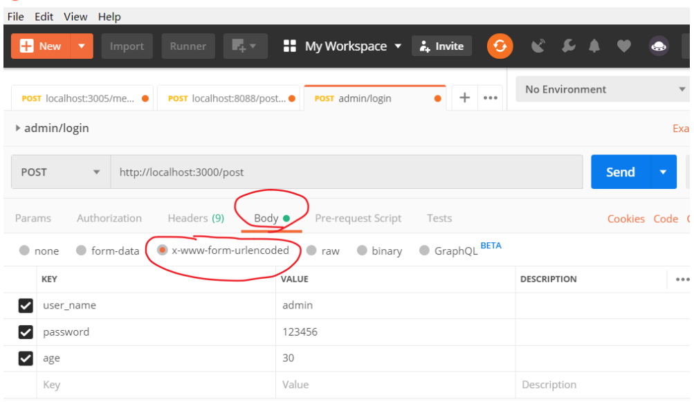


一般要先下载body-parser这个包。

```javascript
npm install body-parser
```

在 express4中，已经预先下载安装过了（在npm install exprss 时，就已经安装了body-parse，你可以在node_modules中查看到），这样就可以直接使用了

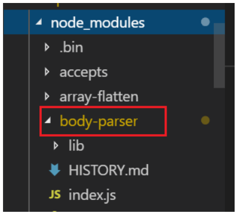

##### 步骤

```javascript
// 1. 引入包
const bodyParser = require('body-parser');

// 2. 使用包
app.use(bodyParser.urlencoded({extended:false}));

app.post("/add",function(req,res){
    //3. 可以通过req.body来获取post传递的键值对	
    res.json(req.body)

})
```

注意：

- app.use(....)之后，在res.body中就会多出一个属性res.body。


#### 文件上传

如果post涉及文件上传操作，则会要额外使用`multer`这个包来获取上传的信息。

```html
enctype="multipart/form-data"
```

对应postman的操作如下：

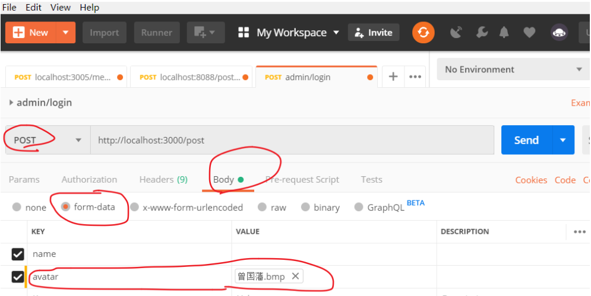

##### 步骤

1.安装

```javascript
npm install multer
```

2.使用

```javascript
// 1. 引入包
const multer = require('multer');
// 2. 配置
const upload = multer({dest:'uploads/'}) // 上传的文件会保存在这个目录下
// uploads表示一个目录名，你也可以设置成其它的

// 3. 使用
// 这个路由使用第二个参数 .upload.single表示单文件上传， 'cover' 表示要上传的文件在本次上次数据中的键名。类似于<input type="file" name='cover'/>

app.post("postfile",upload.single('cover'), function(req,res){

})
```

说明：

- 如果当前目录下没有uploads，它会自动创建uploads这个文件夹


### 写RESTful接口


网络应用程序，分为前端和后端两个部分。当前的发展趋势，就是前端设备层出不穷（手机、平板、桌面电脑、其他专用设备…）。因此，必须有一种统一的机制，方便不同的前端设备与后端进行通信。这导致API构架的流行，甚至出现"APIFirst"的设计思想。RESTful API是目前比较成熟的一套互联网应用程序的API设计理论。

REST（Representational State Transfer）表述性状态转换，REST指的是一组架构约束条件和原则。 如果一个架构符合REST的约束条件和原则，我们就称它为RESTful架构。REST本身并没有创造新的技术、组件或服务，而隐藏在RESTful背后的理念就是使用Web的现有特征和能力， 更好地使用现有Web标准中的一些准则和约束。

符合REST规范的设计，我们称之为RESTful设计。 它的设计哲学是将服务器端提供的内容实体看作一个资源，并表现在url上。


#### 普通接口设计

例如：
接口名：localhost:8080/getarticle
类型：get
功能：获取文章信息

接口名：localhost:8080/addarticle
类型：POST
功能：添加新文章

接口名：localhost:8080/delarticle
类型：post
功能：删除文章

接口名：localhost:8080/updatearticle
类型：post
功能：编辑文章

#### RESTful接口设计

区别上述功能,主要依靠接口名称和请求类型而在restful设计中，它们应该是这样的：
接口名：localhost:8080/articles
类型：get
功能：获取文章信息

接口名：localhost:8080/articles
类型：post
功能：添加新文章

接口名：localhost:8080/articles
类型：delete
功能：删除文章

接口名：localhost:8080/articles
类型：put
功能：编辑文章

RESTful设计是：
- 通过URL设计资源。接口名一般都是名词，不包含动词。
- 请求方法决定资源的操作类型


从前端向后端接口传参数，有两种途径：

- 请求行。
  - get方式，只能从请求行中传参。
- 请求体
  - post,put,delete可以把参数从请求体中进行传参。


**post方式也可以从地址栏中传参**

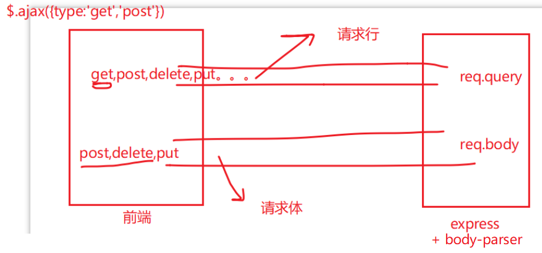


### 中间件技术

在实际的工作中，我们需要对某些请求（或者某一类请求）进行特殊的处理，例如：要记录每一次请求的详细信息。需求：在调用某个接口时，打印出调用者的ip地址及调用时间。此时需要使用到中间件技术。同时对express而言，中间件是它的一个非常重要的概念，掌握中间件的思想对于理解学习express，提升编程水平都有很大的帮助。

#### 生活中的中间件


在上图中，自来水厂从获取水源到净化处理交给用户，中间经历了一系列的处理环节。

- 一个流程结束之后，按顺序进入下一个流程；
- 一个流程如果出了问题，下一个流程也会受影响。
- 我们可以很方便地插入某一个特殊的处理环节，而不需要对原有环节造成影响。这样做的目的既提高了生产效率也保证了可维护性。

我们可以称其中的每一个处理环节就是一个中间件。


#### express中间件

中间件**是**一个特殊的url地址处理**函数**

- 中间件是 express 的最大特色，也是最重要的一个设计。`Express是一个自身功能极简，完全是路由和中间件构成一个web开发框架：从本质上来说，一个Express应用就是在调用各种中间件。`
- 一个 express 应用，就是由许许多多的中间件来完成的

#### 格式及基本示例

##### 格式

```
// 具名函数格式：
const handler1 = (req, res, next) => {
  console.log(Date.now());
  next();
}
app.use(handler1);

// 匿名函数格式：
app.use((req, res, next) => {
  console.log(Date.now());
  next();
});
```

- 中间件本质就是一个函数，它被当作 `app.use(中间件函数)` 的参数来使用，或者是某个路由处理函数中使用。
- 中间件函数中有三个基本参数， req、res、**next**
  - req就是请求相关的对象，它和下一个中间件函数中的req对象是一个对象
  - res就是响应相关的对象，它和下一个中间件函数中的res对象是一个对象
  - next：它是一个函数，调用它将会跳出当前的中间件函数，执行中间件；如果不调用next，则整个请求都会在当前中间件卡住，而得不到返回。

##### 示例：使用中间件打印日志

```javascript
var express = require('express')
var app = express()

var myLogger = function (req, res, next) {
  console.log('LOGGED')
  next()
}
// 注册中间件
app.use(myLogger)

app.get('/', function (req, res) {
  res.send('Hello World!')
})

app.listen(3000)	
```


##### 示例：使用多个中间件

```javascript
app.use((req, res, next) => {
  console.log("第1个中间件");
  next();
});

app.use((req, res, next) => {
  console.log("第2个中间件");
  res.setHeader('content-type', 'text/html;charset=utf8');
  res.a = 1;
  next();
});

app.use((req, res, next) => {
  console.log("第3个中间件");
  res.b = 2;
  console.log(res.a,res.b)
  res.end('中间件');
});
```

- 注意先后顺序。
- 注意通过req来附加额外的信息。

##### 示例：设定特定路径的中间件

```javascript
var express = require('express')
var app = express()

app.use(function (req, res, next) {
  console.log('应用级中间件，能匹配所有请求')
  next()
})
app.use('/api1',function (req, res, next) {
  console.log('只匹配/api1请求')
  next()
})

app.get('/api1', function (req, res) {
  res.send('Hello World!')
})

app.listen(3000)
```


#### 中间件的执行流程


app.use()是应用级中间件，所有的请求都能匹配。

app.get('/abc') 。只能匹配get类型并且请求路径是/abc的请求。

#### 中间件的应用

模拟body-parser

```javascript
let qs = require('querystring')
app.use((req, res, next) => {
  if (req.method === 'POST') {
    let bodyStr = '';
    req.on('data', chunck => {
      bodyStr += chunck;
    });
    req.on('end', () => {
      req.body = qs.parse(bodyStr);
      next();
    });
  }else{
      next()
  }
});
```

### 扩展：模拟中间件实现原理

下面的代码简单模拟了中间件的实现。可以了解一下。

```javascript
const http = require('http');

function express() {
  let fnList = [];
  let app = http.createServer((req, res) => {
    let i = 0;

    let next = function() {
      let f = fnList[i++];
      f && f(req, res, next);
    };
    next();
  });
  app.use = function(f) {
    fnList.push(f);
  };
  return app;
}
const app = express();
app.use(function(req, res, next) {
  console.log('a');
  next();
});
app.use(function(req, res, next) {
  console.log('b');
  next();
});
app.use(function(req, res) {
  res.end('ok');
});
app.listen(3001, () => {
  console.log('ok');
});
```


### 路由中间件

#### 使用场景

路由过多时，代码不好管理。以大事件的代码为例，我们定义了管理员角色的接口和普通游客的接口，这些接口如果全写在一个入口文件中(如下只是显示了4个接口，如果是40个接口，就会很难读了)，是很不好维护的。

```javascript
const express = require('express');

const app = express();
// 两种用户的操作，对应不同的接口
app.get('/getfrontdetail', (req, res) => {
  res.send('获取游客详情');
});

app.get('/getfrontinfo', (req, res) => {
  res.send('获取游客信息');
});

// 两种用户的操作，对应不同的接口
app.get('/getadmincate', (req, res) => {
  res.send('管理员获文章类别信息');
});

app.get('/getadmininfo', (req, res) => {
  res.send('获取管理员信息');
});

app.listen(3000, () => {
  console.log(3000);
});

```

我们的目标就是把它们拆开到不同的文件中，以便于管理。

#### 基本步骤

1. 整理接口名。

   对众多的接口名进行整理和分类，以一级目录，二级目录这样的方式进行。例如：

   ​	/admin/getcate 

   ​	/admin/getinfo

   ​	/front/getinfo

   ​	/front/getdetail

   2.通过nodejs的模块化，分模块定义路由中间件，并导出

   3.在入口文件中，导入并使用路由中间件

定义两个路由文件：

- front.js
- server.js

```javascript
// ./router/front.js
const express = require('express');
const router = express.Router();
router.get('/getinfo', function(req, res) {
  res.send('getinfo');
});
router.get('/getdetail', function(req, res) {
  res.send('getdetail');
});
module.exports = router;
```


```javascript
// ./router/server.js
const express = require('express');
const router = express.Router();

router.get('/getinfo', function(req, res) {
  res.send('管理员getinfo');
});
router.get('/getdetail', function(req, res) {
  res.send('管理员getdetail');
});
module.exports = router;

```

在主入口文件中使用它们

```javascript
const express = require('express');
const app = express();

const frontRouter = require('./router/front');
const serverRouter = require('./router/admin');

app.use('/front', frontRouter);
app.use('/server', serverRouter);
```


## 跨域

跨域问题是我们前端开发中经常会遇到的问题，也是面试中的高频题目。通过这一节的学习，我们就能解决这类问题啦。


### 问题演示

我们先使用express框架写好留言管理的相关接口，并通过postman的测试，然后在某个前端网页中通过ajax来访问，就会出现跨域错误。

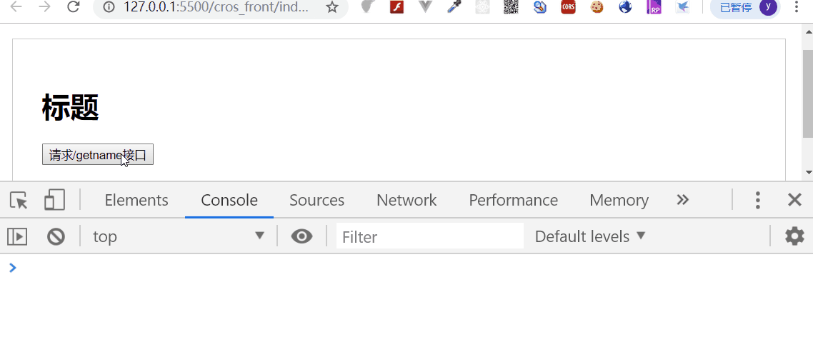

第一步： 先准备好后端接口：

```
// 使用express准备好的留言接口。
// 一共两个接口：
// 1. 添加留言。 post  /message。参数 name, content
// 2. 查询留言。 get   /message。

const express = require('express');
const bodyParser = require('body-parser');

// 创建服务
const app = express();
app.use(bodyParser.urlencoded({ extended: false }));

// 预置一条留言
const MESSAGE = [{ dt: Date.now(), name: 'test', content: '123' }];

// 应用级中间件，输出访问日志
app.use(function(req, res, next) {
  console.log(`${Date.now()}:来自${req.connection.remoteAddress} 访问了 ${req.method}-${req.url}。参数是：${req.query}`);

  next();
});
// 添加 - post
app.post('/message', (req, res) => {
  let { name, content } = req.body;
  MESSAGE.unshift({
    dt: Date.now(),
    name,
    content
  });
  res.json({ code: 200, msg: 'add..ok' });
});
// 查询 - get
app.get('/message', (req, res) => {
  res.json({ code: 200, data: MESSAGE, msg: 'ok' });
});

app.listen(8080, function() {
  console.log('8080');
});

```

1. 启动如上web服务。
2. 使用postman进行测试，这两个接口是可以正常工作的。


第二步，用ajax来请求接口

1. 写一个显示留言板的页面。这个页面在学习ajax时写过的。

```
<!DOCTYPE html>
<html lang="en">
  <head>
    <meta charset="UTF-8" />
    <meta name="viewport" content="width=device-width, initial-scale=1.0" />
    <meta http-equiv="X-UA-Compatible" content="ie=edge" />
    <title>留言板</title>
    <link rel="stylesheet" href="./assets/bootstrap.css" />
  </head>
  <body>
    <div class="container">
      <h3 class="display-6">留言板</h3>
      <hr />
      <ul id="messages" class="list-unstyled">
        <li class="media">
          
          <div class="media-body">
            <h4>张三</h4>
            <p>哈哈哈哈哈哈哈哈哈哈哈</p>
            <p>2019-06-07</p>
          </div>
        </li>
      </ul>

    </div>
    <script src="./assets/jquery.3.4.1.js"></script>
    <script>
      function getAndShow() {
        $.ajax({
          url: 'http://localhost:8080/message',
          type: 'get',
          success: res => {
            let { code, msg, data } = res;
            if (code === 200) {
              var msgStr = data
                .map(item => {
                  return `<li class="media">
                    
                    <div class="media-body">
                      <h4>${item.name}</h4>
                      <p>${item.content}</p>
                      <p>${item.dt}</p>
                    </div>
                  </li>`;
                })
                .join('');
              $('#messages').html(msgStr);
            }
          }
        });
      }

      getAndShow();
      
    </script>
  </body>
</html>

```

2.通过vscode中liveserver打开这个页面，就会发现错误了。


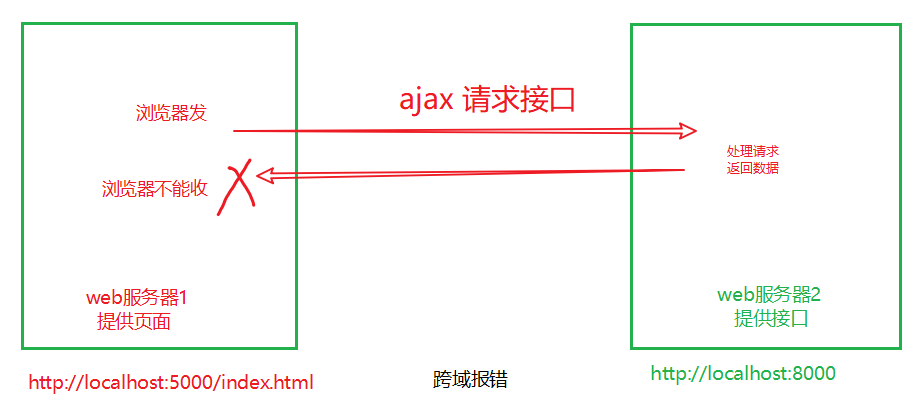


如果你把前后端的代码放在同一个服务器就不会出现跨域的问题了。如下

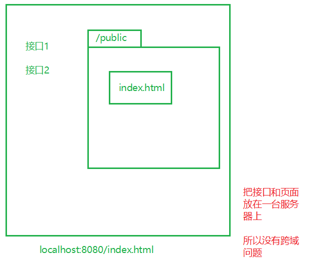

下图是跨域错误的示意图


### 原因

 跨域错误:`不同源`的`ajax请求`


浏览器向web服务器发起http请求时 ，如果同时满足以下`三个条件`时，就会出现跨域问题，从而导致ajax请求失败：

- 你的浏览器多管闲事了。跨域问题出现的基本原因是浏览器出于安全性的考虑------同源策略：ajax请求必须是同源，封杀了你跨域请求。可以安装一个浏览器插件`allow-control-allow-origin`来测试一下。 如果使用postman软件（它不是浏览器）来发请求，就不会有这个问题了。

- 你的请求是xhr请求。就是常说的ajax请求。浏览器请求图片资源，js文件,css文件是可以跨域的（不是ajax请求）

- 发出请求不符合同源策略要求。

  - 同源是指：`协议相同`，`域名相同`，`端口相同`。即发ajax请求的所在的页面 与 所请求的接口的url必须是同源的。

    以下就是不同源的：

    从` http://127.0.0.1:5500/message_front/index.html ` 请求` http://localhost:8080/msg `

  - 在前后端分离开发的场景下，前端的页面和后端的服务经常是分开部署的，所以跨域访问的情况是比较常见的。

    

  注意，错误是发生在浏览器端的。请求是可以正常从浏览器发到服务器端，服务器也可以处理请求，只是返回到浏览器端时出错了。

### 实现跨域请求的方案--JSONP

#### JSONP简介

**JSON** with **P**adding，是一种借助于 `script` 标签发送跨域请求的技巧。

原理:

- script的src标签可以请求外部的js文件，它是可以发跨域请求的。
- 借助 `script` 标签src请求服务端上的接口
- 服务端的接口返回JavaScript 脚本，并附上要返回的数据。

它其实并**不是ajax请求**。


#### 实现步骤

##### 让script标签的src指向一个接口

> 前端：让script标签的src指向一个后端接口的地址；
>
> 后端：接口的返回值是一个js函数调用语句

前端页面

```html
<script src="http://localhost:3000/getTime"></script>
```

注意：

- script标签中的src会指向一个后端接口的地址。由于script标签并不会导致跨域问题，所以这里的请求是可以正常发送和接收的。
- 与我们之前理解的src指向某个具体的.js文件不同，我们只需要确保src所指向的地址的返回内容是js代码就行了，而不必要一定是.js文件。

后端接口

```bash
const express = require('express');
const app = express();
app.get('/gettime', (req, res) => {
  res.end(`alert(1)`);
})
app.listen(3000, () => {
  console.log('你可以通过http://localhost:3000来访问...');
});
```

注意：

- 后端接口的返回值是一个特殊的字符串： 一个刻意拼写的js函数调用语句


##### 传递函数名到后端

> 前端：让script标签的src指向一个后端接口的地址，并附加函数名；
>
> 后端：接口的返回值是一个js函数调用语句
>
> 目标：当请求成功时，执行前端指定的函数

`前端页面`

```html
<script>
	function fn(){
        console.log()
    }
</script>
<script src="http://localhost:3000/gettime?callback=fn"></script>

```

注意：

- 在前端自己定义一个函数，把函数名传给后端
- 使用get方式传参，并且参数名是callback。这个参数名要与后端保持一致。

`后端接口`

```bash
const express = require('express');
const app = express();
app.get('/gettime', (req, res) => {
  let { callback } = req.query;
  res.end(`${callback}()`);
})
app.listen(3000, () => {
  console.log('你可以通过http://localhost:3000来访问...');
});
```

注意：

- 后端接口接收函数名，并返回一个字符串，其内容是`函数调用语句`

##### 后端回传数据

> 前端：让script标签的src指向一个后端接口的地址，并附加函数名；
>
> 后端：接口的返回值是一个js函数调用语句,并附加实参；
>
> 目标：当请求成功时，执行前端指定的函数

前端页面

```html
<script>
      function dosomething(rs) {
        console.log(rs);
      }
</script>
<script src="http://localhost:3000/getTime?callback=dosomething"></script>
```

注意：

- script标签中的src会指向一个后端接口的地址。由于script标签并不会导致跨域问题，所以这里的请求是可以常发送的。
- 把前端的函数名传给后端

后端接口

```bash
const express = require('express');
const app = express();
app.get('/gettime', (req, res) => {
  let { callback } = req.query;
  let data = JSON.stringfy( {a:1,b:2} )
  res.end(`${callback}(${data})`);
})
app.listen(3000, () => {
  console.log('你可以通过http://localhost:3000来访问...');
});

```

注意：

- 接收函数名，组装一个特殊的字符串：`函数调用语名`
- 把要回传的参数转成字符串，并嵌入返回值，当作函数的实参。


#### jQuery封装的jsonp

jquery中的ajax已经封装好了的jsonp方式，你可以直接使用。具体来说就是给ajax请求添加一个dataType属性，其值为"jsonp"。注意前后端都需要改动代码。示例如下：

前端页面：`加上dataType属性`

```javascript
$.ajax({
   type: 'GET',
   url: 'http://localhost:4000/getTime', 
   success: function (result) {
      console.log(result);
   },
   dataType: 'jsonp' // 必须要指定dataType为jsonp
});
```


后端接口:

```java
const express = require('express');
const app = express();
app.get('/gettime', (req, res) => {
  let { callback } = req.query;
  let data = JSON.stringfy( {a:1,b:2} )
  res.end(`${callback}(${data})`)
})
    
app.listen(3000, () => {
  console.log('你可以通过http://localhost:3000来访问...');
});
```

当然了，后端框架中也有现成的解决方案，不要需要写的这么复杂。express框架已经提供了一个名为jsonp的方法来处理jsonp请求:

```java
const express = require('express');
const app = express();
app.get('/gettime', (req, res) => {
  let data = {a:1,b:2}
  res.jsonp(data)
})
app.listen(3000, () => {
  console.log('你可以通过http://localhost:3000来访问...');
});
```


#### jquery封装的jsonp原理分析

第一步：产生一个随机函数名；并创建这个函数(jQuery34109553463653123275_1565234364495)；

第二步：动态创建script标签，其src就是拼接的后端接口地址及callback值，如果有其它参数，则正常传递

第三步：请求成功返回之后，执行第一步中创建的函数(jQuery34109553463653123275_1565234364495)。这个函数最终会指向$.ajax({success:function(){}}) 中的success

第四步：`销毁` 第一步中创建的函数及第二步中创建的script标签

- 添加断点调试


#### 附送一段模拟代码(面试，手写jsonp)

```html
<!DOCTYPE html>
<html>
  <head>
    <meta charset="UTF-8" />
    <meta name="viewport" content="width=device-width, initial-scale=1.0" />
    <meta http-equiv="X-UA-Compatible" content="ie=edge" />
    <title>html页面</title>
  </head>
  <body>
    <div class="container">
      <h1>jsonp</h1>
      <div>需要后端接口的配合：http://localhost:3005/jsonp</div>
      <pre>
        //--后端测试代码如下
          const express = require('express');
          const app = express()
          
          // 留言板接口 -- 获取所有数据
          app.get('/jsonp', (req, res) => {
            var { callback } = req.query;
          
            res.setHeader('content-type', 'application/javascript');
          
            res.end(callback + '({a:1,b:2})');
          });
          
          app.listen(3000,()=>{})
      </pre>
    </div>
    <script>
      function buildCallBackFunction(options, callbackFunName) {
        window[callbackFunName] = function(result) {
          options.success(result);
          window[callbackFunName] = null;
          delete window[callbackFunName];
        };
      }
      function buildParam(options) {
        var params = options.params;
        if (!params) {
          return '';
        }
        if (typeof params === 'object') {
          var arr = [];
          for (var p in params) {
            arr.push(`p=${params[p]}`);
          }
          return arr.join('&');
        } else if (typeof params === 'string') {
          return params;
        } else {
          return '';
        }
      }
        
      function buildScript(url) {
        var script = document.createElement('script');
        script.setAttribute('src', url);
        script.onload = function() {
          document.getElementsByTagName('head')[0].removeChild(script);
        };
        document.getElementsByTagName('head')[0].appendChild(script);
      }
        
      function json(options) {
        var { url, params, success } = options;
        var callbackFunName = 'callback_' + Date.now();
        var params = buildParam(options);
        params += !params ? 'callback=' + callbackFunName : '&callback=' + callbackFunName;
        url += '?' + params;
        buildCallBackFunction(options, callbackFunName);
        buildScript(url);
      }

      json({
        url: 'http://localhost:3005/jsonp/jsonp',
        // params: 'a=1&b=2',
        params: { a: 1, b: 2 },
        success: function(result) {
          console.log(result);
        }
      });
    </script>
  </body>
</html>
```


### 实现跨域请求的方案--CORS

CORS是一个W3C标准，全称是"跨域资源共享"（Cross-origin resource sharing）。它允许浏览器向跨源服务器，发出[`XMLHttpRequest`](http://www.ruanyifeng.com/blog/2012/09/xmlhttprequest_level_2.html)请求，从而克服了AJAX只能[同源](http://www.ruanyifeng.com/blog/2016/04/same-origin-policy.html)使用的限制。CORS需要浏览器和服务器同时支持。目前，所有浏览器都支持该功能，IE浏览器不能低于IE10(ie8通过XDomainRequest能支持CORS)。

[参考](https://developer.mozilla.org/zh-CN/docs/Web/HTTP/Access_control_CORS)

通过在**被请求的路由中**设置header头，可以实现跨域。

```javascript
app.get('/time', (req, res) => {
  // // 允许任意源访问，不安全
  // res.setHeader('Access-Control-Allow-Origin', '*')
  // 允许指定源访问
  res.setHeader('Access-Control-Allow-Origin', 'http://www.xxx.com')
  res.send(Date.now().toString())
})
```

- 这种方案无需客户端作出任何变化（客户端不用改代码），就当跨域问题不存在一样。
- 服务端响应的时候添加一个 `Access-Control-Allow-Origin` 的响应头
- 如果ajax请求中还附加了cookie，则还需要设置一句：`res.setHeader('Access-Control-Allow-Credentials', 'true');`


自行下载使用 npm cors https://www.npmjs.com/package/cors


### jsonp vs cors 对比

jsonp：

- 不是ajax
- 只能使用`get方式`传参
- 兼容性好 

cors:

- 就是ajax
- 支持各种方式的请求(post,get....)
- 浏览器的支持不好


 

## 会话技术

有很多的网站都有登录的功能：

```
|--login.html (登录页)
|--index.html(主页)
|--vip.html(设置页)
```

实际开发中，我们必须解决：

1. 页面之间的状态共享问题：例如用户从login.html页面登陆之后，再去访问index.html或者setting.html页面时，应该还是能够获取用户的登陆信息。 
2. 权限控制。必须先login成功，之后才访问vip.html。

由于 http是无状态的，就是无记忆的，对于HTTP协议而言，无状态同样指每次request请求之间是相互独立的，当前请求并不会记录上一次请求信息。每次请求都是独立的，没有关联的，所以服务器和客户端都不知道是否是登录过的。

> 无状态的理发店：理发店剪头发，店长不记忆是否是老客户，每人每次25元。这就是无记忆的。
>
> 
>
> 有状态的理发店：理发店剪头发，店长给你办理会员，下次你再来就记得你。这就是有记忆的。
>
> 店长能够知道你是谁，有两种记录会员的信息：
>
> - 第一次理发之后，给你一张会员片，下次再来的话，带上会员卡。（ cookie ：把信息保存在浏览器端）
> - 第一次理发之后，把你的电话号码留下来，然后在**本子**上做记录。下次理发时，报出电话号码，他去查本子上的信息。（session：把信息保存在服务器上）
>
> 理发店：服务器
>
> 顾客：浏览器

### 什么是会话控制

会话控制就是用来弥补http无记忆的缺陷的一种技术。它能够将数据持久化（保存数据）的保存在客户端(浏览器)或者服务器端，从而让浏览器和服务器进行多次数据交换时，产生连续性。

让`每一次的请求和响应都知道对方是谁`。

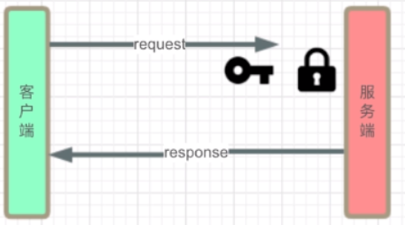

### 会话控制的分类


- cookie： 将数据保存到**客户端**（浏览器）
- session： 将数据保存到**服务器端**


### cookie（饼干，甜点）

#### 查看cookie

在浏览器中查看

- 在application--> cookie中查看。
- 在发送请求时的请求头中查看

#### 理解cookie

- cookie是将数据持久化（保存）存储到客户端（浏览器）的一种技术
- cookie是**键值对格式的字符串**
- 可以通过浏览器查看某个网站的cookie
- 如果浏览器保存了cookie，则向服务器发请求时，就会**自动带上这个cookie**。具体来说是把cookie放在请求头中，发送给服务器。


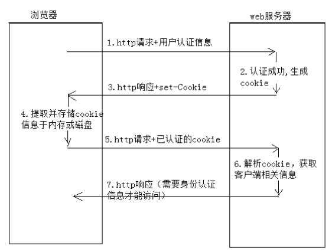


#### 从服务器设置cookie给客户端

##### 原生的方法

设置单个cookie

```javascript
//通过res.setHeader来设置响应头。
res.setHeader('set-cookie', 'name=curry');
```

设置多个cookie

```javascript
//通过res.setHeader来设置响应头。
//理解为这是一个键值对，多个cookie也只能写在一个setHeader()中。如果写两次res.setHeader()则后面一句会覆盖前面的设置。
res.setHeader('set-cookie', ['name=curry', 'age=30']);
```

如果cookie值是中文的话，还要对这个值进行额外的编码。

```
let name = new Buffer('好汉').toString('base64'); //5aW95rGJ
var info = new Buffer('5aW95rGJ', 'base64').toString();
```

##### express中提供的方法

express框架给我们提供了一个res.cookie方法，用来设置cookie

`res.cookie(cookie名, cookie值,{属性});`

#### cookie详细设置

参考：https://developer.mozilla.org/zh-CN/docs/Web/HTTP/Headers/Set-Cookie

从服务器端发送cookie给客户端，本质是通过设置Set-Cookie这个特殊的响应头来实现的，其中包括了对应的cookie的名称，值，以及各个属性。

```html
Set-Cookie: <cookie-name>=<cookie-value> 
Set-Cookie: <cookie-name>=<cookie-value>; Expires=<date>
Set-Cookie: <cookie-name>=<cookie-value>; Max-Age=<non-zero-digit>
Set-Cookie: <cookie-name>=<cookie-value>; Domain=<domain-value>
Set-Cookie: <cookie-name>=<cookie-value>; Path=<path-value>
Set-Cookie: <cookie-name>=<cookie-value>; Secure
Set-Cookie: <cookie-name>=<cookie-value>; HttpOnly
Set-Cookie: <cookie-name>=<cookie-value>; SameSite=Strict
Set-Cookie: <cookie-name>=<cookie-value>; SameSite=Lax

// Multiple directives are also possible, for example:
Set-Cookie: <cookie-name>=<cookie-value>; Domain=<domain-value>; Secure; HttpOnly
```

一个cookie所具有的主要的属性包括：

- Domain：域，表示当前cookie所属于哪个域或子域下面。对于服务器返回的Set-Cookie中，如果没有指定Domain的值，那么其Domain的值是默认为当前所提交的http的请求所对应的主域名的。比如访问 http://www.example.com，返回一个cookie，没有指名domain值，那么其为值为默认的www.example.com。
- Path：表示cookie的所属路径。
- Expire time/Max-age：表示了cookie的有效期。expire的值，是一个时间，过了这个时间，该cookie就失效了。或者是用max-age指定当前cookie是在多长时间之后而失效。如果服务器返回的一个cookie，没有指定其expire time，那么表明此cookie有效期只是当前的session，即是session cookie，当前session会话结束后，就过期了。对应的，当关闭（浏览器中）该页面的时候，此cookie就应该被浏览器所删除了。
- secure：表示该cookie只能用https传输。一般用于包含认证信息的cookie，要求传输此cookie的时候，必须用https传输。
- httponly：表示此cookie必须用于http或https传输。这意味着，浏览器脚本是不允许访问操作此cookie的(你不能在浏览器端通过document.cookie访问)。


#### 设置有效期 

expires字段来用设置这个cookie在哪个时间内是有效的。值得注意的是，时间格式是UTC时间格式（ 不是中国时间）。

具体的语法是：

`"cooke-name=cookie-value;expires=UTC时间"`

如下原生的写法

```
res.setHeader('set-cookie', ['id=1;expires=' + new Date(Date.now() + 1000 * 5).toUTCString()]);
```

表示id=1这个cookies在5秒之后失效。

使用express带的setCookie，则可以

`res.cookie('name', 'ok', { expires: new Date(Date.now() + 1000*5) })`

#### 在服务器端获取cookie

客户端浏览器向服务器发请求时，会自动在请求头上携带cookie，具体来说它被保存在req.headers.cookie中。要注意取到的cookie中只包括键值对，而cookies的属性（如过期时间）是看不到的。我们可以打印出来看看

```javascript
req.headers.cookie; //isLogin=true; name=xsfss
```

这个字符中中包含了全部的cookie，为了把它们的值解析出来成一个对象，我们可以通过node的核心对象querystring来进行解析。

`手动解析`

```javascript
// 1. 把; 替换成&，以让querystring能够解析
let cookiestr = req.headers.cookie.replace('; ', '&');
console.log(req.headers.cookie);
console.log(cookiestr);
// 2 解析成对象
let cookieObj = qs.parse(cookiestr);
let { isLogin, name } = cookieObj;

```

`cookie-parser进行解析`

如果想快速解析，则可以使用cookie-parser这个包。

先安装`npm install cookie-parser`

再使用：

```
var cookieParser = require('cookie-parser');
app.use(cookieParser());

// 某个具体的路由回调函数中，cookies会以对象的格式保存在req对象中
console.log(req.cookies);
```


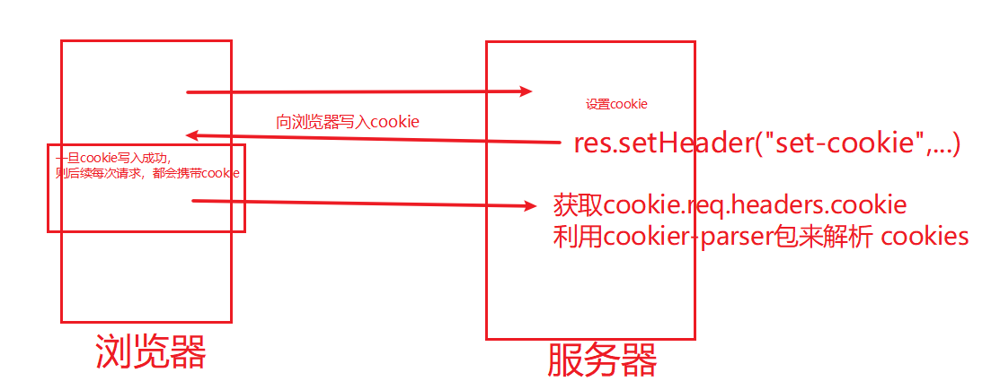

#### 删除cookie

express框架提供了一个删除方法。从服务器端删除:

```javascript
app.get('/quit', (req, res) => {

  res.clearCookie('name');
  res.clearCookie('isLogin');
  res.redirect('/login.html');
});
```


### 留言板案例-步骤

#### 准备后端

```

// 1.处理跨域问题- 带cookie的跨域

// app.all 以所有请求方式来访问  ， * 全部
app.all('*', function(req, res, next) {
  console.log(`${Date.now()}:来自${req.connection.remoteAddress} 访问了 ${req.method}-${req.url}。参数是：${req.query},携带cookie:${req.headers.cookie}`);
  res.header('Access-Control-Allow-Origin', req.headers.origin); //需要显示设置来源
  res.header('Access-Control-Allow-Headers', 'Origin, X-Requested-With, Content-Type, Accept');
  res.header('Access-Control-Allow-Methods', 'PUT,POST,GET,DELETE,OPTIONS');
  res.header('Access-Control-Allow-Credentials', true); //后端能收cookies
  next();
});

// 2.解析cookie
const cookieParser = require("cookier-parser");
app.use( cookieParser()) 

// 正常写接口

app.post("/login",(req,res)=>{
/// 代码判断

if(登陆成功){
	// 写入cookie 
	// 后续请求都会带cookie
	res.setHeader('set-cookie', 'name=curry'); //原生的
	
}
})

app.get("/checklogin",(req,res)=>{
	// 取出本次请求中携带的cookie ==> req.headers.cookie
	// 看不是我上次设置的
	console.log( req.cookies )
	
})

```

#### 准备前端

给每一个ajax请求都加上 crossDomain, xhrFields属性

```

$.ajax({

crossDomain: true,//跨域
xhrFields: {
	withCredentials: true //带cookie
},


url,
type,
data,
success:function(){}
})
```


### session

#### 原理

session 从字面上讲，就是会话。这个就类似于你和一个人交谈，你怎么知道当前和你交谈的是张三而不是李四呢？对方肯定有某种特征（长相等）表明他就是张三。

session 也是类似的道理，服务器要知道当前发请求给自己的是谁。为了做这种区分，服务器就要给每个客户端分配不同的“身份标识”，然后客户端每次向服务器发请求的时候，都带上这个“身份标识”，服务器就知道这个请求来自于谁了。至于客户端怎么保存这个“身份标识”，可以有很多种方式，对于浏览器客户端，默认采用 cookie 的方式来保存这个身份标记。

服务器使用session把用户的信息临时保存在了服务器上，用户离开网站后session会被销毁。这种用户信息存储方式相对cookie来说更安全，可是session有一个缺陷：如果web服务器做了负载均衡，那么下一个操作请求到了另一台服务器的时候session会丢失。或者服务器重启了session数据也会丢失。


#### 安装包

在express框架下， 我们可以通过安装  `express-session` 包来实现session的功能。

#### 设置

```javascript
//1. 引入session包
const session = require('express-session');

const app = express();

//2. 配置项
let conf = {
  secret: '123456', //加密字符串。 使用该字符串来加密session数据，自定义
  resave: false, //强制保存session即使它并没有变化
  saveUninitialized: false //强制将未初始化的session存储。当新建了一个session且未
  //设定属性或值时，它就处于未初始化状态。
};

//3. 使用express-session
app.use(session(conf));

```

#### 设置session

```
app.post('/loginAPI', (req, res) => {
    // 此处省略用户信息校验
    // 直接通过req.session来设置
	req.session.isLogin = true;
    req.session.name = req.body.username;
    res.end()
}

```

#### 获取session

```javascript
app.get('/index.html', (req, res) => {
    console.log(req.session)
}
```

#### 删除session

```javascript
app.get('/quit', (req, res) => {
    req.session.destroy();
}
```


#### 参考代码

```javascript
const express = require('express');
const session = require('express-session');
const bodyparser = require('body-parser');
const qs = require('querystring');
const app = express();

//2. 配置项
let conf = {
  secret: '4ey32erfyf3fgpg', //加密字符串。 使用该字符串来加密session数据，自定义
  resave: false, //强制保存session即使它并没有变化
  saveUninitialized: false //强制将未初始化的session存储。当新建了一个session且未
  //设定属性或值时，它就处于未初始化状态。
};
//3. 注册为express-session中间件
app.use(session(conf));
app.use(bodyparser.urlencoded({ extended: false }));
app.use(express.static('public'));

app.post('/loginAPI', (req, res) => {
  res.send(req.body.username);
  req.session.isLogin = true;
  req.session.name = req.body.username;
 
  let str = `
  <h1>${req.body.username}登录成功</h1>
  <a href='./vip.html'>vip</a>
  
  `;
  res.send(str);
});
app.get('/vip.html', (req, res) => {
  // session的值可以是任何的数据类型，比如布尔，数组，对象等
 
  let { isLogin, name } = req.session;

  if (isLogin) {
    let htmlstr = `
    <h1>weclome ${name}</h1>
    <a href='./quit'>退出</a>
    `;
    res.send(htmlstr);
  } else {
    res.send('<h1>请先登录</h1> <a href="./login.html">登录</a>');
  }
    
});

app.get('/quit', (req, res) => {
  req.session.destroy();
  res.redirect('/login.html');
});

app.listen(3000, () => {
  console.log(3000);
});
```


### cookie、session原理

cookie原理：

- 从服务器端向客户端浏览器留下信息；
- 浏览器每次访问服务器时都带上这些信息；

session原理：

- 服务器端会为每个用户（浏览器）各自保存一个session（文件）。当服务器保存session之后，会以cookie的形式告诉浏览器，你的session号是哪一个。它把session号返回给了浏览器，而把真实的数据保存在服务器。
- 下次再来访问服务器的时候，浏览器就会带着它自己的session号去访问，服务器根据session号就可以找到对应的session了。


### cookie和session的优缺点

cookie：优点是节省服务器空间，缺点不安全。不要保存敏感信息。

session：优点是安全，缺点需要服务器空间， 是一种最常见的解决方案。


### 小结- 跨域带cookie

如果是发跨哉的ajax请求需要带上cookie的话，要处理如下：

后端

```javascript
app.all('*', function(req, res, next) {
  console.log(`${Date.now()}:来自${req.connection.remoteAddress} 访问了 ${req.method}-${req.url}。参数是：${req.query},携带cookie:${req.headers.cookie}`);
  res.header('Access-Control-Allow-Origin', req.headers.origin); //需要显示设置来源
  res.header('Access-Control-Allow-Headers', 'Origin, X-Requested-With, Content-Type, Accept');
  res.header('Access-Control-Allow-Methods', 'PUT,POST,GET,DELETE,OPTIONS');
  res.header('Access-Control-Allow-Credentials', true); //带cookies
  next();
});
```

前端

```javascript
 $.ajax({
     crossDomain: true,
     xhrFields: {
         withCredentials: true
     },
     url,
     type
 })
```


