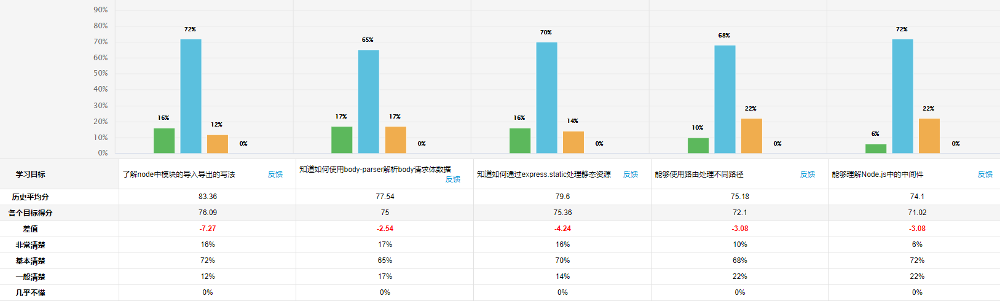

| 姓名 | 意见或建议                                                   |
| ---- | ------------------------------------------------------------ |
| ***  | 中间件就相当于人为添加的代码，类似于插件。这样讲对不？？     |
| ***  | 嗯 不错不错                                                  |
| ***  | 凡哥,游客登录系统的案例,front.get('/getdetail',(req,res)=>{})是作为一个中间件吗?,回调函数没有参数next啊?还有最后app.use('/front', (req,frontRouter);不太理解,frontRouter也是作为一个中间件吗?`路由中间件` |
| ***  | 有点难                                                       |
| ***  | const express = require('express'); const user = express.Router(); user.get('/user', (req, res) => res.send('用户获取成功')) user.post('/user', (req, res) => res.send('用户增加成功')) user.put('/user', (req, res) => res.send('用户修改成功')) user.delete('/user', (req, res) => res.send('用户删除成功')) module.exports = user; const express = require('express'); const app = express(); const userRouter = require('./router/user'); app.use('/user', userRouter); 中间件 /user 去匹配的时候，只匹配/user 的请求，他是怎么匹配到userRouter对象中的地址的，如果要访问要在 地址上输入/user/user 才能正常的工作，为什么输入这个地址就能访问到？ |
| ***  | data和date总区分不开                                         |
| 刘宵 | 怎么样能容易学习！`有效，高效  学习 = 熟悉（85%） + 意外(15%)    ` |




```
require() // 导入

module.exports
exports

```


