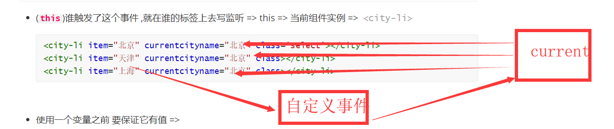

# Vue基础第五天笔记

## 反馈 

| ***  | 建议老师把特别难的东西放在最后讲，这样有个缓冲...今天最后两节课听得不好，因为难的给弄蒙了 |
| ---- | ------------------------------------------------------------ |
| ***  | 懵逼树上懵逼果，懵逼树下我懵逼                               |
| ***  | 我变秃了，也变强了                                           |
| ***  | 老师,能说一下子传父案例中事件监听放在组件标签和组件内标签上的依据吗? |
| ***  | 挺好哒，又是我，不要讲太快哟，很棒，嘻嘻嘻~                  |
| ***  | 带劲嗷                                                       |
| ***  | 子组件给父组件传值，第一步，v-for，循环显示（北京，上海，天津）是用的父传子吗? 本题的思路是父传子，先把item的值显示页面。子再把值传给父，用了$emits,定义一个变量接收子传过的值，然后父把接收的值又传给儿子，（子组件 根据当前选中和循环项目比对 得出 哪个城市 得到 select class ，这个比较不太懂），总体为什么要经过三步，父亲为什么要传两次值给子组件 |
| ***  | 父子嵌套，子对象定义的时候放的位置是否有要求，我同桌定义出来的两哥父子组件的位置可以颠倒放，我的就不可以 //在我着这个代码是错误的 <div id="app"> <parent-a></parent-a> </div> <script src="./vue.js"></script> <script> var parentA = { template: `<div>我是爸爸 <child-b></child-b> </div>`, components: { "child-b": childB } }; var childB = { template: `<div>{{content}}</div>`, data() { return { content: "我是儿子" }; } }; var vm = new Vue({ el: "#app", data: {}, methods: {}, components: { "parent-a": parentA } }); |
| ***  | 为什么子组件给父组件传值时的那三个点击的子组件，点击其中一个计算属性改变，其他两个也会变？它们不是三个独立的vue实例吗？ |
| ***  | 很棒                                                         |
| ***  | 局部组件命名时，组件名不写引号的话用abc这种格式的可以，但是用abc-d这种格式不可以，如果用abc-d这种格式必须加引号 是这样吗？对象命名是不能用abc-d这种格式吗？想让老师帮我们总结一下命名规范，Thanks♪(･ω･)ﾉ |

## 复习 

* (**`this`**)谁触发了这个事件 ,就在谁的标签上去写监听 => this => 当前组件实例 =>  <city-li>

  ```html
  <city-li item="北京" currentcityname="北京" class='select'></city-li>
  <city-li item="天津" currentcityname="北京" class></city-li>
  <city-li item="上海" currentcityname="北京" class></city-li>
  ```


* 使用一个变量之前 要保证它有值 => 
* 父传子 =>子自定义事件 => 父 =>父更新自己的数据 => 数据变化 => 视图变化 =>
* 

* json中key的命名 => 如果有特殊字符,需要对key引号
* 组件 /路由=>组件独立的Vue实例 => 特殊的Vue实例
* template/data带返回值的函数 
* Vue实例有的 组件都有
* spa => 实现原理 =>hash值改变 页面不刷新
* vue-router =>导航/容器/实例化 /配置路由表/挂载

## 基础-路由-vue-router-动态路由

> **`目标`**掌握Vue-router的动态路由如何使用
>
> - 点击**`列表页`** 跳转到**`详情页`**时,跳转的链接需要**`携带参数`**,会导致**`页面path`**不同
> - 当**`页面path不同`**却需要对应**`同一个组件`**时,需要用到**`动态路由`**这一概念
>
> 此时可以通过路由传参来实现，具体步骤如下：
>
> 1. 路由规则中增加参数，在path最后增加 **:`id`**
>
> **`注意`**这里的id相当于我们给路由加了参数 叫做**`id`**
>
> ```js
> { name: 'users', path: '/users/:id', component: Users },
> ```
>
> 2. 通过 <router-link> **`传参`**，在路径上传入具体的值(**`实参`**)
>
> ```html
> <router-link to="/users/120">用户管理</router-link>
> ```
>
> 3. 在组件内部可以使用，**`this.$route`** 获取当前路由对象  并通过**`params`**获取定义的参数**`id`**
>
> ```js
> var Users = {
>   template: '<div>这是用户管理内容 {{ $route.params.id }}</div>',
>   mounted() {
>       console.log(this.$route.params.id);
>   }
> };
> ```
>
> | 路由规则                      | 匹配路径            | $route.params                          |
> | ----------------------------- | ------------------- | -------------------------------------- |
> | /user/:username               | /user/evan          | `{ username: 'evan' }`                 |
> | /user/:username/post/:post_id | /user/evan/post/123 | `{ username: 'evan', post_id: '123' }` |
>
> **`任务`**定义一个数组list["红烧肉","北京烤鸭","卤煮火烧"].渲染生成导航,实现点击每个导航时,指向同一个组件,并显示点击的导航名称
>
> **注意** 动态路由的参数 可以通过 vue实例.$route.params获取
> 
> **`关于具体实现参考课程提供的代码`**

## 基础-路由-vue-router-to属性赋值

> **`目标`**掌握 vue-router中的to的多种赋值方式
>
> - to 有多种赋值方式  

```html
<!-- 常规跳转 -->
      <!-- <router-link to="/sport">体育</router-link> -->
      <!-- 变量 -->
      <!-- <router-link :to="path">体育</router-link> -->
      <!-- 根据对象name跳转 -->
      <!-- <router-link :to="{name:'abcdefg'}">体育</router-link> -->
      <!-- 根据对象path跳转 -->
      <!-- <router-link :to="{path:'/sport'}">体育</router-link> -->
      <!-- 带参数的跳转 -->
      <router-link :to="{name:'abcdefg',params:{a:1}}">体育</router-link>
```

**注意：如果提供了 path，params 会被忽略，上述例子中的name并不属于这种情，你可以提供路由的 name 并手写完整的参数params：**

**`任务`**

1. 用vue-router实例化路由 
2. 导航为 北京 上海 
3. 分别采用四种赋值方式 将上海跳转到对应的组件
4. 在北京跳转时 实现 带参数的跳转

**`关于具体实现参考课程提供的代码`**

## 基础-路由-vue-router-重定向

> **`目标`**掌握路由-vue-router-重定向
>
> 场景: 当希望某个页面被强制中转时  可采用redirect 进行路由重定向设置
>
> **`拦截谁就在谁的路由表上写redirect`**
>
> ```json
> {
> path: "/sport",
> redirect: "/news", // 强制跳转新闻页
> component: {
>  template: `<div>体育</div>`
> }
> },
> ```
>
> **`任务`**
>
> 1. 实例化一个vue路由
> 2. 导航为 bj => 北京  sh => 上海 tj => 天津
> 3. 实现当跳转到天津时 直接重定向到北京
>
> **`关于具体实现参考课程提供的代码`**

## 基础-路由-vue-router-编程式导航

> **`目标`**掌握路由-vue-router-**`编程式`**导航
>
> - 跳转不同的组件 不仅仅可以用**`router-link`** 还可以采用**`代码行为`**
> - (Vue实例)**`this.$router`** 可以拿到当前路由对象的实例
> - **`注意`** 前面小节获取数据用到的是 **`$route`**,这里用到的是**`$router`**
> - 路由对象的实例方法 有 push  replace, go()  
> - **`router-link`**和**`push`**方法都是追加历史记录
> - push 方法 相当于往历史记录里推了一条记录 如果点击返回 会回到上一次的地址
> - replace方法 想相当于**`替换`**了当前的记录  历史记录并没有多 但是**`地址会变`**
> - go(数字) 代表希望是前进还是回退,当数字大于0 时 就是前进 n(数字)次,小于0时,就是后退n(数字)次
>
> 可以通过vue实例 获取当前的路由实例 $router 
>
> ```js
> goPage() {
> // 跳转到新闻页面
>   this.$router.push({
>     path: "/news"
>   });
> }
> ```
>
> **`任务`**
>
> 1. 实例化一个导航路由
> 2. 四个页面为A,B,C,D 
> 3. A页面中有一个按钮，点击跳到B页面
> 4. B页面有一个按钮，点击跳转到C页面，但是**`不追加历史纪录`**
> 5. C页面有一个按钮，点击跳到D页面，
> 6. D页面有一个按钮，点击直接回到A页面，而且页面**`不能再进行返回`**(之前的回退记录)

## 基础-路由-vue-router-routerlink-tag-激活样式

> **`目标`**: 掌握如何设置当前激活路由的样式
>
> - 当前路由在导航中是拥有激活class样式的
>
> 审查导航元素,可以发现 激活样式
>
> ```html
>	<a href="#/news" class="router-link-exact-active router-link-active">新闻</a>
> ```
> 
> 设置激活class样式即可
>
> **`任务`**
>
> 1. 实例化一个vue-router导航
>2. 北京- 上海- 天津
> 3. 让当前路由的导航 字体48px  加粗 颜色红色

## 基础-路由-vue-router-嵌套路由

>   **`目标`** 掌握如何实现一个嵌套路由
>
>   * 如果存在**`路由嵌套`**,就需要提供多个视图容器<router-view></router-view>
>
>   * 同时,router-link和router-view 都可以添加类名、设定样式
>
>   **`任务`** 
>
>   1. 实现一个嵌套路由   
>   2. 第一级路由为 热点 教育 社会 音乐
>   3. 音乐下 二级路由为 流行.古典.爵士
>
>   **要注意，以 / 开头的嵌套路径会被当作根路径。 这让你充分的使用嵌套组件而无须设置嵌套的路径。**
>
>   即
>
>   ```js
>   {
>       path:'/music',
>       children:{
>           path:'/pop'  //此时该条路由 就是 /pop
>       }
>   }
>   // 如果想使用 /music/pop 可以这样
>   {
>       path:'/music',
>       children:{
>           path:'/music/pop'  //此时该条路由 就是 /music/pop
>       }
>   }
>   // 或者
>   {
>       path:'/music',
>       children:{
>           path:'pop'  //此时该条路由 就是 /music/pop
>       }
>   }
>   ```
>
>   **`注意`**如果一个需要给子路由一个默认的显示 可以配置一个默认的选项
>
>   ```js
>    {
>         path: '/user/:id', component: User,
>         children: [
>           // 当 /user/:id 匹配成功，
>           // UserHome 会被渲染在 User 的 <router-view> 中
>           { path: '', component: UserHome },
>   
>           // ...其他子路由
>         ]
>       }
>   ```
>
>   
>
>   路径: 实现一个嵌套路由
>
>   ​        1  引入vue-router
>
>   ​        2  页面导航 
>
>   ​        3  页面视图 => 子视图
>
>   ​        4  实例化router 
>
>   ​        5  router选项
>
>   ​        6  挂载router
>
>   ```js
>   // 实例化 router
>    var router = new VueRouter({
>      routes: [
>        {
>          path: "/hot",
>          component: {
>            template: `
>            <div>热点</div>
>            `
>          }
>        },
>        {
>          path: "/tech",
>          component: {
>            template: `
>            <div>教育</div>
>            `
>          }
>        },
>        {
>          path: "/soc",
>          component: {
>            template: `
>            <div>社会</div>
>            `
>          }
>        },
>        {
>          path: "/music",
>          component: {
>            template: `
>            <div>
>             <router-link to="/music/pop">流行</router-link>
>             <router-link to="/music/tra">古典</router-link>
>             <router-link to="/music/jazz">爵士</router-link>
>             <router-view></router-view>
>            </div>
>            ` // 组件中放入 嵌套的导航 和视图容器
>          },
>          // children承载嵌套路由对象
>          children: [
>            {
>              path: "/music/pop",
>              component: {
>                template: `<div>
>                流行音乐
>                </div>
>                `
>              }
>            },
>            {
>              path: "/music/tra",
>              component: {
>                template: `<div>
>                古典音乐
>                </div>
>                `
>              }
>            },
>            {
>              path: "/music/jazz",
>              component: {
>                template: `<div>
>                爵士音乐
>                </div>
>                `
>              }
>            }
>          ]
>        },
>        {
>          path: "/sport",
>          component: {
>            template: `
>            <div>体育</div>
>            `
>          }
>        }
>      ]
>    });
>    var vm = new Vue({
>      el: "#app",
>      data: {},
>      methods: {},
>      router
>    });
>   </script>
>   ```

## Vue中的动画过渡

>**`目标`**掌握如何在过渡动画中自动应用class
>
>Vue 提供了 `transition` 的封装组件，在下列情形中，可以给任何元素和组件添加进入/离开过渡
>
>- 条件渲染 (使用 `v-if`)
>- 条件展示 (使用 `v-show`)
>
>* 基本用法就是给我们需要动画的标签外面嵌套**`transition`**标签 ,并且设置name属性
>* Vue 提供了 `transition` 的封装组件，在下列元素更新,移除，新增 情形中，可以给任何元素和组件添加进入/离开过渡
>* 
>
>```html
><transition name="fade"> 
><div v-show="isShow" class="box"></div>
></transition>
>```
>6中class状态 
>
>1. v-enter：定义进入过渡的开始状态。
>2. v-enter-active：定义进入过渡生效时的状态。
>3. v-enter-to: 2.1.8版及以上 定义进入过渡的结束状态。
>4. v-leave: 定义离开过渡的开始状态。
>5. v-leave-active：定义离开过渡生效时的状态。
>6. v-leave-to: 2.1.8版及以上 定义离开过渡的结束状态。
>
>

**`注意`**  **`v`**要替换成transition组件的name属性值

**`注意`**先要编写元素的最终展示样式

**`任务`**

1. 实现一个div 显示时 从小到大过渡
2. 实现该div隐藏时 从大到小

>

## 基础-vue-cli安装和2-3版本解释

**`目标`**了解vue-cli是什么东西,掌握vue-cli的安装及2-3版本

* 介绍: **`vue-cli`**是一个**`辅助开发工具`**=> **`代码编译`** + **`样式`** + 语法校验 + 输出设置 + 其他 ...

* 作用: 可以为开发者提供一个**`标准的项目开发结构`** 和配置  **开发者**不需要再关注

* vue-cli 一个**`命令行`**工具,最新版本也支持**`图形化`**操作,可快速搭建大型网页应用

>说明:vue-cli本质上是一个npm包,也需要通过npm去安装下载
>
>```bash 
>npm i -g @vue/cli  // 全局安装脚手架  默认安装的最新版本 3.0+
>```
>
>安装完成后  可通过 **`vue命令`**来进行检查 脚手架是否安装成功
>
>**注意** vue-cli的命令行 关键字 是**vue**
>
>查看版本
>
>```bash
>vue -V  // 查看脚手架版本号
>or 
>vue --version // 和上面等价 
>```
>
>`注意`: 默认安装的3.0+ 版本,但是企业很多还在用2.0+版本 怎么破?
>
>执行以下命令就可以 2.0 和 3.0 兼得
>
>* **`2.0和3.0创建项目的命令是不一样的`**
>
>```bash
>
>npm install -g @vue/cli-init  // 安装桥接工具 将2.0的功能补齐到目前的脚手架上
>
>```
>
>**注意**  vue生成的模板的有难有易 
>
>* 简单业务 => 简易模板 
>
>* 复杂业务 => 内容丰富模板
>
>**`任务`**
>
>1. 安装vue-cli脚手架 并 将2.0版本的补丁打到当前版本

## 基础-vue-cli创建项目

>**`目标`** 学会使用vue-cli 2.0特性创建项目
>
>创建项目: 采用 cli 2.0的特性 (生成简易模板)
>
>```bash
>#  heroes 创建的项目名称
>$ vue  init webpack-simple heroes //  webpack-simple 为模板名称 固定写法
># 切换到当前目录
>$ cd  heroes 
># 安装依赖
>$ npm install  
># 在开发模式下 启动运行项目
>$ npm run dev
>
>```
>
>创建项目: 采用 cli 3.0 特性 (两种 默认 /选填)
>
>```bash 
># 3.0下创建项目
>$ vue create heroes // create(创建) 为关键字
># 切换到当前目录
>$ cd  heroes 
># 在开发模式下 启动运行项目
>$ npm run serve
>```
>
>**注意** 3.0 +创建项目时  有两种模式, 一种**`默认模式`**, 一种选择模式,
>
>默认模式:一种标准的模板
>
>选择模式 可以根据自己的需求选择需要的工具和模式
>
>**`任务`**
>
>1. 分别使用vue-cli 2.0 和 3.0特性创建一个叫做heroes的项目 
>2. 分别启动运行

## 基础-vue-cli项目目录解释

>**`目标`**对2.0项目目录生成的模板文件进行识别认识
>
>.bablelrc=>存放 babel编译的配置信息 () => es6 => es5 
>
>.editorconfig => 存放编辑器的配置信息
>
>.gitignore => git忽略文件
>
>index.html => 单页应用的html
>
>package.json => 用于存放依赖信息 及 其他项目信息
>
>README.md => 项目介绍信息 github上的页面信息
>
>webpack.config.js => wepack工具的配置文件 => webpack是一个前端工程化的工具  编译代码 -压缩代码- 处理代码,其他....
>
>入口 main.js => 逻辑
>
>出口 build.js => index.html引入

## 基础-回顾-ES6模块的导入和导出

**`目标`**回顾ES6的导入导出

html+js+css

>**ES6**提供**import**   `变量`   **from**  `路径`   语法 来引入 组件 
>
>前提是 引入的组件 已经**`导出`**了 
>
>**var a = require("//路径")**
>
>提供 **export**  **default**  **`对象`** 语法来导出组件
>
>上面的代码 换成import 
>
>```js
>export default vue //导出对象   vue.js
>```
>
>```js
>import vue from 'vue' 
>```
>
>扩展--- 
>
>```js
>export const function  fn1() {} // 方法1
>export const function  fn2() {} // 方法2
>export const function  fn3() {} // 方法3
>// 一个文件
>```
>
>```js 
>import { fn1,fn2, fn3 } from '文件'
>```

## 基础-Vue-单文件组件及入口解析

>**`目标`**  掌握认识 Vue的单文件组件
>
>* 一个.vue文件就是一个组件
>* 一个组件分为三块 => template(页面模板),script => 组件逻辑.style => 组件样式
>
>**`注意`**Vue 选项中的 **`render`** 函数若存在，则 Vue 构造函数不会从 **`template`** 选项或通过 `el` 选项指定的挂载元素中提取出的 HTML 模板编译渲染函数。
>
>介绍: 在cli开发模式下, 一个*.vue文件就是一个组件
>
>* template 组件的页面结构 代表它的 html 结构 
>
>* 必须在里面放置一个 html 标签来包裹所有的代码 
>* 我们在其他地方写好了一个组件，然后就可以在当前template中引入
>
>* script  组件的逻辑结构及数据对象
>
>
>* style 组件的样式
>
>*  就是针对我们的 template 里内容出现的 html 元素写一些样式 
>
>**`注意`**: vue-cli的作用就是让我们把精力放在业务编码上,一切准备的工作交给vue-cli去做
>
>**`任务`** 
>
>1. 新建一个名为 Menu的组件 
>2. 内容为 一个横向菜单   商城   团购   拼团   省钱帮 
>3. 菜单高60px  水平居中  字体大小为20px  颜色为 red  背景色 为 #CCCCCC
>4. 实现组件在页面上展示
>
>

## 基础-示例项目效果演示

>**`目标`**演示示例项目的最终效果 分拆功能
>
>英雄项目演示 =>  功能拆分 => 路由 => 嵌套路由 =>  列表 =>  新增 修改 删除  更新  

## 基础-示例项目-导入素材处理样式

>**`目标-任务`**:将项目所需样式导入到项目中 
>
>* 安装 bootstrap固定版本
>
>```bash 
>npm i  bootstrap@3.3.7
>```
>
>安装完成之后 ,在入口处引入js文件
>
>```js
>import "./../node_modules/bootstrap/dist/css/bootstrap.css"; // 引入 bootstarp的样式文件
>import "./assets/index.css"; // 引入index.css
>
>```
>
>重启运行,发现bootstrap.css文件 运行报错 
>
>根据错误 需要在webpack.config.js增加对不识别文件的处理
>
>```js	
>{
>   test: /.(ttf|woff2|woff|eot)$/,
>   loader: "file-loader",
>   options: {
>     name: "[name].[ext]?[hash]"
>   }
> }
>```
>
>

## 基础-示例项目-提取公共组件-头部-侧边栏-列表,并预览效果

>**`目标-任务`**:将静态内容的 头部 侧边栏 , 列表分别封装成Vue组件 ,并在视图中显示
>
>**`路径`** 提取组件
>
>1. 新建vue文件
>
>2.  拷贝html静态内容到 template中
>3.  在app.vue中引入注册组件
>4. 注册在app.vue的组件中 
>5. 在app.vue的模板中使用注册组件 

## 复习 

## 总结 

* 路由 => 动态路由 => 多个路径对应同一个组件 =>传参 => 1.定义 路由参数  /bj/:name 2 /bj/abc 3 $route.params.name
* to属性赋值 =>  字符串/变量/对象=> path /name
* 重定向 => redirect => 拦截谁在谁的路由上写redirect
* 嵌套路由 => 一级路由 => 二级路由  => 一级路由的组件里 写 导航/视图 一级路由=>children  =>二级路由表
* 编程式导航 => router-link(标签跳转) => 代码跳转 => this.$router (路由对象实例) push/replace/go
* vue-cli 脚手架 =>2.0/3.0 => 先安装3.0  => 装2.0补丁
* webpack.config.js  => 编译代码 打包代码 => 
* index.html => 单页应用 => build.js => webpack.config.js => main.js(入口)
* main.js  =>实例化Vue =>import  from  => 引入组件/导出组件
* export default {}  / import 变量名 from  路径
* 单文件组件 => 一个>vue文件就是一个组件 => template/script/style