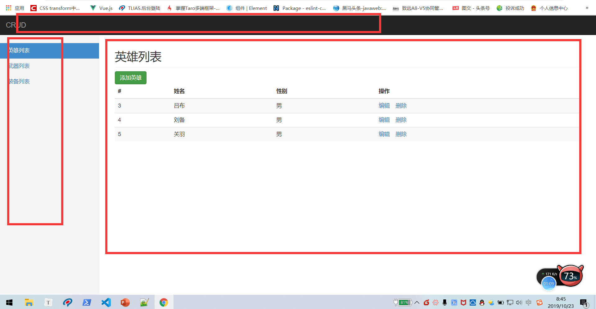
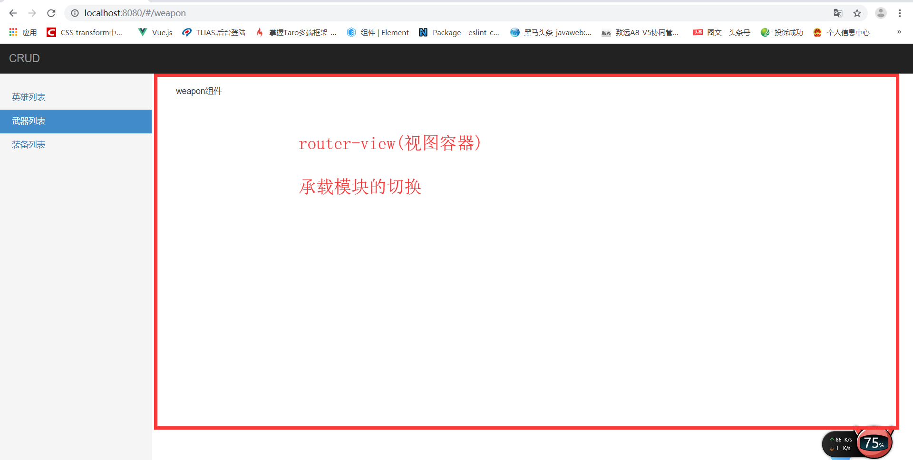

# Vue基础第六天笔记

## 反馈 

| ***  | 路由和组件都混一块了 傻傻说不明白                            |
| ---- | ------------------------------------------------------------ |
| ***  | 希望今天老师能多讲点面试的事，拖拖堂                         |
| ***  | 希望老师多扩展一些知识                                       |
| ***  | 老师,子组件是必须在父组件里声明吗?还是在全局组件内部引用由另一个全局组件的标签就是父子关系? |
| ***  | 1.刚开始学Vue时的ppt 2.听会做废，无奈，迷茫，焦虑            |
| ***  | 老师说路由中建议同一个组件，可是后面讲的案例都是用的不同组件，怎么区分用同一个组件还是不同的组件哪个场景适合呢 |
| ***  | 为什么window.onhashchange=func之后，刷新页面之后，原先的数据就一直在了？ |
| ***  | 如果用动态路由，怎么使用redirect呀                           |

## 复习 

* 路由 => spa => 根据地址切换对应的组件 地址 =>组件
* 组件 => 单独的Vue实例 =>  模板(template) script style
* 父模板中 => 使用了子组件的标签 => 
* 动态路由 => 列表页 => 详情页 =>详情页的页面结构一样的, =>id => 动态路由传参 => 1 定义参数 2  传参 3 $route.params.
* redirect => 将当前地址跳转到其他地址
* 单文件组件 => .vue文件就是一个组件 => export default {}
* import  from  vue-cli => 脚手架 => 
* 1.0.0 => 1.0.1 => 1.1.1  => 小版本 一般修复bug,丰富一些体验
* 1.9.1 => 2.0.0 => 大版本  => 命令/功能/用法/目录
* 2.0/3.0 

## 基础-示例项目效果演示

> **`目标`**演示示例项目的最终效果 分拆功能
>
> 
>
> 英雄项目演示 =>  功能拆分 => 路由 =>  列表 =>  新增 修改 删除  更新  
>



* 英雄列表的增删改查
* spa  路由 => 嵌套路由/动态路由
* vue-cli 项目开发

## 基础-示例项目-导入素材处理样式

> **`目标-任务`**:将项目所需样式导入到项目中 
>
> - 安装 bootstrap固定版本
> - npm i  包名  -S/--save  安装到运行时依赖
> - npm  i 包名  -D/--save--dev 安装到开发时依赖
>
> ```bash 
> npm i  bootstrap@3.3.7
> ```
>
> 安装完成之后 ,在main.js入口处引入js文件
>
> ```js
> import "./../node_modules/bootstrap/dist/css/bootstrap.css"; // 引入 bootstarp的样式文件
> import "./assets/index.css"; // 引入index.css
> 
> ```
>
> 重启运行,发现bootstrap.css文件 运行报错 
>
> 根据错误 需要在webpack.config.js增加对**`不识别文件`**的处理
>
> ```js	
> {
> test: /.(ttf|woff2|woff|eot)$/,
> loader: "file-loader",
> options: {
> name: "[name].[ext]?[hash]"
> }
> }
> ```
>
> 

## 基础-示例项目-提取公共组件-头部-侧边栏-列表,并预览效果

> **`目标-任务`**:将静态内容的 头部 侧边栏 , 列表分别封装成Vue组件 ,并在视图中显示
>
> **`路径`** 提取组件
>
> 1. 新建vue文件
> 2. 拷贝html静态内容到 template中
> 3. 在app.vue中引入注册组件
> 4. 注册在app.vue的组件中 b bn                                                                                                                                                                                                                                                                                                                                                                                                                                                                                                                                                                                                                                                                                                                                                                                                                                                                                                                                                                                                                                                                                                                                                                                                                                                                                                                                                                                                                                                                                                                                                                                                                                                                                                                                                                                                                                                                                                                                                                                                                                                                                                                                                                                                                                                                                                                                                                                                                                                                                                                                                                                                                                                                                                                                                                                                                                                                                                                                                                                                                                                                                                                                                                                                                                                                                                                                                                                                                                                                                                                                                                                                                                                                                                                                                                                                                                                                                                                                      
> 5. 在app.vue的模板中使用注册组件 

## 基础-示例项目-提取路由模块

**`目标-任务`** 在示例项目中 提取路由模块,并应用视图

>**`路径`**  提取路由模块
>
>1  安装路由 
>
>```bash 
>npm i vue-router // 安装路由模块
>```
>
>2   在main.js中引入 路由模块
>
>```js
>import VueRouter from 'vue-router ' // 引用router
>```
>
>3  使用router 
>
>```js 
>Vue.use(VueRouter) // 使用router
>```
>
>4   实例化 router 
>
>```js 
>const router = new VueRouter({
>routes:[] //实例化routes
>})
>```
>
>5  配置理由表
>
>```js
>const router = new VueRouter({
>routes: [
>{ path: "/heroes", component: AppList },
>{ path: "/foo", component: Foo },
>{ path: "/bar", component: Bar }
>] // 路由表
>}); // 实例化router
>```
>
>
>
>**注意** 一般来说 路由表 需要单独一个文件   可以将router提取成一个js文件 
>
>6   提取 三个组件 appList(主要 )  Foo(组件) Bar(组件) 完善路由表
>
>```html
><template>
><div>Bar组件</div>
></template>
>
><script>
>export default {};
></script>
>
><style>
></style>
>
>```
>
>
>
>7   在App.vue中假如路由承载视图
>
>```html
><div>
><AppHeader></AppHeader>
><div class="row">
> <AppSilder></AppSilder>
>    <div class="col-sm-9 col-sm-offset-3 col-md-10 col-md-offset-2 main">
>      <router-view></router-view> // 加入承载视图
>    </div>
></div>
></div>
>```

## 基础-示例项目-json-server-启动接口服务器

>**`目标-任务`**准备json-server服务器.启动实现 数据接口 增删改查的联通
>
>**`路径`**: 启动json-server服务器
>
>1  安装json-server  
>
>**注意** json-server 是一个命令行工具,和vue以及vue-cli没有任何关系 所以安装在任何位置都可以
>
>```bash 
>npm i -g json-server // 安装json-server 
>```
>
>2  新建json文件 
>
>```json
>{
>"heroes": [
>{ "name": "张三", "id": 1, "gender": "男" },
>{ "name": "李白", "id": 2, "gender": "女" },
>{ "name": "吕布", "id": 3, "gender": "男" }
>]
>}
>
>```
>
>3  启动json-server
>
>```bash
>json-server --watch db.json 
>```
>
>

## 基础-示例项目-列表渲染

>**`目标-任务`**完成英雄列表的数据加载及渲染
>
>**`路径`**:
>
>1 安装axios 插件 
>
>```bash
>npm i axios // 安装axios插件
>```
>
>2  英雄列表组件中引入 axios , 
>
>```js 
>import axios from 'axios' // 引入axios
>```
>
>3  定义数据list
>
>```js
>data() {
>return {
> list: []
>};
>}
>```
>
>4  请求英雄列表的方法封装 
>
>```js
>loadData() {
> //restful规则
> axois.get("http:localhost:3000/heros").then(result => {
>   this.list = result.data;
> });
>}
>```
>
>5  在事件中加入 请求方法
>
>```js
>// 实例完成事件
>created() {
>//可以加
>this.loadData();
>},
>```
>
>6  渲染列表list

## 基础-示例项目-删除功能

>**`目标`**实现英雄列表的删除功能
>
>路径: 删除功能
>
>1  注册删除事件 
>
>```html
><a href="javascript:void(0)" @click="delItem(item.id)">删除</a>
>```
>
>2 定义删除方法  实现删除逻辑
>
>```js
>// 定义删除方法
>// id为要删除id的方法
>delItem(id) {
> // restful规则
> if (confirm("确认删除此条数据")) {
>   axios.delete("http://localhost:3000/heroes" + id).then(result => {
>     if (result.status === 200) {
>       // 判断删除状态 是否成功
>       this.loadData(); // 刷新数据
>     }
>   });
> }
>}
>```
>
>3  根据状态 进行刷新页面
>
>```js
>this.loadData(); // 刷新数据
>```
>
>

## 基础-示例项目-添加-渲染添加组件

>**`目标-任务`**添加组件功能的静态实现
>
>路径: 添加视图的实现
>
>1 新建add.vue组件 并写入静态内容(拷贝)
>
>```html
><!-- 添加静态内容到template模板下 -->
><div>
><h2 class="sub-header">添加英雄</h2>
><form>
><div class="form-group">
><label for="exampleInputEmail1">用户名</label>
><!-- 使用v-model的方式来绑定表单 -->
><input
>v-model="formData.name"
>type="text"
>class="form-control"
>id="exampleInputEmail1"
>placeholder="请输入姓名"
>/>
></div>
><div class="form-group">
><label for="exampleInputPassword1">性别</label>
><input
>v-model="formData.gender"
>type="text"
>class="form-control"
>id="exampleInputPassword1"
>placeholder="请输入性别"
>/>
></div>
><!-- 给添加英雄按钮注册一个事件 -->
><button type="submit" class="btn btn-success" @click="addHero">添加英雄</button>
></form>
></div>
>
>```
>
>2  在路由表中配置添加功能的路由
>
>```js
>{ path: "/add", component: Add }  // 引入组件 配置路由
>
>```
>
>3  给列表组件中的添加按钮 添加l导航 到添加功能路由的导航
>
>```html
><!-- 给添加功能添加路由导航 -->
><a class="btn btn-success" href="#/add">添加</a>
>```
>
>4  根据业务场景调整页面模板
>
>```html
><div>
><h2 class="sub-header">添加英雄</h2>
><form>
><div class="form-group">
><label for="exampleInputEmail1">用户名</label>
><input type="email" class="form-control" id="exampleInputEmail1" placeholder="请输入姓名" />
></div>
><div class="form-group">
><label for="exampleInputPassword1">性别</label>
><input type="password" class="form-control" id="exampleInputPassword1" placeholder="请输入性别" />
></div>
><button type="submit" class="btn btn-success">添加英雄</button>
></form>
></div>
>```
>
>

## 基础-示例项目-添加-功能实现

>**`目标-任务`** 实现添加英雄的功能
>
>**`路径`**:  添加功能的实现
>
>1  定义表单数据  和  表单进行绑定 
>
>```js
>data() {
>return {
> // 定义一个数据对象 存储 姓名和性别
> formData: {
>   name: "", // 姓名
>   gender: "" // 性别
> }
>};
>}  //定义一个数据对象
>```
>
>2 	注册添加按钮的点击事件 
>
>```html
><!-- 给添加英雄按钮注册一个事件 -->
> <button type="submit" class="btn btn-success" @click="addHero">添加英雄</button>
>```
>
>3   实现 添加的前后逻辑
>
>```js
>// 添加英雄方法
>addHero() {
> // 判断填报信息是否为空
> if (this.formData.name && this.formData.gender) {
>   // 该判断条件是判断 当前的姓名和 性别都不为空
>   // restful规则
>   axios
>     .post("http://localhost:3000/heroes", this.formData)
>     .then(result => {
>       // 注意这里添加成功的状态码 是 201
>       if (result.status === 201) {
>         // 添加成功之后 要跳转回列表页
>         // 编程式导航
>         this.$router.push({ path: "/heroes" });
>       } else {
>         alert("添加失败");
>       }
>     });
> } else {
>   alert("提交信息不能为空");
> }
>}
>```
>
>

## 基础-示例项目-编辑-添加编辑组件	

>**`目标-任务`**实现英雄列表的编辑功能组件渲染
>
>路径: 编辑功能渲染
>
>新建编辑组件
>
>**注意** 由于 编辑组件和添加组件页面结构基本一致  可以 直接拷贝添加组件的内容
>
>```html
><!-- 添加静态内容到template模板下 -->
><div>
><h2 class="sub-header">添加英雄</h2>
><form>
> <div class="form-group">
>   <label for="exampleInputEmail1">用户名</label>
>   <!-- 使用v-model的方式来绑定表单 -->
>   <input
>     v-model="formData.name"
>     type="text"
>     class="form-control"
>     id="exampleInputEmail1"
>     placeholder="请输入姓名"
>   />
> </div>
> <div class="form-group">
>   <label for="exampleInputPassword1">性别</label>
>   <input
>     v-model="formData.gender"
>     type="text"
>     class="form-control"
>     id="exampleInputPassword1"
>     placeholder="请输入性别"
>   />
> </div>
> <!-- 给添加英雄按钮注册一个事件 -->
> <button type="submit" class="btn btn-success" @click="editHero">编辑英雄</button>
></form>
></div>
>```
>
>

## 基础-示例项目-编辑-显示编辑数据

>**`目标-任务`**实现英雄列表的编辑功能
>
>**`路径`**:  实现编辑的显示数据 
>
>1. 添加编辑路由  **注意** 由于需要拿到编辑数据的标识 所以需要动态路由
>
>```js
>{ path: "/edit/:id", component: Edit } // 编辑组件 动态路由
>```
>
>2. 编辑按钮添加跳转路由的属性
>
>```html
><a class="btn btn-success" href="#/edit">添加</a>
>```
>
>3. 定义加载英雄方法 **注意** 通过 $router.params来获取参数
>
>```js
>// 加载英雄
>loadHero() {
> const { id } = this.$route.params; // 通过参数获取id
> if (id) {
>   //判断id
>   axios.get("http://localhost:3000/heroes/" + id).then(result => {
>     this.formData = result.data; // 获取数据并赋值给表单对象
>   });
> }
>}
>```
>
>3.  在初始化事件中 调用loadHero 方法
>
>```js
>// 实例完成事件
>created() {
>this.loadHero(); // 加载英雄
>}
>```

## 基础-示例项目-编辑-表单处理

>**`目标-任务`**实现英雄列表编辑数据的提交
>
>**`路径`**:实现编辑方法
>
>定义实现编辑提交方法
>
>```js
>// 编辑英雄
>editHero() {
> if (this.formData.name && this.formData.gender) {
>   const { id } = this.$route.params;
>   //restful规则
>   axios
>     .put("http://localhost:3000/heroes/" + id, this.formData)
>     .then(result => {
>       if (result.status === 200) {
>         this.$router.push({ path: "/heroes" });
>       } else {
>         alert("编辑失败");
>       }
>     });
> } else {
>   alert("提交内容不能为空");
> }
>}
>```
>
>

## 基础-示例项目-优化-axios统一导入

>**`目标-任务`**实现axios的统一导入
>
>**`路径`**: axios的统一导入 和使用
>
>1 在入口main.js文件中引入axios,并给全局Vue对象的原型链赋值 
>
>```js
>Vue.prototype.$http = Axios; //所有的实例都直接共享拥有了 这个方法
>
>```
>
>2  调用接口时  采用 实例.属性的方式即可调用 
>
>```js
>addHero() {
> // 判断填报信息是否为空
> if (this.formData.name && this.formData.gender) {
>   // 该判断条件是判断 当前的姓名和 性别都不为空
>   // restful规则
>   this.$http
>     .post("http://localhost:3000/heroes", this.formData)
>     .then(result => {
>       // 注意这里添加成功的状态码 是 201
>       if (result.status === 201) {
>         // 添加成功之后 要跳转回列表页
>         // 编程式导航
>         this.$router.push({ path: "/heroes" });
>       } else {
>         alert("添加失败");
>       }
>     });
> } else {
>   alert("提交信息不能为空");
> }
>}
>```
>
>

## 基础-示例项目-优化-设置baseUrl

>**`目标-任务`**通过配置**`baseUrl`**将所有的请求地址进行优化 
>
>**`路径`**: axios中配置统一的**`请求路径头`**
>
>1. 给axios中的baseUrl设置常态值
>
>```js
>Axios.defaults.baseURL = "http://localhost:3000"; // 设置共享的方法
>
>```
>
>2. 改造所有的的请求
>
>```js
>this.$http.put("heroes/" + id, this.formData).then(result => {
>     if (result.status === 200) {
>       this.$router.push({ path: "/heroes" });
>     } else {
>       alert("编辑失败");
>     }
>   });
>```
>
>

## 基础--示例项目-优化-目录划分-统一设置激活样式

>**`目标-任务`**将组件的目录进行整理划分,并统一当前路由的激活样式
>
>路径:   左侧导航激活样式  目录划分
>
>1  统一激活样式
>
>```js
>linkActiveClass: "active", // active为bootstrap中的 一个class样式
>
>```
>
>2  整理目录   分门别类
>
>路由级组件 =>  直接挂到路由上的组件叫做路由级组件 =>  views
>
>普通组件 => 在路由级组件中使用的组件 叫做普通组件  => components
>
>**注意**同一类 组件放入同一个文件夹下  修改引用地址

## 给切换路由增加过渡效果 (扩展)

>**`目标-任务`**实现项目中的路由切换过渡
>
>**`路径`**:  给路由切换加入 过渡效果 
>
>1  用过渡组件包裹路由视图
>
>```html
><transition name="slide">
>     <router-view></router-view>
>   </transition>
>```
>
>2  编写 过渡效果
>
>```css
>.slide-enter,
>.slide-leave-to {
>opacity: 0;
>}
>.slide-enter-to,
>.slide-leave {
>opacity: 1;
>}
>.slide-enter-active {
>transition: all 1s;
>}
>```
>
>

## 钩子函数

>**`目标`**掌握Vue的生命周期及其**`钩子函数`**
>
>* 生命周期是指Vue实例或者组件从诞生到消亡经历的每一个阶段，在这些阶段的前后可以设置一些函数当做事件来调用。
>
>

* beforeCreate (实例被创建前)
* created(实例被创建后)
* beforeMount(文档被挂载前)
* mounted(文档被挂载后)
* beforeUpdate(数据变化 页面更新前)
* updated(数据变化 页面更新后)
* beforeDestory(视图销毁前)
* destoryed(视图销毁后)

**`任务`**

1. 分别在以上不同的生命周期中 输出不同内容 查看不同变化


## 总结

* 英雄列表项目

* vue-cli 创建项目 2.0 

* 导入素材 

* 抽提组件 app-header(头部) app-slidbar(侧边栏)  hero-list(列表)

* 路由 => 引入路由 (安装) 

* main.js  => import VueRouter from ''

* Vue.use(VueRouter)

* 实例化路由表  配置路由表  导出路由 export default  router 

* router-link  => a 标签 => tag = "li"

* 列表加载 =>json-server => created => axios.get()

* 删除=> json-server => 点击事件  => axios.delete() => 刷新页面

* 增加英雄 => 二级路由 => appContainer =>二级路由容器

* axios.post 接口 =>  跳转回 =>英雄列表

* ```js
  {
            path: "", // 二级path路由什么都不写 代表匹配一级路由的地址默认显示
            component: heroList
    },
  ```

* 编辑 => 动态路由 => id不同 =>传参 =>this.$route.params.

* axios =>Vue.proptotype.$axios = axios

* axios => baseUrl ="http://localhost:3000"

* 钩子函数 => 八个函数  => 四个阶段 