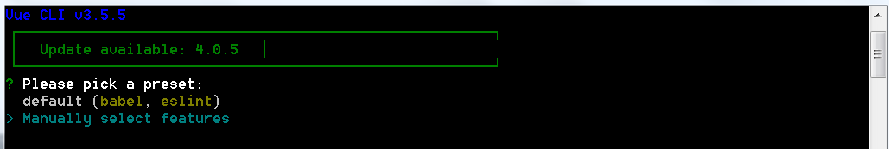
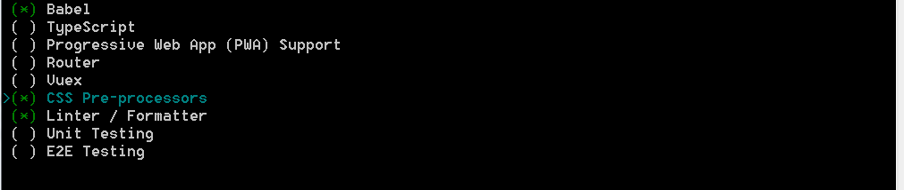
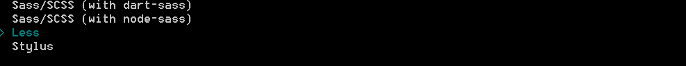
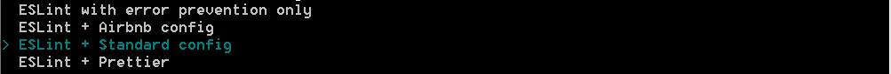
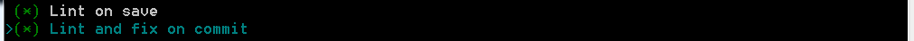
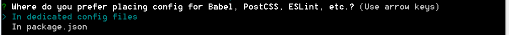
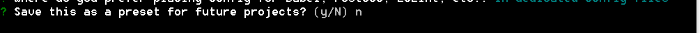
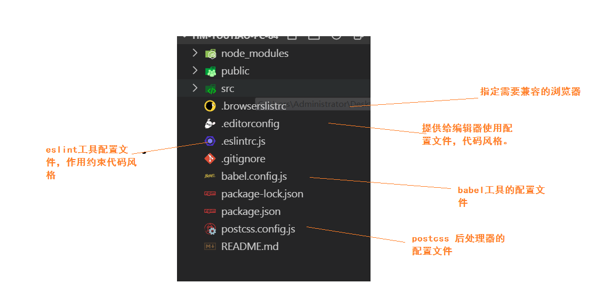
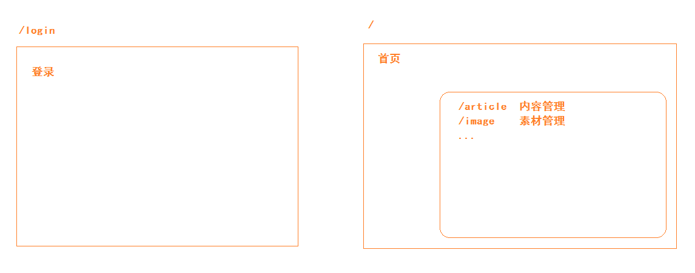

## 黑马头条PC项目-第一天

### 01-项目-简单介绍

是一个类似于今日头条的app的后台管理系统。

- 登录
- 欢迎页面（首页）
- 内容管理
- 素材管理
- 发布文章
- 评论管理
- 粉丝管理
- 个人设置


### 02-项目-准备工作

- vue基础
- vue-cli 脚手架  2.0    (3.0和4.0 几乎一样)
- axios  接口调用
- vue-router  路由
- 接口文档
-  element-ui  饿了么UI
- git + github


### 03-项目-初始化

- vue-cli 2.0 创建

```bash
vue init webpack -simple 项目名称
```

- vue-cli 3.0|4.0 创建

```bash
vue create 项目名称
```

第一步：自定义创建



第二步：babel 降级js语法   css 预处理器   linter 代码风格



第三步：



第四步：



第五步：



第六步：



第七步：



等待安装包....

最后：

```bash
cd hm-toutiao-pc-84
npm run serve  #启动项目
```


初始化项目目录：

解释目录结构：



修改目录结构：src

```bash
├─api  #接口代码 
├─assets #静态资源
├─components #公用组件
├─directive #指令代码
├─filter #过滤器代码
├─router #路由
├─styles #less代码
├─utils #工具函数
└─views #路由级别组件
└─App.vue #根组件
└─main.js #入口文件
```

请参考结构。


### 04-项目-分支管理

- 分支作用：
  - 通过分支维护不同功能的代码。
  - 不同的开发人员拥有不同的分支，协同开发。
- 分支操作：
  - 开发登录功能：git branch login
  - 切换到登录分支：git checkout login
  - 开始实现功能：
    - 开发一个小的功能：提交一次   git add .  ---> git commit -m '备注'
    - 开发第二个小功能 ....
  - 功能开发结束，测试一下，合并到master分支。
    - 切换master: git checkout master
    - 合并分支：git merge login


为什么这么做：

- 可维护
- 把代码提交到github，将来大家在github上查看我实现每一个功能的代码。
  - 查看每一次的提交，修改了那些文件，修改了哪一些代码（删除，添加）

```bash
# 创建一个远程仓库地址的别名
git remote add origin git@github.com:zhousg/hm-toutiao-pc-84.git
# 推送
git push -u origin master
```


### 05-项目-使用element-ui

- 使用框架目的，更加快速构建项目。
- 基于vue的UI框架，使用最多。
- 文档：https://element.eleme.cn/#/zh-CN
- 使用的步骤：

下载包

```bash
# -S 安装到运行时依赖，上线时依赖。 生产依赖。
# npm5.0 版本以上  省略 -S
npm i element-ui -S
```

引入 main.js

```diff
import Vue from 'vue';
+import ElementUI from 'element-ui';
+import 'element-ui/lib/theme-chalk/index.css';
import App from './App.vue';

+// ElementUI是一个插件，包含了很多组件。
+Vue.use(ElementUI);

new Vue({
  el: '#app',
  render: h => h(App)
});
```


### 06-项目-配置vscode的eslint插件

- 项目安装eslint插件，校验代码风格和修复代码风格。
- 但是 部分同学 vscode安装了**prettier**的插件，会存在冲突。
  - 卸载插件
  - 在settings.json中注释 剔除 对应配置。


安装配置eslint，达到：保存代码自动修复格式。

settings.json 配置即可：

```json
 "eslint.validate": [
    "javascript",
    "javascriptreact",
    {
      "language": "vue",
      "autoFix": true
    }
  ],
  "eslint.autoFixOnSave": true,
  "javascript.format.insertSpaceBeforeFunctionParenthesis": true,
```


### 07-项目-使用vue-router

下载：

```bash
npm i vue-router
```

导入：router/index.js

```js
import VueRouter from 'vue-router'
```

使用：

```js
import Vue from 'vue'
Vue.use(VueRouter)
```

实例化：

```js
const router = new VueRouter({
  // 配置对象
  // 路由规则选项 routes  若干规则
  routes:[]
})
```

导出：

```js
export default router
```

引入：main.js

```js
// 导入文件的时候，默认导入的是目录下的索引文件（index.js index.vue index.json）。
// @是webpack指定的路径别名  @===‘/src’   绝对路径
import router from '@/router'
```

挂载到根实例：

```DIFF
new Vue({
+  router,
  render: h => h(App)
}).$mount('#app')
```


### 08-项目-路由规则分析

分析：



结果：

| 路径     | 组件（功能） | 路由级别 |
| -------- | ------------ | -------- |
| /login   | 登录         | 一级路由 |
| /        | 首页         | 一级路由 |
| /welcome | 欢迎         | 二级路由 |
| /article | 内容管理     | 二级路由 |
| /image   | 素材管理     | 二级路由 |
| /publish | 发布文章     | 二级路由 |
| /comment | 评论管理     | 二级路由 |
| /fans    | 粉丝管理     | 二级路由 |
| /setting | 个人设置     | 二级路由 |


### 09-登录模块-路由及组件创建

创建组件：views/login/index.vue

```html
<template>
  <div class='container'>Login</div>
</template>

<script>
export default {}
</script>

<style scoped lang='less'></style>

```

配置规则：router/index.js

```diff
const router = new VueRouter({
  routes: [
+    { path: '/login', component: Login }
  ]
})
```

指定组件渲染的位置：App.vue

```html
  <div id="app">
    <router-view />
  </div>
```


### 10-登录模块-基础布局

- 全屏容器
- 白色卡片

```html
<template>
  <div class='container'>
    <!-- 登录卡片 -->
    <el-card>
      <!-- logo -->
      
    </el-card>
  </div>
</template>

<script>
export default {}
</script>

<style scoped lang='less'>
// 全屏容器
.container{
  width: 100%;
  height: 100%;
  // 背景尺寸 background-size 拆分写法
  // 组合写法 background:    / 背景尺寸(width,height) 简写 cover 铺面整个容器多余看不见  contain 等比例缩放完整的显示在容器内容
  background:url(../../assets/login_bg.jpg) no-repeat center / cover;
  position: absolute;
  left: 0;
  top: 0;
}
// 饿了么组件 el-card 组件名称  解析成HTML  后组件根元素上默认生成一个类和组件的名称一致
.el-card{
  width: 400px;
  height: 370px;
  position: absolute;
  left: 50%;
  top:50%;
  transform: translate(-50%,-50%);
  text-align: center;
}
</style>

```


### 11-登录模块-绘制表单

使用表单组件，分析代码。

```html
<!-- 表单容器  ref="form" 操作dom|组件 :model="form" 绑定表单数据对象  
label-width="80px" 表单输入框前的文字的宽度  -->
<el-form ref="form" :model="form" label-width="80px">
  <!-- 表单选项 label="活动名称" 表单输入框前的文字-->
  <el-form-item label="活动名称">
    <!-- 表单元素 -->                  
    <el-input v-model="form.name"></el-input>
  </el-form-item>
  <el-form-item>
    <el-button type="primary" @click="onSubmit">立即创建</el-button>
    <el-button>取消</el-button>
  </el-form-item>
</el-form>
```

基础结构：

```html
<!-- 登录卡片 -->
    <el-card>
      <!-- logo -->
      
      <!-- 表单 -->
      <el-form ref="form" :model="loginForm">
        <el-form-item>
          <el-input v-model="loginForm.mobile" placeholder="请输入手机号"></el-input>
        </el-form-item>
        <el-form-item>
          <el-input v-model="loginForm.code" style="width:235px;margin-right:10px" placeholder="请输入验证码"></el-input>
          <el-button>发送验证码</el-button>
        </el-form-item>
        <el-form-item>
          <el-checkbox :value="true">我已阅读并同意用户协议和隐私条款</el-checkbox>
        </el-form-item>
        <el-form-item>
          <el-button type="primary" style="width:100%">立即登录</el-button>
        </el-form-item>
      </el-form>
    </el-card>
```

补充需要依赖数据

```js
export default {
  data () {
    return {
      loginForm: {
        mobile: '',
        code: ''
      }
    }
  }
}
```

样式：

```css
// 全屏容器
.container {
  width: 100%;
  height: 100%;
  // 背景尺寸 background-size 拆分写法
  // 组合写法 background:    / 背景尺寸(width,height) 简写 cover 铺面整个容器多余看不见  contain 等比例缩放完整的显示在容器内容
  background: url(../../assets/login_bg.jpg) no-repeat center / cover;
  position: absolute;
  left: 0;
  top: 0;
}
// 饿了么组件 el-card 组件名称  解析成HTML  后组件根元素上默认生成一个类和组件的名称一致
.el-card {
  width: 400px;
  height: 340px;
  position: absolute;
  left: 50%;
  top: 50%;
  transform: translate(-50%, -50%);
  img{
    display: block;
    margin: 0 auto 30px;
  }
}
```


