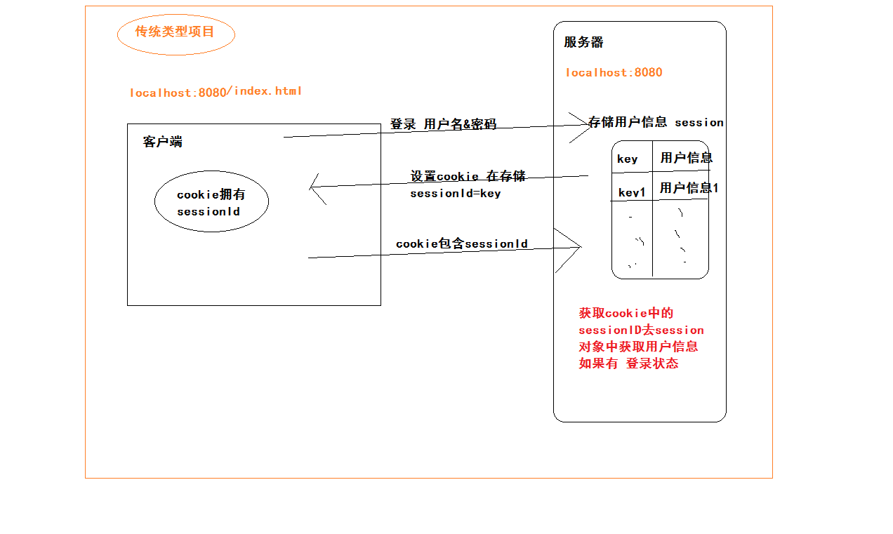
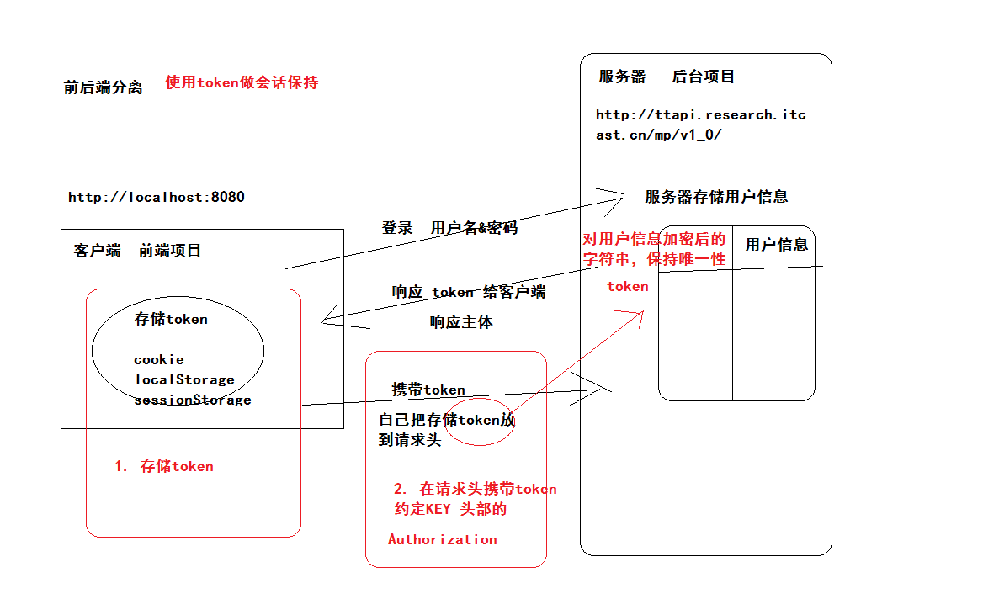
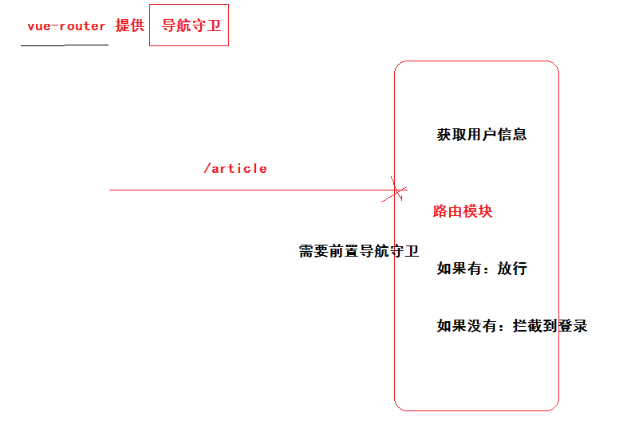

##黑马头条PC项目-第三天

### 01-反馈

| 姓  名 | 意见或建议                                                   |
| ------ | ------------------------------------------------------------ |
| ***    | 很多插件找不准 比如下拉菜单 该怎么选择                       |
| ***    | 一步跟不上步步跟不上，不行啊                                 |
| ***    | 1.登录功能未完成//退出登录 2.文件.vue,.js,main.js,app.vue具体作用理不清，他们之间的联系有点乱 3.讲课声音可以高点，敲字动作轻一点（看视频键盘声音有点大，听不清） |
| ***    | 很棒，加油哟                                                 |
| ***    | 发现一个bug: 在首页(`http://localhost:8080/#/`)点首页会报错: message: "Navigating to current location ("/") is not allowed". 猜测原因可能出现在一级路由为根路由，二级路由的欢迎页也是根路由的原因。 |
| ***    | 老                                                           |
| ***    | 淑淑。能把二级路由在说一下么？ 你讲的真好!                   |
| ***    | ElementUI的使用还是很模糊 求刚哥指点迷津 带我走向希望        |
| &&***  | 淑淑，牛逼！                                                 |

- 安装 vue-router 3.0.7 版本
- 使用ELEMENTUI组件的套路
  - 根据需求找到符合的组件
  - 找到组件后，寻找符合需求的示例：
    - 如果找到
      - 展开示例代码
      - 分析代码结构
      - 使用分析好的代码
    - 组件使用文档
      - 组件属性说明表
      - 组件函数说明表
      - 组件事件说明表

### 02-回顾

- 表单校验
  - 单个表单元素进行基本校验
  - 自定义校验规则
  - 整体表单校验
- 进行登录（粗暴）
- 首页模块
  - 布局
  - 导航菜单
  - 404处理


### 03-登录补充-分析session

- session 服务端存储技术，实现会话处理。
- 利用session来保持登录状态的机制是什么？
  - 基于cookie
- 在不同的域名下，session是否可以共享？
  - 不能



### 04-登录补充-认识token



- 存储token
- 请求头携带token

###05-登录补充-postman工具

- 登录后保存token在浏览器
- 请求头需要携带：
  - Authorization
  - Bearer  + 空格 + token字符

### 06-登录补充-回顾本地存储

- cookie
  - 可以设置有效期，如果没有设置默认是浏览器关闭后失效。
- localStorage
  - 永久生效
- sessionStorage
  - 当前页面下生效，浏览器关闭后失效。
  - setItem()
  - getItem()
  - removeItem()
  - clear()

项目：关闭浏览器后失效，单页面应用程序。


###07-登录补充-保存用户信息（token）

封装local模块，本地存储用户信息：src/utils/local.js

```js
// 提供 存储用户信息的相关API
// 约定：key=hm-toutiao-pc-84-user-key
const KEY = 'hm-toutiao-pc-84-user-key'
const local = {
  // 存储
  setUser (user) {
    // 把user对象转换成json字符串
    const jsonStr = JSON.stringify(user)
    window.sessionStorage.setItem(KEY, jsonStr)
  },
  // 获取
  getUser () {
    const jsonStr = window.sessionStorage.getItem(KEY)
    return JSON.parse(jsonStr)
  },
  // 清除
  delUser () {
    window.sessionStorage.removeItem(KEY)
  }
}

export default local

```

在登录逻辑保存用户信息：scr/views/login/index.vue

```js
import local from '@/utils/local'
```

```diff
    login () {
      // 获取表单组件实例 ---> 调用校验函数
      this.$refs['loginForm'].validate((valid) => {
        if (valid) {
          // 发请求 校验手机号和验证码  后台
          this.$http.post('authorizations', this.loginForm).then(res => {
            // 成功
+            // 保存用户信息（token）
+            local.setUser(res.data.data)
            this.$router.push('/')
          }).catch(() => {
            // 失败 提示
            this.$message.error('手机号或验证码错误')
          })
        }
      })
    }
```


### 08-登录补充-访问权限控制

- 除去登录页面，其他页面访问的时候，都需要判断登录状态
- 怎么判断登录状态？
  - 是否在本地存储过用户信息。
- 在哪里判断登录状态？
  - 在**跳转路由前**去判断。
  - 登陆了，放行。
  - 没有登录，如果不是登录页面的访问，拦截到登录页面。

导航守卫：



具体实现：src/router/index.js

```js
import local from '@/utils/local'
```

```js
// 添加路由的 导航守卫（前置导航守卫）
router.beforeEach((to, from, next) => {
  // 当每次跳转路由前触发
  // to 跳转到目标 路由对象
  // from 从哪里跳转过来  路由对象
  // next 下一步方法  next()放行  next(‘/login’) 拦截
  const user = local.getUser()
  // 如果登录
  if (user && user.token) {
    next()
  } else {
    if (to.path === '/login') {
      next()
    } else {
      next('/login')
    }
  }
})
```


### 09-axios-默认配置使用

- axios-默认配置 添加请求头
  - 键值对：
    - Authorization
    - Bearer  + 空格 + token字符

```js
import local from '@/utils/local'
// 设置默认的请求头
if (local.getUser()) {
  axios.defaults.headers.Authorization = `Bearer ${local.getUser().token}`
}
```

- 登录页面刷新一下
  - 登录成功，存储token
  - 跳转到首页，欢迎页面，发请求
    - 情况：请求头没有token
- 首页再次刷新一下
  - 跳转到首页，欢迎页面，发请求
  - 情况：请求头有token

**刷新一下**

- 重新执行vue项目的所有代码

目的：

- 在每一次请求前的时候，获取token，设置token。


### 10-axios-请求拦截器

官方提供：

```js
// 添加请求拦截器
axios.interceptors.request.use(function (config) {
    // 在发送请求之前做些什么
    return config;
  }, function (error) {
    // 对请求错误做些什么
    return Promise.reject(error);
  });
```

- 约定：拦截错误一定要返回错误的PROMISE对象。
  - new Promise()  可能成功可能失败
  - Promise.resolve()  一定成功的promise
  - Promise.reject()  一定失败的promise
  - Promise.race()  同时执行多个异步操作，最快异步操作成功后
  - Promise.all() 同时执行多个异步操作，所有的异步操作成功后

携带token：位置src/api/index.js

```js
// 请求拦截器
axios.interceptors.request.use((config) => {
  // 拦截成功  往headers中加token
  const user = local.getUser() || {}
  config.headers.Authorization = `Bearer ${user.token}`
  return config
}, (err) => {
  return Promise.reject(err)
})
```


### 11-axios-响应拦截器

- token可能会失效
  - token在服务端是有时效，2小时候后失效。
  - 你传递一个失效的token给服务器，服务器：401的错误码
- 用户可能没有传token
  - 服务器：401的错误码
- 回到登录页面，重新登录，即可获取有效token。
- 当你访问任何一个服务端接口的时候，可能存在token失效情况。

官方代码：

```js
// 添加响应拦截器
axios.interceptors.response.use(function (response) {
    // 对响应数据做点什么
    return response;
  }, function (error) {
    // 对响应错误做点什么  获取状态码  判断是不是401  如果是 跳转登录页面
    return Promise.reject(error);
  });
```

自己实现：

```js
import router from '@/router'
```

```js
// 响应拦截器
axios.interceptors.response.use(res => res, err => {
  // 获取响应状态码  err.response 响应对象  err.response.status 状态码
  if (err.response.status === 401) {
    // 如果是401跳转登录
    // 麻烦 window.location.href = 'http://localhost:8080/#/login'
    // 不推荐 window.location.hash = '#/login'
    // 使用vue-router进行跳转
    return router.push('/login')
  }
  return Promise.reject(err)
})
```


###12-掌握async与await用法

- 异步操作
  - 回调函数
    - 弊端：嵌套，回调地狱
  - promise
    - 好处：连续的then，让业务更加清晰。
    - 弊端：还是不够简洁（优雅）
  - ES6（async await）

```js
<!DOCTYPE html>
<html lang="en">
<head>
  <meta charset="UTF-8">
  <meta name="viewport" content="width=device-width, initial-scale=1.0">
  <meta http-equiv="X-UA-Compatible" content="ie=edge">
  <title>Document</title>
</head>
<body>
  <script>
    // 先调用A接口  再去调用B接口

    // 回调函数
    // const xhr = new XMLHttpRequest()
    // xhr.open('get','http://localhost:3000/a')  
    // xhr.send()
    // xhr.onload = function() {
    //   console.log(xhr.responseText)
    //   const xhr1 = new XMLHttpRequest()
    //   xhr1.open('get','http://localhost:3000/b')
    //   xhr1.send()
    //   xhr1.onload = function() {
    //     console.log(xhr1.responseText)
    //   }
    // }

    // promise
    const axios = function(url) {
      return new Promise((resolve,reject)=>{
          const xhr = new XMLHttpRequest()
          xhr.open('get',url)
          xhr.send()
          xhr.onload = function() {
            resolve(xhr.responseText)
          }
          xhr.onerror = function () {
            reject(new Error('请求失败'))
          }
      })
    }

    // axios('http://localhost:3000/a').then(data=>{
    //   console.log(data)
    //   return axios('http://localhost:3000/b')
    // }).then(data=>{
    //   console.log(data)
    // })

    // async await 写法
    // 1. 基于promise的异步操作才能使用语法
    // 2. 当返回promise的函数前 修饰的是 await 那么该函数的返回值是 promise执行成功后结果
    // 3. await is only valid in async function  使用await的语法必须在async修饰的函数内执行
    // 4. await 修饰的函数执行是同步的
    // 5. 失败的时候怎么处理
    const getData = async function() {
      const a =  await axios('http://localhost:3000/a')
      const b =  await axios('http://localhost:3000/b')
      console.log(a)    
      console.log(b)    
    }
    getData()
  </script>
</body>
</html>
```


### 13-运用async与await改写axios请求


### 14-首页补充-用户信息


###15-首页补充-退出登录


