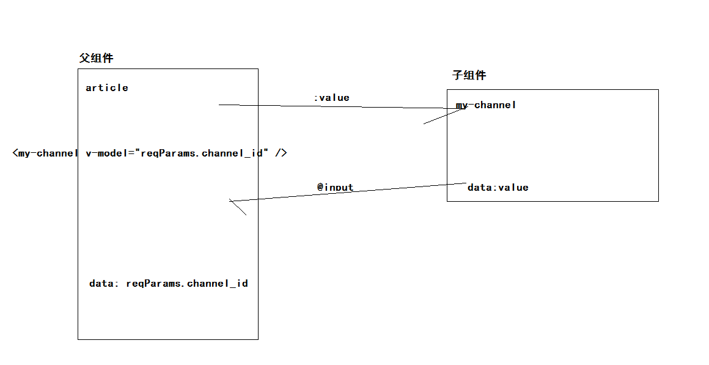

## 黑马头条PC项目-第六天

### 01-反馈

| 姓名 | 意见或建议                                                   |
| ---- | ------------------------------------------------------------ |
| ***  | 1 所有的axios请求都可以用async吗？2 element 标签不是不能直接绑定时间吗？2 为什么在编辑文章和删除中可以直接绑定事件，3 昨天的代码中什么情况下需要用插槽，对这个有点模糊 |
| ***  | 完美                                                         |
| ***  | 唉 这一天天的 这可怎么办阿 唉 这该如何是好啊 照这么下去这可怎么得了啊 淑淑 我完了 我完了啊 不过想想还是我家冬冬强 什么都会 现在都能去面试了 真强(所有方面的呦) 开心哦 今天又能和刘冬出去住了 |
| ***  | 老师,data转格式那一块,为什么会有data为空的情况?不太懂        |
| ***  | 发布文章内容和标题只能是字母呀，我看到有人发布的都可以有中文，可是我不知道怎么弄，好羡慕那些可以发中文的同学，嘻嘻嘻~ |
| ***  | 老师那个最大安全值 在axios配置时 你说会有data为空的时候 神魔情况下会为空 为神魔会是空 |
| ***  | 1.//const { data: { data } } = await this.$http.get('articles', { params: this.reqParams }) const { data: { data } } = await this.$http.get('articles'，this.reqParams )，为啥这样写实现不了分页效果？ 2.对筛选的实现原理有点懵 |
| ***  | 老师还有一个关于权限的需求同一级别的A,B,C三个人，看到不同的选项，A看到全部，B看到前5个人，C看到后5个，老师可以详细举下例子吗？听说上班一定会用到关于权限的，现在不讲，以后不会。还有一个问题是课堂上，图片和状态按钮还有操作这三个是用的插槽。其他两个也可以用插槽吗？我看到没有引入插槽，elmentui全部都默认提供插槽功能吗？ |
| ***  | 在手机上app修改昵称前一面显示修改成功，后一秒打开网页登上自己的账号，他却把我的手机号显示出来了，还好旁边没有其他人不然就暴露了，那么问题来了，怎样才能把名字修改了，头像可以随意修改，在线等，挺急的 |
| ***  | 请问一下，什么时候数值是布尔值，什么是json字符串，不知道啥时候需要转成json对象，啥时候不用。 发现第四天的视频没有06，希望发一下，补全了看着舒服 |
| ***  | 难啊~~~~~~~~                                                 |

qq：1229127923

### 02-回顾

- 内容管理
  - 筛选结果布局
  - 频道选项渲染
  - 文章列表渲染
  - 分页功能
  - 筛选
    - 日期选择处理
  - 跳转编辑
  - 删除
    - JS最大安全数值
    - 当后台无响应
      - 返回的响应体 null
- 组件封装（重要）
- 素材管理
  - 组件路由
  - 布局
  - 素材列表渲染
    - 全部
    - 收藏
  - 分页
  - 上传素材
  - 删除素材
  - 收藏素材


### 03-内容管理-频道组件封装-准备

- v-model  双向数据绑定
  - 把数据传递给表单元素显示
  - 当表单元素值改变，改变绑定的数据
- 不使用v-model怎么实现双向数据绑定？
  - v-bind:value=“msg”  
  - `@input="fn($event)"`   `fn(e){ this.msg = e.target.value }`
- v-model 语法糖(一些代码简写)

组件传值：

- 父传子

  - 在使用组件的时候，使用自定义属性绑定值（父组件）
  - 在封装组件的时候，使用props选项获取父组件数据

  父组件

  ```html
  <template>
  	<!-- 子组件 -->
  	<my-child :value="msg"></my-child>
  </template>
  <script>
  export default {
    data () {
    	return {
      	msg: '父组件数据'                                      
      }                     
    }
  }
  </script>
  ```

  子组件

  ```html
  <tempalte>
  	<div>
    	{{value}}	                    
    </div>
  </tempalte>
  <script>
  export default {
    // 和data中的数据使用方式是一样的，数据是单向的（仅读）
  	props: ['value']
  }
  </script>
  ```

  

- 子传父

  - 基于自定义事件，谁绑定谁调用。
  - 绑定：在使用子组件的时候，使用@绑定自定义事件，背后函数是属于父组件接受子组件数据。
  - 触发：在封装子组件的时候，使用$emit('自定义事件名称'，子组件数据)

  父组件

  ```html
  <template>
  	<!-- 子组件 -->
  	<my-child @input="fn($event)"></my-child>
  </template>
  <script>
  export default {
  	methods: {
    	fn (data) {
      	// 如果是原生事件  $event是事件对象 
        // 如果是自定义事件  $event是触发事件的时候提交数据                                  			 // 值组件的数据  data
      }                    
    }
  }
  </script>
  ```

  子组件

  ```html
  <script>
  export default {
  	created () {
    	// 触发自定义使用
      this.$emit('input','子组件数据')                  
    }
  }
  </script>
  ```


总结：

- 组件默认支持v-model吗？
  - 接收value数据
  - 值改变后触发 input事件
  - 实现了v-model


###04-内容管理-频道组件封装-实现

- 实现组件本身功能

```html
<template>
  <el-select v-model="value" placeholder="请选择" clearable>
    <el-option
      v-for="item in channelOptions"
      :key="item.id"
      :label="item.name"
      :value="item.id"
    ></el-option>
  </el-select>
</template>

<script>
export default {
  data () {
    return {
      value: null,
      channelOptions: []
    }
  },
  created () {
    this.getChannelOptions()
  },
  methods: {
    // 获取频道选项数据
    async getChannelOptions () {
      const {
        data: { data }
      } = await this.$http.get('channels')
      // 赋值频道下拉选项依赖数据
      this.channelOptions = data.channels
    }
  }
}
</script>

<style scoped lang='less'></style>

```

注册：

```diff
import MyBread from '@/components/my-bread'
+import MyChannel from '@/components/my-channel'
export default {
  install (Vue) {
    // Vue 是一个构造函数
    Vue.component('my-bread', MyBread)
+   Vue.component('my-channel', MyChannel)
  }
}

```

使用：

```html
          <!-- 频道组件 -->
          <my-channel></my-channel>
```

- 实现v-model功能

使用组件的时候加上v-model,其实相当于加上 value属性  input事件

```html
          <!-- 频道组件 -->
          <!-- v-model本质： 绑定value属性  绑定了input事件 -->
          <my-channel v-model="reqParams.channel_id"></my-channel>
```

子组件接收值

```diff
+  props: ['value'],
  data () {
    return {
-      // value: null,
      channelOptions: []
    }
  },
```

```html
<el-select :value="value"
```

子组件数据改变，提交数据给父组件

```html
<el-select :value="value" @change="fn" 
```

```js
    // 值改变函数
    fn (channelId) {
      // 把数据提交父组件
      if (channelId === '') channelId = null
      this.$emit('input', channelId)
    },
```

注明：父组件收到数据后   把数据赋值 reqParams.channel_id  （自动完成）



### 05-素材管理-组件与路由

```html
<template>
  <div class='container-image'>Image</div>
</template>

<script>
export default {}
</script>

<style scoped lang='less'></style>

```

路由规则：

```js
import Image from '@/views/image'
```

```diff
        // 素材管理
        { path: '/image', component: Image }
```


###06-素材管理-基础布局

```html
<template>
  <div class="container-image">
    <el-card>
      <div slot="header">
        <my-bread>素材管理</my-bread>
      </div>
      <!-- 按钮 -->
      <div class="btn_box">
        <!-- 按钮单选框 label就是值 -->
        <el-radio-group v-model="reqParams.collect" size="small">
          <el-radio-button label="false">全部</el-radio-button>
          <el-radio-button label="true">收藏</el-radio-button>
        </el-radio-group>
        <!-- 绿色按钮 -->
        <el-button style="float:right" type="success" size="small">添加素材</el-button>
        <!-- 素材列表 -->
        <div class="img_list">
          <div class="img_item" v-for="index in 10" :key="index">
            
            <div class="footer">
              <span class="el-icon-star-off" :class="{red:index%2}"></span>
              <span class="el-icon-delete"></span>
            </div>
          </div>
        </div>
        <!-- 分页 -->
        <el-pagination background layout="prev, pager, next" :total="1000"></el-pagination>
      </div>
    </el-card>
  </div>
</template>

<script>
export default {
  data () {
    return {
      reqParams: {
        // false 全部  true 收藏
        collect: false
      }
    }
  }
}
</script>

<style scoped lang='less'>
.img_list {
  padding-top: 20px;
  .img_item {
    width: 180px;
    height: 180px;
    position: relative;
    border: 1px dashed #ddd;
    display: inline-block;
    margin-right: 50px;
    margin-bottom: 20px;
    img {
      width: 100%;
      height: 100%;
    }
    .footer {
      position: absolute;
      left: 0;
      bottom: 0;
      height: 30px;
      line-height: 30px;
      background: rgba(0, 0, 0, 0.3);
      width: 100%;
      text-align: center;
      color: #fff;
      span {
        margin: 0 20px;
        &.red {
          color: red;
        }
      }
    }
  }
}
</style>

```


### 07-素材管理-列表渲染

- 在组件初始化获取素材列表数据
- 然后根据数据渲染

依赖数据

```js
    return {
      reqParams: {
        // false 全部  true 收藏
        collect: false,
        page: 1,
        per_page: 10
      },
      // 素材列表
      images: []
    }
```

初始化发请求

```js
  created () {
    this.getImages()
  },
  methods: {
    async getImages () {
      const { data: { data } } = await this.$http.get('user/images', { params: this.reqParams })
      this.images = data.results
    }
  }
```

渲染

```html
 <!-- 素材列表 -->
        <div class="img_list">
          <div class="img_item" v-for="item in images" :key="item.id">
            
            <div class="footer">
              <span class="el-icon-star-off" :class="{red:item.is_collected}"></span>
              <span class="el-icon-delete"></span>
            </div>
          </div>
        </div>
```


### 08-素材管理-分页功能

- 依赖总条数

```html
        <!-- 分页 -->
        <el-pagination
          background
          layout="prev, pager, next"
          :total="total"
          :page-size="reqParams.per_page"
          :current-page="reqParams.page"
          @current-change="pager"
        ></el-pagination>
```

```js
      // 总条数
      total: 0
```

```js
// 赋值总条数
      this.total = data.total_count
```

```js
    // 分页
    pager (newPage) {
      this.reqParams.page = newPage
      this.getImages()
    }
```


### 09-素材管理-切换列表

- 当你选择了单选框的时候
  - 把当前页面改为 1
  - 重新发请求即可
  - 在收藏列表  不需要底部操作栏

绑定的是布尔类型的值

```diff
        <!-- 按钮单选框 label就是值 -->
        <el-radio-group @change="toggleList" v-model="reqParams.collect" size="small">
+          <el-radio-button :label="false">全部</el-radio-button>
+          <el-radio-button :label="true">收藏</el-radio-button>
        </el-radio-group>
```

绑定单选框的值改变事件

```html
<el-radio-group @change="toggleList"
```

定义函数

```js
    // 切换列表
    toggleList () {
      this.reqParams.page = 1
      this.getImages()
    }
```

在收藏列表  不需要底部操作栏

```html
 <div class="footer" v-if="!reqParams.collect">
```


### 10-素材管理-添加收藏&取消收藏

- 绑定收藏图标点击事件
  - 判断当前图片的状态
    - 如果是收藏   做 取消收藏操作
    - 如果是没收藏  做  添加收藏操作
  - 把你需要的状态发送给后台进行修改
  - 修改成功
    - 修改当前图片的状态

事件

```html
<span @click="toggleStatus(item)" class="el-icon-star-off"
```

函数

```js
    // 添加收藏与取消收藏
    async toggleStatus (item) {
      // 修改请求
      const { data: { data } } = await this.$http.put(`user/images/${item.id}`, {
        collect: !item.is_collected
      })
      // 成功后  修改样式
      item.is_collected = data.collect
      // 提示
      this.$message.success((data.collect ? '添加收藏' : '取消收藏') + '成功')
    }
```


### 11-素材管理-删除图片

- 绑定删除按钮点击事件
- 温馨提示，确认框组件
  - 确认
    - 发删除请求
    - 删除成功
      - 提示
      - 更新列表
  - 取消：不做任何业务

事件

```html
              <span @click="deleteImage(item.id)" class="el-icon-delete"></span>
```

函数

```js
    // 删除素材
    deleteImage (id) {
      this.$confirm('此操作将永久删除该图片, 是否继续?', '温馨提示', {
        confirmButtonText: '确定',
        cancelButtonText: '取消',
        type: 'warning'
      }).then(async () => {
        // 点击了确认
        await this.$http.delete(`user/images/${id}`)
        // 删除成功
        this.$message.success('删除成功')
        // 更新列表
        this.getImages()
      }).catch(() => {
        // 点击了取消
      })
    }
```


### 12-素材管理-添加素材

- 绑定添加素材按钮的点击事件
- 显示一个对话框
  - 上传组件
  - 点击组件
  - 选择图片
  - 提交给后台
  - 上传成功后
    - 预览图片
    - 预览2s之后，关闭对话框，更新列表


准备对话框组件和上传组件

数据

```js
      // 对话框显示隐藏
      dialogVisible: false,
      // 上传成功后的图片地址
      imageUrl: null
```

按钮点击

```html
        <el-button @click="dialogVisible=true" style="float:right" type="success" size="small">添加素材</el-button>

```

对话框

```html
 <!-- 对话框 -->
    <el-dialog title="添加素材" :visible.sync="dialogVisible" width="300px">
      <el-upload
        class="avatar-uploader"
        action="https://jsonplaceholder.typicode.com/posts/"
        :show-file-list="false"
      >
        
        <i v-else class="el-icon-plus avatar-uploader-icon"></i>
      </el-upload>
    </el-dialog>
```

依赖样式：src/styles/index.less

```less
// 上传组件的样式
.avatar-uploader{
  text-align: center;
}
.avatar-uploader .el-upload {
  border: 1px dashed #d9d9d9;
  border-radius: 6px;
  cursor: pointer;
  position: relative;
  overflow: hidden;
}
.avatar-uploader .el-upload:hover {
  border-color: #409EFF;
}
.avatar-uploader-icon {
  font-size: 28px;
  color: #8c939d;
  width: 178px;
  height: 178px;
  line-height: 178px;
  text-align: center;
}
.avatar {
  width: 178px;
  height: 178px;
  display: block;
}
```


