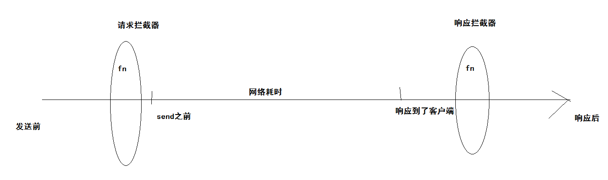
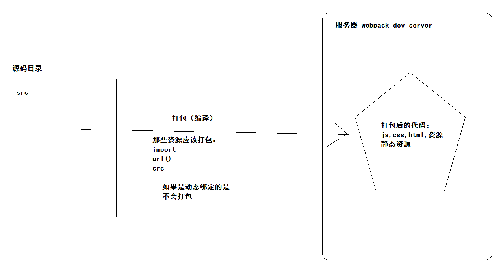

## 黑马头条PC项目-第八天

### 01-反馈

| 姓名 | 意见或建议                                                   |
| ---- | ------------------------------------------------------------ |
| ***  | 拦截器是怎么实现的?                                          |
| ***  | 叔叔明天讲课再大一点点声音                                   |
| ***  | 思路略微有点混杂 希望淑淑讲课再大点声                        |
| ***  | 没有意见欧，很棒喔~                                          |
| ***  | 1. 点击上传图片，还没有点击确定文件已经自动发送给后台，似乎并不完美(如果手误点错了，就没法撤回了) 2. 封面中的自动模式：如何判断富文本框内是否包含图片？正则匹配内容中是否包含img标签似乎并不完美 |
| ***  | 发现讲师们好凶啊，班主任也很凶啊！就以前的小苏苏不凶，我们都学习这么好了，能不能温柔一点对待我们，我们好歹也考过第一名啊 |
| ***  | 请问一下，极速api 天气既有get又有post，怎么确定什么时候写哪个？刚哥，可以把项目要点，还有容易忽略或者错误的点在笔记上，写文字总结一下吗？只复制代码，很多要点回顾的时候就会忘记，不太好把握，谢谢。 |
| ***  | 每个el组件中包含的属性和方法都是独立的吗，老师每次找文档比较快，可能是比较熟练，比如upload中用header，还有change事件，这都是每个组件中特有的吗？ 那以后我们使用之前是不是得先把这些属性和方法怎么用，需要什么参数或者返回什么值都认真看一遍再去用。 |

拦截器实现分析：




### 02-回顾

- 上传图片
- 发布文章
  - 基础布局
  - 使用富文本
  - 封面组件封装
    - 对话框
    - 标签页
      - 素材库
      - 上传图片
  - 确认图片


###03-发布文章-封面组件-确认图片

- 当你点击确认按钮的时候
  - 判断当激活的选项卡（activeName）是谁？
    - 是素材库
      - 校验是否选择了一张图片
      - 把选中的图片渲染在图片按钮中
    - 是上传图片
      - 校验是否上传了一张图片
      - 把上传图片渲染在图片按钮中

绑定事件

```html
<el-button type="primary" @click="confirmImage">确 定</el-button>
```

实现函数

```js
    // 确认图片
    confirmImage () {
      if (this.activeName === 'image') {
        // 素材库
        if (!this.selectedImageUrl) {
          return this.$message.warning('请选择一张图片')
        }
        this.btnImage = this.selectedImageUrl
        this.dialogVisible = false
      } else {
        if (!this.uploadImageUrl) {
          return this.$message.warning('请上传一张图片')
        }
        this.btnImage = this.uploadImageUrl
        this.dialogVisible = false
      }
    },
```

动态绑定src

```html
    <div class="btn_box" @click="open">
      
    </div>
```

```js
      // 按钮图片
      btnImage: '../assets/default.png'
```


- 怎么把选中的图片放到图片按钮中？
  - 动态绑定 src 属性即可
  - **但是需要实现默认的图片？**



主动导入图片数据，返回值就是图片。

```js
import defaultImage from '../assets/default.png'
```

```js
 btnImage: defaultImage
```

如果地址是网络地址，不需要这个做法。


###04-发布文章-封面组件-双向绑定

- 让组件内部数据和父组件双向绑定

使用组件绑定v-model指令

```html
<!-- 封面图组件 -->
            <div>
              <my-image v-model="articleForm.cover.images[0]"></my-image>
            </div>
```

组件内部实现指令

接收

```js
  // 是封面图片地址
  props: ['value'],
```

```HTML
    <!-- 按钮 -->
    <div class="btn_box" @click="open">
      
    </div>
```

传递

```diff
    confirmImage () {
      if (this.activeName === 'image') {
        // 素材库
        if (!this.selectedImageUrl) {
          return this.$message.warning('请选择一张图片')
        }
-        // this.btnImage = this.selectedImageUrl
        // 提交父组件
+        this.$emit('input', this.selectedImageUrl)
        this.dialogVisible = false
      } else {
        if (!this.uploadImageUrl) {
          return this.$message.warning('请上传一张图片')
        }
-        // this.btnImage = this.uploadImageUrl
        // 提交父组件
+        this.$emit('input', this.uploadImageUrl)
        this.dialogVisible = false
      }
    },
```


###05-发布文章-封面组件-使用组件

- 根据当前的封面类型 使用组件
  - 单图  对应一个组件
  - 三图  对应三个组件
  - 其他 不使用组件

- 在选择过封面图类型，清除之前的图片数据。

```html
<el-radio-group v-model="articleForm.cover.type" @change="articleForm.cover.images=[]">
              <el-radio :label="1">单图</el-radio>
              <el-radio :label="3">三图</el-radio>
              <el-radio :label="0">无图</el-radio>
              <el-radio :label="-1">自动</el-radio>
            </el-radio-group>
            <!-- 封面图组件 -->
            <div v-if="articleForm.cover.type===1">
              <my-image v-model="articleForm.cover.images[0]"></my-image>
            </div>
            <div v-if="articleForm.cover.type===3">
              <my-image v-for="i in 3" :key="i" v-model="articleForm.cover.images[i-1]"></my-image>
            </div>
```


###06-发布文章-发表与存入草稿

- 先校验（暂时不做）
- 发表 (审核通过)
- 存入草稿 （草稿）
  - 提交当前表单数据
  - 使用一个逻辑进行提交  区分（draft =  true|false   草稿|发表）
  - 提交成功，跳转到内容管理

```html
        <el-form-item>
          <el-button type="primary" @click="create(false)">发表</el-button>
          <el-button  @click="create(true)">存入草稿</el-button>
        </el-form-item>
```

```js

    async create (draft) {
      // 发表 存入草稿
      await this.$http.post(`articles?draft=${draft}`, this.articleForm)
      // 提示
      this.$message.success(draft ? '存入草稿成功' : '发表成功')
      // 去内容管理
      this.$router.push('/article')
    }
```


###07-发布文章-合并修改文章业务

- 新建：点击发布文章菜单
- 修改：点击编辑按钮来到发布文章
- 区分：判断地址栏是否存在 ID 即可


渲染逻辑：

- 获取当前ID对应的文章信息
  - 在发布组件初始化去做（有ID去做）
- 设置到当前的表单上（渲染）
- 按钮变成，`修改` 文字
  - 点击按钮  修改逻辑
- 面包屑的文字，修改文章

提交逻辑：

- 路径传参   文章的ID
- 其他传参一样


在组件初始化 判断当前的操作行为  获取文章的数据

```js
  created () {
    // 判断当前是否是编辑
    const articleId = this.$route.query.id
    if (articleId) {
      // 获取当前文章信息
      this.getArticle(articleId)
    }
  },
  methods: {
    // 获取文章信息
    async getArticle (id) {
      const { data: { data } } = await this.$http.get('articles/' + id)
      // 表单填充  面包屑文字   按钮文字
      this.articleForm = data
    },
```

三处需要渲染

```html
 <my-bread>{{$route.query.id?'修改':'发布'}}文章</my-bread>
```

```js
// 表单填充
this.articleForm = data
```

```HTML
        <el-form-item v-if="$route.query.id">
          <el-button type="success" @click="update(false)">修改</el-button>
          <el-button  @click="update(true)">存入草稿</el-button>
        </el-form-item>
        <el-form-item v-else>
          <el-button type="primary" @click="create(false)">发表</el-button>
          <el-button  @click="create(true)">存入草稿</el-button>
        </el-form-item>
```

进行修改提交

```js
    // 修改
    async update (draft) {
      // 修改 存入草稿
      await this.$http.put(`articles/${this.articleForm.id}?draft=${draft}`, this.articleForm)
      // 提示
      this.$message.success(draft ? '存入草稿成功' : '修改成功')
      // 去内容管理
      this.$router.push('/article')
    }
```


问题：

- 当你从编辑文章到发布文章，组件不初始化，重置表单信息。
- 使用watch来监听地址栏id的数据变化，重置表单信息。
- 其实还有特例情况：
  - 从发表文章，点击回退历史，切换到编辑文章
  - 使用watch来监听地址栏id的数据变化，获取表单信息。

```js
    // 切换发布与修改
    toggleArticleStatus () {
    // 判断当前是否是编辑
      const articleId = this.$route.query.id
      if (articleId) {
      // 获取当前文章信息
        this.getArticle(articleId)
      } else {
      // 重置数据不能为空对象  模版中 articleForm.cover.images
        this.articleForm = {
          title: null,
          content: null,
          cover: {
            type: 1,
            images: []
          },
          channel_id: null
        }
      }
    },
```

```js
  // 当路由规则没有发生改变的时候，组件是不会重新初始化
  // 只有组件初始化的时候才会只会执行一次。
  // 监听地址栏参数的变化，执行下面代码
  watch: {
    // data = {a:{b:10}}  'a.b':function(){}
    // （只要是this能够获取到的数据）字段名称：function(newVal,oldVal){ //当数据改变就会执行  }
    '$route.query.id': function () {
      this.toggleArticleStatus()
    }
  },
  created () {
    this.toggleArticleStatus()
  },
```


###08-评论管理-组件路由与基础布局

组件路由代码未记录

```html
<template>
  <div class='container-comment'>
    <el-card>
      <div slot="header">
        <my-bread>评论管理</my-bread>
      </div>
      <!-- 表格 -->
      <el-table :data="articles">
        <el-table-column label="标题" width="400"></el-table-column>
        <el-table-column label="总评论数"></el-table-column>
        <el-table-column label="粉丝评论数"></el-table-column>
        <el-table-column label="状态"></el-table-column>
        <el-table-column label="操作"></el-table-column>
      </el-table>
      <!-- 分页 -->

    </el-card>
  </div>
</template>

<script>
export default {
  data () {
    return {
      articles: []
    }
  }
}
</script>

<style scoped lang='less'></style>

```


###09-评论管理-列表与分页

结构：

```html
      <!-- 表格 -->
      <el-table :data="articles">
        <el-table-column label="标题" width="400" prop="title"></el-table-column>
        <el-table-column label="总评论数" prop="total_comment_count"></el-table-column>
        <el-table-column label="粉丝评论数" prop="fans_comment_count"></el-table-column>
        <el-table-column label="状态">
          <template slot-scope="scope">{{scope.row.comment_status?'正常':'关闭'}}</template>
        </el-table-column>
        <el-table-column label="操作" width="120px">
          <template slot-scope="scope">
            <el-button v-if="scope.row.comment_status" type="danger" size="small">关闭评论</el-button>
            <el-button v-else type="success" size="small">打开评论</el-button>
          </template>
        </el-table-column>
      </el-table>
      <!-- 分页 -->
      <el-pagination
        style="margin-top:20px"
        background
        layout="prev, pager, next"
        :total="total"
        :page-size="reqParams.per_page"
        :current-page="reqParams.page"
        @current-change="pager"
      ></el-pagination>
```

数据：

```js
  data () {
    return {
      articles: [],
      reqParams: {
        response_type: 'comment',
        page: 1,
        per_page: 20
      },
      total: 0
    }
  },
```

函数：

```js
  created () {
    this.getArticles()
  },
  methods: {
    async getArticles () {
      // 注意：文章列表但是需要包含  评论相关信息
      const {
        data: { data }
      } = await this.$http.get('articles', { params: this.reqParams })
      // 渲染
      this.articles = data.results
      // 总条数
      this.total = data.total_count
    },
    pager (newPage) {
      this.reqParams.page = newPage
      this.getArticles()
    }
  }
```


### 10-评论管理-关闭评论与打开评论

- 绑定点击事件
  - 确认框
  - 触发的时候 传入 需要修改的状态
  - 把状态提交给后台进行修改
  - 成功
    - 更新列表
    - 提示

绑定事件

```html
          <template slot-scope="scope">
            <el-button @click="toggleStatus(scope.row.id,false)" v-if="scope.row.comment_status" type="danger" size="small">关闭评论</el-button>
            <el-button @click="toggleStatus(scope.row.id,true)" v-else type="success" size="small">打开评论</el-button>
          </template>
```

处理函数

```js
    // 切换 打开 与 关闭
    toggleStatus (id, status) {
      const text = status ? '您确认要打开评论吗？' : '您确认关闭评论吗，如果关闭用户将无法对该文章进行评论。'
      this.$confirm(text, '温馨提示', {
        confirmButtonText: '确定',
        cancelButtonText: '取消',
        type: 'warning'
      }).then(async () => {
        // 确认时候
        const { data: { data } } = await this.$http.put(`comments/status?article_id=${id}`, {
          allow_comment: status
        })
        // 提示
        this.$message.success(data.allow_comment ? '打开评论成功' : '关闭评论成功')
        // 更新当前列表
        this.getArticles()
      }).catch(() => {})
    },
```


### 11-个人设置-组件路由与基础布局

组件路由代码未记录

```html
<template>
  <div class='container-setting'>
    <el-card>
      <div slot="header">
        <my-bread>个人设置</my-bread>
      </div>
      <!-- 栅格 -->
      <el-row>
        <el-col :span="12">
          <!-- 表单 -->
          <el-form label-width="120px">
            <el-form-item label="编号：">1</el-form-item>
            <el-form-item label="手机：">13211121222</el-form-item>
            <el-form-item label="媒体名称：">
              <el-input v-model="userInfo.name"></el-input>
            </el-form-item>
            <el-form-item label="媒体介绍：">
              <el-input v-model="userInfo.intro" type="textarea" :rows="3"></el-input>
            </el-form-item>
            <el-form-item label="邮箱：">
              <el-input v-model="userInfo.email"></el-input>
            </el-form-item>
            <el-form-item >
              <el-button type="primary">保存设置</el-button>
            </el-form-item>
          </el-form>
        </el-col>
        <el-col :span="12">
          <!-- 上传 -->
          <el-upload
            class="avatar-uploader"
            action="http://ttapi.research.itcast.cn/mp/v1_0/user/images"
            :show-file-list="false"
          >
            
            <i v-else class="el-icon-plus avatar-uploader-icon"></i>
          </el-upload>
          <p style="text-align:center">修改头像</p>
        </el-col>
      </el-row>
    </el-card>
  </div>
</template>

<script>
export default {
  data () {
    return {
      userInfo: {
        name: '',
        intro: '',
        email: ''
      },
      imageUrl: null
    }
  }
}
</script>

<style scoped lang='less'></style>

```


### 12-个人设置-非父子组件传值


