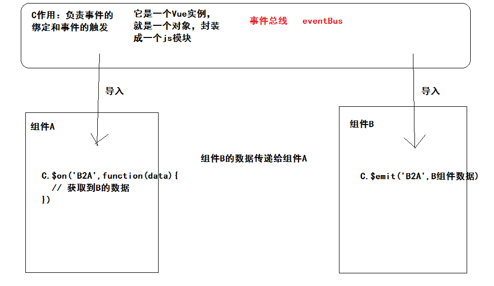

## 黑马头条PC项目-第九天

### 01-反馈

| 姓名 | 意见或建议                                                   |
| ---- | ------------------------------------------------------------ |
| ***  | $route 和 $touter 的区别忘记了,查了半天没理解通,希望刚哥给指点指点, 感谢 抱拳 |
| ***  | 当面试官问:请你自我介绍一下的时候，要讲项目经验，该怎么说比较稳呢 |
| ***  | 刚刚,能不能教一下怎么用Vue.js devtools,每次都找不到,想要监控的数据呢❀ |
| ***  | 大叔，比如在内容管理页面再次点击该页面，控制台会报错是怎么回事呀？ |
| ***  | 还好                                                         |
| ***  | 淑淑讲课的声音很大，但是视频里的声音却很小，自习的时候偶尔教室吵一些就完全听不清了，这是怎么回事呢，基础太差吸收慢前面的很多知识点没有弄懂，稀稀拉拉的拉下很多知识，看笔记加视频连抄带蒙的做了一部分页面，由于前面知识的不扎实有的代码都看不懂啥意思为啥要这么写，如果一直这样迷迷糊糊连抄带蒙的会不会后面更惨，不懂的太多有时候不是不爱问问题而是不知道从何问起，有什么好的学习方案吗？还请淑淑指点迷津！ |
| ***  | 修改文章时发请求用的articleForm.id为什么id没定义就能用 而不直接用this.$route.query.id传参 |
| ***  | // 当路由规则没有发生改变的时候，组件是不会重新初始化 // 只有组件初始化的时候才会只会执行一次。 // 监听地址栏参数的变化，执行下面代码 watch: { // data = {a:{b:10}} 'a.b':function(){} // （只要是this能够获取到的数据）字段名称：function(newVal,oldVal){ //当数据改变就会执行 } '$route.query.id': function () { this.toggleArticleStatus() } }, 这个不会，希望老师再讲下 |
| ***  | 在网页上的那个vue插件，不太会看也不太会用，刚哥能给我们讲一下吗？ |
| ***  | Vue Router 的params和query传参的使用和区别                   |

### 02-回顾

- 什么情况下使用，在挂载过路由之后。
  - $route   获取路由信息（路径，query传参，params传参，哈希值）
  - $router 其实初始化router实例，调用一些函数 ( push  back   go  forward  )
- 申明data中数据目的
  - 支撑模版的渲染数据
  - 具备响应式特点
- 侦听器使用
  - 计算属性使用场合：
    - 当你在模版中需要使用复杂的表达式，使用计算属性实现。
    - 当你需要依赖data中的数据，经过一些逻辑得到一项新的数据，使用计算属性。
    - 当data中依赖的数据发生改变时候，计算属性也发生改变。
    - 当数据没有改变的时候，不会重新执行计算的逻辑，获取的是缓存的数据。
  - 侦听器使用场合：
    - 当你在数据改变的时候，需要发送请求获取新的数据 或者 开销较大操作（复杂逻辑处理），使用侦听器。
- VueRouter 中两种传参（query,params）
  - query  ？id=10 后面键值对传参    $route.query.id
  - params  /:id === /10  路径传参      $route.params.id


### 03-个人设置-非父子组件传值

> 重点

组件与组件之前的关系（父 子 其他）是由什么决定的？

- 和注册的位置没有任何关系。
- **和使用的时候，相互嵌套的关系。**


非父子组件传值实现：使用自定义事件

- 组件A中，绑定一个自定义事件，事件对应的函数可以接受传参（B组件数据）。
- 组件B中，触发这个自定义事件，触发的时候可以提交数据（B组件数据）。
- 事件由谁绑定，由谁来触发。
- C复杂事件的绑定和事件的触发，C是一个Vue实例
  - 触发事件：$emit('事件名称',数据)
  - 绑定事件：$on('事件名称',fn（数据）)



实际的代码：

eventBus.js

```js
// 导出一个Vue实例即可
import Vue from 'vue'
export default new Vue()
```

A组件接受数据，绑定事件

```html
<template>
  <div class='com-a'>
    COM-A --- {{str}}
  </div>
</template>

<script>
import eventBus from '@/eventBus'
export default {
  data () {
    return {
      str: ''
    }
  },
  created () {
    eventBus.$on('B2A', (data) => {
      this.str = data
    })
  }
}
</script>

<style scoped lang='less'></style>

```

B组件传递数据，触发事件

```html
<template>
  <div class='com-b'>
    COM-B <button @click="fn">发送数据</button>
  </div>
</template>

<script>
import eventBus from '@/eventBus'
export default {
  data () {
    return {
      msg: '组件B的数据'
    }
  },
  methods: {
    fn () {
      eventBus.$emit('B2A', this.msg)
    }
  }
}
</script>

<style scoped lang='less'></style>

```


### 04-个人设置-保存用户信息

- 获取当前用户的信息
- 填充到表单，渲染到页面
- 点击保存设置
  - 发修改用户信息的请求
  - 成功
    - 提示
    - 修改Home组件中的用户名称
    - 修改本地存储中的用户名称

绑定保存设置点击

```html
            <el-form-item >
              <el-button type="primary" @click="saveInfo">保存设置</el-button>
            </el-form-item>
```

使用函数

```js
    // 保存用户信息（除去头像）
    async saveInfo () {
      // put 请求是修改    完整的修改所有信息
      // patch 请求是修改    局部的修改一些信息
      const { name, email, intro } = this.userInfo
      await this.$http.patch('user/profile', {
        name,
        email,
        intro
      })
      // 提示
      this.$message.success('保存成功')
      // 改home组件
      eventBus.$emit('updateName', name)
      // 改本地存储
      const user = local.getUser()
      user.name = name
      local.setUser(user)
    }
```

在home组件监听事件  created（）

```js
    // 绑定事件  接收修改的name数据
    eventBus.$on('updateName', (name) => {
      this.userInfo.name = name
    })
```

注意：响应式数据  先申明

```js
  data () {
    return {
      isOpen: true,
      // 如果响应响应式的数据，建议先申明
      userInfo: {
        name: '',
        photo: ''
      }
    }
  },
```


### 05-个人设置-修改用户头像

- el-upload组件进行上传，默认上传请求方式是post
- 后台提供的接口，编辑头像的请求方式是 patch
- 导致：没有配置请求方式的属性，无法使用默认的组件上传。
- 方案：自己来上传
  - 使用属性 http-request  指定函数，在函数内自行上传
  - 回忆大事件项目：使用xhr对象提交formdata数据（包含图片）
  - 在当前项目中：**使用axios来提交formdata数据（包含图片）**
    - 获取当前选择的图片数据
    - 初始化一个formdata对象
    - 把图片数据追加进去，key和后台字段一致
    - 使用axios发送请求
      - patch
      - body请求传参
    - 成功
      - 提示 + 预览
      - 更新home组件头像
      - 更新本地存储的头像


上传组件

```html
          <!-- 上传 -->
          <el-upload
            class="avatar-uploader"
            action=""
            :http-request="uploadPhoto"
            :show-file-list="false"
          >
            
            <i v-else class="el-icon-plus avatar-uploader-icon"></i>
          </el-upload>
```

修改头像函数

```js
    // 修改用户头像
    async uploadPhoto ({ file }) {
      // result.file 是你选择图片后的文件对象
      // 获取文件对象  文档没有记录
      const formData = new FormData()
      formData.append('photo', file)
      const { data: { data } } = await this.$http.patch('user/photo', formData)
      // 提示
      this.$message.success('修改头像成功')
      // 预览
      this.userInfo.photo = data.photo
      // 更新home组件头像
      eventBus.$emit('updatePhoto', data.photo)
      // 更新本地存储的头像
      const user = local.getUser()
      user.photo = data.photo
      local.setUser(user)
    },
```

home组件接受数据  created（）

```js
    // 绑定事件  接收修改的photo数据
    eventBus.$on('updatePhoto', (photo) => {
      this.userInfo.photo = photo
    })
```


### 06-粉丝管理-基础布局

组件：

```html
<template>
  <div class='container-fans'>
    <el-card>
      <div slot="header">
        <my-bread>粉丝管理</my-bread>
      </div>
      <!-- tabs组件 -->
      <el-tabs v-model="activeName" type="card">
        <el-tab-pane label="粉丝列表" name="list">
          <!-- 列表 -->
          <div class="fans_list">
            <div class="fans_item">
              <el-avatar :size="80" :src="defaultImage"></el-avatar>
              <p>粉丝名称</p>
              <el-button type="primary" size="small" plain>+关注</el-button>
            </div>
          </div>
          <!-- 分页 -->
        </el-tab-pane>
        <el-tab-pane label="粉丝画像" name="pic"></el-tab-pane>
      </el-tabs>
    </el-card>
  </div>
</template>

<script>
import defaultImage from '../../assets/avatar.jpg'
export default {
  data () {
    return {
      activeName: 'list',
      defaultImage
    }
  }
}
</script>

<style scoped lang='less'>
.fans_list{
  .fans_item{
    width: 150px;
    height: 190px;
    text-align: center;
    border: 1px dashed #ddd;
    padding-top: 20px;
    display: inline-block;
    margin-right: 20px;
    margin-bottom: 20px;
  }
}
</style>

```

路由：

```js
        // 粉丝
        { path: '/fans', component: Fans }
```


### 07-粉丝管理-粉丝列表

结构

```html
<el-tab-pane label="粉丝列表" name="list">
          <!-- 列表 -->
          <div class="fans_list">
            <div class="fans_item" v-for="item in fansList" :key="item.id.toString()">
              <el-avatar :size="80" :src="item.photo"></el-avatar>
              <p>{{item.name}}</p>
              <el-button type="primary" size="small" plain>+关注</el-button>
            </div>
          </div>
          <!-- 分页 -->
          <el-pagination
            background
            layout="prev, pager, next"
            :total="total"
            :page-size="reqParams.per_page"
            :current-page="reqParams.page"
            @current-change="pager"
          ></el-pagination>
        </el-tab-pane>
```

id如果报错   ：key="item.id.toString()" 转换字符串

数据

```js
      fansList: [],
      reqParams: {
        page: 1,
        per_page: 21
      },
      total: 0
```

函数：

```js
  created () {
    this.getFansList()
  },
  methods: {
    async getFansList () {
      const {
        data: { data }
      } = await this.$http.get('/followers', { params: this.reqParams })
      this.fansList = data.results
      this.total = data.total_count
    },
    pager (newPage) {
      this.reqParams.page = newPage
      this.getFansList()
    }
  }
```


### 08-粉丝管理-echarts使用

- echarts作用：

  - 数据可视化
  - 直白：一些图表 （柱状图，饼状图，线形图，K线图，雷达图，...）
  - 功能完善，highchart 国外

- echarts使用：

  - 安装：npm i echarts 
  - 导入：import echarts from 'echarts'
  - 准备dom容器具备高宽

  ```html
  <div ref="dom" style="width: 600px;height:400px;"></div>
  ```

  - 初始化echarts
    - 获取dom  `const dom = this.$refs.dom`
    - 初始化 `const myEcharts = echarts.init(dom)`
  - 准备 配置对象及数据
    - 请参考不同图表的具体示例  `const option = { // 参考文档 }`
  - 使用 配置对象及数据 `myEcharts.setOption(option)`

使用柱状图

```html
        <el-tab-pane label="粉丝画像" name="pic">
          <div ref="dom" style="width: 600px;height:400px;"></div>
        </el-tab-pane>
```

```js
import echarts from 'echarts'
```

```js
  mounted () {
    // 注意：获取dom需要在dom渲染完毕后
    const dom = this.$refs.dom
    const myEcharts = echarts.init(dom)
    // 配置及数据
    const option = {
      color: ['#3398DB'],
      tooltip: {
        trigger: 'axis',
        axisPointer: { // 坐标轴指示器，坐标轴触发有效
          type: 'shadow' // 默认为直线，可选为：'line' | 'shadow'
        }
      },
      grid: {
        left: '3%',
        right: '4%',
        bottom: '3%',
        containLabel: true
      },
      xAxis: [
        {
          type: 'category',
          data: ['Mon', 'Tue', 'Wed', 'Thu', 'Fri', 'Sat', 'Sun'],
          axisTick: {
            alignWithLabel: true
          }
        }
      ],
      yAxis: [
        {
          type: 'value'
        }
      ],
      series: [
        {
          name: '直接访问',
          type: 'bar',
          barWidth: '60%',
          data: [10, 52, 200, 334, 390, 330, 220]
        }
      ]
    }

    // 使用配置及数据
    myEcharts.setOption(option)
  },
```

- 配置文档  https://www.echartsjs.com/zh/option.html#title


### 09-项目总结

- 标准：项目写完

- 期望：自己独立写出发布文章


- 使用vue-cli构建项目
- element-ui使用方法
- vue-router相关
  - 初始化，挂载
  - 传参
  - 导航守卫
  - $route    $router
  - 路由嵌套
- axios相关知识
  - 默认配置
  - 响应拦截器
  - 请求拦截器
  - 响应格式转换
- 具体业务实现
  - 首页
  - 登录
    - token 理解
    - session 理解
  - 内容管理
    - 组件封装
      - 插槽
      - v-model实现
  - 素材管理
    - 上传图片
    - 导入图片
  - 发布文章
    - 封面图组件
    - 富文本
    - 侦听器
  - 评论管理
  - 个人设置
    - 非父子组件传参，eventBus
    - 自定义上传图片的
  - 粉丝管理
    - 使用echart


