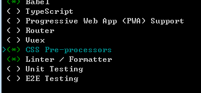
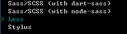
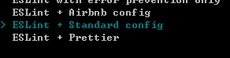
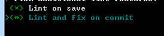
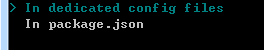
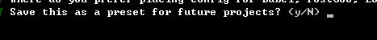
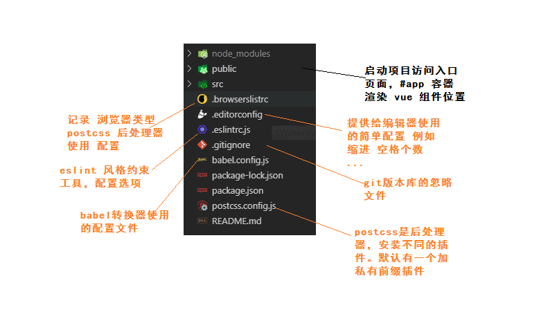
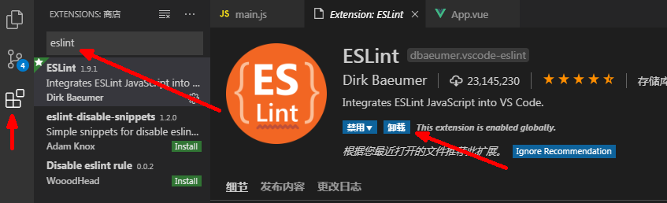
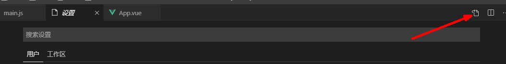
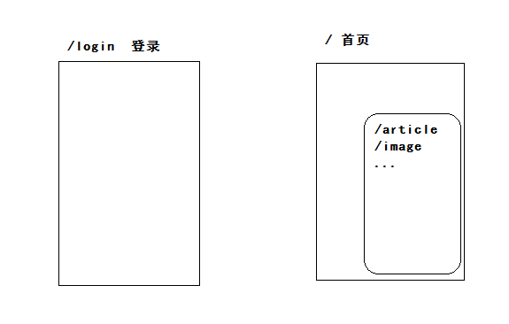

## DAY01-黑马头条PC

### 01-项目-简单介绍

- 今日头条，新闻客户端。浏览新闻，自媒体用户，拥有PC管理系统，注意的功能，录入新闻。
- 登录
- 首页
- 内容管理
- 素材管理
- 发布文章
- 评论管理
- 粉丝管理
- 个人设置

### 02-项目-准备工作

- vue 基础
- vue-cli 脚手架
- vue-router 路由插件
- axios  请求插件
- 会读接口文档
- element-ui 
  - 用户界面（自己界面风格），提供了常用的组件，组件库。
  - 饿了么UI    对国内用户友好。
  - 注意：学习使用UI组件的方法方式（套路）
  - https://element.eleme.cn/#/zh-CN

### 03-项目-初始化

- 构建项目骨架，创建一个空的项目架子。

```bash
vue create hm-toutiao-80
```

- 步骤：

第一步：选择自己来创建项目


第二步：ES6的降级处理工具    需要与处理器   需要代码风格检查工具



第三步：选择使用的预处理器 less



第四步：选择代码风格  标准风格



第五步：1. 在保存的时候校验代码风格 2. 在git提交的时候是不检查代码风格



第六步：不同的插件生产不同的配置文件




第七步：是否把刚才的操作保存起来（取名字）   选择否



等待装包...

提示：

```bash
# 切换到项目目录
cd hm-toutaio-80
# 启动项目
npm run serve
```

- 了解目录配置文件



- **src目录（重点）**

```bash
├─api # axios 内容
├─assets # 静态资源
│  └─images 
├─components # 公用组件
├─directive # 指令
├─filter # 过滤器
├─router # 路由
└─views # 路由对应组件
└─App.vue # 根组件
└─main.js # 入口文件
```

参考：重要的是要有这个思维。


### 05-项目-分支管理

- 需要使用git来管理代码版本。

  - 使用vue-cli创建的项目，默认初始化了git且进行了一次提交。

- 使用分支来管理功能模块

  - 分支作用：
    - 多人协同开发，每个人拥有一个或者多个分支，合并到一个分支上。
    - 一个人开发项目，使用不同的分支开发不同功能模块，更好维护代码。

- 例如：开发登录功能

  - git branch login  （本地分支）
  - git checkout login
  - 写代码，多次提交
    - git add .
    - git commit -m '备注'
    - 重复若干次
    - 功能完毕
  - git push 远程仓库地址 login  （远端分支）
  - git checkout master
  - git merge login 
  - git push 远程仓库地址 master（远端分支）

- 推送代码到远端：

  ```bash
  # 给 远程仓库的地址 取一个别名   叫 origin
  git remote add origin git@github.com:zhousg/hm-toutiao-80.git
  # 推送master分支到远端  
  git push -u origin master
  ```

- 期望：
  - <https://github.com/zhousg/hm-toutiao-80>
  - 参考提交记录，对比代码进行开发。


### 06-项目-使用element-ui

- 是基于vue的组件库，封装成了插件形态。
- 安装

```bash
# --save -S 安装在生产依赖 --save-dev -D 安装在开发依赖
# npm 5.0 版本 默认安装生产依赖
npm i element-ui -S
```

- 导入&注册  main.js

```diff
import Vue from 'vue';
+import ElementUI from 'element-ui';
+import 'element-ui/lib/theme-chalk/index.css';
import App from './App.vue';

+Vue.use(ElementUI);

new Vue({
  el: '#app',
  render: h => h(App)
});
```

- 测试

```html
  <div id="app">
    App <el-button type="success">成功按钮</el-button>
  </div>
```


### 07-项目-配置vscode的eslint插件

- 安装 eslint 插件



- 需要在设置功能进行eslint设置，才能生效。



```
 "eslint.validate": [
        "javascript",
        "javascriptreact",
        {
            "language": "vue",
            "autoFix": true
        }
    ],
    "eslint.autoFixOnSave": true,
```

加上以上信息即可。


注意：取消保存的时候格式化代码，只使用eslint来修复代码格式。


### 08-项目-使用vue-router

使用路由插件步骤：

- router目录创建模块
  - 安装：npm i vue-router
  - 导入：import VueRouter from 'vue-router'
  - 导入：import Vue from 'vue'
  - 注册：Vue.use(VueRouter)
  - 初始化router对象  const router = new VueRouter({routes:[]})
  - 导出：export default router
- 在main.js使用，vue选项router制定实例对象。


文件：router/index.js

```js
// 职责：创建一个router实例 导出给main使用
import Vue from 'vue'
import VueRouter from 'vue-router'

Vue.use(VueRouter)

const router = new VueRouter({
  routes: []
})

export default router

```

文件：main.js

```diff
+import router from '@/router'

Vue.use(ElementUI)
Vue.config.productionTip = false

new Vue({
+  router,
  render: h => h(App)
}).$mount('#app')
```


### 09-项目-路由规则分析



| 路径       | 功能         | 路由级别 |
| ---------- | ------------ | -------- |
| /login     | 登录         | 一级路由 |
| /          | 首页         | 一级路由 |
| └ /        | 欢迎组件     | 二级路由 |
| └ /article | 内容管理组件 | 二级路由 |
| └ /image   | 素材管理组件 | 二级路由 |
| └ /publish | 发布文章组件 | 二级路由 |
| └ /comment | 评论管理组件 | 二级路由 |
| └ /fans    | 管理组件     | 二级路由 |
| └ /setting | 个人设置组件 | 二级路由 |


### 10-登录模块-路由及组件创建

准备组件：views/login/index.vue

```html
<template>
  <div class='container'>Login</div>
</template>

<script>
export default {}
</script>

<style scoped lang='less'></style>

```

配置规则：router/index.js

```diff
+import Login from '@/views/login'

Vue.use(VueRouter)

const router = new VueRouter({
  // 定义路由规则（路径==>组件）
  routes: [
+    // name选项作用  找到对应的路由规则
+    // 跳转方便一些：$router.push('/login') 或者 $router.push({name:'login'})
+    { path: '/login', name: 'login', component: Login }
  ]
})
```

准备组件出口（渲染位置）：App.vue

```html
 <div id="app">
    <!-- 定义一个 一级路由的出口  组件渲染的位置 -->
    <router-view></router-view>
  </div>
```


### 11-登录模块-基础布局

- 全屏容器
  - 卡片
    - logo

```html
<template>
  <div class='container'>
    <!-- 卡片 element-ui 组件 -->
    <el-card class="my-card">
      
    </el-card>
  </div>
</template>

<script>
export default {}
</script>

<style scoped lang='less'>
.container{
  background: url(../../assets/images/login_bg.jpg) no-repeat center / cover;
  width: 100%;
  height: 100%;
  position: absolute;
  left: 0;
  top: 0;
  .my-card{
    width: 400px;
    height: 350px;
    position: absolute;
    left: 50%;
    top: 50%;
    transform: translate(-50%,-50%);
    img{
      width: 200px;
      display: block;
      margin: 0 auto;
    }
  }
}
</style>

```


### 12-style标签的scoped的作用

- <style scoped lang="less"> </style> scoped作用 

- 在style标签内写的样式，仅在当前组件下生效。

  - 当前组件：暴露在组件内的标签，才是样式生效范围。
  - 原理：
    - 当前组件暴露的标签 加上属性 data-v-xxxx
    - 样式在编译后 选择器后会加上属性选择器  .container[data-v-xxxx]{}

- 怎么去修改 其他组件内部标签的样式？？？

  ```css
  .el-card__body[data-v-xxxx]{
    background: green;
  }
  ```

  写在全局样式下，新建一个：styles/index.less 即可。


### 13-登录模块-绘制表单

分析组件：

```html
<!-- el-form 表单容器 -->
<!-- :model="form" 动态绑定数据model属性 form数据指定当前表单内所有表单元素的数据集合  -->
<!-- label-width="80px" 文字说明的宽度 -->
<el-form ref="form" :model="form" label-width="80px">
  <!-- el-form-item 表单项  label="活动名称" 文字说明-->  
  <el-form-item label="活动名称">
    <!-- 表单元素组件 -->  
    <el-input v-model="form.name"></el-input>
  </el-form-item>
</el-form>
```

使用组件：

```html
<el-form :model="loginForm">
        <el-form-item>
          <el-input v-model="loginForm.mobile" placeholder="请输入手机号"></el-input>
        </el-form-item>
        <el-form-item>
          <el-input v-model="loginForm.code" placeholder="请输入验证码" style="width:236px;margin-right:10px"></el-input>
          <el-button>发送验证码</el-button>
        </el-form-item>
        <el-form-item>
          <el-checkbox :value="true">我已阅读并同意用户协议和隐私条款</el-checkbox>
        </el-form-item>
        <el-form-item>
           <el-button type="primary" style="width:100%">登 录</el-button>
        </el-form-item>
      </el-form>
```

数据：

```js
export default {
  data () {
    return {
      loginForm: {
        mobile: '',
        code: ''
      }
    }
  }
}
```

