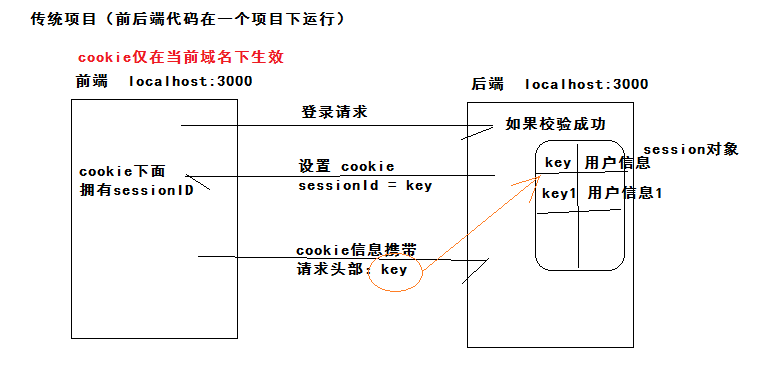
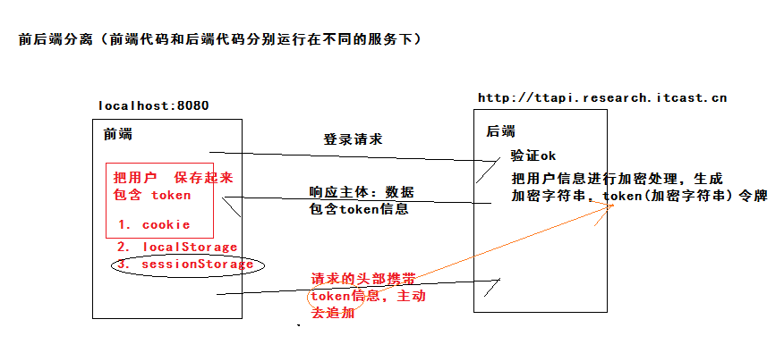
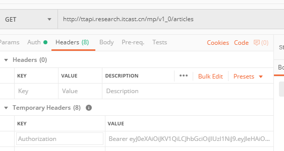
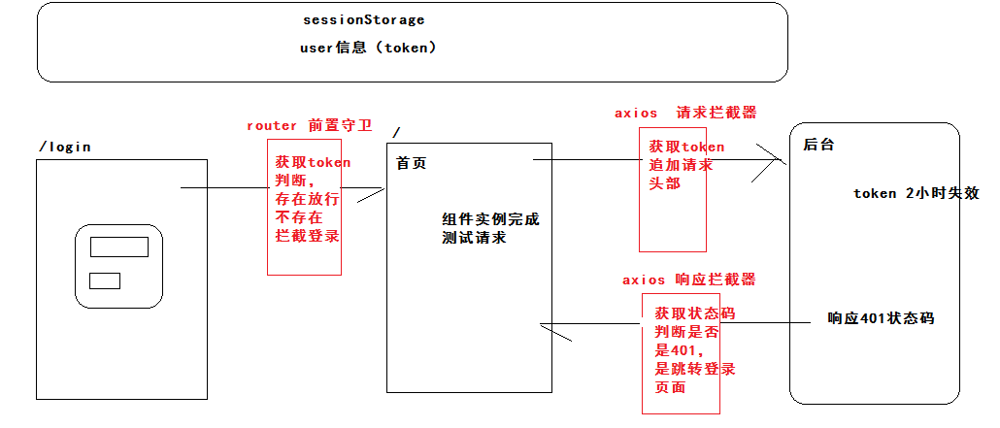

### 02-回顾

- 科学上网

  

- 当你需要获取dom元素，获取其他组的实例。
  - ref vue提供的属性   属性的值
  - $refs 的对象属于当前vue实例    `this.$refs.属性的值`


- 回顾
  - 校验功能
  - 自定义校验
  - 整体校验
  - 简单登录
    - 完善登录
  - 首页基本完成

###03-登录补充-回顾session



- 总结：不同域名下的cookie是不能共享。

###04-登录补充-认识token



- 登录成功后：用户信息保存在客户端。
- 每一次请求：需要在请求头追加token

### 05-登录补充-postman工具



- 结论：头部加token
  - 字段名称：Authorization
  - 字段的值：Bearer + 空格 + token


###06-登录补充-回顾本地存储

sessionStorage使用：

- setItem(key,value)  value要求：必须是字符串，使用json来存储复杂数据。
- getItem(key)   如果没有数据  返回的是 null
- removeItem(key)
- clear()
- 补充：sessionStorage 当前域名下生效。


### 07-登录补充-保存用户信息

定义一个模块，操作本地的用户信息，store/index.js

```js
// 负责：用户信息的  存储 获取 删除 三个函数
const KEY = 'hm-toutiao-80-user'
export default {
  setUser (user) {
    // 存储用户信息
    // user 数据类型  对象
    const jsonStr = JSON.stringify(user)
    window.sessionStorage.setItem(KEY, jsonStr)
  },
  getUser () {
    // 获取用户信息
    const jsonStr = window.sessionStorage.getItem(KEY) || '{}'
    // 可能没有数据  返回的null  通过null.token报错 但是{}.token 值 undefined
    return JSON.parse(jsonStr)
  },
  delUser () {
    // 删除用户信息
    window.sessionStorage.removeItem(KEY)
  }
}
```

登录成功的时候保存用户信息：views/login/index.vue

```diff
+ import store from '@/store'
//....
.then(res => {
    // 成功 跳转
    // 注意 登录 不够完善
    // res是响应对象--->res.data响应主体---->res.data.data响应主体包含（message,data）
    // 用户信息  res.data.data
    // 操作用户信息 就是操作 store 存储  写一个模块进行用户信息的操作。
+   store.setUser(res.data.data)
    this.$router.push('/')
})
```


### 08-登录补充-访问权限控制

- 除去登录页面外，其他的页面必须登录成功后才能访问。
  - 根据本地的存储中是否有用户信息来判断是否登录成功。
  - 在跳转路由之前，去判断登录状态：
    - 登录了，放行。
    - 未登录，拦截，去登录页面。

- 使用路由进阶功能：导航守卫。

```js
const router = new VueRouter({ ... })
// 前置守卫
router.beforeEach((to, from, next) => {
  // to 去哪里
  // from 来自哪里
  // next() 放行  next('/login') 拦截到login  
})
```

实现代码：router/index.js

```js
// 前置守卫
router.beforeEach((to, from, next) => {
  // // 1. 去的路径是登录的时候  放行
  // if (to.path === '/login') return next()
  // // 2. 不是登录的时候 且 并没有登录  拦截 登录页面
  // if (!store.getUser().token) return next('/login')
  // // 3. 其他情况 放行
  // next()
  if (to.path !== '/login' && !store.getUser().token) return next('/login')
  next()
})
```


### 09-axios-默认配置选项

- 请求的时候，加上额外的配置。 https://www.kancloud.cn/yunye/axios/234845

  - baseURL  作用：基准路径

    ```js
    axios.defaults.baseURL = 'http://ttapi.research.itcast.cn/mp/v1_0/'
    ```

  - headers 作用：自定义请求头

    ```js
    axios.defaults.headers.Authorization = Bearer + 空格 + token
    ```

- 在 api/index.js

```js
// 配置一个符合项目需要的axios  导出去进行全局的配置
import axios from 'axios'
import store from '@/store'

// 进行配置
// 1. 基准地址
axios.defaults.baseURL = 'http://ttapi.research.itcast.cn/mp/v1_0/'
// 2. 请求头 token
axios.defaults.headers.Authorization = `Bearer ${store.getUser().token}`

export default axios
```

- 使用 main.js 

```diff
// 简单配置axios
-import axios from 'axios'
+import axios from '@/api'
Vue.prototype.$http = axios
```


### 10-axios-请求拦截器

- 现象：

  - 等你登录的时候，没有存储token的
  - 点击登录后，跳转到首页（已经存储可token），没有整个页面刷新，局部更新。
  - 来的首页后，发送请求，没有携带token
  - 刷新页面后，发送请求，带上token

- 解释

  - main.js 导入所有的代码，加载页面后，main.js的代码会执行一次。
    - api/index.js  执行了一次   
    - axios.defaults.headers.Authorization = `Bearer ${store.getUser().token}`
    - Authorization ： Bearer undefined
  - 首页，刷新之后  main.js 的代码重新执行了一次。

- 方案：

  - 在每一次请求前，获取token，设置给头部。

  ```js
  // 添加请求拦截器
  // use 里函数在每次请求前会调用
  // 第一个函数：拦截请求成功调用
  // 第二个函数：拦截请求的时候，做业务的时候，出现报错，才会触发第二个函数的执行。
  axios.interceptors.request.use(function (config) {
      // 参数 config 请求配置  默认配置
      // 修改配置  添加 token 信息
      // 返回修改好的配置  请求的时候使用你的修改后的配置
      return config;
  }, function (error) {
      // error 错误对象
      // 对请求错误做些什么
      // 返回一个一定出错的promise对象
      // new Promise((resolve,reject)=>{})  可能成功可能失败
      // Promise.reject(error) 一定是调catch() 失败
      // Promise.resolve() 一定是调then() 成功
      return Promise.reject(error);
  });
  ```

  

具体实现：

```js
// 请求拦截器（在每一次请求前）
axios.interceptors.request.use(config => {
  // 修改配置  加token
  config.headers.Authorization = `Bearer ${store.getUser().token}`
  return config
}, (err) => {
  return Promise.reject(err)
})
```


### 11-axios-响应拦截器

- 前端存储了token
- 后端存储了token，但是有效期2小时。
- 后台会返回信息，响应状态码401，在每一次响应，判断状态码，如果是401拦截跳转到login

```js
// 添加响应拦截器(每次后端给你响应)
axios.interceptors.response.use(function (response) {
    // 响应成功
    // 对响应数据做点什么
    return response;
}, function (error) {
    // 响应失败
    // 401错误  获取响应状态码 判断是不是401 
    // error.response  响应对象
    // error.response.status 状态码
    // 对响应错误做点什么
    return Promise.reject(error);
});
```

具体实现：

```js
import router from '@/router'


// 响应拦截器(每一次响应后)
// res => { return res } ==== res => res
axios.interceptors.response.use(res => res, err => {
  // 自己逻辑
  // 1. 获取状态码
  const status = err.response.status
  // 2. 判断401
  if (status === 401) {
    // 3. 清除无效token
    store.delUser()
    // 4. 跳转登录
    // 4.1 原生方式改路径  router基于hash实现  /login ===> #/login
    // window.location.hash = '#/login'
    // 4.2 使用router进行跳转  $router本质 main.js导入了router/index.js的实例 挂载vue根实例下。
    router.push('/login')
  }
  return Promise.reject(err)
})
```


梳理：




### 12-axios-async与await使用

- axios是基于promise封装的。
- promise作用：解决**回调地狱**的异步写法，让异步逻辑更加清晰。
- ES6提供了关键字 async await 使用同步的写法来进行异步操作，逻辑清晰，优雅一些。

需要场景：

- 当你请求A接口后，才能获取B接口的数据。

```js
export default {
  async created () {
    // 1. 使用promise 调用A接口后调用B接口获取所有的数据
    // this.$http.get('http://localhost:3000/a')
    //   .then(res => {
    //     console.log(res.data) // A
    //     return this.$http.get('http://localhost:3000/b')
    //   })
    //   .then(res => {
    //     console.log(res.data) // B
    //   })

    // 2. 使用async await 调用A接口后调用B接口获取所有的数据
    // 使用 await 修饰的函数（返回值promise） 那么：返回值成功后的结果
    // await 同步执行这个函数，阻碍当前程序执行
    // await 的使用必须在 async 修饰的函数内部 （await的外层函数必须加上async ）
    const resA = await this.$http.get('http://localhost:3000/a')
    const resB = await this.$http.get('http://localhost:3000/b')
    console.log(resA.data, resB.data)
  }
}
```


###13-axios-修改登录异步操作


### 14-首页补充-用户信息


### 15-首页补充-退出登录


