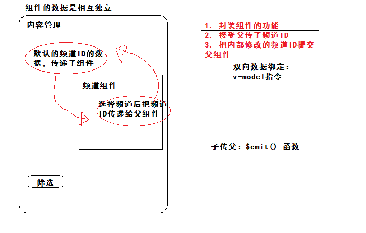

## DAY05-黑马头条PC

### 02-回顾

- 实现首页退出
- 筛选布局
- 结果布局
  - 插件封装
    - 规则：模块导出对象包含install
  - 组件封装
    - 使用插槽
      - 默认插槽
      - 备用内容
      - 具名插槽
      - 作用域插槽


### 03-内容管理-频道选项渲染

- 在组件初始化完毕
  - 获取后台的数据
  - 获取数据给channelOptions赋值

```js
  created () {
    // 获取频道选项数据
    this.getChannelOptions()
  },
```

```js
methods: {
    async getChannelOptions () {
      // data.channels 数组 [{id,name}]
      const { data: { data } } = await this.$http.get('channels')
      // 赋值
      this.channelOptions = data.channels
    }
  }
```

渲染：

```html
<el-option
              v-for="item in channelOptions"
              :key="item.id"
              :label="item.name"
              :value="item.id"
            ></el-option>
```


### 04-内容管理-列表渲染

- 在组件初始化完毕，根据默认筛选条件查询
  - 获取文章列表数据
  - 获取数据给 articles 赋值

```js
// 表格数据
articles: []
```

```js
created () {
    // 获取频道选项数据
    this.getChannelOptions()
    // 获取文章列表数据
    this.getArticles()
  },
```

```js
async getArticles () {
      // data.results 才是文章列表
      // post 请求  post(url,数据)
      // get 请求 get(url,{params:数据})
      const { data: { data } } = await this.$http.get('articles', { params: this.reqParams })
      this.articles = data.results
    }
```


- 渲染表格
  - 表格是列组件组成
  - 渲染列组件

```html
<!-- 表格 -->
      <el-table :data="articles">
        <!-- 封面 cover.images[0] 默认取第一张 -->
        <!-- 假设字段可以取出数据  值是图片地址 -->
        <!-- prop 作用把字段背后的值 渲染在列位置 -->
        <!-- 需要是图片需要往组件传入额外的内容才显示图片 -->
        <!-- 使用插槽  渲染图片需要数据  使用作用域插槽 -->
        <el-table-column prop="date" label="封面">
          <template slot-scope="scope">
            <el-image
              :src="scope.row.cover.images[0]"
              style="width:160px;height:100px;border:1px solid #ddd"
              fit="contain"
            >
              <div slot="error" class="image-slot">
                
              </div>
            </el-image>
          </template>
        </el-table-column>
        <el-table-column prop="title" label="标题"></el-table-column>
        <el-table-column label="状态">
          <template slot-scope="scope">
            <el-tag v-if="scope.row.status === 0" type="info">草稿</el-tag>
            <el-tag v-if="scope.row.status === 1">待审核</el-tag>
            <el-tag v-if="scope.row.status === 2" type="success">审核通过</el-tag>
            <el-tag v-if="scope.row.status === 3" type="warning">审核失败</el-tag>
            <el-tag v-if="scope.row.status === 4" type="danger">已删除</el-tag>
          </template>
        </el-table-column>
        <el-table-column prop="pubdate" label="发布时间"></el-table-column>
        <el-table-column label="操作" width="120px">
          <template slot-scope="scope">
            <el-button type="primary" icon="el-icon-edit" plain circle></el-button>
            <el-button type="danger" @click="delArticle(scope.row.id)" icon="el-icon-delete" plain circle></el-button>
          </template>
        </el-table-column>
      </el-table>
```


###05-内容管理-分页功能

分页组件渲染

- :total="1000"  总条数，默认一页10条、
- 获取总条数数据，修改一页显示20条。

```js
// 文章总数
total: 0
```

```diff
async getArticles () {
      // data.results 才是文章列表
      // post 请求  post(url,数据)
      // get 请求 get(url,{params:数据})
      const {
        data: { data }
      } = await this.$http.get('articles', { params: this.reqParams })
      this.articles = data.results
      // 文章总数
+      this.total = data.total_count
    }
```

```html
 <div slot="header">根据筛选条件共查询到 {{total}} 条结果：</div>
```

```html
<!-- 分页 -->
      <el-pagination
        class="pager"
        background
        layout="prev, pager, next"
        :total="total"
        :page-size="reqParams.per_page"
        :current-page='reqParams.page'
      ></el-pagination>
```

- total 总条数
- page-size 一页显示条目数
- current-page 当前页码


分页切换功能

- 监听页码改变事件  current-change  el-pagination
- 页码改变的时候，获取当前新页码，重新获取列表数据，更新数据更新列表。

```diff
<!-- 分页 -->
      <el-pagination
        class="pager"
        background
        layout="prev, pager, next"
        :total="total"
        :page-size="reqParams.per_page"
        :current-page="reqParams.page"
+        @current-change="changePager"
      ></el-pagination>
```

```js
// 改变分页后触发的函数
    changePager (newPage) {
      this.reqParams.page = newPage
      this.getArticles()
    },
```


### 06-内容管理-搜索功能

- 当你选择日期范围时候
  - 获取当前你选择的值 Date
  - 要给值转换格式  2019-01-01
  - 给 begin_pubdate end_pubdate 赋值

```diff
 <el-date-picker
            v-model="dateArr"
            type="daterange"
            range-separator="至"
            start-placeholder="开始日期"
            end-placeholder="结束日期"
+            @change="changeDate"
+            value-format="yyyy-MM-dd"
          ></el-date-picker>
```

```JS
// 选择日期范围后触发的函数
    changeDate (valueArr) {
      // valueArr 选中的日期范围值  [起始日期，结束日期]
      // 清空功能 valueArr === null
      if (valueArr) {
        this.reqParams.begin_pubdate = valueArr[0]
        this.reqParams.end_pubdate = valueArr[1]
      } else {
        this.reqParams.begin_pubdate = null
        this.reqParams.end_pubdate = null
      }
    },
```


- 当你点击筛选按钮
  - 重新提交筛选数据，获取列表数据。
  - 当给频道选项，清空功能，清空之后的值是 “” 而不是null

```html
<el-form-item>
          <el-button type="primary" @click="search">筛选</el-button>
        </el-form-item>
```

```js
 // 搜索 筛选
    search () {
      // 根据新的筛选条件（动态绑定）  获取数据
      // 页码重置到 1
      this.reqParams.page = 1
      // 严谨处理 channel_id === "" 改成 null
      if (this.reqParams.channel_id === '') this.reqParams.channel_id = null
      this.getArticles()
    },
```

```html
<el-select clearable
```


### 07-内容管理-删除-数字最大安全值

- 浏览器toolbar  Response 功能

  - 显示  响应的内容  没有转换过格式   json字符串
  - "id": 1166621421271515136

- 浏览器toolbar  Preview 功能

  - 显示  （JSON.parse）转换成json对象 显示
  - id: 1166621421271515100   

- 总结：使用JSON.parse来转换较大数值的时候，出现误差。

  - 超出JS的最大安全数值，在转换或者在运算的时候出现误差。
  - 最大安全值  2的53次方   Number.MAX_SAFE_INTEGER

- 处理：

  - json-bigint 包  会把数字转换成其他格式。
  - 安装  npm i json-bigint
  - 导入  api/index.js   (axios的默认JSON.parse转换不好使)   import JSONBIG from 'json-bigint'
  - 包怎么用：JSONBIG.parse(json字符串)
  - axios怎么用：配置

  ```js
  transformResponse: [function (data) {
      // 对 data 进行任意转换处理
      return data;
    }]
  ```

最终处理代码：api/index.js

```js
import JSONBIG from 'json-bigint'
// 进行配置
// 3. 自定义转换响应内容
axios.defaults.transformResponse = [(data) => {
  // data 原始数据
  return JSONBIG.parse(data)
}]
```


### 08-内容管理-删除-响应无内容处理

- 点击删除按钮的时候
  - 弹出确认框
    - 取消  任何事件不做
    - 确认
      - 发删除请求给后台
      - 成功：提示+更新列表

严谨处理后端响应的数据，可能出现没有响应的情况。api/index.js

```js
axios.defaults.transformResponse = [(data) => {
  // data 原始数据  有一些接口没有响应内容  data === null 报错
  try {
    return JSONBIG.parse(data)
  } catch (e) {
    return data
  }
}]
```

```html
<el-button
              type="danger"
              @click="delArticle(scope.row.id)"
              icon="el-icon-delete"
              plain
              circle
            ></el-button>
```

```js
// 删除函数
    delArticle (id) {
      // 确认框
      this.$confirm('老铁，此操作将永久删除该文章, 是否继续?', '温馨提示', {
        confirmButtonText: '确定',
        cancelButtonText: '取消',
        type: 'warning'
      }).then(async () => {
        // 点击确认
        // 地址  articles/id  请求 delete
        // get 获取数据 post 添加数据 delete 删除属性 put 完整修改数据 patch 局部修改数据
        await this.$http.delete(`articles/${id}`)
        // 代码走这 成功
        this.$message.success('删除成功')
        this.getArticles()
      }).catch(() => {
        // 点击取消
      })
    },
```


### 09-内容管理-编辑-地址栏传参跳转

- 发布文章：http://localhost:8080/#/publish
- 编辑文章：http://localhost:8080/#/publish 传递ID
  - query     /publish?id=123456  ===>  /publish    路由规则一致，且传ID
  - params  /publish/123456       ===>  /publish/:id

```html
            <el-button @click="$router.push('/publish?id='+scope.row.id)" type="primary" icon="el-icon-edit" plain circle></el-button>

```


###10-内容管理-频道组件封装-准备




### 11-内容管理-频道组件封装-实现
