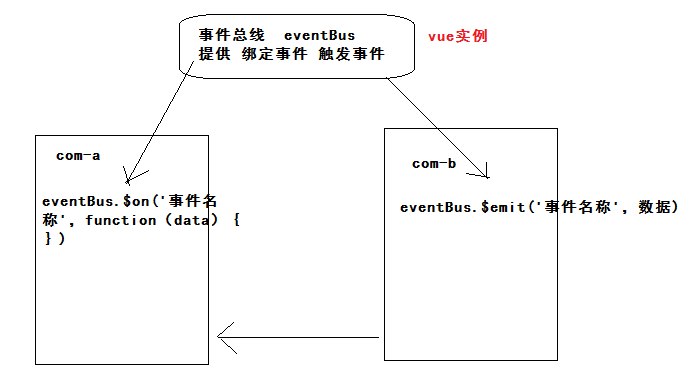

## 黑马头条后台管理项目-DAY08

- &.red{}
  - .a.b{} ==> .a{&.b{}}
- vue 实例中的成员
  - this.$emit
  - 当vue实例中挂载，vue-router
    - this.$route
    - this.$router
  - axios 挂载
    - this.$http
  - 注册element-ui
    - this.$message
- 什么时候用v-model
  - 你既能给  组件赋值  又能得到值的改变。
- el-table  data属性

### 02-回顾（作业）

- 发布文章
  - 封装封面图组件
  - 完成发布文章
  - 完成修改文章
  - 作业：当你在编辑文章的时候，点击发布文章的菜单，组件不更新。
    - 什么时候组件更新，路由规则发生变化，组件才会初始化。
    - 路由规则没有变化，变化的是地址栏传参（修改  有ID ---->  发布 没有）
    - 地址栏参数：$route.query.id  
    - 监听 地址栏ID 的变化，去主动的更新组件的数据，视图更新。
    - 需要使用一个知识点，侦听器 watch 选项。
      - 作用：监听vue实例下所有数据的变化，从而做你想实现功能。

- 计算属性：
  - 使用场景：当你需要一个新数据，这个数据依赖data中的数据通过一定的逻辑得到，此时使用。
  - 特点：当data中的数据发生改变的时候，计算属性也会改变，必须有返回值。
- 侦听器：
  - 使用场景：当你要监听某一项数据的变化，根据变化去做异步或者开销较大操作（逻辑复杂），其实任何操作都可以。
  - 特点：不需要返回值，根据数据的变化去做其他的业务。

```js
// 侦听器语法
new Vue({
    data(){
        msg:'hi vue',
        obj:{
             name:''
        }    
    },
    watch:{
        msg:function(newVal,oldVal){
            // 当msg数据发生改变 执行当前函数  做业务
        },
        'obj.name':function(n,o){}
    }
})
```

功能代码：

```js
// 监听$route.query.id变化  重置表单数据  清空文章ID数据
  watch: {
    '$route.query.id': function (newVal, oldVal) {
      // 当发布文章改成修改文章  回退历史
      if (newVal) {
        // 判断业务articleId 存在修改  不存在 发表
        this.articleId = this.$route.query.id
        if (this.articleId) {
          // 获取数据 填充表单
          this.getArticle()
        }
        return false
      }
      // 当编辑文章改成发布文章
      this.articleForm = {
        title: '',
        content: '',
        cover: {
          type: 1,
          images: []
        },
        channel_id: null
      }
      this.articleId = null
    }
  },
```


### 03-评论管理-基础布局

```html
<template>
  <div class="container">
    <el-card>
      <div slot="header">
        <my-bread>评论管理</my-bread>
      </div>
      <!-- 表格 -->
      <el-table :data="articles">
        <el-table-column label="标题"></el-table-column>
        <el-table-column label="总评论数"></el-table-column>
        <el-table-column label="粉丝评论数"></el-table-column>
        <el-table-column label="状态"></el-table-column>
        <el-table-column label="操作"></el-table-column>
      </el-table>
      <!-- 分页 -->
      <el-pagination background layout="prev, pager, next" :total="1000"></el-pagination>
    </el-card>
  </div>
</template>

<script>
export default {
  data () {
    return {
      articles: []
    }
  }
}
</script>

<style scoped lang='less'></style>

```


### 04-评论管理-列表与分页

列表

```html
<!-- 表格 -->
      <el-table :data="articles">
        <el-table-column label="标题" prop="title" width="400px"></el-table-column>
        <el-table-column label="总评论数" prop="total_comment_count"></el-table-column>
        <el-table-column label="粉丝评论数" prop="fans_comment_count"></el-table-column>
        <el-table-column label="状态">
          <template slot-scope="scope">
            {{scope.row.comment_status?'正常':'关闭'}}
          </template>
        </el-table-column>
        <el-table-column label="操作" width="120px">
          <template slot-scope="scope">
            <el-button type="danger" size="small" v-if="scope.row.comment_status">关闭评论</el-button>
            <el-button type="success" size="small" v-else>打开评论</el-button>
          </template>
        </el-table-column>
      </el-table>
```

数据：

```js
 articles: [],
      reaParams: {
        response_type: 'comment',
        page: 1,
        per_page: 20
      }
```

```js
created () {
    this.getArticles()
  },
  methods: {
    async getArticles () {
      const { data: { data } } = await this.$http.get('articles', { params: this.reaParams })
      this.articles = data.results
    }
  }
```

分页

```html
 <!-- 分页 -->
      <el-pagination
        style="margin-top:20px"
        background
        layout="prev, pager, next"
        :total="total"
        :page-size="reqParams.per_page"
        :current-page="reqParams.page"
        @current-change="changePager"
        hide-on-single-page
      ></el-pagination>
```

```js
  total: 0
```

```js
 changePager (newPage) {
      this.reqParams.page = newPage
      this.getArticles()
    },
```


### 05-评论管理-打开与关闭

- 点击操作栏按钮
  - 同一个业务，只不过参数不一样。

```html
<el-table-column label="操作" width="120px">
          <template slot-scope="scope">
            <el-button @click="toggleStatus(scope.row)" type="danger" size="small" v-if="scope.row.comment_status">关闭评论</el-button>
            <el-button @click="toggleStatus(scope.row)" type="success" size="small" v-else>打开评论</el-button>
          </template>
        </el-table-column>
```

```js
// 切换文章的评论状态
    async toggleStatus (row) {
      const { data: { data } } = await this.$http.put(`comments/status?article_id=${row.id}`, {
        allow_comment: !row.comment_status
      })
      // 成功   提示  更新列表（局部更新  修改当前行数据中的状态）
      this.$message.success(data.allow_comment ? '打开评论成功' : '关闭评论成功')
      row.comment_status = data.allow_comment
    },
```


### 06-VUE基础-组件传值(非父子)

- 父传子
- 子传父
- 非父子关系传值
  - 通过自定义事件进行传值，需求：B组件传值A组件。
  - 在A组件的内部绑定一个事件，当事件被触发，接收数据。
  - 在B组件的内部触发这个事件，触发事件同时，传递数据。
  - 在C中（模块），绑定事件，触发事件。
    - 术语：事件总线 eventBus（ 负责，所有组件之前传值需要使用的，事件绑定和触发）



事件总线：

```js
import Vue from 'vue'
// 模块  提供一个VUE实例 负责事件的绑定与事件触发
export default new Vue()
```

谁要数据谁绑定事件 com-a

```js
import eventBus from '@/eventBus'
// ...
created () {
    eventBus.$on('b2a', (data) => {
        this.message = data
    })
}
```

谁要传递数据触发事件 com-b

```js
import eventBus from '@/eventBus'
// ...
eventBus.$emit('b2a', this.msg)
```


### 07-个人设置-基础布局

```html
<template>
  <div class="container">
    <el-card>
      <div slot="header">
        <my-bread>个人设置</my-bread>
      </div>
      <!-- 栅格系统 -->
      <el-row>
        <el-col :span="12">
          <!-- 表单 -->
          <el-form label-width="120px">
            <el-form-item label="编号：">1</el-form-item>
            <el-form-item label="手机：">13200000000</el-form-item>
            <el-form-item label="媒体名称：">
              <el-input v-model="userInfo.name"></el-input>
            </el-form-item>
            <el-form-item label="媒体介绍：">
              <el-input v-model="userInfo.intro" type="textarea" :rows="3"></el-input>
            </el-form-item>
            <el-form-item label="邮箱：">
              <el-input v-model="userInfo.email"></el-input>
            </el-form-item>
            <el-form-item>
              <el-button type="primary">保存设置</el-button>
            </el-form-item>
          </el-form>
        </el-col>
        <el-col :span="12">
          <!-- 上传组件 -->
          <el-upload
            class="avatar-uploader"
            action="https://jsonplaceholder.typicode.com/posts/"
            :show-file-list="false"
          >
            
            <i v-else class="el-icon-plus avatar-uploader-icon"></i>
          </el-upload>
          <p style="text-align:center;font-size:14px">修改头像</p>
        </el-col>
      </el-row>
    </el-card>
  </div>
</template>

<script>
export default {
  data () {
    return {
      userInfo: {
        name: '',
        intro: '',
        email: ''
      },
      imageUrl: null
    }
  }
}
</script>

<style scoped lang='less'></style>

```


### 08-个人设置-修改基本信息

- 获取个人信息，进行填充和头像展示。

```js
 created () {
    this.getUserInfo()
  },
  methods: {
    async getUserInfo () {
      const { data: { data } } = await this.$http.get('user/profile')
      this.userInfo = data
    }
  }
```

修改了预览图的数据：

```diff
userInfo: {
        name: '',
        intro: '',
        email: '',
+        photo: ''
      }
```

- 点击保存设置
  - 把数据提交给后台
  - 成功：
    - 提示
    - 更新本地存储中  用户名称
    - 更新HOME组件  用户名称

```html
<el-form-item>
    <el-button type="primary" @click="save()">保存设置</el-button>
</el-form-item>
```

```js
async save () {
      const { name, intro, email } = this.userInfo
      await this.$http.patch('user/profile', { name, intro, email })
      // 成功
      // 提示
      this.$message.success('保存设置成功')
      // 更新 本地存储  用户名称
      const localUser = store.getUser()
      localUser.name = name
      store.setUser(localUser)
      // 更新 HOME组件  用户名称
      eventBus.$emit('updateName', name)
    },
```

home需要接收数据

```diff
created () {
    const user = store.getUser()
    this.name = user.name
    this.photo = user.photo
    // 绑定事件
+    eventBus.$on('updateName', (name) => {
+      this.name = name
+    })
  },
```


### 09-个人设置-修改头像

- 后台需要的请求方式是 patch
- el-upload组件上传的时候，使用什么请求方式是post
  - el-upload 只能发post请求，自己来上传图片。
  - 覆盖组件默认上传行为：http-request  指定  函数（当你选择图片后）
    - 大事件项目   xhr + formdata 进行图片上传。
      - input[type=file] 选择图片--->获取图片文件对象--->使用formdata追加文件数据--->xhr发送
    - 黑马头条PC   axios +  formdata 进行图片上传。
      - el-upload 选择图片--->获取图片文件对象--->使用formdata追加文件数据--->axios 发送

```html
<el-upload
            class="avatar-uploader"
            action=""
            :show-file-list="false"
            :http-request="upload"
          >
            
            <i v-else class="el-icon-plus avatar-uploader-icon"></i>
          </el-upload>
```

```js
// 选择图片之后
    async upload (result) {
      // 1. 获取文件对象
      const file = result.file
      // 2. 使用 formData 追加文件数据
      const formData = new FormData()
      formData.append('photo', file)
      // 3. 使用axios发请求
      const { data: { data } } = await this.$http.patch('user/photo', formData)
      // 成功：提示 + 预览 + 更新本地存储头像 + 更新HOME组件头像
      this.$message.success('修改头像成功')
      this.userInfo.photo = data.photo
      const localUser = store.getUser()
      localUser.photo = data.photo
      store.setUser(localUser)
      eventBus.$emit('updatePhoto', data.photo)
    },
```


### 10-粉丝管理-基础布局


### 11-粉丝管理-粉丝列表


### 12-粉丝管理-echarts使用

