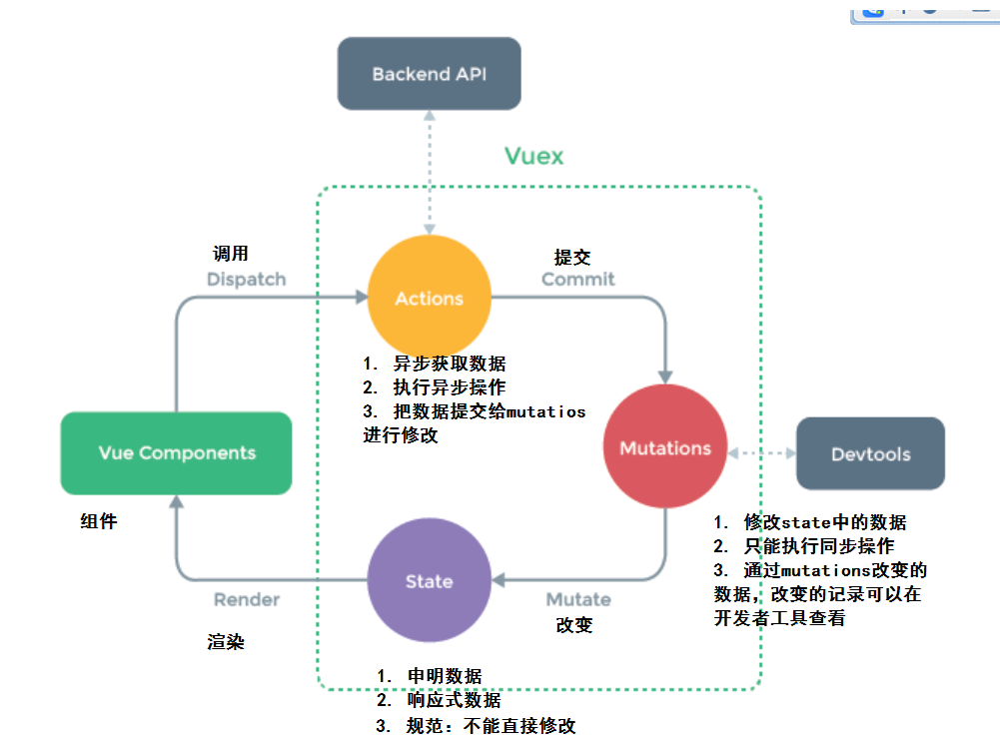
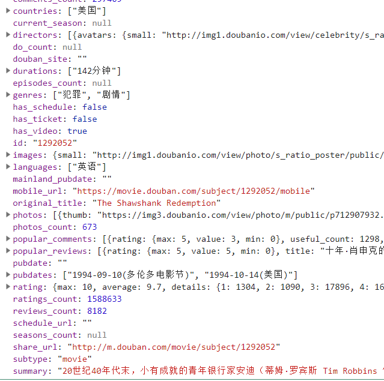

### vuex基础-介绍

​	Vuex 是一个专为 Vue.js 应用程序开发的**状态管理模式**。它采用集中式存储管理应用的所有组件的状态，并以相应的规则保证状态以一种可预测的方式发生变化。

<font color="red">我们理解：</font>

- vuex是采用集中式管理组件依赖的共享数据的一个工具，可以解决不同组件数据共享问题。


<font color="red">看图结论：</font>

- state 管理数据，管理的数据是响应式的，当数据改变时驱动视图更新。
- mutations 更新数据，state中的数据只能使用mutations去改变数据。
- actions 请求数据，响应成功后把数据提交给mutations




### vuex基础-初始化功能

初始化：

- 第一步：`npm i vuex --save`
- 第二步： 创建store.js  `import vuex from 'vuex'`  `import vue from 'vue'`
- 第三步：`Vue.use(vuex)`
- 第四步：`const store = new Vuex.Store({...配置项})`
- 第五步：导出 `export default store`
- 第六步：导入main.js 在根实例配置 store 选项指向 store 实例对象

```js
// 初始化一个vuex的实例（数据仓库） 导出即可
import Vuex from 'vuex'
import Vue from 'vue'

// 使用安装
Vue.use(Vuex)

// 初始化
const store = new Vuex.Store({
  // 配置（state|mutations|actions）
})

export default store
```

```diff
+import store from '@/store'

new Vue({
+  store,
  render: h => h(App),
}).$mount('#app')
```


### vuex基础-state

- 管理数据

```js
// 初始化vuex对象
const store = new vuex.Store({
  state: {
    // 管理数据
    count: 0
  }
})
```

在组件获取state的数据：原始用法插值表达式

```html
<div>A组件 state的数据：{{$store.state.count}}</div>
```

使用计算属性：

```js
// 把state中数据，定义在组件内的计算属性中
  computed: {
    // 1. 最完整的写法
    // count: function () {
    //   return this.$store.state.count
    // },
    // 2. 缩写
    count () {
      return this.$store.state.count
    }
  }
// 不能使用剪头函数  this指向的不是vue实例
```


### vuex基础-mapState

- 把vuex中的state数据映射到组件的计算属性中。
- 辅助函数，生成计算属性。

导入：

```js
import { mapState } from 'vuex'
```

1. 使用：mapState(对象)

```JS
// 对象写法
  // computed: mapState({
  //   // 第一种写法  基础写法
  //   // count 是计算属性的名称
  //   // function 是返回值的函数  state和store中的state是一个对象
  //   // count: function (state) {
  //   //   return state.count
  //   // }

  //   // 第二种写法  箭头函数
  //   // count: state => state.count
    
  //   // 第三种写法  (vuex提供的简写方式)
  //   // count: 'count'

  //   // 第四种写法 情况  依赖data中的数据 同时 依赖vuex中的数据
  //   // count: function(state) {
  //   //   return this.total + state.count
  //   // }
  // })
```

2. 使用：mapState(数组)

```js
  // 数组写法  [state中数据的字段名称]
  // computed: mapState(['count'])

```

3. 如果组件自己有计算属性，state的字段映射成计算属性

```js
  // 情况：我即有自己的计算属性  同时 映射vuex中的state
  // const a = {a:10} const b = {b:20} const c = {...a,...b}
  computed: {
    // 自己的计算属性 
    myCount () {
      return this.total * 10
    },
    // 映射vuex的计算属性
    ...mapState(['count'])
  }
```


### vuex基础-mutations

- 修改数据

vuex申明：

```js
  // 修改state中数据
  mutations: {
    // 修改count的函数  （自增100）
    // state 状态
    // payload 运输 载荷  调用函数的时候传入的数据  obj
    increment (state, obj) {
      // this并不是vuex实例，获取不到state中数据
      // state 作用就是当前申明的状态数据对象
      state.count = state.count + obj.num
    }
  }
```

组件调用：

```js
  methods: {
    fn () {
      // 调用vuex提供的mutations函数
      // 使用commit函数调用mutations函数
      // commit函数中的第一个传参是 mutations函数名称
      // commit函数中的第二个传参是 数据
      this.$store.commit('increment', {num: 100})
    }
  },
```


### vuex基础-mapMutations

- 把vuex中的mutations的函数映射到组件的methods中
- 通俗：通过mapMutations函数可以生成methods中函数

```js
methods: {
    fn () {
      this.$store.commit('increment', { num: 100 })
    },
        
    // 使用 mapMutations 来映射函数
    // methods有一个increment() 的执行内容是：this.$store.commit('increment')
    ...mapMutations(['increment']),
    
    // methods有一个add() 的执行内容是：this.$store.commit('increment')
    ...mapMutations({ add: 'increment' })
  },
```


### vuex基础-actions

- 异步获取数据

vuex定义：

```js
actions: {
    // context 官方运行上下文 运行环境   获取当前的vuex实例
    getData (context) {
      // 模拟获取数据的耗时
      setTimeout(() => {
        const data = { num: 8888 }
        // 获取后台的数据成功后
        // 通过mutations去修改数据
        context.commit('increment', data)
      }, 1000)
    },
    // 带传参 params = {num:9999}
    getDataByParams (context, params) {
      // 模拟获取数据的耗时
      setTimeout(() => {
        const data = { num: 8888 }
        // 获取后台的数据成功后
        // 通过mutations去修改数据
        context.commit('increment', data)
      }, 1000)
    }
  }
```

组件使用：

```js
getData () {
    // 发请求获取数据
    this.$store.dispatch('getData')
    this.$store.dispatch('getDataByParams', { num: 9999 })
},
```


### vuex基础-mapActions

- mapActions辅助函数，把actions中的函数映射组件methods中
- 通俗：通过mapActions函数可以生成methods中函数

```js
// 在methods中申明了一个函数getCount，执行的代码是：this.$store.dispatch('getData')
    ...mapActions({ getCount: 'getData' }),
    // 在methods中申明了一个函数getDataByParams({ num: 9999 })，执行的代码是：this.$store.dispatch('getDataByParams', { num: 9999 })
    ...mapActions(['getDataByParams']),
```


### vuex案例-豆瓣接口

豆瓣接口地址**支持jsonp**但是不支持cors。

- http://api.douban.com/v2/movie/subject/:id  详情
- http://api.douban.com/v2/movie/in_theaters  正在热映
- http://api.douban.com/v2/movie/coming_soon  即将上映
- http://api.douban.com/v2/movie/top250  top250

注意：

- 豆瓣的接口请求限制，每个外网IP有请求次数限制。
- 豆瓣的图片访问显示，非豆瓣域名下发起的图片请求不给予响应。
- 近期：官方停用搜索相关接口，必须要注册豆瓣api平台获取认证apikey才行。
- 网友提供 `apikey=0df993c66c0c636e29ecbb5344252a4a`  <font color="red">大家慎用</font>


### vuex案例-搭建项目

> 静态资源  douban-static.zip
>
> 完整案例 douban-vuex.zip

- 使用vue-router插件     router.js
- 使用vuex插件  store.js

main.js

```js
import Vue from 'vue'
import App from './App.vue'

import store from './store'
import router from './router'

Vue.config.productionTip = false

new Vue({
  render: h => h(App),
  store,
  router
}).$mount('#app')

```

store.js

```js
// 管理数据
import Vuex from 'vuex'
import Vue from 'vue'

Vue.use(Vuex)

const store = new Vuex.Store({

})

export default store

```

router.js

```js
// 路由相关功能
import Vue from 'vue'
import VueRouter from 'vue-router'

Vue.use(VueRouter)

const router = new VueRouter({
  // TODO 路由规则
  routes: []
})

export default router

```


### vuex案例-配置路由及组件

- 封装组件

  - 头部组件
  - 底部组件
  - 路由组件
    - 正在热映
    - 即将上映
    - top250
    - 电影详情

- 路由规则

  - /hot
  - /  重定向  /hot
  - /movie
  - /top
  - /detail

  ```js
  // 路由规则
    routes: [
      { path: '/', redirect: '/hot' },
      { path: '/hot', component: Hot },
      { path: '/movie', component: Movie },
      { path: '/top', component: Top },
      { path: '/detail', component: Detail }
    ]
  ```

  ```html
  <div class="my-footer">
        <ul>
          <li><router-link :to="{path:'/hot'}"><span class="iconfont icon-remen"></span>
              <p>正在热映</p>
            </router-link></li>
          <li><router-link :to="{path:'/movie'}"><span class="iconfont icon-dianying"></span>
              <p>即将上映</p>
            </router-link></li>
          <li><router-link :to="{path:'/top'}"><span class="iconfont icon-top"></span>
              <p>top250</p>
            </router-link></li>
        </ul>
      </div>
  ```


### vuex案例-电影列表功能

第一步：申明数据，根据页面需要的数据进行申明。

```js
  state: {
    title: '',
    list: []
  },
```

第二步：定义修改数据的方法

```js
 mutations: {
    // payload = {title,list}  约定数据格式
    setListPageData (state, payload) {
      state.title = payload.title
      state.list = payload.list
    }
  },
```

第三步：获取数据的方法

```js
actions: {
    // 获取数据
    getListData (context) {
      // 注意：豆瓣接口不支持跨域  支持jsonp
      // 通过: jsonp的第三方插件  专门发jsonp请求
      jsonp('http://api.douban.com/v2/movie/in_theaters?apikey=0df993c66c0c636e29ecbb5344252a4a', (err, data) => {
        if (err) return alert('接口请求失败')
        console.log(data)
        // 提交数据  mutations
        context.commit('setListPageData', { title: data.title, list: data.subjects })
      })
    }
  }
```

第四步：调用获取数据的方法

```js
methods: {
    ...mapActions(['getListData'])
  }
```

```js
 created () {
    this.getListData()
    // this.$store.dispatch('getListData')
  },
```

第五步：获取vuex的数据

```js
computed: {
    ...mapState(['list'])
  },
```

第六步：渲染页面


```html
<ul class="list">
    <li v-for="item in list" :key="item.id">
      <a href="#">
        
        <div class="info">
          <h3>{{item.title}}</h3>
          <p>豆瓣评分：{{item.rating.average}}</p>
          <p><span v-for="(item,i) in item.genres" :key="i" class="tag">{{item}}</span></p>
        </div>
      </a>
    </li>
  </ul>
```


### vuex案例-电影详情功能

- 电影列表  电影的详情地址   都不一样   都会来到电影详情组件
  - 使用动态路由功能  /detail/:id  
  - 电影详情组件获取id获取详情数据

第一步：路由规则

```js
{ path: '/detail/:id', component: Detail }
```

```js
router-link :to="{path:'/detail/'+item.id}"
router-link :to="{name:'item',params:{id:item.id}}"
```

第二步：准备数据

```js
state: {
    // 标题
    title: '',
    // 详情
    item: null
  },
```

第三步：修改数据函数

```js
mutations: {
    // payload = {title,item}  约定数据格式
    setItemPageData (state, payload) {
      state.title = payload.title
      state.item = payload.item
    }
  },
```

第四步：获取数据去修改数据的函数

```js
 actions: {
    // 获取数据 详情
    getItemData (context, id) {
      jsonp('http://api.douban.com/v2/movie/subject/' + id + '?apikey=0df993c66c0c636e29ecbb5344252a4a', (err, data) => {
        if (err) return alert('接口请求失败')
        console.log(data)
        // 提交数据  mutations
        context.commit('setItemPageData', { title: data.title, item: data })
      })
    }
  }
```

第五步：在组件使用数据

```js
computed: {
    ...mapState(['item'])
  },
```

第六步：在组件初始化获取数据

```js
created () {
    this.getItemData(this.$route.params.id)
  },
```

```js
 methods: {
    ...mapActions(['getItemData'])
  }
```

第七步：渲染页面



```html
<div class="item" v-if="item">
    
    <div>
      <p>豆瓣评分：{{item.rating.average}}</p>
      <p>产地：{{item.countries[0]}}</p>
      <p><span v-for="(item,i) in item.genres" :key="i" class="tag">{{item}}</span></p>
      <p>{{item.summary}}</p>
    </div>
  </div>
```

处理：空数据报错问题

```js
 <div class="item" v-if="item">
```


