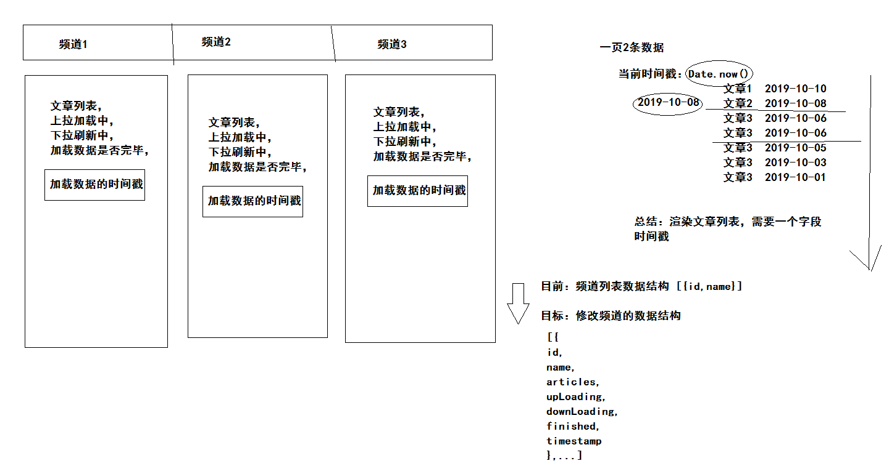

### 使用tabs组件

基础结构：

```html
<van-tabs swipeable>
  <van-tab :key="index" v-for="index in 8" :title="'标签 ' + index">
    <div class="scroll-wrapper">
     <van-cell-group>
         <van-cell v-for="item in 20" :key="item">{{index}}</van-cell>
      </van-cell-group>
     </div>
  </van-tab>
</van-tabs>
<span class="bar_btn" slot="nav-right">
  <van-icon name="wap-nav"></van-icon>
</span>
```

设置样式：

```less
.van-tabs {
  height: 100%;
  display: flex;
  flex-direction: column;
  /deep/ .van-tabs__wrap {
    height: 36px;
    padding-right: 36px;
    .van-tab {
      line-height: 36px;
    }
    .van-tabs__line {
      background-color: #3296fa;
      height: 2px;
    }
  }
  /deep/ .van-tabs__content{
    flex: 1;
    overflow: hidden;
  }
  /deep/ .van-tab__pane{
    height: 100%;
    .scroll-wrapper{
      height: 100%;
      overflow-y: auto;
    }
  }
}
.bar_btn {
  width: 36px;
  height: 35px;
  position: absolute;
  top: 0;
  right: 0;
  &::before {
    content: "";
    width: 100%;
    height: 100%;
    position: absolute;
    z-index: 999;
    box-shadow: 0 0 10px #999;
    transform: scale(1, 0.6);
  }
  .van-icon-wap-nav {
    width: 100%;
    height: 100%;
    background: #fff;
    text-align: center;
    line-height: 35px;
    position: relative;
    z-index: 1000;
    &::before {
      font-size: 20px;
    }
  }
}
```

- /deep/  作用：让样式在其他组件生效。
- 保证 scroll-wrapper 容器能够生成滚动条，将来需要使用滚动。
  - 下拉刷新
  - 上拉加载
  - 记录浏览位置


### 实现上拉加载

结构：

```html
<van-list v-model="upLoading" :finished="finished" finished-text="没有更多了" @load="onLoad">
            <van-cell v-for="item in articles" :key="item">{{item}}</van-cell>
          </van-list>
```
数据：

```js
// ----列表需要的数据----
// 上拉加载中
upLoading: false,
// 是否全部加载完成
finished: false,
// 文章列表
articles: []
```
逻辑：

```js
    onLoad () {
      // onLoad 组件初始化默认执行一次，如果数据对应的页面不够一屏，自动再加载一次。
      // 触发上拉加载触发当前函数 (获取数据，进行列表渲染)
      // 模拟获取数据，模拟网络延时
      window.setTimeout(() => {
        // 获取数据成功，模拟一下数据
        const data = []
        // 1-10  11-20  21-30 ...
        for (let i = this.articles.length + 1; i <= this.articles.length + 10; i++) {
          data.push(i)
        }
        // 获取文章列表ok
        this.articles.push(...data)
        // 结束上拉加载效果
        this.upLoading = false
        // 是否所有数据已经加载完毕 （模拟一下，数据超过50就加载完毕）
        if (this.articles.length >= 50) {
          this.finished = true
        }
      }, 1000)
    }
```


###实现下拉刷新

结构：

```diff
+<van-pull-refresh v-model="downLoading" @refresh="onRefresh" :success-text="refreshSuccessText">
  <van-list v-model="upLoading" :finished="finished" 
  finished-text="没有更多了" @load="onLoad">
    <van-cell-group>
      <van-cell v-for="item in articles" :key="item">{{item}}</van-cell>
    </van-cell-group>
  </van-list>
+</van-pull-refresh>
```

数据：

```js
// 是否正在下拉刷新中
      downLoading: false,
     // 刷新成功的文案
      refreshSuccessText: null
```

逻辑：

```js
onRefresh () {
      // onRefresh 在下拉后 松手后 触发的函数 （获取数据，替换，进行列表渲染）
      // 获取数据 (获取到了数据，获取不到数据--->提示“暂无更新”,不需要替换列表)
      window.setTimeout(() => {
        // 获取数据成功
        // const data = [1, 2, 3, 4, 5, 6]
        const data = []
        // 结束下拉刷新效果
        this.downLoading = false
        if (data.length) {
          this.articles = data
          // 加载有数据的文案
          this.refreshSuccessText = '更新成功'
          // 防止看到 没有更多了 信息 （重新刷新列表，下一页应该是有数据的）
          this.finished = false
          // 防止数据不够一屏 再来一次上拉加载数据 onLoad
          this.onLoad()
        } else {
          // 加载没有数据的文案
          this.refreshSuccessText = '暂无更新'
        }
      }, 1000)
    },
```


### 列表文章布局

结构：

- 三张图

```html
<div class="article_item">
  <h3 class="van-ellipsis">PullRefresh下拉刷新PullRefresh下拉刷新下拉刷新下拉刷新</h3>
  <div class="img_box">
     <van-image class="w33" fit="cover" src="https://img.yzcdn.cn/vant/cat.jpeg"/>
     <van-image class="w33" fit="cover" src="https://img.yzcdn.cn/vant/cat.jpeg"/>
     <van-image class="w33" fit="cover" src="https://img.yzcdn.cn/vant/cat.jpeg"/>
  </div>
  <div class="info_box">
     <span>你像一阵风</span>
     <span>8评论</span>
     <span>10分钟前</span>
     <span class="close"><van-icon name="cross"></van-icon></span>
  </div>
</div>
```

- 一张图

```html
<div class="article_item">
  <h3 class="van-ellipsis">PullRefresh下拉刷新PullRefresh下拉刷新下拉刷新下拉刷新</h3>
  <div class="img_box">
      <van-image class="w100" fit="cover" src="https://img.yzcdn.cn/vant/cat.jpeg"/>
  </div>
  <div class="info_box">
     <span>你像一阵风</span>
     <span>8评论</span>
     <span>10分钟前</span>
     <span class="close"><van-icon name="cross"></van-icon></span>
  </div>
</div>
```

- van-ellipsis  vant内置的样式 当文本内容长度超过容器最大宽度时，自动省略多余的文本。
- w33   宽度33% 剩余1%当作间距。
- w100 宽度100% 


样式：

```less
.article_item{
  h3{
    font-weight: normal;
    line-height: 2;
  }
  .img_box{
    display: flex;
    justify-content: space-between;
    .w33{
      width: 33%;
      height: 90px;
    }
    .w100{
      width: 100%;
      height: 180px;
    }
  }
  .info_box{
    color: #999;
    line-height: 2;
    position: relative;
    font-size: 12px;                  
    span{
      padding-right: 10px;
      &.close{
        border: 1px solid #ddd;
        border-radius: 2px;
        line-height: 15px;
        height: 12px;
        width: 16px;
        text-align: center;
        padding-right: 0;
        font-size: 8px;
        position: absolute;
        right: 0;
        top: 7px;
      }
    }
  }
}
```


### 渲染频道

api函数 `src/api/channel.js`

```js
/**
 * 获取我的频道信息（如果没登录，获取的是后台设置的默认频道列表）
 */
export const getMyChannels = () => {
  return request('/app/v1_0/user/channels', 'get')
}
```

导入函数 `src/vies/home/index.vue`

```js
import { getMyChannels } from '@/api/channel'
```

使用函数 

```js
  created () {
    this.getMyChannels()
  },
  methods: {
    // 获取频道列表
    async getMyChannels () {
      const data = await getMyChannels()
      this.channels = data.channels
    },
```

申明数据

```js
 // ----频道需要的数据----
 channels: [],
```

渲染组件

```html
<van-tab :key="item.id" v-for="item in channels" :title="item.name">
```


###组织数据



- 分析：文章列表与频道关系
- 结论：频道数据应该包含文章列表数据

```js
 // 获取频道列表
    async getMyChannels () {
      const data = await getMyChannels()
      // data.chennels 数据结构 [{id,name},...]
      // 不满足页面的数据要求，转化成另外一种格式。
      // map() 数组提供的函数，遍历当前数组，生成一个新的数组，
      // 在遍历的时候回调函数的返回值，就是新数组中的每一项。
      // 注意：在箭头函数 => {}  解析的时候不是对象 而是代码块
      // 写法：如果一定要直接返回对象  包裹小括号
      this.channels = data.channels.map(item => ({
        id: item.id,
        name: item.name,
        // 是否正在上拉加载中
        upLoading: false,
        // 是否正在下拉刷新中
        downLoading: false,
        // 是否加载了所有的数据
        finished: false,
        // 文章列表
        articles: [],
        // 获取数据的时间戳
        timestamp: Date.now()
      }))
    },
```

- timestamp  相当于分页的页码
- upLoading  加载中
- finished  没有数据
- downLoading 刷新中
- articles 文章列表

全局数据：

-  refreshSuccessText  刷新后提示信息


###渲染列表

- 封装api  `src/api/article.js`

```js
// 提供  调用文章相关的接口函数

import request from '@/utils/request'

/**
 * 获取文章列表
 * @param {Integer} channelId - 频道ID
 * @param {String} timestamp - 时间戳 相对于分页页码
 */
export const getArticles = (channelId, timestamp) => {
  return request('app/v1_1/articles', 'get', {
    channel_id: channelId,
    timestamp,
    with_top: 1
  })
}

```

- 当前频道

```js
  computed: {
    // 当前激活的频道
    activeChannel () {
      return this.channels[this.activeIndex]
    }
  },
```

- 上拉加载  onLoad

```js
await this.$sleep()
 const data = await getArticles(this.activeChannel.id, this.activeChannel.timestamp)
      // 把获取的数据累加到当前频道下的文章列表中
      this.activeChannel.articles.push(...data.results)
      // 结束上拉加载效果
      this.activeChannel.upLoading = false
      // 是否所有数据已经加载完毕
      if (!data.pre_timestamp) {
        // 已经没有更多数据了
        this.activeChannel.finished = true
      } else {
        // 把后端返回的时间戳 记录下来  下次请求需要使用
        this.activeChannel.timestamp = data.pre_timestamp
      }
```

- 下拉刷新  onRefresh

```js
await this.$sleep()
      this.activeChannel.timestamp = Date.now()
      const data = await getArticles(this.activeChannel.id, this.activeChannel.timestamp)
      // 结束下拉刷新效果
      this.activeChannel.downLoading = false
      // 判断是否有数据
      if (data.results.length) {
        this.activeChannel.articles = data.results
        // 加载有数据的文案
        this.refreshSuccessText = '更新成功'
        // 防止看到 没有更多了 信息 （重新刷新列表，下一页应该是有数据的）
        this.activeChannel.finished = false
        // 加上时间戳 加载下一页数据
        this.activeChannel.timestamp = data.pre_timestamp
        // 防止数据不够一屏 再来一次上拉加载数据 onLoad
        this.onLoad()
      } else {
        // 加载没有数据的文案
        this.refreshSuccessText = '暂无更新'
      }
```

- 渲染页面

```html
<van-pull-refresh v-model="activeChannel.downLoading" @refresh="onRefresh" :success-text="refreshSuccessText">
  <van-list v-model="activeChannel.upLoading"  :finished="activeChannel.finished" 
            finished-text="没有更多了" @load="onLoad">
    <van-cell-group>
       <van-cell v-for="article in activeChannel.articles" 
                  :key="article.id" :to="'/article/'+article.art_id">
          <div class="article_item">
              <h3 class="van-ellipsis">{{article.title}}</h3>
              <div class="img_box" v-if="article.cover.type === 3">
                    <van-image class="w33" 
                                 fit="cover" 
                                 :src="article.cover.images[0]"/>
                    <van-image class="w33" 
                                 fit="cover" 
                                 :src="article.cover.images[1]"/>
                    <van-image class="w33" 
                                 fit="cover" :src="article.cover.images[2]"/>
                    </div>
                 <div class="img_box" v-if="article.cover.type === 1">
                    <van-image class="w100" 
                                 fit="cover" :src="article.cover.images[0]"/>
                 </div>
                <div class="info_box">
                    <span>{{article.aut_name}}</span>
                    <span>{{article.comm_count}} 评论</span>
                    <span>{{article.pubdate}}</span>
                    <span class="close">
                      <van-icon name="cross"></van-icon>
                    </span>
                  </div>
            </div>
          </div>
      </van-cell>
    </van-cell-group>
  </van-list>
</van-pull-refresh>
```

- 延时函数 `src/utils/plugin.js`

```js
// 提供vue一些插件方法
const $sleep = () => {
  return new Promise((resolve, reject) => {
    window.setTimeout(() => {
      resolve()
    }, 1000)
  })
}

export default {
  install (Vue) {
    Vue.prototype.$sleep = $sleep
  }
}

```

```js
// main.js
import plugin from '@/utils/plugin'
Vue.use(plugin)
```


###时间格式处理

- 封装一个相对时间函数

```js
import dayjs from 'dayjs'
import relativeTime from 'dayjs/plugin/relativeTime'
import 'dayjs/locale/zh-cn'
dayjs.extend(relativeTime)
```

```js
/**
 * 过滤器函数
 * @param {String} strDate - 就是过滤器 | 前的表达式的值
 */
const relTime = (strDate) => {
  // 转换的逻辑
  // moment 插件  dayjs 插件  都是处理时间格式
  // dayjs 轻量一些
  return dayjs().locale('zh-cn').from(strDate)
}
```

- 注册成过滤器

```diff
export default {
  install (Vue) {
    Vue.prototype.$sleep = $sleep
+   Vue.filter('relTime', relTime)
  }
}
```

使用：

```html
<span>{{article.pubdate|relTime}}</span>
```


###图片懒加载

- 使用组件属性

```html
<van-image lazy-load></van-image>
```

- 需要依赖 v-lazy 指令，由谁提供：vue-lazyload 插件

```html

```

- 安装插件 https://github.com/hilongjw/vue-lazyload

```sh
npm i vue-lazyload
```

- 导入，注册

```js
import VueLazyload from 'vue-lazyload'
Vue.use(VueLazyload)
```


补充：是vant内置的插件，实现图片懒加载。

```js
import Vant, { Lazyload } from 'vant'
```

```js
// 注册好了 支持v-lazy指令
Vue.use(Lazyload)
```

```html
<van-image lazy-load></van-image>
```


### 优化-缓存组件

- keep-alive 缓存组件

- 并非所有组件要做缓存，所以按需缓存

`src/router.js`

```diff
const router = new Router({
  routes: [
    { path: '/search', name: 'serach', component: Search },
    { path: '/search/result', name: 'serach-result', component: SearchResult },
    { path: '/user/profile', name: 'user-profile', component: UserProfile },
    { path: '/user/chat', name: 'user-chat', component: UserChat },
    { path: '/login', name: 'login', component: UserLogin },
-   { path: '/article/:id', name: 'article', component: Article}  
+   { path: '/article/:id', name: 'article', component: Article, meta: { keepAlive: true } },
    {
      path: '/',
      component: Layout,
      children: [
-        { path: '/', name: 'home', component: Home }
+        { path: '/', name: 'home', component: Home, meta: { keepAlive: true } },
        { path: '/question', name: 'question', component: Question },
        { path: '/media', name: 'media', component: Media },
        { path: '/user', name: 'user', component: User }
      ]
    }
  ]
})
```

`src/App.vue`

```html
<div id="app">
  <keep-alive>
    <router-view v-if="$route.meta.keepAlive"></router-view>
  </keep-alive>
  <router-view v-if="!$route.meta.keepAlive"></router-view>
</div>
```

`src/views/Layout.vue`

```html
<div id="app">
  <keep-alive>
    <router-view v-if="$route.meta.keepAlive"></router-view>
  </keep-alive>
  <router-view v-if="!$route.meta.keepAlive"></router-view>
</div>
```

###优化-阅读记忆

- tab组件，默认是懒加载，会导致操作dom问题，需要关闭自己主动来加载。

- 绑定滚动事件，记录阅读位置，使用scrollTop
- 激活组件的时候，操作当前列表，滚动到阅读位置
- 切换tab组件的时候
  - 如果之前没有加载过数据，开启上拉加载效果，调用加载函数。
  - 如果有数据，操作当前列表，滚动到阅读位置

关闭懒加载：

```html
<van-tabs :lazy-render="false"></van-tabs>
```

监听滚动：

```html
<div  @scroll="remenber($event)"></div>
```

记录阅读位置：

```js
remenber (e) {
  this.activeChannel.scrollTop = e.target.scrollTop
},
```

需要提前设置记录阅读位置数据：

```diff
// 获取数据
    async getChannels () {
      const data = await getChannels()
      // 组织数据
      this.channels = data.channels.map(item => ({
        id: item.id,
        name: item.name,
        timestamp: Date.now(),
        upLoading: false,
        downLoading: false,
        finished: false,
        articles: [],
+       scrollTop: 0
      }))
    }
  },
```

在激活组件时候，跳转记录的位置：

```js
activated () {
  if (this.$refs['scrollWrapper']) {
      const dom = this.$refs['scrollWrapper'][this.activeIndex]
      dom.scrollTop = this.activeChannel.scrollTop
  }
},
```

切换tab组件的时候

```js
changeChannel () {
      // 之前加载过数据 才去滚动至浏览位置
      if (this.activeChannel.articles.length) {
        // 切换tab的时候回进行dom的重新绘制 需要等绘制完毕后定位
        this.$nextTick(() => {
          const dom = this.$refs['scrollWrapper'][this.activeIndex]
          dom.scrollTop = this.activeChannel.scrollTop
        })
      } else {
        this.activeChannel.upLoading = true
        this.onLoad()
      }
    },
```


###登录后更新频道与文章

- 监听登录与退出
- 不管登录与退出，都需要操作 vuex 中用户数据
- 监听用户数据改变即可

导入vuex的用户数据

```js
import { mapState } from 'vuex'
```

```diff
  computed: {
    activeChannel () {
      return this.channels[this.activeIndex]
    },
+    ...mapState(['auth'])
  },
```

监听vuex的用户数据：重置到推荐频道，重新获取频道数据，手动加载文章数据。

```js
  watch: {
    auth () {
      this.activeIndex = 0                                    
      this.getChannels()
      this.onLoad()
    }
  }
```


### 更多操作-组件准备

- 使用 popup 组件  https://youzan.github.io/vant/#/zh-CN/popup
- 封装在 `./components/more-action.vue` 组件下

```html
<template>
  <van-popup :value="value" @input="$emit('input',$event)" @open="isReport=false">
    <van-cell-group v-if="!isReport">
      <van-cell>不感兴趣</van-cell>
      <van-cell is-link @click="isReport=true">反馈垃圾内容</van-cell>
      <van-cell>拉黑作者</van-cell>
    </van-cell-group>
    <van-cell-group v-else>
      <van-cell icon="arrow-left" @click="isReport=false">返回</van-cell>
      <van-cell>侵权</van-cell>
      <van-cell>色情</van-cell>
      <van-cell>暴力</van-cell>
      <van-cell>低俗</van-cell>
      <van-cell>不适</van-cell>
      <van-cell>错误</van-cell>
      <van-cell>其他</van-cell>
    </van-cell-group>
  </van-popup>
</template>

<script>
export default {
  name: 'more-action',
  props: {
    value: {
      type: Boolean,
      default: false
    }
  },
  data () {
    return {
      isReport: false
    }
  }
}
</script>

<style scoped lang='less'>
.van-popup {
  width: 80%;
  border-radius: 4px;
}
</style>

```

- 登录后才可使用

```js
import MoreAction from './components/more-action'
```

```js
components: { MoreAction },
```

```html
<more-action v-if="auth.token" v-model="showMoreAction"></more-action>
```

显示隐藏

```html
<span v-if="auth.token" class="close" @click.stop="showMoreAction=true"><van-icon name="cross"></van-icon></span>
```


###更多操作-不感兴趣

- 打开时候传入当前点击文章ID

```js
articleId: null
```

```html
<span
      v-if="auth.token"
      class="close"
      @click.stop="openMoreAction(article.art_id)">
  <van-icon name="cross"></van-icon>
</span>
```

```js
openMoreAction (articleId) {
  this.showMoreAction = true
  this.articleId = articleId
},
```

```html
<more-action v-if="auth.token" v-model="showMoreAction" :articleId="articleId" ></more-action>
```

- 封装API `src/api/article.js`

```js
/**
 * 对文章不感兴趣
 * @param {BigInt} articleId
 */
export const disLike = (articleId) => {
  return request('app/v1_0/article/dislikes', 'post', {
    target: articleId
  })
}
```

- 点击 不感兴趣 发请求

```html
<van-cell icon="closed-eye" @click="disLike()">不感兴趣</van-cell>
```

```js
    async disLike () {
      try {
        await disLike(this.articleId)
        // 提示
        this.$toast({ type: 'success', message: '操作成功' })
        // 关闭
        this.$emit('input', false)
        // 删除文章
        this.$emit('on-success', this.articleId)
      } catch (e) {
        this.$toast({ type: 'fail', message: '操作失败' })
      }
    }
```

- 成功后 通知父组件 删除文章

```html
<more-action
      v-if="auth.token"
      v-model="showMoreAction"
      @on-dislike="removeArticle"
      :articleId="articleId" >
    </more-action>
```

```js
    removeArticle () {
      const articles = this.activeChannel.articles
      const index = articles.findIndex(item => item.art_id === this.articleId)
      articles.splice(index, 1)
    },
```


###更多操作-举报文章

- 根据接口提供的传参，定义常量数据 `src/api/constants.js`

```js
/**
 * 举报类型
 */
export const reports = [
  { value: 0, label: '其他问题' },
  { value: 1, label: '标题夸张' },
  { value: 2, label: '低俗色情' },
  { value: 3, label: '错别字多' },
  { value: 4, label: '旧闻重复' },
  { value: 5, label: '广告软文' },
  { value: 6, label: '内容不实' },
  { value: 7, label: '涉嫌违法犯罪' },
  { value: 8, label: '侵权' }
]
```

- 使用数据

```js
import { reports } from '@/api/constants'
```

```diff
  data () {
    return {
      isReport: false,
+     reports
    }
  },
```

```html
<van-cell icon="info-o" v-for="item in reports" :key="item.value">
  {{item.label}}
</van-cell>
```

- 举报api  `src/api/article.js`

```js
/**
 * 举报文章
 * @param {BigInt} articleId -文章ID
 * @param {Integer} type - 举报类型
 */
export const report = (articleId, type) => {
  return request('app/v1_0/article/reports', 'post', {
    target: articleId,
    type
  })
}
```

- 绑定点击事件，发请求

```js
import { reports } from '@/api/constants'
```

```html
<van-cell icon="info-o" @click="report(item.value)"
```

```js
    async report (type) {
      try {
        await report(this.articleId, type)
        // 提示
        this.$toast({ type: 'success', message: '举报成功' })
        // 关闭
        this.$emit('input', false)
        // 删除文章
        this.$emit('on-report', this.articleId)
      } catch (e) {
        if (e.response.status === 409) {
          this.$toast({ message: '已举报过' })
          return
        }
        this.$toast({ type: 'fail', message: '举报失败' })
      }
    }
```

- 成功后 通知父组件 删除文章

```diff
<more-action
      v-if="auth.token"
      v-model="showMoreAction"
      @on-dislike="removeArticle"
+     @on-report="removeArticle"
      :articleId="articleId" >
    </more-action>
```

