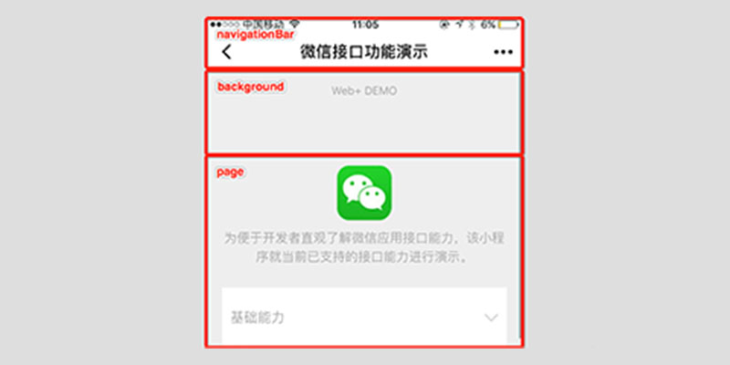
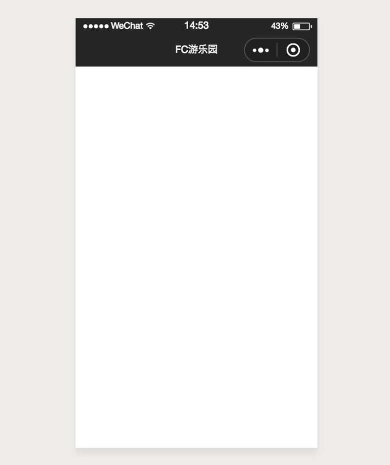
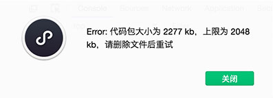
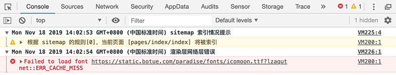

# 第1天小程序基础


## 每日目标

- 掌握小程序开发的流程步骤
- 掌握小程序开发工具的使用
- 理解小程序项目的基本结构
- 能够通过配置文件实现对小程序的配置
- 理解小程序布局的实现方式
- 掌握小程序常用组件的使用
- 能够使用 wxss 布局小程序界面


## 背景介绍

> 微信是一个生态圈，包括即时通信、移动支付、社交媒体、游戏娱乐等多个领域，彼此之间紧密联系、互为支撑形成了一个强大的微信帝国。日常交流中所提到的微信更多是指的**即时通信**和**移动支付**，而我们即将学习的**微信小程序属于社交媒体的组成部分**。

*注：除了有微信小程序外，支付宝也如法炮制了小程序，文中提到的小程序如无特别说明，特指微信小程序。*


人们越来越多的将时间花费在了移动设备上，移动互联势不可挡。


伴随而来的移动开发技术层出不穷：

- H5（Web App）

  即运行于移动设备浏览器的**网页**，使用html5、css3等技术实现，可以跨平台。

- 原生应用（Native App）

  即所谓的 Android 和 IOS 开发，可以直接与底层操作系统通信，可扩展性非常强，不可跨平台。

- 混合应用（Hybrid App）

  混合了Web App 和 Native App开发技术，一般展示类内容使用 Web App技术，交互性较强的使用 Native App技术，可以跨平台。


然而不同的开发技术间各有优势，下图列举了各开发技术间的差异：


小程序是一种新型的轻量的开发技术，"微信之父" 张晓龙是这样定义小程序的：


##开发环境

### 1. [账号申请](https://mp.weixin.qq.com/cgi-bin/registermidpage?action=index&lang=zh_CN)

1. 选择注册账号类型


2. 账号信息

   填写邮箱及密码信息

3. 邮箱激活


4. 信息登记


### 2. 绑定开发者

1. [登录小程序](https://mp.weixin.qq.com/)


2. 管理员授权


3. 添加成员


### 3. 获取AppID


### 4. 开发工具

1. [下载](https://developers.weixin.qq.com/miniprogram/dev/devtools/download.html)


2. 扫码登录


3. 小程序


4. 创建小程序


5. 开发界面


### 5. 开发文档

俗话说的好：如记性不如烂笔头，小程序开发过程中参考[官方文档](https://developers.weixin.qq.com/miniprogram/dev/index.html?t=2018413)是最佳实践！

**注：如果已存在的项目，可通过导入方式打开。**


## 快速体验

### 创建小程序

1. 创建一个目录，例如 demo
2. 打开开发工具
3. 选择第1步创建的目录


4. 填定AppID、名称，后端服务**不使用云服务**


### 编辑小程序

微信官方的开发工具自带了编辑器功能，可以对小程序代码进行编辑，如下图


注：使用官方开发工具编辑小程序并不是唯一方式，开发者也可以根据自已喜好自由选择任意编辑工具，如 sublime_text、WebStorm、VS Code等。

### 预览小程序

使用绑定的开发者微信用户扫描二维码，便可以在微信中打开小程序了


​		由于小程序处理开发阶段，在小程序 **后台管理=>成员管理=>项目成员**，添加开发成员后，才可以描码在真机中预览小程序。

**注：小程序所有者就不必添加为成员了。**

## 结构分析

### 1. 目录

> 小程序包含一个描述整体程序的 app 和多个描述各自页面的 page。

- 主体 app

一个小程序主体部分由三个文件组成，必须放在项目的根目录，如下：

| 文件类型 | 必填 | 描述                 |
| -------- | ---- | -------------------- |
| app.js   | 是   | 小程序入口           |
| app.json | 是   | 小程序全局配置       |
| app.wxss | 否   | 小程序全局(公共)样式 |

- 页面 page

一个小程序页面由四个文件组成，分别是：

| 文件后缀 | 必填 | 描述         |
| -------- | ---- | ------------ |
| .js      | 是   | 页面逻辑     |
| .wxml    | 是   | 页面布局结构 |
| .wxss    | 否   | 局部布局样式 |
| .json    | 否   | 局部配置     |

​		wxml 指的是 **W**ei **X**in **M**arkup **L**anguage，微信团队以 XML 为基础，而定义的一套用以实现小程序页面布局的标记语言，与HTML非常类似。

​		wxss 指的是 **W**ei **X**in **S**tyle **S**heet，微信团队定义的一套用以实现小程序布局样式的层叠样式表，与CSS非常接近。


​		以下是小程序的基本目录结构，也可以根据需要任意添加其它目录，如资源目录 assets、第三方库vendors、扩展目录 extends等。

```
├── app.js ...................................................... 小程序入口文件
├── app.json .................................................... 小程序全局配置
├── app.wxss .................................................... 小程序全局样式
├── pages ....................................................... 所有页面目录
│   ├── index ................................................... index页面目录
│   │   ├── index.js ............................................ index页面业务逻辑
│   │   ├── index.wxml .......................................... index页面布局结构
│   │   └── index.wxss .......................................... index页面布局样式
│   └── logs .................................................... logs页目录
│       ├── logs.js ............................................. logs页面业务逻辑
│       ├── logs.json ........................................... logs页面配置文件
│       ├── logs.wxml ........................................... logs页面布局结构
│       └── logs.wxss ........................................... logs页面布局样式
├── project.config.json ......................................... 开发工具配置文件
└── utils ....................................................... 公共逻辑
    └── util.js ................................................. 实用工具
```

### 2. 配置

​		熟悉了小程序的基础知识后，接下来我们一起动手开发一个真正的小程序，首先从配置小程开始。按着上一章节步骤创建一个小程序。


#### 全局配置

> 通过 app.json 文件对小程序进行全局配置，如页面文件的路径、窗口表现、设置网络超时时间、设置多 tab 等。

**app.json 配置清单**

| 属性           | 类型         | 必填 | 描述                 |
| -------------- | ------------ | ---- | -------------------- |
| pages          | String Array | 是   | 设置页面路径         |
| window         | Object       | 否   | 设置默认窗口表现     |
| tabBar         | Object       | 否   | 设置底部 tab 表现    |
| networkTimeout | Object       | 否   | 设置网络超时时间     |
| debug          | Boolean      | 否   | 设置是否开启调试模式 |

创建 app.json 文件

app.json 示例

```json
{
  "pages":[
    "pages/index/index",
    "pages/detail/index"
  ],
  "window":{
    "backgroundTextStyle":"light",
    "navigationBarBackgroundColor": "#fff",
    "navigationBarTitleText": "WeChat",
    "navigationBarTextStyle":"black"
  }
}
```

1. **pages**

数组类型，数组中每一项都是字符串，来指定小程序由哪些页面组成。每一项代表对应页面的【路径+文件名】信息，数组的第一项代表小程序的初始页面。小程序中新增/减少页面，都需要对 pages 数组进行修改。文件名不需要写文件后缀，因为框架会自动去寻找路径下 .json ,  .js,  .wxml ,  .wxss 四个文件进行整合。

```
// 创建目录及文件
// 习惯性的将页面统一放到名叫 pages 的目录中，不是强制要求，可以起任意名称的目录
pages
├── detail
│   ├── index.js
│   └── index.wxml
└── index
    ├── index.js
    └── index.wxml
```

编辑 app.json，添加字段 pages

```json
{
  "pages": [
    "pages/index/index",
    "pages/detail/detail"
  ]
}
```

2. **window**

对象类型，用于设置小程序的状态栏、导航条、标题、窗口背景色。

| 属性                         | 类型     | 默认值  | 描述                               | 兼容 |
| ---------------------------- | -------- | ------- | ---------------------------------- | ---- |
| navigationBarBackgroundColor | HexColor | #000000 | 导航栏背景颜色，如"#000000"        | -    |
| navigationBarTextStyle       | String   | white   | 导航栏标题颜色，仅支持 black/white |      |
| navigationBarTitleText       | String   |         | 导航栏标题文字内容                 |      |
| backgroundColor              | HexColor | #ffffff | 窗口的背景色                       |      |
查看window[更多配置](https://developers.weixin.qq.com/miniprogram/dev/framework/config.html#window)属性



编辑 app.json，添加字段 windows

```json
{
  "window": {
     "navigationBarBackgroundColor": "#262626",
     "navigationBarTitleText": "FC游乐园",
     "navigationBarTextStyle": "white",
     "backgroundColor": "#F0F0F0"
  }
}
```

效果如下图所示：



3. **tabBar**

对象类型，配置项指定 tab 栏的表现，以及 tab 切换时显示的对应页面。

| 属性            | 类型     | 必填 | 默认值 | 描述                                    |
| --------------- | -------- | ---- | ------ | --------------------------------------- |
| color           | HexColor | 是   |        | tab 上的文字默认颜色                    |
| selectedColor   | HexColor | 是   |        | tab 上的文字选中时的颜色                |
| backgroundColor | HexColor | 是   |        | tab 的背景色                            |
| borderStyle     | String   | 否   | black  | tabbar上边框的颜色， 仅支持 black/white |
| list            | Array    | 是   |        | tab 的列表，最少2个、最多5个            |
| position        | String   | 否   | bottom | 可选值 bottom、top                      |

1. 当设置 position 为 top 时，将不会显示 icon
2. tabBar 中的 list 是一个数组，**只能配置最少2个、最多5个 tab**，tab 按数组的顺序排序。

其中 list 接受一个数组，数组中的每个项都是一个对象，其属性值如下：

| 属性             | 类型   | 必填 | 描述                                                         |
| ---------------- | ------ | ---- | ------------------------------------------------------------ |
| pagePath         | String | 是   | 页面路径，必须在 pages 中先定义                              |
| text             | String | 是   | tab 上按钮文字                                               |
| iconPath         | String | 否   | 图片路径，icon 大小限制为40kb，建议尺寸为 81px * 81px，当 postion 为 top 时，此参数无效，不支持网络图片 |
| selectedIconPath | String | 否   | 选中时的图片路径，icon 大小限制为40kb，建议尺寸为 81px * 81px ，当 postion 为 top 时，此参数无效 |


```diff
// 到目前完整的目录结构
FC
├── app.js
├── app.json
├── icons
│   ├── cards-active.png
│   ├── cards-default.png
│   ├── face-active.png
│   ├── face-default.png
│   ├── home-active.png
│   └── home-default.png
├── pages
│   ├── cards
│   │   ├── index.js
│   │   └── index.wxml
│   ├── center
│   │   ├── index.js
│   │   └── index.wxml
│   ├── detail
│   │   ├── index.js
│   │   └── index.wxml
│   └── index
│       ├── index.js
│       └── index.wxml
└── project.config.json
```

编辑 app.json，添加 tabBar 字段

```json
  "tabBar": {
    "color": "#D78B09",
    "selectedColor": "#FFF",
    "backgroundColor": "#FECA49",
    "borderStyle": "white",
    "list": [
      {
        "text": "首页",
        "pagePath": "pages/index/index",
        "iconPath": "icons/home-default.png",
        "selectedIconPath": "icons/home-active.png"
      },
      {
        "text": "卡券",
        "pagePath": "pages/cards/index",
        "iconPath": "icons/cards-default.png",
        "selectedIconPath": "icons/cards-active.png"
      },
      {
        "text": "我的",
        "pagePath": "pages/center/index",
        "iconPath": "icons/face-default.png",
        "selectedIconPath": "icons/face-active.png"
      }
    ]
  }
```

效果如下图如所示：


#### 页面配置

> 每个页面可以有不同的表现，通过 pages 目录下的 .json 文件，如 logs.json ，实现页面的局部配置。但是只能设置 app.json 中的 window 配置项的内容，页面中配置项会覆盖 app.json 的 window 中相同的配置项。

| 属性                         | 类型     | 默认值 | 描述                               |
| ---------------------------- | -------- | ------ | ---------------------------------- |
| navigationBarBackgroundColor | HexColor | #000   | 导航栏背景颜色                     |
| navigationBarTextStyle       | String   | white  | 导航栏标题颜色，仅支持 black/white |
| navigationBarTitleText       | String   |        | 导航栏标题文字内容                 |
| backgroundColor              | HexColor | #fff   | 窗口的背景色                       |

```
// 在 pages/center 目录下创建 index.json
FC/pages/center
├── index.js
├── index.json
└── index.wxml
```

如下所示，编辑 index.json

```json
{
  "navigationBarBackgroundColor": "#ffffff",
  "navigationBarTextStyle": "white",
  "navigationBarTitleText": "我的"
}
```

效果如下图所示：


## 布局

> 小程序与Web类似，也分为结构、表现、行为三部分，小程序使用标记语言 WXML 定义结构、使用 WXSS 定义表现、使用 JavaScript 定义行为。

​		小程序的每一个页面都是由 .wxml、.wxss、.js 三部分构成，**并且要求文件名一致**，通常为了**管理方便**，会将小程序的每个页面单独归到同一个目录下，所有的页面又都归到了 pages 目录下。

```
FC/pages ............................................................... 所有页面目录
├── cards .............................................................. card 页面
│   ├── index.js
│   └── index.wxml
├── center ............................................................. center 页面
│   ├── index.js
│   ├── index.json
│   └── index.wxml
├── detail ............................................................. detail 页面
│   ├── index.js
│   └── index.wxml
└── index .............................................................. index 页面
    ├── index.js ....................................................... 行为
    ├── index.wxss ..................................................... 表现
    └── index.wxml ..................................................... 结构
```

### WXML

​		wxml 指的是 **W**ei **X**in **M**arkup **L**anguage，微信团队以 XML 为基础，而定义的一套用以实现小程序页面布局的标记语言，与HTML非常类似。

​		wxml有一套**自已的标签**（组件）如 form、input、textarea、button、audio、video、view、text等，其含义与html的标签也是一样的，其中 view、text 可分别与 html 中的 div、text 对应。

```html
<form action="">
  <view class="items">
    <view>
      <label for="">姓名:</label>
        <input type="text" placeholder="请填写您的真实姓名" />
    </view>
    <view>
      <label for="">手机:</label>
      <input type="text" placeholder="请填写您的手机号" />
    </view>
    <view>
      <label for="">身份:</label>
      <input type="text" placeholder="请选择您与宝宝的关系身份" />
    </view>
    <view>
      <label for="">验证码:</label>
      <input type="text" placeholder="六位数字验证码" />
      <button class="verify" size="mini">获取验证码</button>
    </view>
  </view>
  <button class="submit">绑定并登录</button>
</form>
```

### WXSS

​		wxss 指的是 **W**ei **X**in **S**tyle **S**heet，微信团队定义的一套用以实现小程序布局样式的层叠样式表，与CSS非常接近。可以理解成 wxss 是 css 的一个子集，也包括选择器、属性、值部分，同样具有层叠的特征。

​		小程序会自动根据 wxml 文件名，自动将 wxss 进行加载，例如 当加载 pages/style/index.wxml 时，会自动将 pages/style/index.wxss 加载。

```css
/* 样式仅供参考，以课堂为准 */
page {
    background: #F0F0F0;
}

.items {
    padding-left: 15px;
    background: #FFF;
}

.items view {
    display: flex;
    padding: 10px 15px 10px 0;
    color: #3C3C3C;
    font-size: 14px;
    border-bottom: 1px solid #F0F0F0;
}

.items view:last-child {
    border-bottom: 0 none;
}

/* 省略了一些css */
......
```

效果如下图所示：

 

​		在  wxss 中也可以像 css 那样，通过 style 属性直接定义样式，并且使用 @import 语句可以导入外联样式表， @import 后跟需要导入的外联样式表的相对路径，用 ; 表示语句结束。

### 适配

> 众所周之移动设备种类较多，如操作系统有 Android、IOS、Windows Phone等，屏幕尺寸有 4寸、4.7寸、5.5寸等，甚至屏幕像素密码也存在差异，开发者不得不针对不同的操作系统和不同的屏幕尺寸进行处理。
>
> 开发小程序不用担心操作系统的差异，小程序运行在微信中，微信有 Android版本 和 IOS版本，天然可以实现跨平台（操作系统）运行。
>
> 为了保证小程序能够在任何尺寸的屏幕上都能正常显示，开发人员需要进行适配置处理，为此微信团队在底层做了专门处理，提供了一个**新的尺寸单位 rpx** **，rpx是一个相对长度单位，会根据屏幕尺寸自动调整**（有点类似百分比的意思）。

**rpx（responsive pixel）可以根据屏幕宽度进行自适应。小程序专有的单位，它规定所有屏幕宽均为750rpx。**

rpx 与 px 的换算关系：

| 设备           | 屏幕尺寸 | rpx换算px (屏幕宽度/750) | px换算rpx (750/屏幕宽度) |
| -------------- | -------- | ------------------------ | ------------------------ |
| iPhone5        | 320px    | 1rpx = 0.42px            | 1px = 2.34rpx            |
| 小米MIX 2S     | 360px    | 1rpx = 0.48px            | 1px = 2.083rpx           |
| iPhone6        | 375px    | 1rpx = 0.5px             | 1px = 2rpx               |
| iPhone6 Plus   | 414px    | 1rpx = 0.552px           | 1px = 1.81rpx            |
| HUAWEI Mate 10 | 480px    | 1rpx = 0.64px            | 1px = 1.562rpx           |

​		上述表格展示了 rpx 与 px 的换算关系，但是由微信小程序在执行过程中自动换算的，我们只**需要了解换算关系**就可以了。

**一句话：开发小程序时所有屏幕宽度都是 750rpx。**

注：开发微信小程序时设计师可以用 750px 作为视觉稿的标准，这样可以一定程序上避免换算带来的误差。


### 静态资源

​		目前我们完成了小程序的首页面，如果通过开发工具=>预览=>扫码，会遇到一个**错误提示**，如图所示：



​		错误的原因是微信官方要求小程序代码包体积不允许超过 2M，其中图片资源占用了较大部分空间，然而实际项目中图片资源都是通过服务器返回，而非本地资源，所以 2M 的大小可以满足大部分的需求。

​		通过配置  [project.config.json](https://developers.weixin.qq.com/miniprogram/dev/devtools/projectconfig.html) 文件，可以忽略某些文件（如图片等）以减少预览发布资源所占空间的大小。

```json
"packOptions": {
  "ignore": [
    {
      "type": "folder",
      "value": "static"
    }
  ]
}
```

​		为了实现对小程序进行真机预览，可以临时将图片资源上传到 gitHub 网站（因为其免费，实际开发是公司提供的服务器）。

​		当在 wxss 中引入本地资源（图片、字体）时，也会报错，原因是小程序中 wxss 不支持本地资源路径，只支持网络路径(http:// 或 https://)或者 base64 路径。


​		然而在 app.json 中配置 tabBar 时所设置的图标只支持本地资源路径。

### 字体图标

​		在小程序中可以像网页一样使用字体图标，并且使用方式基本一致。唯一的不同在于小程序中字体图标所引入的字体文件路径为网络路径，且必须为 https 协议。

```css
@font-face {
  font-family: 'icomoon';
  /** 路径为网络路径，且需要为 https 协议 **/
  src:  url('https://static.botue.com/paradise/fonts/icomoon.eot?lzaqut');
  src:  url('https://static.botue.com/paradise/fonts/icomoon.eot?lzaqut#iefix') format('embedded-opentype'),
  url('https://static.botue.com/paradise/fonts/icomoon.ttf?lzaqut') format('truetype'),
  url('https://static.botue.com/paradise/fonts/icomoon.woff?lzaqut') format('woff'),
  url('https://static.botue.com/paradise/fonts/icomoon.svg?lzaqut#icomoon') format('svg');
  font-weight: normal;
  font-style: normal;
}
```

​		注：视情况演示如何自定义字体图标！



​		加载字体图时，会出现上图所示的[错误提示](https://developers.weixin.qq.com/miniprogram/dev/api/ui/font/wx.loadFontFace.html)，忽略即可！


## 发布


## 案例练习

FC游乐园