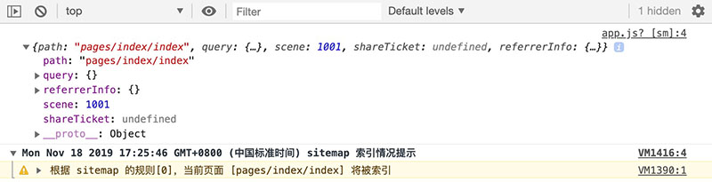
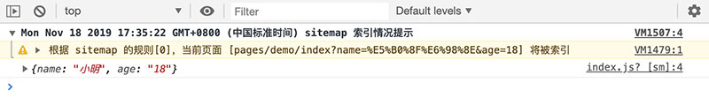

# 第2天小程序基础


## 每日目标

- 掌握小程序的数据绑定
- 能够处理列表数据
- 能够根据条件对数据实现控制
- 掌握小程序事件监听方法
- 理解小程序事件冒泡现象
- 掌握小程序生命周期的监听


## 数据

​		通过前面学习，掌握了小程序页面的布局，然而小程序页面中显示的内容都是静态的，真正线上运行的小程序内容都应该是动态的，接下来我们学习如何在小程序中处理页面数据。


### 数据绑定

​		小程序内容数据是由 JavaScript 控制提供的。每个页面都是由 .wxml、.wxss、.js、.json 构成，其中 wxml 定义结构，wxss 定义表现、json 进行配置，**.js 则专门处理逻辑。**

​		当加载页面时，同名的 js 文件会自动加载并执行，如加载 pages/demo/data.wxml 时，pages/demo/data.js 会自动被加载执行。

​		**所谓数据绑定是指数据与页面中组件的关联关系。使用 Mustache 语法（双大括号）将数据变量包起来**。

创建 data.js、data.wxml、data.wxss 三个文件，可使用工具快速创建。

```diff
└── FC
    ├── app.js
    ├── app.json
    ├── app.wxss
    ├── pages
    │   ├── data
+   │   │   ├── data.js ........................................... 数据逻辑
+   │   │   ├── data.wxml ......................................... 演示数据处理
+   │   │   └── data.wxss
    │   ├── index
    │   └── style
    ├── project.config.json
    └── static
        ├── images
        └── uploads
```

1. **简单数据**

```javascript
// Page 是全局提供的，用来创建一个页面实例
Page({
	// 通过 data 属性，初始化页面中用到的数据
	data: {
    // 字符串类型
    message: 'hello world!',
	}
});
```

   ```html
<text class="msg">{{message}}</text>
   ```

   ```css
.msg {
  display: block;
	font-size: 60rpx;
  font-weight: bold;
}
   ```

   如下图：

   

2. **复杂数据**

```javascript
Page({
  // 通过 data 属性，初始化页面中用到的数据
  data: {
    user: {
      name: '小明',
      age: 16
    },
    courses: ['wxml', 'wxss', 'javascript']
  }
});
```

```html
<text>我叫{{user.name}}，我今年{{user.age}}岁了，我在学习{{courses[0]}}课程。</text>
```

3. **运算**

```javascript
Page({
  // 通过 data 属性，初始化页面中用到的数据
  data: {
    a: 10,
    b: 5,
    flag: true
  }
});
```

```html
<text>{{a}} + {{b}} = {{a + b}}</text>
<text>{{flag ? '是': '否'}}</text>
```


### 列表数据

> 将数组数据遍历绑定到组件中。通过 wx:for 控制属（类似vue中的指令）性实现。

1. **基本用法**

```javascript
Page({
  // 通过 data 属性，初始化页面中用到的数据
  data: {
    users: [
      {name: '小明', age: 16, gender: '男'},
      {name: '小刚', age: 19, gender: '男'},
      {name: '小红', age: 18, gender: '女'},
      {name: '小丽', age: 17, gender: '女'}
    ]
  }
});
```

```html
<view wx:for="{{users}}">
  <text>{{index+1}}</text>
  <text>{{item.name}}</text>
  <text>{{item.age}}</text>
  <text>{{item.gender}}</text>
</view>
```

​         **wx:for 属性将当前组件按着数组的长度动态创建，并且通过 index 变量可以访问到数组的索引值，通过item变量可以访问到单元值。**

   


2. **指定索引值变量、单元值变量**

   - 通过 wx:for 对数组数据进行遍历时，可以分别指定访问数组索引值变量和单元值的变量。
   - wx:for-index 指定索引值变量，wx:for-item 批定单元值变量。
   - wx:for 支持嵌套
   
```javascript
Page({
  // 通过 data 属性，初始化页面中用到的数据
  data: {
    brands: [
      {
        name: '耐克',
        origin: '美国',
        category: ['男装', '女装', '鞋', '体育用品']
      },
      {
        name: 'SK-II',
        origin: '韩国',
        category: ['防晒霜','面膜', '洗护']
      }
    ]
  }
});
```

```html
<view wx:for="{{brands}}" wx:for-index="k" wx:for-item="v">
  <view>
    <text>{{k+1}} </text>
    <text> {{v.name}} </text>
    <text> {{v.origin}}</text>
  </view>
  <view>
    <text wx:for="{{v.category}}">{{item}}</text>
  </view>
</view>
```

   


3. **block**

​        通过 block 可以将多个组件元素“包”到一起进行渲染，block 只是提供一种结构，并不会被渲染到页面中。一般这样做的目的是可以将多个组件按统一的逻辑进行控制。

```html
   <block wx:for="{{users}}">
     <text>{{item.name}}</text>
     <text>{{item.age}}</text>
   </block>
```

```javascript
   Page({
     // 通过 data 属性，初始化页面中用到的数据
     data: {
       users: [
         {name: '小明', age: 18},
         {name: '小红', age: 16}
       ]
     }
   });
```

4. **wx:key**

   当使用 wx:for 遍历数据时，会有如下图所示的警告，其原因是为了提升性能，建议添加 wx:key 属性。
   
   
   
   wx:key 的值以两种形式提供
   
   1. 字符串，代表在 for 循环的 array 中 item 的某个 property，该 property 的值需要是列表中唯一的字符串或数字，且不能动态改变。
   2. 保留关键字 *this 代表在 for 循环中的 item 本身，这种表示需要 item 本身是一个唯一的字符串或者数字。
   
```html
<!--
name 在当前数据中是不重复的，具有唯一性！
现实开发中一般使用数据中的 id 字段
与 vue 不一样，这里只需要添写属性名即可，即不必写 v.name
-->
<view wx:key="name" wx:for="{{brands}}" wx:for-index="k" wx:for-item="v">
  <view>
    <text>{{k+1}} </text>
    <text> {{v.name}} </text>
    <text> {{v.origin}}</text>
  </view>
  <view>
    <text wx:for="{{v.category}}">{{item}}</text>
  </view>
</view>
```

   

### 条件数据

> 根据条件控制是否渲染某个（些）组件，通过 wx:if 属性实现。

1. **基本用法**

```html
<view wx:if="{{true}}">
  <text>锄禾日当午</text>
</view>
```

   

2. **多分支**

```html
<view wx:for="{{users}}">
  <text>{{index+1}} </text>
  <text> {{item.name}}</text>
  <text> {{item.age}} </text>
  <text wx:if="{{item.age <= 14}}"> 儿童</text>
  <text wx:elif="{{item.age <= 18}}"> 未成年</text>
  <text wx:else> 成年人</text>
</view>
```

```javascript
Page({
  // 通过 data 属性，初始化页面中用到的数据
  data: {
    users: [
      {name: '小明', age: 18},
      {name: '小红', age: 13},
      {name: '小丽', age: 19}
    ]
  }
});
```

   

   

3. **block**

> 将满足同一条件的组件“包”起来，同时控制是否渲染。

```html
<view>
  <text>序号 </text>
  <text> 姓名 </text>
  <text> 年龄 </text>
  <text> 成年 </text>
  <text> 批准</text>
</view>
<view wx:for="{{users}}">
  <text>{{index+1}} </text>
  <text> {{item.name}}</text>
  <text> {{item.age}} </text>
  <block wx:if="{{item.age>18}}">
    <text>是</text>
    <text>是</text>
  </block>
  <block wx:else>
    <text>否</text>
    <text>否</text>
  </block>
</view>
```

```javascript
Page({
  // 通过 data 属性，初始化页面中用到的数据
  data: {
    users: [
      {name: '小明', age: 18},
      {name: '小红', age: 16},
      {name: '小丽', age: 19}
    ]
  }
});
```

   

   

4. **hidden**

​        为小程序组件添加 hidden 属性也可以控制组件是否显示，其效果类似于 vue 中的 v-show，它与 wx:if 的不同之处是 wx:if 通过添加/移除节点实现元素的显示/隐藏，而 hidden 是对过样式 display 属性实现的。

```html
<view hidden="{{true}}">
  <text>锄禾日当午</text>
</view>
```

​         小程序中组件属性的值如果为布尔类型时，只要包含这个属性即为 true，要表达 false 时，需要通过 {{}} 表达，原因是 {{}} 中的内容为被小程序当成表达式解析，所以 hidden="{{false}}" 会被解析成数据类型的布尔类型，而如果写成 hidden="false" 则将 false 当成字符串解析。


## 事件处理

> 小程序中的事件同网页 DOM 中的事件含义一样，只是语法及及其执行细节上略有差异。


### 事件监听

小程中通过属性为组件添加事件的监听。例如 tap 事件（相当于 html 中的 click事件）

**语法格式： bind:事件名称="回调函数" 或者 bind事件名称="回调函数"**

```html
<!-- 为button组件绑定了 tap 事件，当用户点击了，会执行 sayHi 函数 -->
<button type="primary" bind:tap="sayHi">点我试试</button>
```

```javascript
Page({
  // 事件回调函数
  sayHi: function () {
    console.log('Hi~')
  }
});
```

监听表单的 blur、 focus事件：

```javascript
Page({
  // 事件回调函数
  sayHi: function () {
    console.log('Hi~');
  },
  sayBye: function () {
    console.log('Bye~');
  }
});
```

```html
<view> 
  <label for="">姓名: </label>
  <input type="text" bind:focus="sayHi" bind:blur="sayBye" />
</view>
<view> 
  <label for="">密码: </label>
  <input type="text"/>
</view>
```

**以前在学习 DOM 时见到的事件，绝大多数在小程序中都是被支持的。**


### 事件冒泡

> 小程序事件处理机制与DOM类似，**冒泡现象依然存在**，但并非所有事件都会[冒泡](https://developers.weixin.qq.com/miniprogram/dev/framework/view/wxml/event.html)。

```html
<view class="parent" bind:tap="foo">
  <view class="child" bind:tap="bar"></view>
</view>
```

```javascript
Page({
  // 事件回调函数
  foo: function () {
    console.log('parent');
  },
  bar: function () {
    console.log('child');
  }
});
```

如下图所示，当点击 .child 盒子时，同时触发了 .child 和 .parent 的 tap事件


​		如果想要阻止冒泡现象的发生，可以使用小程序提供了另一种事件监听的方式，**即 catch:事件名称="回调函数" 或 catch事件名称="回调函数"**，bind 和 catch 的区别就在于是否阻止冒泡。

```html
<view class="parent" bind:tap="foo">
  <view class="child" catch:tap="bar"></view>
</view>
```

如下图所示，当点击子盒子，父盒子的事件不会被触发了


### 事件捕获

​	小程序也支持在捕获阶段触发事件，其**语法格式为 capture-bind:事件名称="回调函数"**。

​	事件捕获时事件的触发顺序为 祖先元素 => 父元素 => 子元素，如果父子元素监听了相同的事件时，事件执行顺序为 父元素 => 子元素。

​	捕获也可以被阻止，其**语法格式为 capture-catch:事件名称="回调函数"**，这样父元素事件触发后，子元素便不会再被触发了。


### 互斥事件

​		一种更灵活的阻止冒泡的方式，当前元素与某个祖先元素都使用 mut-bind 监听事件时，祖先元素的事件不会被冒泡触发。

```html
<view class="box" mut-bind:tap="fn">
  <view class="parent" bind:tap="foo">
    <view class="child" mut-bind:tap="bar"></view>
  </view>
</view>
```

**关于事件捕获和互斥事件，做为了解内容即可，因为现实开发中这种复杂的需求比较少见！**


### 事件对象

​		当某个事件被触发时，通过一个对象可以获得被触发事件的相关信息。事件对象，回调函数的第一个参数即为事件对象，习惯命名为 ev。

1. **ev.target** 获取触发事件的元素

```javascript
Page({
  // 事件回调函数
  sayHi: function (ev) {
    // ev 即为事件对象，包含了事件相关信息
    // 着重关注 ev.target.dataset 它可以获得 wxml 组件中以 data- 开头的自定义属性
    console.log(ev.target.dataset);
  },
  
  sayHello: function (ev) {
    console.log(ev.target.dataset);
  }
});
```

```html
<view class="parent" data-name="大明" data-age="40" bind:tap="sayHello">
	<view class="child" data-name="小明" data-age="16" bind:tap="sayHi">点我试试</view>
</view>
```


2. **ev.mark** 标记哪个元素的事件被触发了

```javascript
Page({
  // 事件回调函数
  sayHi: function (ev) {
    // ev 即为事件对象，包含了事件相关信息
    // 着重关注 ev.mark 用于标记哪个元素的事件被触发了
    console.log(ev.mark);
  },
  
  sayHello: function (ev) {
    console.log(ev.mark);
  }
});
```

```html
<view class="parent" mark:name2="大明" bind:tap="sayHello">
	<view class="child" mark:name="小明" bind:tap="sayHi">点我试试</view>
</view>
```


**注：ev.mark  是新增加的功能与dataset 有些类似，应用时某些情形下可以互相替代。**


## 生命周期

​		小程序是按着某种特定的流程序执行的，并且允许开发人员对执行过程中的若干节点进行事件监听，通常将这些节点称为生命周期，如小程序启动、销毁等。

​		小程序中将生命周期分成两类，分别是应用级别和页面级别。

### App

​		在小程序 app.js 文件中调用 App() 函数，可以注册一个小程序，应用级别的生命周期在这里进行监听。

```javascript
// App 函数是小程序内置提供的，接受一个对象类型的数据做为参数。
// 注意大小写
App({
  
  // 小程序启动时
  onLaunch: function () {
    // 全局只会触发1次
    console.log('小程序启动了...');
  },
  // 小程序前台运行时
  onShow: function () {
    // 重复执行
    console.log('小程序前台运行了...');
  },
  // 小程序后台运行时
  onHide: function () {
    // 重复执行
    console.log('小程序后台运行了...');
  },
  // 执行错误时
  onError: function (err) {
    console.log('出错啦!!!');
  },
  // 冷启动（如扫码）打开小程序的页面不存在时
  onPageNotFound: function () {
    console.log('你找到页面去火星了？？？');
  }
})
```

​		点击小程序右上角的胶囊的关闭时，并不会将小程序销毁而是处于**后台运行**的状态，当再次打开小程序时并不会触发 onLaunch 生命周期的监听，而是触发 onShow 将小程序重新**前台运行**。

​		关于前台和后台的理解可以简单的理解成最小化了，桌面上暂时看不到，但程序依然在运行，常见的如按了 home 键、接听电话等都会将小程序置于后台运行。

​		是不是意味着小程序永远都不会被销毁？答案当然不是！小程序销毁是由微信自动控制的，一般情况下如果某个小程序后台运行超过一定时间或者系统内存不足报警时，微信会主动将小程序销毁，当再次从小程序列表找到这个小程序打开时，会再次触发 onLaunch 这个生命周期。

​		[参考官方文档](https://developers.weixin.qq.com/miniprogram/dev/framework/runtime/operating-mechanism.html)

### Page

​		在小程序页面对应的 .js 文件中调用 Page() 函数，可以注册一个小程序页面，页面级别的生命周期在这里进行监听。

```javascript
// Page 函数是由小程序默认提供的，接受一个对象类型的数据做为参数。
// 注意大小写，必须要调用！！！
Page({
  // 1. 初始数据
  data: {},
  
  // 2. 定义事件回调
  sayHi: function () {
    // code...
  },
  
  // 3. 监听生命周期
  
  // 页面加载时
  onLoad: function () {
    // 只会触发1次
    console.log('当前页面被加载了...');
  },
  
  // 页面显示时（返回、tabBar切换、前台运行）
  onShow: function () {
    // 重复触发
    console.log('当前页面显示了...');
  },
  
  onReady: function () {
    // 只会触发1次
    console.log('当前页面初次渲染完毕了...');
  },
  
  // 页面隐藏时（跳转、tabBar切换、后台运行）
  onHide: function () {
    console.log('当前页面不见了...');
  },
  
  // 还有其它，后续应用时介绍
})
```

onShow 和 onHide 分别表过当前页面是否被显示/隐藏在当前小程序窗口，这其中包括几种情形：

1. 页面跳转 => onHide
2. 返回         => onShow
3. tabBar    => onSow 或 onHide
4. 前台        => onShow
5. 后台       => onHide

### 场景值

​		打开小程序的方式多种多样，如扫码、转发、搜索、公众号等，通过[场景值](https://developers.weixin.qq.com/miniprogram/dev/reference/scene-list.html)可以区分用户是以何种方式打开的小程序，通常用于条件判断或者数据统计等。

​		在小程序生命周期函数 onLaunch 和 onShow 中可以获得场景值：

```javascript
App({
  onLaunch: function (res) {
    // 根据打开小程序的方式不同，res.scene 的值也不一样
    console.log(res.scene);
  },
  
  onShow: function (res) {
    // 这里也可以获取场景值
    console.log(res.scene);
  }
})
```




### 地址参数

​		为小程序组件 navigator 指定 url 属性，可以实现页面间的跳转，在跳转的同时支持通过 ? 向跳转页面传递参数，格式如下：

```html
<navigator url="/pages/demo/index?name=小明&age=18">跳转页面</navigator>
```

在被跳转的页面中通过监听 onLoad 生命周期获得地址中的参数

```javascript
// pages/demo/index.js
Page({
  onLoad: function (query) {
    // 获取地址中的参数
    console.log(query);
  }
})
```



## 案例练习

猫眼电影