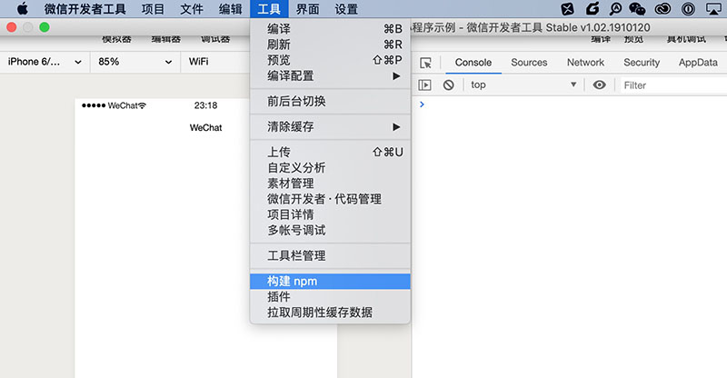
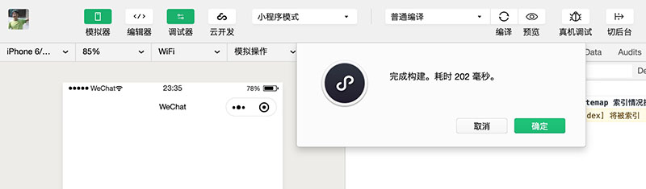
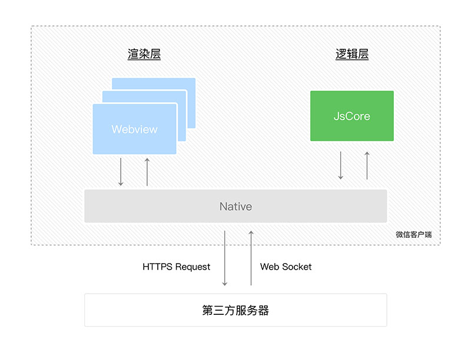

# 第3天小程序基础


## 每日目标

- 理解小程序中的模块化规范

- 能够在小程序中导入npm模块
- 了解小程序中wxs的作用
- 掌握小程序API的调用方式


## 模块化

小程序遵循的是类似 CommonJS 的规范。

### 规范

​		通过 module.exports 或 exports 对外暴露接口，通过 require 导入模块。

```javascript
// utils/cart.js
module.exports.add = function () {
  console.log('添加购物车!');
}

module.exports.delete = function () {
  console.log('删除购物车!');
}
```

```javascript
// pages/index/index.js

// 使用相对路径
const cart = require('../../utils/cart.js');

cart.add(); // 添加购物车

cart.delete(); // 删除购物车
```

### npm

​		小程序目前不支持直接引入 node_modules , 开发者需要使用到 node_modules 时候建议拷贝出相关的代码到小程序的目录中，或者使用小程序支持的 [npm](https://developers.weixin.qq.com/miniprogram/dev/devtools/npm.html) 功能。

```bash
# 初始化
$ npm init -y
# 安装 mime 模块
$ npm install mime
```

```javascript
// pages/index/index.js
// 不会导入成功！
const mime = require('mime');
```

​		小程序默认不支持 npm 的模块，必须经过小程序工具构建后才可以使用，如下图所示：



​		这时工具会自动**根据 package.json 的依赖关系**对 node_modules 中的模块进行构建，然后将构建后的模块拷贝到 miniprogram_npm 目录中，如下图所示：



```javascript
// pages/index/index.js

// 当通过开发工具进行构建后，才可以将 npm 模块导入，这时导入的是 miniprogram_npm 中的模块
const mime = require('mime');

```

### 文件作用域

​        在 JavaScript 文件中声明的变量和函数只在该文件中有效；不同的文件中可以声明相同名字的变量和函数，不会互相影响。

​       通过全局函数 getApp 可以获取全局的应用实例，如果需要全局的数据可以在 App() 中设置如:

```javascript
// app.js
App({
  // 定义在这里的属性方法或方法可以被全局访问
  name: '小明',
  age: 18,
  sayHi: function () {
    console.log('你好' + this.name);
  }
})
```

```javascript
// getApp 是小程序内置提供的函数，用于获取全局应用实例
const app = getApp();

Page({
  data: {
    // 全局实例中定义的 name 属性
    name: app.name
  },
  
  onLoad: function () {
    // 全局实例中定义的 sayHi 方法
    app.sayHi();
  }
})
```


## WXS

​		小程序的运行环境分成渲染层和逻辑层，其中 WXML 模板和 WXSS 样式工作在渲染层，JS 脚本工作在逻辑层。

​		小程序的渲染层和逻辑层分别由2个线程管理：渲染层的界面使用了WebView 进行渲染；逻辑层采用JsCore线程运行JS脚本。



​		由上图我们可以知道 JsCore（Javascript）和 界面（WXML、WXSS）是互相隔离的，它们之间的通信是通过Native（微信）中转实现的。

​		这种运行机制导致了一些问题:

1. 在逻辑层无法操作 WXML 可以认为没有 DOM

  		2. 在视图层也无法调用逻辑层定义的函数

```javascript
Page({
  data: {
    msg: '学习小程序!'
  },
  
  foo: function () {
    console.log('wxml无法调用该函数...');
  },
  
  sayHi: function () {
    console.log('你好，小程序!');
  }
})
```

```html
<view class="msg">{{msg}}</view>
<!-- 将sayHi注册为事件回调，当事件触发时会被调用 -->
<button type="primary" bind:tap="sayHi">打招呼</button>
<!-- 直接调用函数，无效！！！ -->
<view class="demo">{{foo()}}</view>

<!-- 由于无法直接调用函数，故下面的写法是不允许的！！！ -->
<button type="primary" bind:tap="sayHi()">打招呼</button>
```

### 基本用法

​		视图层和逻辑层的隔离性给开发带来了不便，通过 WXS 可以解决这个问题，WXS（WeiXin Script）是小程序的一套脚本语言，结合 WXML，可以构建出页面的结构。

​		[WXS](https://developers.weixin.qq.com/miniprogram/dev/reference/wxs/) 与 JavaScript 是不同的语言，有自己的语法，并不和 JavaScript 一致，**但类似！！！！**WXS 声明变量只能使用 var 、变量名不能为 $、通过 getDate 获取时间对象等，这些都是与 Javascript 不一致的方面。

1. 内联式

```html
<view class="box">WXS是小程序的脚本语言！</view>
<!-- 必须指定 module 属性，并赋值 -->
<wxs module="m1">
	console.log('第1段wxs脚本...');
</wxs>
```

2. 引入式

```javascript
// m2.wxs
console.log('第2段wxs脚本...');
```

```html
<view class="box">WXS是小程序的脚本语言！</view>
<!-- 必须指定 module 属性，并赋值 -->
<wxs module="m1">
	console.log('第1段wxs脚本...');
</wxs>
<!-- 引入独立的 wxs 文件 -->
<wxs module="m2" src="../../wxs/m2.wxs"></wxs>
```

### 模块化

​		WXS 也遵循类似 CommonJS 模块规范，通过 module.exports（**没有exports）** 对外暴露接口，通过 require 导入模块。

```html
<view class="box">WXS是小程序的脚本语言！</view>
<view>{{m1.name}}</view>
<view>{{m2.sayHi()}}</view>
<!-- 必须指定 module 属性，并赋值 -->
<wxs module="m1">
  var name = '小明';
  var sayHi = function () {
  	console.log('Hi~');
  }
  
  // 导出内部的属性或方法
  module.exports.name = name;
  module.exports.sayHi = sayHi;
</wxs>
<!-- 引入独立的 wxs 文件 -->
<wxs module="m2" src="../../wxs/m2.wxs"></wxs>
```

wxs 模块间的依赖：

```javascript
// m3.wxs
module.exports.count = function (a, b) {
  return a + b;
}
```

```javascript
// m2.wxs
const m3 = require('./m2.wxs');

module.exports.sum = function (a, b) {
  // 调用 m3 模块开放的接口
  m3.count(a, b);
}
```

```html
<view class="box">WXS是小程序的脚本语言！</view>
<view>{{m1.name}}</view>
<view>{{m1.sayHi()}}</view>

<view>{{m2.sum(5, 10)}}</view>
<!-- 必须指定 module 属性，并赋值 -->
<wxs module="m1">
  var name = '小明';
  var sayHi = function () {
  	console.log('Hi~');
  }
  
  // 导出内部的属性或方法
  module.exports.name = name;
  module.exports.sayHi = sayHi;
</wxs>
<!-- 引入独立的 wxs 文件 -->
<wxs module="m2" src="../../wxs/m2.wxs"></wxs>
```

### 语法

​		WXS 一般是结合 WXML 使用的，它通过被用来格式展示数据，类似于 Vue 中过滤器的功能。

```html
<!-- 将 now 时间戳传入 date.format 方法 -->
<view class="now">{{date.format(now)}}</view>
<!-- 模块 date 暴露了 format 方法 -->
<wxs module="date" src="../../wxs/date.wxs"></wxs>
```

```javascript
Page({
  // 获取当前时间（时间戳）
  now: Date.now()
})
```

```javascript
module.exports.format = function (timestamp) {
  // wxs 中通过 getDate 函数获得时间对象
  var d = getDate(timestamp);
  // 返回值会在 wxml 中被渲染展示
  return d.getFullYear() + '年' + (d.getMonth() + 1) + '月' d.getDate() + '日';
}
```


## API

​		API 是小程序开发的核心，通过 API 开发者可以获得微信底层封装的高级特性，如网络请求、文件操作、设备信息、地理定位、本地存储等。

​		小程序的 API 以全局对象 wx 为命名空间，**格式为 wx.方法名()**，可全局调用。

### 网络

1. wx.request 发起网络请求
2. wx.uploadFile 上传文件

### 界面

1. wx.showLoading 显示加载框
2. wx.hideLoading 隐藏加载框
3. wx.showModal 确认框
4. wx.showToast 提示框
5. wx.showActionSheet 选择框
6. wx.setNavigationBarTitle 设置标题
7. wx.showNavigationBarLoading 显示加载状态
8. wx.hideNavigationBarLoading 隐藏加载状态
9. wx.showTabBar 显示 tabBar
10. wx.hideTabBar 隐藏 tabBar

### 媒体

1. wx.chooseImage 相册/拍照
2. wx.previewImage 图片预览

### 路由


### 数据缓存


## 其它

### 模板

​		小程序提供了模板功能，使用模板可以将页面中的公共部分提取出来，实现复用的效果。

1. 基本用法

- 使用 template 标签定义模板，指定 name 属性为模板命名
- 使用 template 标签应用模板，指定 is 属性确认应用哪个模板

```html
<!--定义模板 -->
<template name="mytpl">
  <view class="user">
  	<text>姓名: 小明</text>
    <text>年龄: 18</text>
  </view>
</template>
```

```html
<!-- 应用模板 -->
<template is="mytpl"></template>
```

将模板定义在独立文件中，使用模板会更加灵活，可实现多页面的共享：

```html
<!-- ../common/student.wxml -->
<template name="student">
	<text>姓名: 小红</text>
  <text>性别: 女</text>
</template>
```

使用 import 标签导入公共的模板文件

```html
<!-- 导入公共模板 student.wxml -->
<import src="../common.student.wxml" />
<template is="student"></template>
```

### 作用域

模板拥有自己的作用域，只能使用 data 传入的数据。

```html
<!-- ../common/student.wxml -->
<template name="student">
	<text>姓名: {{name}}</text>
  <text>性别: {{gender}}</text>
</template>
```

```html
<!-- 导入公共模板 student.wxml -->
<import src="../common.student.wxml" />
<template is="student" data="{{name: '小丽', gender: '女'}}"></template>
<template is="student" data="{{...student}}"></template>
```

```javascript
Page({
  data: {
    // 定义的数据
    student: {
      name: '小明',
      gender: '男'
    }
  }
})
```


## 案例练习

颜值测试