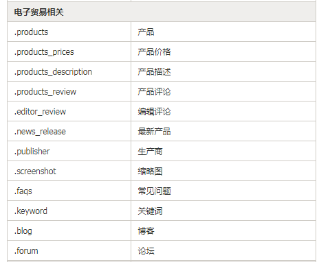
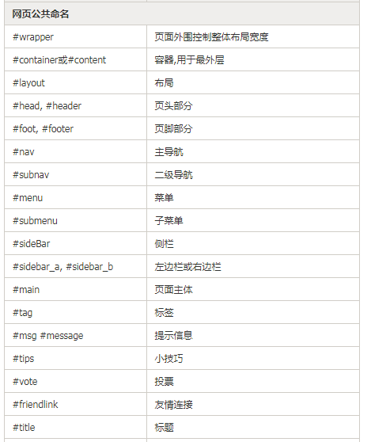
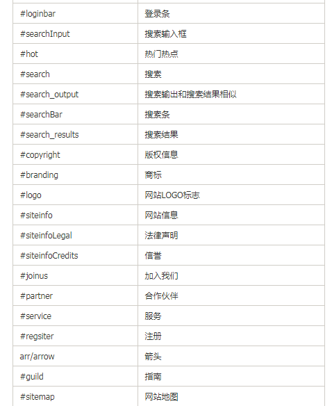
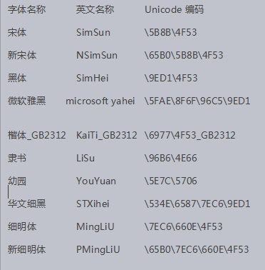

# 03CSS基础

## 核心知识点

- [ ] 基础选择器
- [ ] 复合选择器
- [ ] font属性合写

## CSS概念

```css
☞ 层叠样式表或者叫级联样式表(英文全称：Cascading  Style  Sheets)。

☞ 层叠：指的是css一个特性
```

## CSS语法

```css
☞  
选择器 {
    属性: 值;
    属性: 值;
}
☞ 选择器:  选中标签

☞ 属性: 通过选中标签,给标签加样式

☞ 总结CSS中常见的属性:
		color属性:  用来设置文字颜色[前景色]
    font-size属性:  用来设置文字大小
	   width属性:   用来设置标签宽度
	  height属性:   用来设置标签高度
 background-color属性:  用来设置背景颜色
/* 文字内容居中 */
text-align: center;   内容居中(文字,图片)

text-indent: 2em;  设置首行缩进
```

## CSS书写位置

```css
☞ 内嵌式写法: 在html页面内写CSS代码 (学习阶段推荐使用)
	<head>
        <meta charset="UTF-8">
        <title>Document</title>
        <!-- 内嵌式写法 -->
        <style type="text/css">
            CSS代码
        </style>
    </head>

☞ 外联式: 	将css代码和html代码分开了(综合项目的时候推荐使用这种方法)
	 1. 新建一个css文件,文件后缀名是 .css
	 2. 通过link标签将外部的css文件引入到html页面中
	
	<link rel="stylesheet" type="text/css" href="test.css">
	

☞行内式:  将css代码写到标签内部(如果标签要设置的属性比较少,可以考虑使用行内样式写法)
	<p  style="属性: 值;  属性: 值;"></p>
```

## CSS基础选择器

### 标签选择器（重点理解）

```css
☞  通过HTML标签名选中对应的标签

☞ 语法
HTMl标签名 {
    属性: 值;
    属性: 值;
}
```

### 类选择器（重点掌握）

```CSS
 1. 定义一个类样式
    .自定义类名 {
        属性: 值;
    }

2. 标签通过class属性调用类样式

<p  class="自定义类名"></p>
```

#### 类选择器命名规范

```css
☞ 定义类名不能以数字开头
☞ 不能以特殊符号开头定义类名
☞ 不推荐使用汉字定义类名
```







#### 类选择器特点

```css
☞ 一个类样式可以被任意的标签调用

☞ 一个标签可以调用多个类样式
<div class="one two ">1</div>
```

### ID选择器（理解）

```css
☞  选中对应的ID

1. 
#自定义id名  {
    属性: 值;
}

2. 标签通过ID属性调用

<p id="自定义id名"></p>


例如:
/* ID选择器 */
#div_box {
			width: 200px;
			height: 200px;
			background-color: red;
}
<div id="div_box"></div>


☞ ID选择器与类选择器的区别:
	 ◆ 一个id样式只能对应一个标签
     ◆ 一个标签只能调用一个ID样式
```

### 通配符选择器（理解）

```css
语法:
* {
    属性: 值; 
    属性: 值;
}

特点:
	将页面中所有的标签都选中
```

## 颜色表示方式(了解)

### 预定义方式

```css

```

### 十六进制方式[表示任意的颜色]

```css
  
```

### RGB方式(颜色的表示方式)

```css
  
```

### RGBA方式

```css

```

## font复合属性介绍

```css
☞ 文字大小:
   font-size: 
☞ 设置文字是否加粗:
font-weight: 700(bold)  | normal(400) 

☞ 设置文字是否斜体显示:
font-style: normal | italic(斜体显示)

☞ 设置文字字体:
 font-family: "微软雅黑";

☞ 设置文字行高: 调整文字的上下间距
  line-height: 40px;


☞ font属性合写介绍:
	/* font合写 */
	font: 700 italic  30px/100px  "微软雅黑";
	◆font合写的时候只用font属性
	◆font合写的时候,必须设置font-size 和 font-family
	◆font合写的时候,font-size必须在font-family之前
	◆font合写的时候,如果要设置line-height,那么该属性必须写到 font-size/line-height
```



## 复合选择器

### 后代选择器【掌握】

```css

```

### 子代选择器【理解】

```css
 
```

### 标签指定式选择器【理解】

```css
  
```

### 并集选择器【理解】

```css
 
```


### 