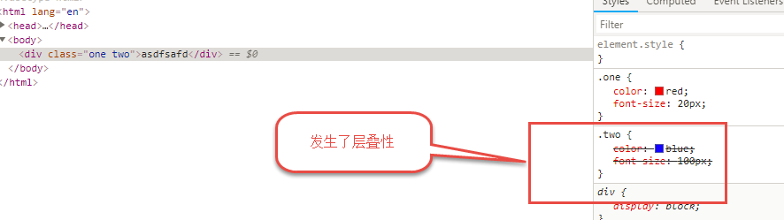
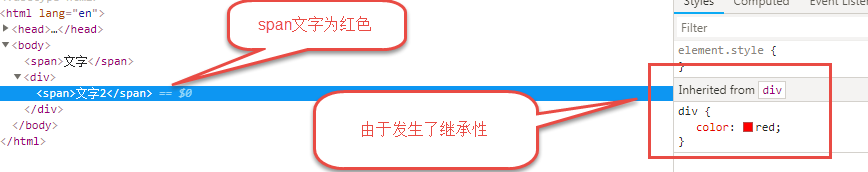

# 04CSS基础

## 核心知识点

- [ ] 并集选择器
- [ ] 元素显示模式
- [ ] 元素模式转换
- [ ] CSS特性
- [ ] 伪类
- [ ] 背景
- [ ] 文字阴影

## 元素显示方式 

```css
 ☞ 块级元素
 ☞ 行内元素
 ☞ 行内块元素
```

### 块级元素

```css
☞ 代表:
div, p, ul,ol,dl,li,dd,h1,h2.....

 ☞ 特点:
	1. 如果一个块级元素没有设置宽度,那么其宽度等于父元素的宽度.(只有块级元素才有特点)
	2. 所有的块级元素都是独占一行显示,与宽度无关
	3. 可以设置宽和高度
```

### 行内元素

```css
☞ 代表:
span, a, font,strong,em,i....

☞ 特点:
  	1. 所有的行内元素都在一行上显示
	2. 行内元素不能设置宽度和高度(行内元素特有的特点)
```

### 行内块元素

```css
☞ 代表:
img,input 

☞ 特点:
	1. 元素在一行上显示.
    2. 可以设置宽度和高度
```

## 元素模式转换

### 转块级元素

```css
   display: block;
```

### 转行内块元素

```css
   display: inline-block;
```

### 转行内元素

```css
  display: inline;(比较少用)
  总结：
	  1. 在网页中如果希望一个行内元素要设置宽度和高度的情况下，要进行模式转换
	  2. 如果希望元素在一行上显示，就转换为行内块，如果希望元素独占一行显示就转换为块级元素
```

## CSS特性【理解】

### 层叠性

```css
/* 层叠性 

			1. 必须使用同一个选择器选中一个标签
			2. 最后定义的样式会将前面定义的样式(重复的部分)覆盖
*/
```



### 继承性

```css
☞ 继承性必须在嵌套结构的标签中才有发生.

☞ 总结:
/* 继承性 
			  1. 给父元素设置样式
			  2. 子元素默认没有样式
			  3. 子元素按照父元素的样式去设置
		*/


☞ 总结可以被继承的属性:
	 1. color属性可以被继承
	 2. font中的所有属性都可以被继承


☞ 不可以被继承的属性:
	width
	heigth
```



### 优先级

```css
标签选择器  <   类选择器   <  ID选择器  < 行内样式  < !important
   10			100		    1000       10000      10000+
☞ 特点:
	1. 继承的权重为0
	2. 权重可以叠加(如果使用了不通的选择器,都选中的是同一个标签,考虑使用权重叠加计算解决)
```

## 伪类选择器

```css
☞ 目的: 用来选中标签

◆
:link {}            用来设置链接的样式(不推荐使用,有兼容性)


◆
:visited {}		   用来设置标签被访问过后的样式(不推荐使用,1. 该选择器中只能设置与颜色相关的属性 2. 有浏览器缓存问题)


◆ 必须掌握
:hover {}		 用来设置鼠标悬停到标签上时候的样式

◆
:active {}		用来设置标签被激活时候的样式(使用情况比较少)


◆ 必须掌握
:focus {}		用来设置获取鼠标焦点时候的样式
```

## 背景（background）

```css
☞ 背景是一个复合选择器: 属性可以联写

☞ 背景颜色
background-color

☞ 背景图
background-image: url("2.png");


☞设置背景是否平铺
background-repeat: repeat(默认平铺)  | no-repeat (不平铺)  |  repeat-x |  repeat-y

☞ 改变背景图片位置
background-position:
	1. 可以直接设置具体的方位名称(left | right | top  | bottom | center)
		background-position: center center;
	2. 可以自定义改变背景图片位置,设置具体值
		background-position: 20px  80px;

		总结:
			1. 如果background-position中设置了具体值,第一个值代表水平方向
			2. 如果background-position只设置一个值,第二个值默认代表center


☞  属性合写
	background: red  url("2.png") no-repeat  20px 50px;

	注意:
	   1. 没有个数的限制
	   2. 没有顺序的限制
```

## 文字阴影

```css
☞ 给文字加阴影效果

/* 设置文字阴影 

				1. 第一个值代表 阴影在水平方向的偏移

				2. 第一个值代表 阴影在垂直方向的偏移

				3. 第一个值代表 阴影模糊度

				4. 颜色
			*/
text-shadow: 0px 0px 10px red;


☞ 设置多个文字阴影
text-shadow: 0px 0px 10px red,
			 5px 5px 10px blue,
		     -5px -5px 10px yellow;
```

## 行高实现单行文字垂直居中

```css
  文字垂直居中:   行高=容器的高度
```

