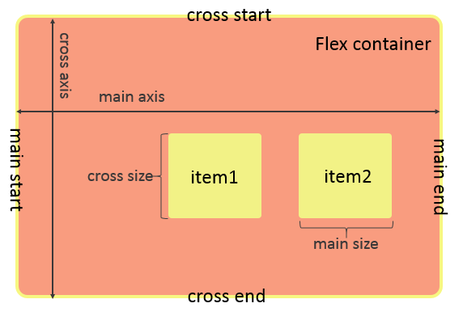
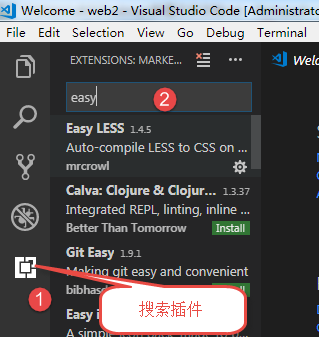

# 伸缩布局和LESS介绍

## 其他属性介绍

> #### word-break属性介绍
>
> ```css
> 该属性规定自动换行的处理方法。
> 
> normal (按照浏览器默认的换行方式) |  break-all  |  break-all
> ```
>
> #### 文字超出父元素显示省略号
>
> ```css
>     /* 设置超出部分的显示方式 */
> 	overflow: hidden;
> 	/* 在文字末尾换行 */
> 	word-break: break-all;
> 	/* 文字溢出显示省略号 */
> 	text-overflow: ellipsis;
> 
> 	/* 用来控制显示行数 */
> 	-webkit-line-clamp: 2;
> 	/* 文字显示方式,默认水平 */
> 	-webkit-box-orient: vertical;
> 	/* 将盒子转为弹性盒子 */
> 	display: -webkit-box;
> ```
>
> #### max-width,min-width属性介绍
>
> ```css
> max-width: 700px;     设置当前元素最大宽度是多少像素     <= 700
> min-width: 700px;	  设置当前元素最小宽度是多少像素     >= 700
> 
> max-height:
> min-height:
> ```

## 伸缩布局(flex)(屏幕适配)

> ### 概念
>
> ```tx
> ☞ 伸缩布局[弹性布局]
> 
> Flex 是 Flexible Box 的缩写，意为"弹性布局"，用来为盒状模型提供最大的灵活性.
> 任何一个容器都可以指定为 Flex 布局。
> ```
>
> ### 设置盒子为伸缩盒子
>
> ```css
> ☞ display: flex;
> 例如:
> .box {
>     display: flex;
> }
> ```
>
> 
>
> ### 伸缩盒子两条轴
>
> ```tx
>  主轴(main axis): 默认水平从左向右
>  
>  侧轴(cross axis): 始终垂直于主轴
> ```
>
> ### 设置主轴方向(flex-direction)[掌握]
>
> ```css
>  flex-direction: row  |  row-reverse |  column |  column-reverse
> ```
>
> ### 设置在主轴的对齐方式(justify-content)[掌握]
>
> ```css
> justify-content: flex-start(默认值) | flex-end | center |  space-between | space-around
> ```
>
> ### 设置在侧轴的对齐方式(align-items )[掌握]
>
> ```css
> align-items: flex-start | flex-end | center | baseline | stretch(默认值)
> ```
>
> ### 设置元素是否换行显示(flex-wrap)
>
> ```css
> flex-wrap: nowrap | wrap(换行显示)
> ```
>
> ### 设置元素换行后的对齐方式(align-content )
>
> ```css
> align-content: flex-start| flex-end | center| space-between | space-around |stretch(默认对齐方式)
> ```
>
> ### 设置子元素的伸缩比(flex )[掌握]
>
> ```css
> flex 属性定义子元素平均分配剩余空间，该子项目占多少份。
> 
> .item {
>    flex: <number>; /* default 0 */
> }
> ```
>
> ### 设置子元素自己的对齐方式(align-self )[了解]
>
> ```css
> ☞ 
> align-self 属性允许单个项目有与其他项目不一样的对齐方式，可覆盖align-items属性。默认值为auto，表示继承父元素的align-items属性，如果父元素没有，则等同于stretch。
> 
> ☞
>  align-self: auto | flex-start | flex-end | center | baseline | stretch;
> ```
>
> ### 设置子元素的排序方式[了解]
>
> ```css
> order 属性定义项目的排列顺序。数值越小，排列越靠前，默认为0。
> ```

## LESS介绍

> ### 维护CSS的弊端
>
> ```html
> CSS本质上不是一门语言,是一个简单的样式表.代码维护相对老套,不够灵活.
> ```
>
> ### LESS介绍
>
> ```css
> ☞LESS预处理器: 依然使用CSS语法，引入了变量，混合，运算, 嵌套等功能，大大简化了 CSS 的编写，并且			  降低了 CSS 的维护成本
> 
> 
> ☞常见的CSS预处理器:  Less  | SASS  | Stylus[staɪləs] 等
> 
> https://less.bootcss.com/
> https://www.sass.hk/install/
> https://www.zhangxinxu.com/jq/stylus/
> ```
>
> ### 安装及使用
>
> 1. 安装Node环境
>
> 2. 检测Node是否安装成功
>
>    ```css
>    运行cmd命令输入:
>        node -v     node环境是否安装成功(如果安装成功,会出现版本号)
>    	npm  -v     检测包管理工具是否安装成功(如果安装成功,会出现版本号)
>    ```
>
> 3. 安装Less
>
>    ```css
>    运行cmd命令输入:
>    	npm  install  less  -g
>    ```
>
> 4. 验证less是否安装成功
>
>    ```css
>    运行cmd命令输入:
>    	lessc -v 
>    ```
>
> 5. 安装成功后新建一个less文件即可
>
>    ```css
>     test.less
>    ```
>
> 6. 将Less文件编译为CSS文件
>
>    ```css
>    运行cmd命令输入:
>    ☞ 注意: 首先要通过cmd命令进入到当前less文件所在的文件夹目录中
>    ☞ 编译less文件cmd命令:   lessc  要被编译的less文件  要编译为自定义CSS文件
>      例如:  lessc   index.less   index.css
>    ```
>
> 7. 开发工具配置
>
>    ```css
>    1.webstorm自带less编译功能,实时编译
>    webStorm: 配置快捷键方式进行编译
>    ◆ 文件  - > 设置 - > 工具 -> file watchers  -> 选择less文件点击编辑 -> 取消实时编译选项
>    ◆ 文件  - > 设置 ->  快捷键 - >  插件 - > File watchers  -> 点击右键添加键盘快捷键
>    
>    2.Sublime安装插件: LESS2CSS    
>    
>    	安装编译插件:  ctral+shift+P  ---> 在搜索栏中输入   LESS2CSS 
>    
>    3.VSCode需要安装插件:  Easy Less  安装成功后  Ctrl+s保存即可
>    ```
>
>    
>
> ### Less语法
>
> - 变量
>
>   ```css
>   ☞@自定义变量名: 值;
>       例如:
>       @nav_bgcolor: red;
>       nav {
>           color: @nav_bgcolor;
>       }
>   
>   ☞变量的运算:
>   	@width: 10;
>       nav {
>   		width: @width * 3px;
>       }
>   ```
>
> - 混合
>
>   ```css
>   ☞ 定义一个公共的样式(可以式类选择的语法,可以是ID选择器的语法)
>   
>   例如:
>   	.test() {
>           width: 50px;
>           height: 50px;
>       }
>   
>       nav {
>           .test();
>       }
>   
>       header {
>           .test();
>       }
>   
>   
>   ☞ 可以设置参数
>   例如:
>   .test(@width) {
>       width: @width;
>   }
>   
>   nav {
>       .test(100px);
>   }
>   
>   
>   ☞ 可以为参数设置默认值
>   例如:
>   .test(@width: 100px) {
>       width: @width;
>   }
>   nav {
>       .test();
>   }
>   header {
>       .test(50px);
>   }
>   ```
>
> - 嵌套
>
>   ```css
>   例如:
>   nav {
>       ul {
>           li {
>                
>           }
>       }
>   }
>   ```
>
> ### 在浏览器中预览LESS文件(了解)
>
> ```css
> 1. HTML页面直接沟通link标签引用 less文件
>  <link rel="stylesheet/less" type="text/css" href="less文件.less">
> 
> 2. HTML页面中引用用来解析less文件的一个js文件
>  <script type="text/javascript" src="less.js"></script>
> 
> 备注:
> 1. 以上执行过程需要在服务器环境下进行
> 2. webstorm开发工具下,可以执行运行,因为webstorm自带一个服务器环境
> ```