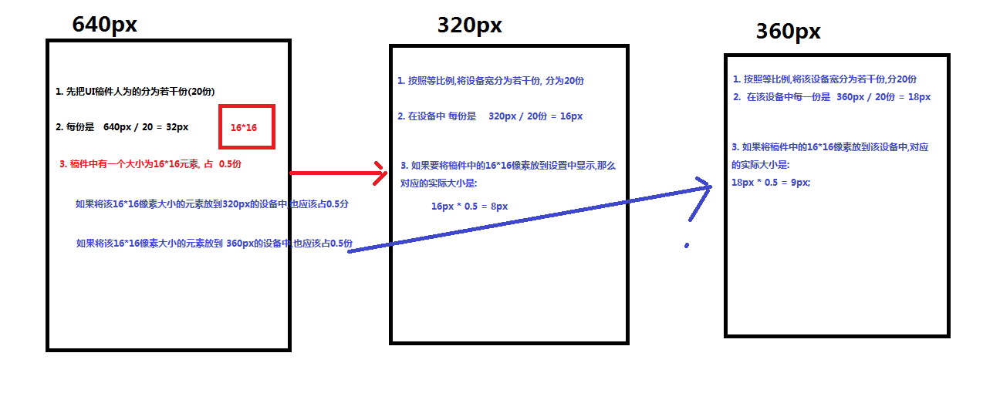

# Rem,媒体查询适配方案

## Less基础语法介绍

> ```html
> 作用: 维护CSS, 按照CSS的基本语法去写.
> 
> https://less.bootcss.com/
> ```
>
> #### 变量
>
> ```css
> ☞@自定义变量名: 值;
>     例如:
>     @nav_bgcolor: red;
>     nav {
>         color: @nav_bgcolor;
>     }
> 
> ☞变量的运算:
> 	@width: 10;
>     nav {
> 		width: @width * 3px;
>     }
> ```
>
> #### 混合
>
> ```css
> ☞ 定义一个公共的样式(可以式类选择的语法,可以是ID选择器的语法)
> 
> 例如:
> .test() {
>         width: 50px;
>         height: 50px;
>     }
> 
>     nav {
>         调用样式
>         .test();
>     }
> 
>     header {
>         .test();
>     }
> 
> ☞ 可以设置参数
> 例如:
> .test(@width) {
>     width: @width;
> }
> 
> nav {
>     .test(100px);
> }
> 
> ☞ 可以为参数设置默认值
> 例如:
> .test(@width: 100px) {
>     width: @width;
> }
> nav {
>     .test();
> }
> header {
>     .test(50px);
> }
> ```
>
> #### 嵌套
>
> ```css
> 例如:
> nav {
>     ul {
>         li {
> 
>         }
>     }
> }
> ```
>
> #### 在浏览器中预览LESS文件(了解)
>
> ```css
> 1. HTML页面直接沟通link标签引用 less文件
>  <link rel="stylesheet/less" type="text/css" href="less文件.less">
> 
> 2. HTML页面中引用用来解析less文件的一个js文件
>  <script type="text/javascript" src="less.js"></script>
> 
> 备注:
> 1. 以上执行过程需要在服务器环境下进行
> 2. webstorm开发工具下,可以执行运行,因为webstorm自带一个服务器环境
> ```

## 媒体查询

> ### 什么是媒体查询?
>
> ```html
> 1, 媒体指的就是各种设备(移动设备,PC设备)
> 2, 查询指的就是要检测属于哪种设备
> 总结:
> 	媒体查询:通过查询当前属于哪种设备,让网页能够在不同的设备下正常的预览
> ```
>
> ### 学习媒体查询的核心是什么?
>
> ```
> 实现页面在不同设备下正常预览.[判断当前设备]
> ```
>
> ### 媒体类型
>
> ```
>  将不同的设备划分为不同的类型,称为媒体类型
> ```
>
> - all  (所有的设备)
> - print (打印设备)
> - screen(电脑屏幕,平板电脑),智能手机
>
> ### 媒体特性
>
> ```
> 用来描述设备的特点,比如宽度,高度...
> ```
>
> - width						     网页显示区域完全等于设置的宽度 
> - height                                                     网页显示区域完全等于设置的高度
> - max-width / max-height                      网页显示区域小于等于设置的宽度
> - min-width / min-width                         网页显示区域大于等于设置的宽度
> - orientation: portrait (竖屏模式肖像)  | landscape (横屏模式全景)
>
> ### 语法关键字
>
> ```
> 目的将媒体类型和媒体特性链接到一块,进行设备检测
> ```
>
> - and				可以将多个媒体特性链接到一块,相当于且
> - not                          排除某个媒体特性 相当于非,可以省略
> - only                        指定某个特定的媒体类型, 可以省略
>
> ### 语法
>
> - 外联式语法
>
>   ```html
>   <link rel="stylesheet" type="text/css" href="01.css" media="only screen and (max-width: 420px)">
>   ```
>
> - 内嵌式语法
>
>   ```css
>   @media only screen  and (max-width: 420px) {
>   	body {
>   		background-color: red;
>   	}
>   }
>   
>   备注: 多个条件联写
>   @media only screen and (width: 320px) and (height: 568px) {}
>   ```

## Rem

> ### 什么是REM?
>
> ```
> Rem: 是一个单位,是一个相对单位
> 
> em: 是一个单位,是一个相对单位,参照当前文字大小设置的
> ```
>
> ### Rem的特点?
>
> ```
> 参照HTML根标签的文字大小
> ```
>
> ### Rem如何实现适配?
>
> ```
> 1. 常见的UI稿件尺寸大小 640px(20份)  或者  750px(常见)[25份]
> ```



## 优惠活动综合案例演示适配方案

## 作业: 自己完成苏宁首页头部适配效果
